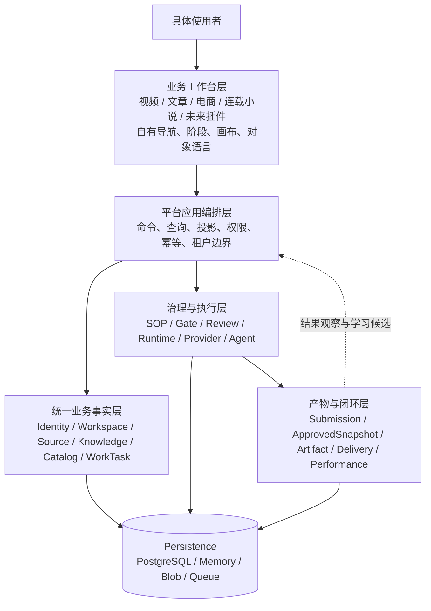
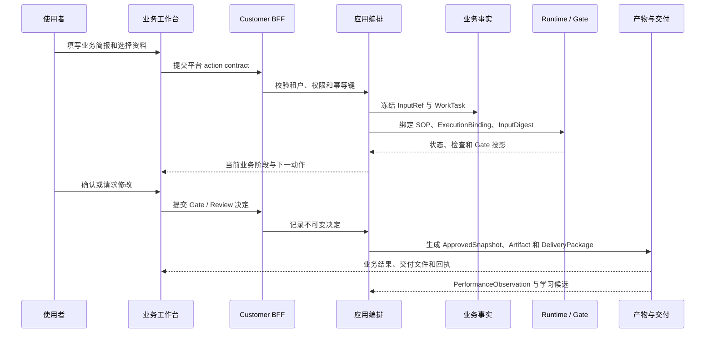

# 分层平台与业务编排边界

状态：`已实现跨业务工作台主链；持续补齐真实基础设施与运营能力`。

更新时间：2026-08-23。

Content Work OS 不是一组互相独立的业务页面，而是一个由业务工作台和统一底层组成的业务编排、流程、执行与产物平台。工作台可以按业务定制，但不能复制底层事实。

## 1. 五层平台模型与持久化底座



### 1.1 工作台层

工作台面向具体使用者，负责把同一套平台能力组织成业务语言。视频可以使用镜头画布，文章可以使用目录和编辑器，电商可以使用商品事实和渠道变体，连载小说可以使用 Canon、卷章规划、章节编辑和连续性检查。它只提交平台批准的 action contract，并读取 Customer BFF 的业务投影。

工作台不得直接访问 Runtime、Provider、数据库或 Agent Plugin 状态；不得创建第二套任务状态、审批状态、产物状态或交付状态。业务工作台的业务简报必须收敛为 `WorkTask.RequestedOutput` 的版本化请求输入，由应用编排层完成校验、幂等和 Runtime 输入摘要冻结。

`serialized_novel` 已完成首方工作台纵向切片，但没有建立小说专用底层。章节使用 `contentcloud.novel-chapter/1.0` 校验后进入统一 `content_batch -> SubmissionRevision`，内部批准和客户 OTP 决定生成 `ApprovedSnapshot`，再由平台生成 JSON、Markdown、XLSX `Artifact` 与 `DeliveryPackage`；效果仍写入 `PerformanceObservation` 和 `RatingDecision`。真实内容商店发布回执尚未验收，不能把内部交付闭环表述成外部平台已经发布。

业务定制的代码归业务 feature 自己拥有，而不是由宿主集中维护。当前首方入口的边界是：

```text
apps/web/src/workbenches/marketing-video/
  definition.ts            视频导航、阶段、画布和对象语言
  VideoBriefFields.tsx     视频业务简报字段
apps/web/src/workbenches/article/
  definition.ts            文章导航、阶段、编辑器和交付语言
  ArticleBriefFields.tsx   文章业务简报字段
apps/web/src/workbenches/commerce/
  definition.ts            商品事实、变体和渠道导航
  CommerceBriefFields.tsx  商品业务简报字段
apps/web/src/workbenches/serialized-novel/
  definition.ts            Canon、卷章、章节、连续性和交付语言
  NovelBriefFields.tsx     小说业务简报字段
  NovelTaskCanvas.tsx      章节编辑、上下文和连续性工作画布
```

`apps/web/src/workbench/` 是宿主边界，只拥有 manifest 解析、平台路由映射、版本化简报契约、通用 action contract 和安全回退。它不重新集中保存某个业务的字段、阶段或面板文案。外部工作台 manifest 若已通过服务端发布门禁，其阶段、面板和客户对象语言优先于首方默认文案；这只改变客户的表达方式，不改变底层任务、SOP、Gate、Runtime、Review、批准快照、Artifact、Delivery 或 Performance 事实。

### 1.2 平台应用编排层

应用服务负责把客户命令编排成统一平台流程：校验租户和权限、冻结输入引用、执行幂等比较、创建 WorkTask、启动 Runtime、提交 Gate 决策、生成投影和记录审计。这里是跨域协调层，不是新的业务事实仓库。

### 1.3 统一业务事实层

这些模块拥有可追溯业务事实：

| 模块 | 唯一责任 |
| --- | --- |
| `Identity` / `Workspace` | 用户、租户、项目、设备和工作区绑定 |
| `Source` / `Knowledge` | 来源、证据、知识对象、快照和权利 |
| `Catalog` | Experience、SOP、Gate、Capability 和发布绑定 |
| `WorkTask` | 任务意图、输入引用、请求产物和客户生命周期 |

业务工作台只引用这些事实，不复制它们。

### 1.4 治理与执行层

`SOP` 定义步骤，`Gate` 定义阻断条件，`Review` 记录内部和客户决定，`Runtime` 负责 Job、Node、Attempt、Lease、State、Effect，`Provider` 和 `Agent` 只作为受批准的执行适配器。它们拥有系统运行状态，不属于任何一个业务工作台。

媒体合成同样属于执行平面：业务工作台只提交版本化 `CompositionManifest` 和已经通过作用域、摘要及审核校验的输入引用；`internal/integration/composition` 的 Worker 端口负责一次性执行并返回产物字节，应用编排层再通过既有 `Artifact`、`MediaReview` 和 `DeliveryPackage` 事实落库。Worker 不创建任务、流程、审批、产物或交付状态，也不能被工作台插件替换成任意远程脚本。

### 1.5 产物与闭环层

`Submission` 和 `SubmissionRevision` 保存提交版本，`ApprovedSnapshot` 保存批准事实，`Artifact` 保存可交付对象，`Delivery` 保存交接和外部回执，`Performance` 保存结果导入和学习候选。业务工作台只能展示这些投影，不能把展示状态当作事实源。

客户任务详情中的“流程、产物与效果”摘要就是这条边界的实际投影：服务端从同一个 `WorkTaskView` 以及当前项目中与其批准快照关联的 `PerformanceObservation`/`RatingDecision` 计算阶段完成数、执行数、待确认数、批准版本数、Artifact 数、交付包数和学习闭环数。它只返回客户安全的计数，不把 Runtime、Provider、数据库行或执行日志暴露给工作台，也不创建第二套状态。

任务控制动作同样由底层统一编排：开始先完成 Runtime 准入，再落 `WorkTask/StageRun=running`；准入失败不产生运行中业务事实。暂停、恢复、取消和重试会镜像到对应 JobRun，重试会取消旧的非终态执行并创建新的幂等 JobRun。工作台只发出 action contract，不能直接改写任一层的状态。

## 2. 一次任务的时序



## 3. 插件边界

业务工作台 Registry 持久化以下内容：`plugin_id`、版本、manifest、digest、状态、生命周期原因、模板别名和租户范围。平台管理员可登记 `draft`、发布为 `published`、正常退役为 `retired`、恢复已退役版本，或填写原因后安全撤销为 `revoked`；Customer BFF 只返回已发布且对当前租户可用的声明。

Registry 不持久化也不允许声明：Go 服务、数据库迁移、Provider 凭据、Runtime 状态机、Agent 会话、任意远程脚本或自定义写 API。登记命令只允许创建 `draft`，不能通过请求体直接写成 `published`；发布门禁要求 `experience.template_id` 命中平台批准模板目录，`primary_action` 命中关闭的 action contract 集合，同一发布范围和内容类型只能有一个默认版本。

创建任务时，应用编排层把工作台的 `plugin_id`、`version` 和 `digest` 固定进 `WorkTask.RequestedOutput.workbench`，并纳入幂等比较与 Runtime 输入摘要。任务详情按这三个字段读取不可变 Registry 版本，不重新使用选择器中的“当前版本”。因此正常退役只阻止新任务选择，不能让历史任务换布局、换业务语言或失去已固定界面；安全撤销 `revoked` 则对历史任务也拒绝渲染并要求运营处置。两者都不能改变任务绑定的 SOP、Gate、Runtime、Review、Artifact、Delivery 和 Performance 事实。



`revoked` 是不可逆的安全终态：租户范围和撤销原因都不可覆盖，只允许完全相同的幂等重试。状态机由应用服务校验，Memory 与 PostgreSQL Repository 再执行期望状态比较；并发发布由存储层原子冲突检查保证同一范围和内容类型只能产生一个已发布版本。

## 4. 当前代码落点

```text
internal/experience/workbench/       manifest 校验、首方 Registry、版本解析
internal/persistence/repository.go   WorkbenchRepository 窄持久化端口
internal/persistence/memory/          测试和本地 Registry 实现
internal/persistence/postgres/        workbench_plugin_versions 表实现
internal/application/workbench_registry.go
                                      合并静态首方声明与持久化版本、运营命令
internal/application/customer_studio.go
                                      固定 WorkbenchRef 并投影流程/产物/效果闭环
internal/transport/http/              /api/bff/admin/workbenches 控制面
apps/web/src/workbench/               宿主、manifest 合并、业务路由和 action 边界
apps/web/src/platform/PipelineSummary.tsx
                                      所有业务工作台共享的流程/产物/效果只读摘要
apps/web/src/workbenches/             按业务定制的定义、简报字段和客户画布
```

Runtime Explorer 的动态图运营入口也遵循同一边界：

```text
运营 Web 执行图视图
  -> Runtime BFF（角色、租户、状态、幂等、版本校验）
  -> 应用 RuntimeService（审计与脱敏投影）
  -> Runtime PatchGraph / CreateFanoutSet / JoinFanoutSet
  -> JobPlanRevision / NodeRun / FanoutSet / JobEvent 原子事实
```

对应接口是 `POST /api/bff/runtime/jobs/:jobID/graph-patches`、`POST /api/bff/runtime/jobs/:jobID/fanout-sets` 和 `POST /api/bff/runtime/fanout-sets/:setID/join`。这些接口只能追加不可变图版本或重新评估已冻结集合，不能修改已有节点、删除事件、直接改状态或绕过 `SubmissionRevision -> ApprovedSnapshot -> Artifact -> DeliveryPackage -> PerformanceObservation` 的业务产物链。

### 4.1 跨业务工作台的统一主链证据

视频、文章、电商和连载小说进入同一条平台主链，而不是停留在静态 UI 或各自复制业务流程：

```text
视频工作台（stage-canvas-context） ─┐
文章工作台（article-editor）         ├─> Studio BFF action contract
电商工作台（product-variants）      ┤       └─> WorkTask.RequestedOutput
小说工作台（novel-editor）          ┘              └─> SOP -> JobPlan -> Runtime Job/Node
                                                           └─> SubmissionRevision -> Review
                                                                └─> ApprovedSnapshot
                                                                     └─> Artifact / Delivery / Performance
```

- 文章通过 `article_collaboration` 解析到内置文章 SOP，电商使用 `commerce_content`，小说通过 `serialized_novel` / `novel_production` 选择已安装的小说 Content Profile SOP；各自阶段和画布完全不同。
- 所有客户工作台通过 `CreateCustomerStudioTask` 创建同一种 `WorkTask`，将业务简报和工作台 `plugin_id/version/digest` 冻结在 `RequestedOutput`，并以 `runtime-policy/customer-studio-v1` 启动 Runtime。
- 小说章节只有 `review_ready` 才能提交，且必须通过章节标识、正文、时间线、角色、地点和伏笔引用校验；客户端不能伪造 `approved_snapshot_id`。
- `internal/application/novel_full_chain_test.go` 已验证章节提交、内部批准、客户 OTP 审批、三格式交付、效果观察和评级决定使用统一底层事实；工作台移除后这些事实仍可独立查询和处理。
- `internal/transport/http/customer_studio_handlers_test.go` 已证明视频、文章、电商和连载小说可以拥有不同布局，但任务、输入固定、Runtime policy、SOP 编译和节点执行模型相同；四类工作台都沿用同一宿主 action contract 和固定规则。
- Bootstrap 消费授权、手动授权、心跳和撤销都从有效设备授权事实投影 `ConnectedDevices`；Memory 与 PostgreSQL 都以有效 `project_device_grants` 为口径，重连或重复心跳不会重复计数。

这组证据只关闭“业务工作台没有进入服务器统一主链”的内部实现缺口，不代表真实 PostgreSQL、Blob、Provider、音视频 Worker、外部渠道和指标回流已经验收。外部门槛仍按路线图保持 `in_progress` 或 `not_started`。

底层能力的验收标准是：任何业务工作台被移除后，Identity、Workspace、Source、Knowledge、Catalog、WorkTask、SOP、Gate、Runtime、Review、Artifact、Delivery 和 Performance 仍能独立运行；任何工作台新增字段都必须进入版本化 action contract，并参与任务幂等和 Runtime 输入摘要。数据库角色只能更新工作台状态、租户范围和更新时间，不能改写已登记 manifest 或 digest。工作台只负责定制入口和表达，平台底层仍负责业务编排、流程推进、执行治理、产物生成、交付交接和效果回流。

### 4.2 兼容入口的收敛规则

文章、电商和普通视频脚本仍保留旧任务版本 API，原因是已有 CLI/HTTP 客户端需要平滑迁移；该正式提交入口不再为这三类新请求写入新的 `TaskRevision`。服务端先执行业务 Schema 校验，再通过任务绑定的 Workspace 创建 `SubmissionRevision`，因此返回的旧 DTO 只是从统一事实转换出的读取视图。普通视频脚本的旧流程没有独立人工审核 Gate，只有在任务已经通过既有流程门禁并进入 `accepted` 后，兼容入口才记录 `automated_gate` 决定并生成 `ApprovedSnapshot`；这不是工作台自行批准，而是对历史流程语义的显式迁移规则。模型 Provider 生成的 `TaskRevision(draft)` 是不可审批、不可交付的候选载体，只用于与生成回执原子对账，不能替代正式 Submission。除此之外，只有历史任务不存在 Submission 时，`task_revisions` 才能作为兼容读取回退。交付包归属同样优先检查其 ApprovedSnapshot 的项目和任务工作区引用，不能用客户业务对象 ID 猜测任务归属。
