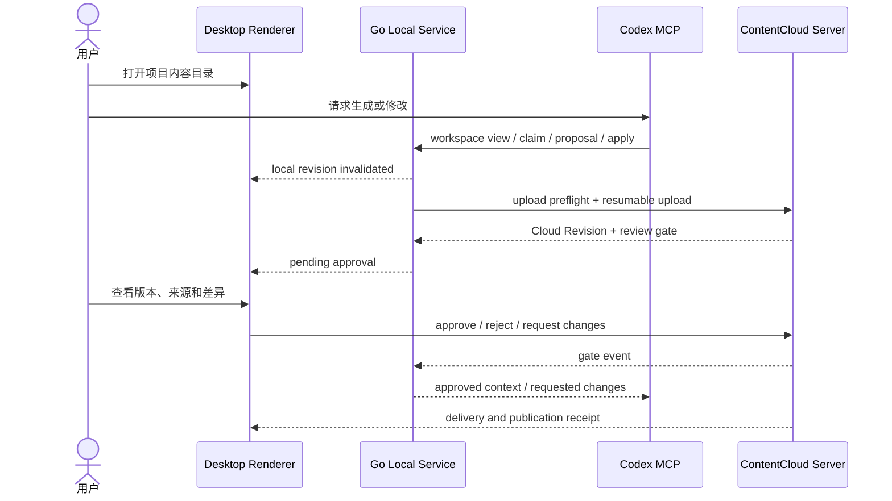

# 一次性架构整改与交付计划

状态：`目标目录与 Desktop 纵向闭环已冻结；代码切换尚未完成`。

更新时间：2026-08-17。

关联：[ADR-0018](./decisions/ADR-0018-desktop-surface-and-repository-topology.md)、[ADR-0019](./decisions/ADR-0019-local-cloud-sync-authority.md)、[Content Work OS Desktop](../product/content-work-os-desktop/04-delivery-plan.md)。

## 1. 迁移原则

项目仍处于早期研发期，本次直接切换到目标结构，不建立长期兼容迁移层：

- 删除旧目录、旧 import、旧别名、旧 Facade、旧脚本路径和双写。
- 不创建第二套业务模型、同步状态、审批状态或 Electron Node 后端。
- 开发数据库、本地缓存和 Fixture 可以重建；已发布数据库迁移历史不在目录整改中隐式删除。
- 每个实现步骤都必须保持可编译和可测试，但中间状态不作为可交付分支。
- 当前 Web、CLI、MCP、Browser Workbench 和 Runtime 的已验证行为必须由目标包直接承接，不复制行为。

## 2. 目标拓扑

```text
apps/web                         Web Studio / Operations / Public
apps/desktop                     Electron Main / Preload / Renderer
packages/contentcloud            npm CLI 安装器
packages/ui                      无业务 UI 原语与设计 Token
packages/contracts-ts            生成的 TypeScript 契约

internal/identity                用户、租户、设备、成员
internal/workspace               项目、绑定、项目上下文
internal/source                  来源、知识、权利、证据
internal/catalog                 Experience、SOP、Gate、Capability
internal/work                    WorkTask 与客户业务生命周期
internal/review                  Revision、Review、Approval、GateEvaluation
internal/delivery                Artifact、Media、DeliveryPackage、回执
internal/performance             结果、观察、评级和学习候选
internal/runtime                 Job、Node、Attempt、State、Effect
internal/experience              Studio、Operations、Projection
internal/local                   Workspace、Sync、Workbench、Desktop API
internal/integration             Agent、Connector、Provider、Plugin Host
internal/persistence              PostgreSQL、Memory、Blob
internal/transport                HTTP、CLI、MCP
internal/bootstrap                组合根、配置和进程启动
```

## 3. 单次切换顺序

```mermaid
flowchart LR
    A[ADR 与文档冻结] --> B[apps/web Surface]
    B --> C[apps/desktop Electron Shell]
    C --> D[internal/local Desktop API]
    D --> E[transport / integration / persistence]
    E --> F[identity / workspace / source / catalog]
    F --> G[work / review / delivery / performance]
    G --> H[runtime 与 Composition Root]
    H --> I[删除旧包与旧引用]
    I --> J[全量构建、测试、文档和分发门禁]
```



顺序是实现依赖顺序，不表示保留旧实现并行运行。每个旧包在目标调用完成后立即删除。

## 4. 代码整改工作包

| ID | 工作包 | 主要产物 | 退出条件 |
| --- | --- | --- | --- |
| R0 | 文档与 ADR | Desktop、Sync、目录、图谱和门禁事实源 | 相关文档无相互矛盾的旧策略 |
| R1 | Web Surface | `apps/web`、Vite、CI、Docker、脚本 | 根 `web/` 不存在，所有引用归一 |
| R2 | Desktop Shell | Forge、Main、Preload、Renderer、E2E | 安全窗口和最小项目 bootstrap 通过 |
| R3 | Local Service | `internal/local/{workspace,sync,workbench,desktopapi,config}` | Electron/Codex 共用 Kernel 与事件 |
| R4 | Transport | `internal/transport/{http,cli,mcp}` | Handler、DTO、命令表不再位于旧路径 |
| R5 | Integration | `internal/integration/{agent,connector,provider,pluginhost}` | 所有执行者和外部服务商路径归一 |
| R6 | Persistence | `internal/persistence/{postgres,memory,blob}` | Repository 端口由使用模块定义 |
| R7 | Business Modules | identity、workspace、source、catalog、work、review、delivery、performance | 每个事实域有独立模型、命令、查询和端口 |
| R8 | Runtime/Bootstrap | Runtime 与业务引用变为稳定 Ref，组合根重写 | Runtime 不导入具体内容业务包 |
| R9 | Cleanup | 删除旧宽包、别名、Facade、重复 DTO、无引用脚本 | 禁止清单扫描为零 |
| R10 | Distribution | Desktop 安装、更新、签名、诊断和 Release | macOS/Windows 预览包可安装并恢复 |

## 5. 事实所有权迁移

| 事实 | 新所有者 | 其他 Surface |
| --- | --- | --- |
| 本地文件、草稿和目录 | `internal/local/workspace` | Codex 经 Kernel 修改，Desktop 持续展示 |
| 同步 outbox、上传会话和事件游标 | `internal/local/sync` | Desktop 只读进度和发起命令 |
| Cloud Revision、Review、Gate、Approval | `internal/review` + Server | Desktop/Web/Codex 使用版本化命令 |
| Artifact、DeliveryPackage、渠道回执 | `internal/delivery` + Server | Desktop/Web 展示，Runtime 引用 |
| RuntimeAttempt、Lease、Effect | `internal/runtime` | Desktop/Web 读取投影，Codex 使用受限工具 |
| Electron 窗口和通知 | `apps/desktop` | 不得进入业务数据库 |
| SQLite 索引和缓存 | `internal/local` | 可删除、可重建，不得作为业务权威 |

## 6. 删除清单

最终代码中不得出现：

```text
internal/app
internal/domain
internal/store
internal/httpapi
internal/agentadapter
internal/localworkspace
internal/workbench
internal/localconfig
internal/environment
internal/mediapipeline
web/
旧全局 Service / Store / types.ts 扩展入口
Go 类型别名、旧路径转发、双写 Adapter、deprecated Facade
```

删除前必须把行为迁入目标模块并更新所有测试；删除后由 `rg`、Go import 检查、TypeScript import 检查和脚本治理门禁确认无引用。

## 7. Desktop 纵向闭环



## 8. 测试与质量门禁

### Go

- 每个业务模块拥有自己的模型、命令、查询、Repository contract 和错误码测试。
- Memory 与 PostgreSQL 使用同一套契约测试。
- Local Sync 测试覆盖 outbox、cursor、gap、digest、幂等、冲突和恢复。
- Runtime 测试禁止依赖 Desktop 或 Electron 包。

### Web/Desktop

- `apps/web` 维持现有 Vitest、typecheck 和 build。
- `apps/desktop` 增加 Main/Preload 单测、Renderer 组件测试和 Playwright Electron E2E。
- E2E 必须使用真实 Go Daemon 和 fixture Cloud API 验证同步、审批和上传，不只 mock IPC。

### 架构

- 检查旧目录、旧 import、跨 Surface 业务页面引用和通用 IPC。
- 检查 Runtime 不导入具体内容业务模块。
- 检查 Local SQLite 表只属于索引、outbox、游标和缓存。
- 检查 Desktop 文档能力状态与测试/分发证据一致。

## 9. 回退

如果 Desktop 包未达到分发门槛，停止发布 Desktop 安装包，保留目标代码目录并修复目标路径。不能恢复旧目录、旧 Store、旧 Service 或旧同步旁路。

## 10. 完成定义

- 目标目录存在且旧目录不存在。
- 业务事实、Runtime 事实、Local Workspace 和 Cloud Revision 各有唯一所有者。
- Codex、Desktop 和 Web 通过同一 revision/digest/allowed-actions 语义协作。
- 同步、上传、审批、冲突、离线、Daemon 重启和发布路径均有验证证据。
- 文档、图表、构建、CI、Docker、安装包和对外能力表述一致。
