# ContentCloud AI Infra 交付路线图

状态：`现有实现收口 + 外部接通路线`。

更新时间：2026-08-11。

## 1. 路线图口径

这份路线图从当前仓库事实出发，不再把已完成的 Adapter、Runtime、Schema 或回执链写成未来设计。状态只使用：

| 状态 | 含义 |
| --- | --- |
| `current` | 跨本地和服务端的代码、契约和测试已经形成主链 |
| `current-local` | 本地工作区可执行并产生可验证产物 |
| `current-server` | 服务端事实、状态机、Inbox、API 或持久化已实现 |
| `partial` | 内部实现已存在，但运营面、真实数据或纵向验收仍不完整 |
| `external-dependency` | 真实账号、端点、配额、平台审核或第三方服务尚未提供 |

`current-server` 不等于“已接通抖音、微信或某 SaaS 生产账号”。内部契约与真实平台接通必须分别验收。

## 2. 已交付基线

| 纵向能力 | 代码/事实源 | 契约/API | 验证 | 状态 |
| --- | --- | --- | --- | --- |
| 本地来源、知识和内容 | `internal/localworkspace` | LocalRun、EvidenceBundle、KnowledgePack、Brief、ContentBatch | localworkspace/CLI tests | `current-local` |
| 服务端提交和审核 | SubmissionRevision、Review、ApprovedSnapshot | SubmissionBundle 3.0、BFF/CLI | submission tests | `current-server` |
| 搜索与受控采集 | `internal/sourceinfra` | `source.search/fetch`、SourceIntake | source infra tests | `current-server` |
| 增量 Connector | `internal/connector` + memory/postgres repository | ConnectorSync、lease、cursor、tombstone | 崩溃重放/并发测试 | `current-server` |
| Agent Runtime | JobRun、NodeRun、RuntimeAttempt、SessionRef、Outbox | runtime worker、Harness registry | runtime tests | `current` |
| 开放 Agent Harness | Pi、remote-http、agent-saas | AgentExecution、signed callback | Harness/callback tests | `current-server` |
| 模型 Provider | vLLM、SGLang OpenAI-compatible Adapter | ModelGenerationReceipt | provider/app tests | `current-server` |
| 内容 Profile | `internal/contentprofile` 编译现有 SOP | douyin/wechat/novel profiles | profile tests | `current-server` |
| 微信文章与排版 | `internal/localworkspace/article.go` | Article/WeChatDelivery | layout/DOM/mobile/package tests | `current-local` |
| 小说生产 | `internal/localworkspace/novel.go` | Canon/Outline/Chapter/Release | continuity/release tests | `current-local` |
| 渠道发布 | ChannelBinding、ChannelPublication、CallbackReceipt | prepare/submit/inspect/withdraw/callback/reconcile/performance | channel tests | `current-server` |
| 抖音电商发布校验 | ApprovedSnapshot + Artifact + DeliveryPackage + ChannelPublication | DouyinCommerceValidationReceipt、typed prepare refs | local/server lineage tests | `current-local` / `current-server` |

## 3. 当前唯一主链

```mermaid
flowchart LR
    Intake["Source / Connector / Search"] --> Evidence["SourceRevision / Evidence"]
    Evidence --> Work["LocalRun / Knowledge / Brief / ContentBatch"]
    Work --> Submit["SubmissionRevision"]
    Submit --> Review["Review / ApprovedSnapshot"]
    Review --> Execute["Agent / SaaS / Model / Worker / Human"]
    Execute --> Artifact["Artifact / DeliveryPackage"]
    Artifact --> Publication["ChannelPublication"]
    Publication --> Receipt["Callback / Inspect / Receipt / Performance"]
```



禁止再引入以下平行主线：

- SaaS 自己的 Task 取代 WorkTask。
- Agent Session 取代 RuntimeAttempt/SessionRef。
- 模型输出直接成为 ApprovedSnapshot。
- Connector 直接写 Knowledge 或 Content。
- 新的发布聚合取代 ChannelPublication。
- 泛化 Asset 覆盖 SourceRevision、WorkspaceMaterial、Artifact 和 DeliveryPackage 的职责。

## 4. 第一阶段：真实外部接通

目标不是再加内部抽象，而是用已有契约接通最少一条真实外部链。

### 4.1 搜索/采集

选择一个公开搜索 Provider 和一个明确授权站点：

1. 配置 `CONTENTCLOUD_SEARCH_ENDPOINT` 和 Fetch allowlist。
2. 验证查询成本、超时、结果摘要和 SourceRevision 物化。
3. 验证重定向、私网地址、超大响应、重复页面和删除传播。
4. 记录来源权利、采集时间、Provider 和请求摘要。

验收：一次真实研究任务从 query 到 Evidence，再进入 Knowledge candidate；搜索摘要不能越权成为批准事实。

状态：内部 `current-server`，Provider/站点为 `external-dependency`。

### 4.2 Agent/SaaS

至少选择 Pi、远程 Agent 或 Agent SaaS 中两种进行真实运行：

1. 同一 Content Profile Stage 分别由两个不同 Harness 完成。
2. 两者都只能写 `TaskRevision(draft)` 或 Artifact candidate。
3. 验证 session.started/progress/usage/result/failed/yield。
4. 在 inbox 写入后模拟进程中断，使用相同 message ID 重放。
5. 验证摘要冲突、租户错配、SessionRef 错配和过期签名被拒绝。

验收：更换 Agent 不改变 WorkTask、Review、ApprovedSnapshot、Artifact 或 ChannelPublication ID 体系。

状态：内部 `current-server`，具体 Agent/SaaS 为 `external-dependency`。

### 4.3 模型推理

使用同一批结构化生成请求对 vLLM 与 SGLang 做真实基准：

- 首 token/整体延迟、吞吐、结构化输出通过率。
- 长上下文、批量 fanout、取消和超时恢复。
- Token/费用/模型版本/端点摘要。
- 失败时 TaskRevision 不晋升，Provider 不能拥有内容事实。

验收：ExecutionProfile 可在发布前选择 Provider；运行中不能由 Agent 任意改端点。

状态：Adapter `current-server`，推理集群为 `external-dependency`。

## 5. 第二阶段：真实渠道闭环

### 5.1 微信公众号

当前可执行链：

```text
Article ApprovedSnapshot
  -> deterministic layout template
  -> inline CSS / sanitize / asset mapping
  -> DOM digest / mobile lint / platform-clean diff
  -> WeChatDeliveryPackage
  -> operator runbook
  -> manual ChannelPublication receipt
```

下一步只需验证真实后台粘贴清洗差异和人工回执，不应再造排版模型。取得官方草稿/发布 API 后新增 Channel Adapter；人工模式仍是明确执行方式，不是兼容层。

验收：包生成不显示为 published；只有记录外部 ID、URL、账号和发布时间的回执才能推进发布状态。

### 5.2 抖音电商

当前可执行链：

```text
AudienceStrategy ApprovedSnapshot
  + CommerceOffer ApprovedSnapshot(valid at scheduled_at)
  + ContentItem ApprovedSnapshot
  + Storyboard ApprovedSnapshot(locked_digest)
  + final media Artifact in DeliveryPackage
  -> DouyinCommerceValidationReceipt
  -> ChannelPublication(prepared)
  -> external callback/inspect/manual receipt
```

发布前必须验证：

- 所有识别出的价格/币种等于 Offer。
- 优惠、赠品、库存和条件以显式观察项出现，且为 Offer 允许子集。
- 动态商品文案镜头引用 Offer 的 approved claim。
- 账号、商品锚点、落地页、排期和最终成片摘要固定。
- Receipt、ContentItem、Storyboard、Artifact、DeliveryPackage 摘要贯通。

验收：修改成片、落地页文本、Offer 或任一 ApprovedSnapshot 后，原校验回执不能重用。

状态：校验和发布状态机 `current`，抖音账号/商品锚点/API 为 `external-dependency`。

### 5.3 小说/内容商店

当前本地链：Canon -> Outline -> Chapter -> continuity lint -> Release。下一步将 NovelRelease 投影到现有 DeliveryPackage，再通过 Channel Adapter 记录排期、章节 ID、审核状态和回执。

验收：Agent 会话记忆不能作为连续性证据；每章必须引用固定 Canon/Outline 版本。

状态：生产 `current-local`，渠道发布为 `partial` / `external-dependency`。

## 6. 第三阶段：运营与规模验证

只有真实外部运行产生数据后再推进：

| 能力 | 输入证据 | 验收 |
| --- | --- | --- |
| Provider 路由 | vLLM/SGLang/云 API 基准、失败率和费用 | 策略可解释、可冻结、可回滚 |
| 渠道运营队列 | Callback、unknown、failed、manual_action_required | 用户能看见下一动作、重试/对账边界 |
| 质量评测 | Content/Artifact/Receipt/Performance 血缘 | 不用发布后指标反向篡改批准内容 |
| Connector 运维 | lease、cursor、tombstone、lag、失败回执 | 可重放、不重复、不跳过删除 |
| Agent 运维 | Attempt、SessionRef、usage、callback inbox | 可取消、可恢复、可归因成本 |

## 7. 配置与部署验收

部署配置必须显式提供，而不能埋在业务数据：

```text
CONTENTCLOUD_SEARCH_ENDPOINT
CONTENTCLOUD_FETCH_ALLOWED_HOSTS
CONTENTCLOUD_CONNECTOR_ENDPOINT
CONTENTCLOUD_CONNECTOR_API_KEY

CONTENTCLOUD_VLLM_ENDPOINT / MODEL / API_KEY
CONTENTCLOUD_SGLANG_ENDPOINT / MODEL / API_KEY

CONTENTCLOUD_REMOTE_AGENT_ENDPOINT / TOKEN
CONTENTCLOUD_PI_AGENT_ENDPOINT / TOKEN
CONTENTCLOUD_AGENT_SAAS_ENDPOINT / TOKEN
CONTENTCLOUD_AGENT_CALLBACK_SECRETS
```

Secret 只能以 SecretRef 或环境配置存在；Channel、Provider、Connector、Agent callback 的签名 Secret 不得复用。

## 8. 代码完成定义

每项 Infra 能力必须同时满足：

1. 有唯一事实拥有者，没有平行 Task/Review/Content/Artifact/Publication。
2. 有 JSON Schema/OpenAPI/CLI 中至少一个稳定外部契约。
3. 有租户、权限、摘要、幂等、错误和重放语义。
4. 有正常、拒绝、重复和崩溃恢复测试。
5. 文档明确区分内部 `current` 与 `external-dependency`。
6. Mermaid 图与代码对象一致。
7. `pnpm architecture`、治理检查、Go 测试和 Web typecheck 通过。

## 9. 不进入近期路线图

- 自研 GPU 推理内核。
- 为不存在的旧用户保留兼容表、兼容 Schema 或双写。
- 在真实外部数据出现前建设万能 Model Gateway、联邦搜索或自动优化器。
- 让任意 Agent/SaaS 自行扩大网络、预算、账号或发布权限。
- 为每种内容、平台或 Agent 创建第二套任务、审批、内容、资产和发布模型。
