# 内容创作 AI Infra 架构与流程图谱

状态：`当前架构图 + 外部接通边界`。

更新时间：2026-08-11。

## 1. 阅读规则

- `current-local`：本地工作区、Plugin、Skill、MCP 和 CLI 已有可验证实现。
- `current-server`：服务端提交、审核、批准快照、Artifact 或投影已有实现。
- `runtime`：V8 JobRun/NodeRun/RuntimeAttempt 负责自动化执行事实。
- `partial`：内部 Adapter、契约或局部链路已经存在，但仍缺少真实外部验证。
- `external-dependency`：需要真实平台账号、授权、配额、模型集群或第三方 SaaS。
- 实线表示正式引用或已验证调用；虚线表示候选、事件、投影或外部接通边界。
- 图中的模块边界不是网络拆分建议，首阶段继续使用模块化单体和本地 Plugin。
- 图中的 Agent/SaaS 名称是执行适配示例；业务节点只绑定 Capability、Schema、ExecutionProfile 和固定引用。

## 2. 当前三执行平面架构图

这张图是当前系统的事实图，不把本地交互生产误画成云端 Runtime 工作流。

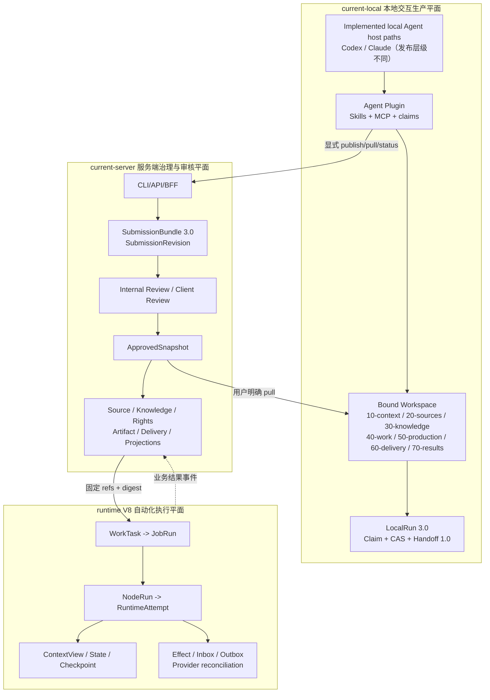

当前 Codex/Claude 是已实现基线，不是封闭名单。Pi Agent、其他本地宿主或 Agent SaaS 只有通过统一能力、隔离、恢复、事件和回执门槛后才能进入已发布执行目录。

### 2.1 开放执行生态架构

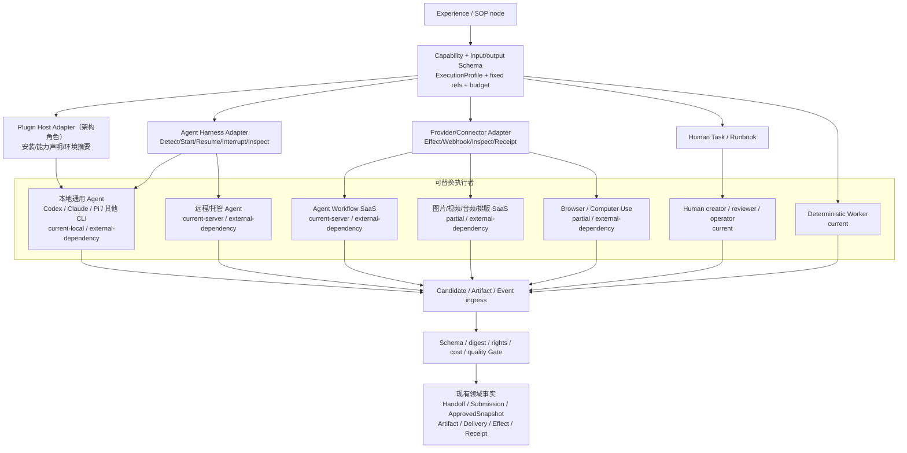

SOP 不直接引用 `codex`、`claude`、`pi` 或某个 SaaS 名称。品牌绑定属于已发布 ExecutionProfile；停用一个执行者不会改变历史内容、审批和交付事实。

## 3. 当前本地到服务端流程图

### 3.1 内容工作区主链

```mermaid
flowchart LR
    Context["workspace_context"] --> Source["source register / ingest"]
    Source --> Evidence["EvidenceBundle 3.0"]
    Evidence --> Claim["LocalRun claim"]
    Claim --> Knowledge["knowledge import / lint / pack"]
    Knowledge --> Brief["Brief 3.0\n或 ArticleBrief 1.0"]
    Brief --> Batch["ContentBatch 3.0"]
    Batch --> Item["ContentItem 3.0\n或 Article 1.0"]
    Item --> Lint["item lint -> batch lint -> finalize"]
    Lint --> Preflight["publish_preflight\nexact files + disclosure"]
    Preflight --> Confirm{"用户确认同一 plan_id?"}
    Confirm -->|否| Stop["不产生云端写入"]
    Confirm -->|是| Apply["publish_apply"]
    Apply --> Revision["SubmissionRevision"]
    Revision --> Review["服务端审核"]
    Review --> Decision{"批准?"}
    Decision -->|否| Changes["反馈拉取\n本地新修订"]
    Decision -->|是| Snapshot["ApprovedSnapshot"]
    Snapshot --> Pull["approved_snapshot_pull"]
```

### 3.2 公众号当前交付流程

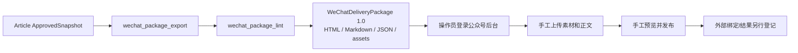

`Package` 生成和校验没有外部公众号副作用；`Publish` 不是 ContentCloud 可以代替用户声称完成的动作。

### 3.3 公众号排版与交付派生图

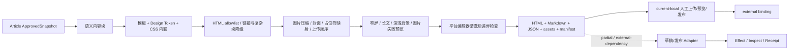

排版是 ApprovedSnapshot 的渠道派生，不能反向静默修改已批准正文。模板、转换器、渠道规格和所有图片派生都要固定版本与 digest。

## 4. 当前 V3 对象与血缘图

```mermaid
flowchart LR
    Material["WorkspaceMaterial\nversion + digest"] --> SourceRevision["SourceRevision"]
    SourceRevision --> Evidence["EvidenceBundle 3.0\nlocator + quote + digest"]
    Evidence --> KnowledgePages["Markdown knowledge pages"]
    KnowledgePages --> KnowledgePack["KnowledgePack 3.0"]
    KnowledgePack --> KnowledgeSubmit["knowledge Submission"]
    KnowledgeSubmit --> KnowledgeSnapshot["KnowledgeSnapshot 1.0"]

    KnowledgeSnapshot --> Brief["Brief / ArticleBrief"]
    Brief --> Batch["ContentBatch 3.0"]
    Batch --> Item["ContentItem / Article"]
    Item --> ContentSubmit["content_batch Submission"]
    ContentSubmit --> ContentApproved["content_batch ApprovedSnapshot"]
    ContentApproved --> Storyboard["StoryboardPackage 1.0"]
    Storyboard --> StoryboardSubmit["storyboard Submission"]
    StoryboardSubmit --> StoryboardApproved["storyboard ApprovedSnapshot"]
    StoryboardApproved --> Artifact["Artifact / media"]
    Artifact --> Delivery["DeliveryPackage / Seedance / WeChat package"]

    ContentApproved --> Result["CreativeResultAssetProjection"]
    Delivery --> Result
    Result --> Reuse["CreativeAssetRef\n下一任务固定引用"]
```

### 4.1 首个用户前的旧入口收口与删除图

这张图描述技术契约的破坏性收口；它不删除内容修订、批准快照、Artifact 或发布回执。

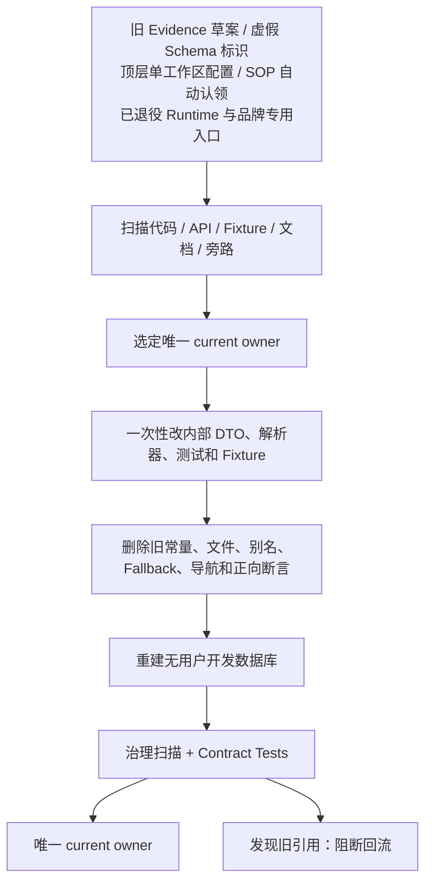

不做在线双写、请求级版本协商或永久适配层。当前没有用户迁移义务，重复入口直接删除。

## 5. 当前两类 Handoff 与跨执行者 Agent

Studio 启动交接与 LocalRun 恢复不是同一状态机：前者选择宿主并固定目标，后者在已绑定 workspace 内延续受治理的运行。

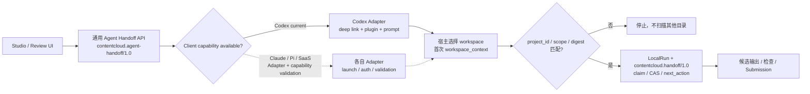

`contentcloud.agent-handoff/1.0` 是通用契约，Codex 只是当前第一个可用 Adapter。新增 Claude Code、Pi Agent、远程 Agent 或 Agent SaaS 时，只新增客户端能力、启动/鉴权 Adapter 和契约测试，不新增品牌专用业务路由。

### 5.1 LocalRun 跨对话恢复时序

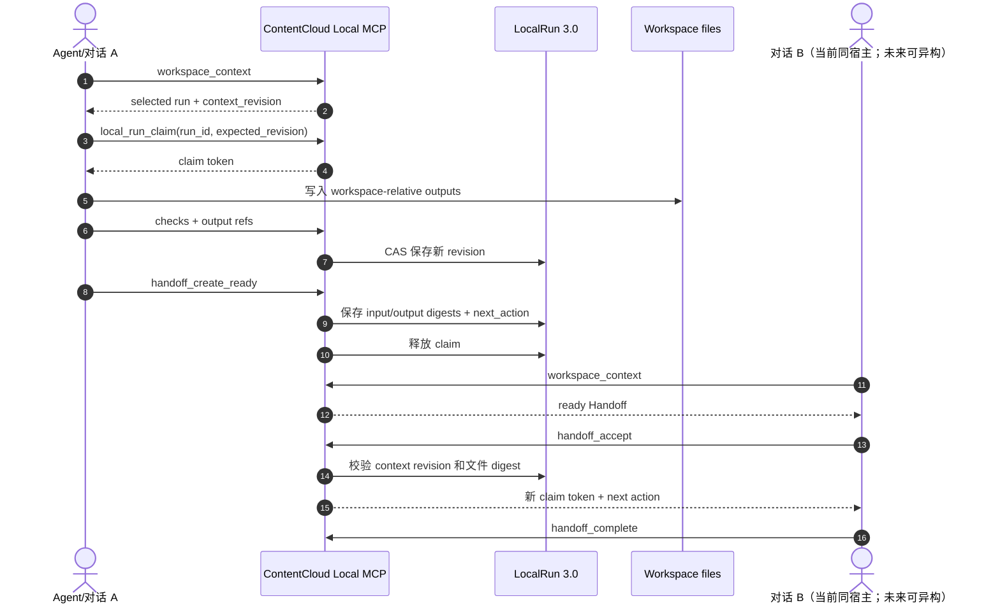

这条链不依赖旧聊天记录，也不应被替换成一个把全文对话放入 Runtime 的通用 Envelope。当前已发布的交互式恢复路径仍以 Codex 为主；Handoff 契约和固定摘要边界应允许未来由 Claude Code、Pi Agent 或其他宿主接续，但必须分别验收，不能为未发布宿主保留运行时兼容分支。

### 5.2 跨 Agent、SaaS、Worker 和人工异步协作时序

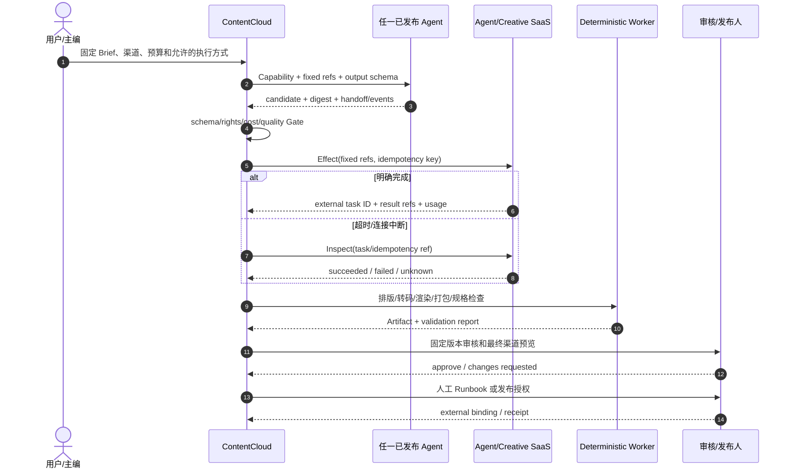

Agent 会话 ID、SaaS task ID 和人工工单 ID 都只是执行引用；ContentCloud 的 Handoff、Revision、ApprovedSnapshot、Artifact、Delivery 和 Effect 才是跨执行者协作边界。

## 6. 当前审核与批准时序图

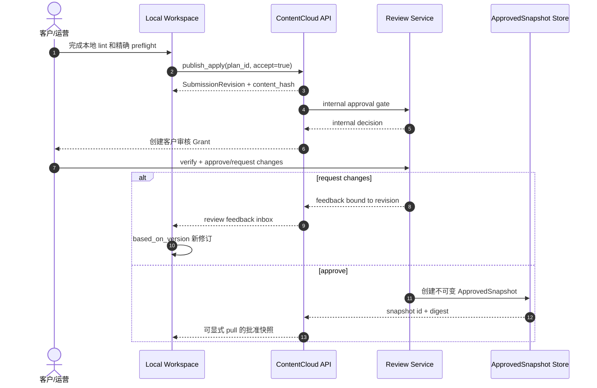

## 7. 搜索、采集与证据物化流程图

Search/Fetch/Connector 的内部执行器已经存在；公开搜索源、平台趋势和企业账号属于 `external-dependency`。无论来源来自 API、网页、文件还是 SaaS，最终只能进入 `Source -> SourceRevision -> Evidence`。

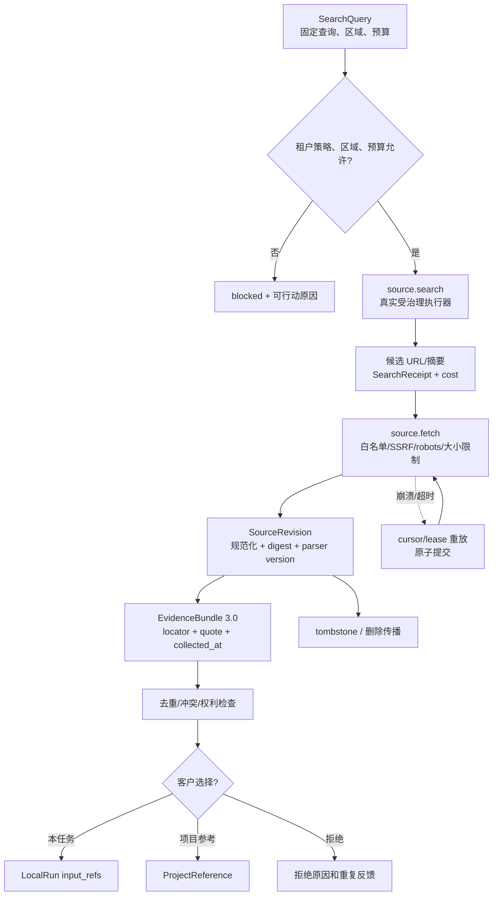

Connector 不直接写 Knowledge、Content 或 Publication；它只产生可追溯的 SourceRevision/Evidence，后续知识提取和内容生产必须重新经过项目权限与批准 Gate。

## 8. Runtime 自动化执行图

Runtime 只适用于需要持久化自动化、服务端 Worker 或受控 Provider 的任务节点；普通本地交互不应强制进入此图。

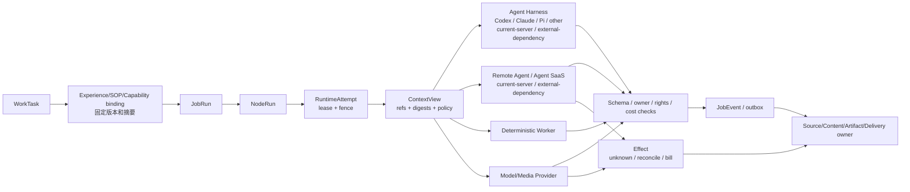

### 8.1 Agent SaaS 回调与崩溃重放时序

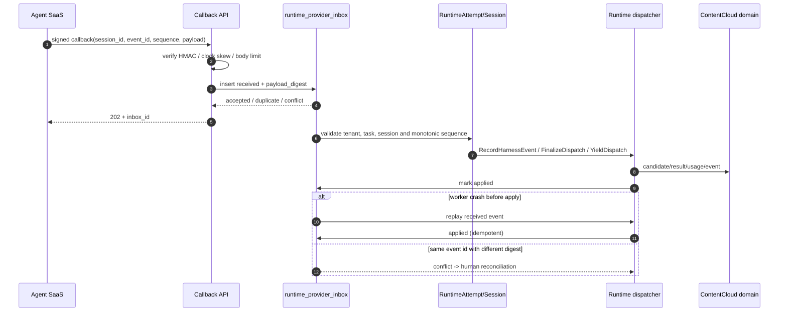

## 9. 渠道发布、回执与对账时序图

Channel Binding、Publication、Callback、Inspect、Reconcile 和 Performance 已是服务端当前能力；真实平台账号/API 仍标记为 `external-dependency`。`published` 只能由外部回执或 Inspect 对账进入。

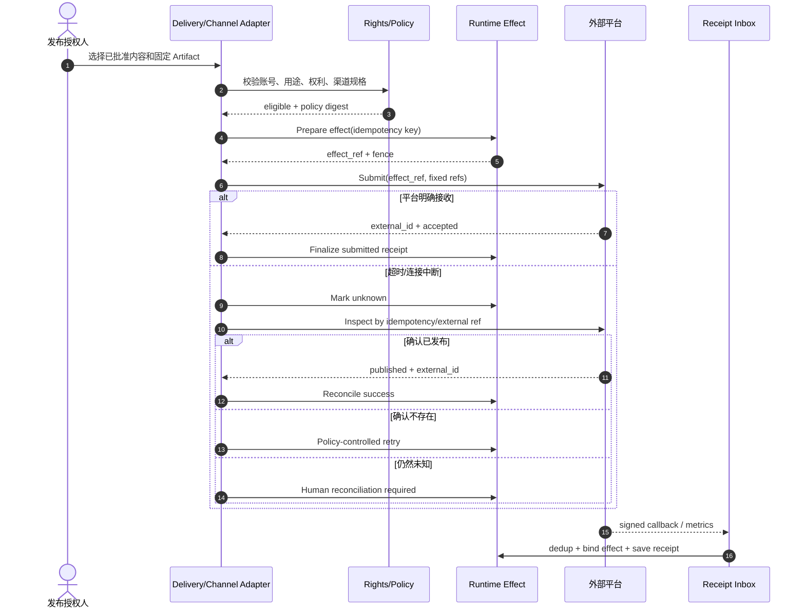

## 10. 三个高价值场景的纵向血缘图

### 10.1 微信公众号排版流水线

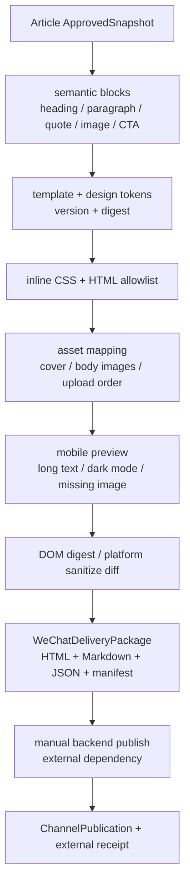

### 10.2 小说 Canon 与连续性流水线

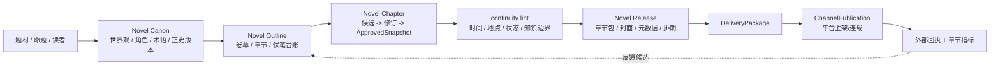

### 10.3 抖音电商完整发布血缘

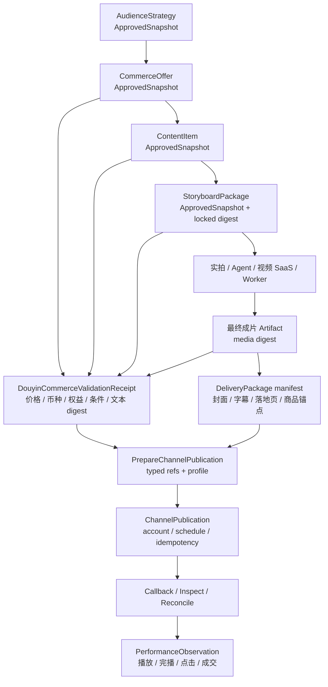

## 11. 当前状态图

### 11.1 内容对象状态

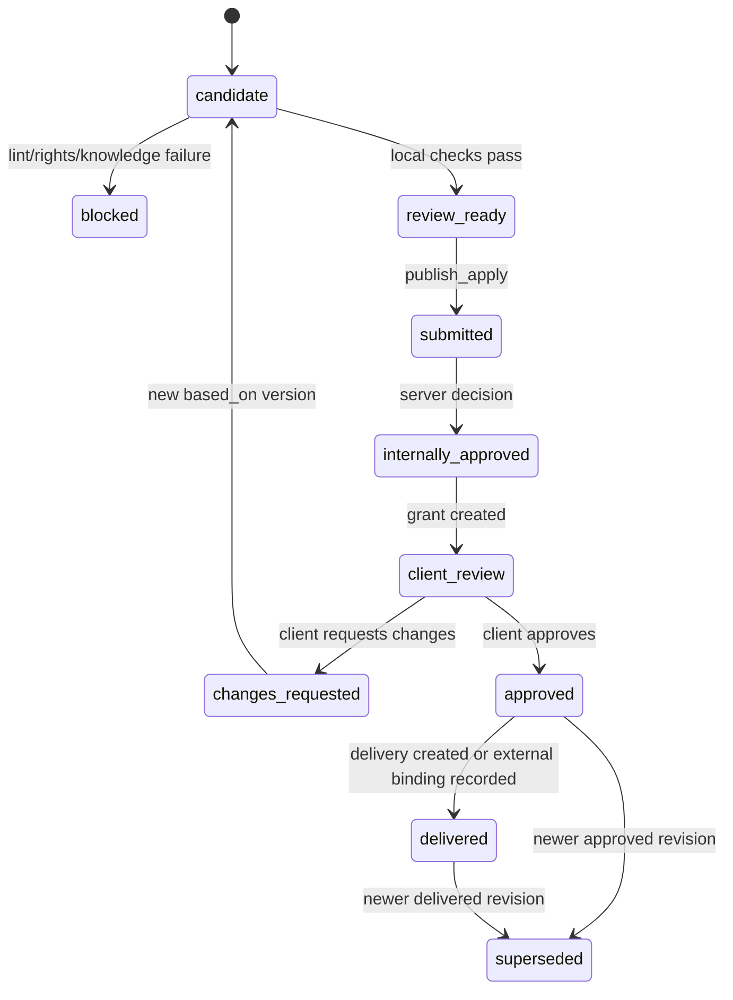

### 11.2 外部 Effect 状态

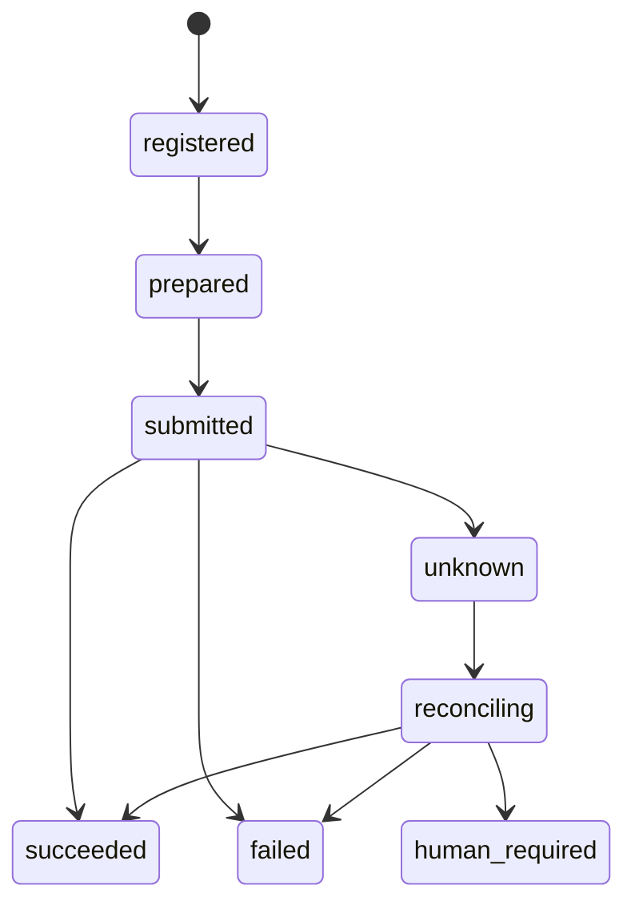

公众号人工上传不进入自动 Effect 状态；它使用 WeChatDeliveryPackage 和后续外部绑定记录。

### 11.3 ChannelPublication 状态机

```mermaid
stateDiagram-v2
    [*] --> prepared
    prepared --> manual_action_required: 无可用 API / 需要登录态
    prepared --> submitted: Submit effect accepted
    prepared --> failed: preflight rejected
    manual_action_required --> submitted: 操作员确认已提交
    submitted --> unknown: 超时或连接中断
    submitted --> failed: 外部明确拒绝
    unknown --> submitted: Inspect/Callback 发现已接收
    unknown --> prepared: Inspect 确认未产生副作用
    submitted --> published: 外部 Receipt/Inspect 明确成功
    published --> withdrawn: 外部撤回回执
    published --> published: 指标/重复回执幂等
    failed --> prepared: 新的授权和版本
    withdrawn --> [*]
```

本地验证、模型输出、Worker 成功或 ContentCloud 内部状态都不能直接把 Publication 标记为 `published`。

## 12. 当前部署拓扑与外部边界

```mermaid
flowchart TB
    subgraph Device["用户设备"]
        Browser["Web Studio / Admin"]
        CLI["ContentCloud CLI"]
        Host["Local Agent host paths\nCodex / Claude / Pi / other\ncurrent-local / external-dependency"]
        Plugin["Plugin Skill + MCP"]
        Workspace["Bound Workspace files"]
        Browser --> API
        CLI --> API
        Host --> Plugin --> Workspace
        Workspace --> CLI
    end

    subgraph Cloud["ContentCloud 模块化单体"]
        API["Go Server / BFF / CLI API"]
        Domains["Business Domains\nWork / Source / Knowledge / Review / Delivery"]
        Runtime["V8 Runtime\nJob / Node / Attempt / Effect"]
        Worker["Worker\nparse / media / projection / reconcile"]
        API --> Domains
        API --> Runtime
        Domains <--> Runtime
        Worker <--> Runtime
        Worker --> Domains
    end

    subgraph Data["数据基础"]
        PG["PostgreSQL + RLS"]
        Blob["Object Storage + digest"]
        Secret["Secret / Environment lock"]
        Obs["Logs / Metrics / Traces"]
    end

    subgraph External["外部系统（按能力逐步接入）"]
        Search["Search/Crawl API\ncurrent-server / external-dependency"]
        Models["Cloud Model / vLLM / SGLang\ncurrent-server / external-dependency"]
        Media["Media Provider\npartial / external-dependency"]
        AgentSaaS["Remote Agent / Agent SaaS\ncurrent-server / external-dependency"]
        CreativeSaaS["Creative/Layout/Edit SaaS\npartial / external-dependency"]
        Channels["WeChat manual / Channel API\ncurrent-local / external-dependency"]
    end

    Domains --> PG
    Runtime --> PG
    Worker --> Blob
    Domains --> Blob
    API --> Secret
    Runtime --> Obs
    Worker --> Obs
    Worker --> Search
    Worker --> Models
    Worker -. "partial / external-dependency" .-> Media
    Runtime --> AgentSaaS
    Worker -. "partial / external-dependency" .-> CreativeSaaS
    Domains -. "current-local / external-dependency" .-> Channels
```

## 13. 故障恢复决策图

```mermaid
flowchart TB
    Failure["节点或外部调用异常"] --> SideEffect{"可能产生外部副作用?"}
    SideEffect -->|否| Retryable{"错误类型允许重试?"}
    Retryable -->|是| Budget{"预算/截止/次数允许?"}
    Budget -->|是| Attempt["创建新 RuntimeAttempt\n从 ContextView/Checkpoint 恢复"]
    Budget -->|否| Human["人工处置"]
    Retryable -->|否| Blocked["节点失败 + 恢复动作"]
    SideEffect -->|是| Known{"外部结果已确认?"}
    Known -->|成功| Finalize["固定 Artifact/费用/回执"]
    Known -->|明确不存在| EffectRetry{"策略允许受控重试?"}
    EffectRetry -->|是| NewEffect["复用 Effect 意图\n创建新尝试"]
    EffectRetry -->|否| Human
    Known -->|未知| Inspect["Inspect / Callback / Bill 对账"]
    Inspect -->|成功| Finalize
    Inspect -->|不存在| EffectRetry
    Inspect -->|仍未知| Human
```

## 14. 图谱与事实来源

| 图 | 事实来源 | 状态 |
| --- | --- | --- |
| 三执行平面 | Workspace Skill、LocalRun、Submission、Foundation、V8 | `current` |
| 本地到服务端主链 | CLI/MCP publish、V3 contracts、Review tests | `current` |
| 公众号交付 | WeChatDelivery contract/Skill/CLI | `current-local` |
| V3 对象血缘 | localworkspace、app submission、asset projections | `current-server` / `current-local` |
| 搜索采集 | `internal/sourceinfra`、`internal/connector`、SourceRevision/Evidence | `current-server` / `external-dependency` |
| Runtime 自动化 | Runtime V8、Effect、Provider inbox | `current-server` |
| 开放执行生态 | AgentHarnessAdapter、ExecutionProfile、Plugin claims、Effect | `current-server` / `external-dependency` |
| 公众号排版派生 | Article/WeChatDelivery、DOM digest、移动 lint | `current-local` |
| 跨 Agent/SaaS 协作 | LocalRun/Handoff、Agent callback、Effect | `current-server` / `external-dependency` |
| 自动渠道发布 | Channel Binding/Publication/Callback/Reconcile/Performance | `current-server` / `external-dependency` |
