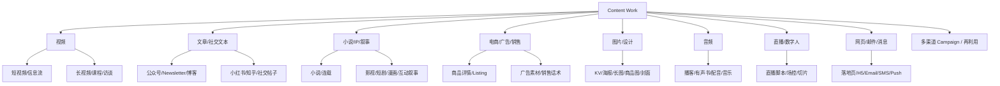
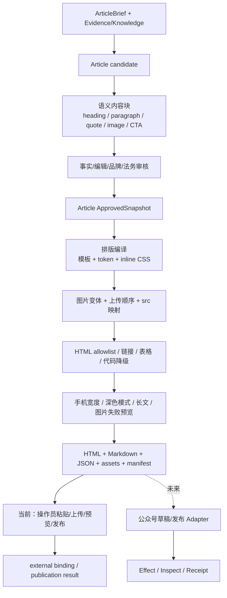
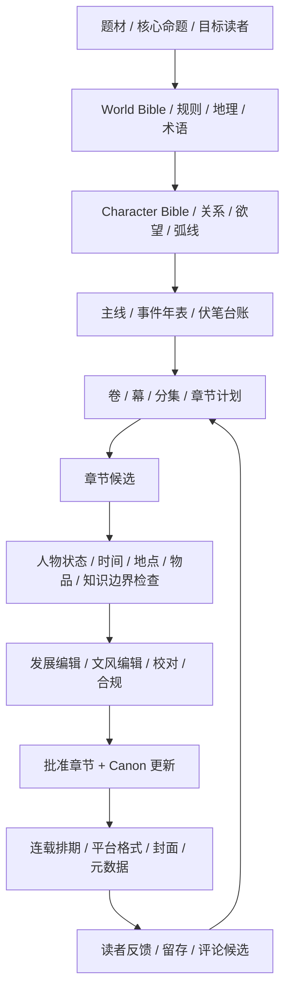
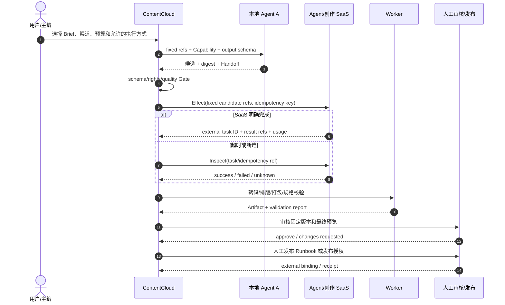

# 内容生产场景与渠道 Infra 矩阵

状态：`场景图谱 + 当前能力映射 + 外部接通边界`。

更新时间：2026-08-17。

## 1. 结论

内容创作 Infra 不能只表达“调用一个大模型生成正文”。一项可交付内容至少同时包含：事实输入、创作决策、结构化正文、媒体资产、平台专有派生、审核、发布和回执。

Desktop 为这些场景提供持续项目容器，而不是新增一种内容场景：它统一展示物理目录、结构化产物、大媒体、传输、审批和交付状态；Codex 继续负责对话期生成，Web 继续负责团队与平台治理。任何新场景都必须说明三种工作面各自显示什么，以及离线、上传、冲突和审批如何处理。

“穷举所有方式”不应维护成永远不完整的平台名单，而应覆盖六个正交维度：

1. 内容形态：文本、图片、视频、音频、交互页面、直播和跨媒体 IP。
2. 业务目的：种草、转化、品牌、教育、娱乐、搜索获客、客户成功和内部传播。
3. 生产模式：单 Agent、多 Agent、Agent + Worker、Agent SaaS、垂直创作 SaaS、人工或混合协作。
4. 平台专有工序：排版、尺寸、安全区、字幕、封面、商品锚点、章节连续性、元数据和审核规则。
5. 交付方式：文件包、人工上传、浏览器协作、平台草稿 API、自动发布 API、排期或下游系统同步。
6. 生命周期：候选、修订、批准、派生、发布、撤回、表现回流和再次利用。

平台可以不断增加，但每个平台都能落入这六个维度。ContentCloud 的任务是保存共同主干和平台差异，而不是为每个渠道复制一套任务、资产和审批系统。

## 2. 所有内容场景的共同主干

```mermaid
flowchart LR
    Intent["目标 / 受众 / 渠道 / Offer"] --> Inputs["授权资料 / 搜索 / 采集 / 数据连接器"]
    Inputs --> Evidence["SourceRevision / EvidenceBundle"]
    Evidence --> Knowledge["Knowledge / Rights / Claims"]
    Knowledge --> Brief["Brief + 场景规格"]
    Brief --> Create["Agent / SaaS / Worker / Human 生产候选"]
    Create --> Review["Lint / 编辑 / 法务 / 客户审核"]
    Review --> Approved["ApprovedSnapshot"]
    Approved --> Derive["渠道派生 / 排版 / 渲染 / 打包"]
    Derive --> Delivery["人工交付或 Channel Adapter"]
    Delivery --> Receipt["外部绑定 / 发布回执 / 指标"]
    Receipt --> Learning["复盘 / Learning Candidate / 资产复用"]
```



共同主干不意味着所有内容使用同一 Schema。文章、视频、分镜等不同内容类型可以有专用契约；但同一语义不能同时维护两条版本主线。新场景先使用唯一 current Schema 的扩展点和 Delivery Profile；若现有契约无法表达，就在首个用户前重写并删除冲突版本，而不是长期增加适配层。

### 2.1 纵向场景接线表

下表把场景、执行者、规范产物和发布事实连成一条可验收的链路。`Executor kind` 是能力类型，不是品牌白名单；同一阶段可以替换 Codex、Claude Code、Pi Agent、远程 Agent、Agent SaaS、垂直创作 SaaS、Worker 或人工。

| 场景 | Content Profile | Stage | Executor kinds | Canonical output | Artifact | Delivery | ChannelPublication | Receipt |
| --- | --- | --- | --- | --- | --- | --- | --- | --- |
| 抖音电商短视频 | `douyin-commerce-video` | audience -> offer -> script -> storyboard -> render -> validate | `agent` / `creative_saas` / `worker` / `human` | Approved ContentItem + StoryboardPackage | 9:16 final render、封面、字幕、落地页 | DeliveryPackage manifest + 商品锚点 | `douyin` binding | DouyinCommerceValidationReceipt + callback/inspect |
| 微信公众号文章 | `wechat-official-article` | research -> article -> layout -> mobile-lint | `agent` / `worker` / `human` | Approved Article | HTML、Markdown、JSON、图片和封面 | WeChatDeliveryPackage | `wechat` manual/API binding | 人工外部回执或 Channel callback |
| 连载小说 | `serialized-novel` | canon -> outline -> chapter -> continuity -> release | `agent` / `worker` / `human` | Approved Canon/Chapter/Release | EPUB/平台章节包、封面、元数据 | Novel DeliveryPackage | `novel`/平台 binding | 上架/连载回执、章节指标 |
| 小红书图文 | `content-batch-3.0` + `xiaohongshu` Delivery Profile | keyword -> card-script -> render -> review | `agent` / `creative_saas` / `worker` / `human` | Approved post text + card set | 多比例图片、正文、标签 | Social DeliveryPackage | `xiaohongshu` binding | external receipt |
| 长内容拆短 | `content-batch-3.0` + channel-specific Delivery Profile | source-lock -> semantic-slice -> channel-rewrite | `agent` / `worker` / `human` | Approved derivative set | 视频切片、卡片、帖子、邮件 | Campaign DeliveryPackage | 每渠道独立 publication | 每渠道 receipt + metrics |
| 播客/有声书 | `content-batch-3.0` + audio Delivery Profile | outline -> record -> edit -> chapterize | `agent` / `creative_saas` / `worker` / `human` | Approved episode/chapter | 音频、转写、章节和封面 | Audio DeliveryPackage | podcast/audio-store binding | ingest/availability receipt |
| 落地页/Email | `content-batch-3.0` + web/email Delivery Profile | brief -> copy -> render -> link-lint | `agent` / `worker` / `human` | Approved copy + layout | HTML、图片、变量 Schema、追踪参数 | Web/Email DeliveryPackage | `web`/`email` binding | send/publish receipt + metrics |
| 直播切片 | `content-batch-3.0` + video Delivery Profile | transcript -> highlight -> edit -> caption | `agent` / `creative_saas` / `worker` / `human` | Approved clip set | 多条视频、封面、标题、回链 | Video DeliveryPackage | `douyin`/`kuaishou`/`video_channel` binding | upload receipt + performance |

## 3. 内容从哪里来

| 输入方式 | 典型内容 | Infra 要求 | 当前状态 |
| --- | --- | --- | --- |
| 用户直接输入 | 主题、口述需求、商品卖点、故事梗概 | 固定原始需求、操作者和时间 | `current` |
| 本地文件 | 文档、表格、PDF、图片、音视频 | MIME、digest、locator、解析版本 | `current-local` / `partial` |
| 项目资料库 | 品牌规范、历史内容、商品资料 | 权限裁剪、版本、删除传播 | `current-server` / `partial` |
| Web 搜索 | 公开事实、选题、竞品、趋势 | 查询计划、成本、结果回执、来源固定 | `current-server` / `external-dependency` |
| 指定网页采集 | 官网、新闻、法规、商品页 | 白名单、SSRF/robots、正文定位 | `current-server` / `external-dependency` |
| 平台趋势/热榜 | 抖音、小红书、搜索趋势、榜单 | 时效、区域、授权、平台条款 | `partial` / `external-dependency` |
| 社交聆听 | 评论、舆情、用户问题 | 隐私、脱敏、采样偏差、删除 | `partial` / `external-dependency` |
| 电商/CRM/PIM | 商品、库存、价格、人群、活动 | OAuth、游标、字段映射、时效 | `current-server` / `external-dependency` |
| CMS/DAM/云盘 | 历史文章、图片、视频和品牌素材 | 增量同步、ACL、tombstone | `current-server` / `external-dependency` |
| 访谈/会议 | 专家访谈、播客、用户研究 | ASR、说话人、时间码、授权 | `partial` / `external-dependency` |
| 数据分析结果 | 关键词、投放、点击、转化和留存 | 指标口径、时间窗、归因版本 | `partial` / `external-dependency` |
| 人工策展 | 编辑挑选、运营灵感、参考案例 | 选择原因、用途、项目引用 | `current-server` |

搜索摘要、评论聚合、模型记忆和 SaaS 研究结果都只是候选输入。它们不能绕过 Source/Evidence/权利门禁直接变成已批准知识。

## 4. 谁可以生产内容

| 生产组合 | 适合场景 | 交接方式 | 风险控制 |
| --- | --- | --- | --- |
| 单一本地 Agent | 短任务、强交互、本地资料敏感 | LocalRun + Claim + Handoff | 工作区边界、结构化输出、人工确认 |
| 多本地 Agent 串行 | 研究 -> 写作 -> 校对 | 每阶段固定 input/output refs | 禁止共享隐式聊天记忆 |
| 多 Agent 并行 | 多方向脚本、标题、视觉方案 | ContentBatch fanout + 合并 Gate | 控制变量、去重、成本预算 |
| 本地 Agent + 确定性 Worker | 写作 + Lint/排版/渲染/打包 | Artifact 和校验报告 | 规则步骤不得由自由文本替代 |
| Runtime Agent Harness | 无人值守、可恢复的长时任务 | JobRun/NodeRun/Attempt 事件 | 租约、取消、恢复、隔离、预算 |
| 远程 Agent | 研究、生成、专用推理服务 | API 任务 + Webhook/Inspect | 最小上下文、租户隔离、未知结果对账 |
| Agent 工作流 SaaS | 多 Agent 研究/编排/自动化 | Connector + Effect + Receipt | SaaS 流程不是权威任务状态 |
| 垂直创作 SaaS | 图片、视频、剪辑、配音、排版、翻译 | 输入清单 + 外部任务 ID + 导出包 | 权利、费用、版本、导出完整性 |
| 用户浏览器/Computer Use | 无 API 或必须使用账号登录态的步骤 | Human/Browser Handoff | 每次发布显式授权，避免重复副作用 |
| 纯人工 | 高创意、高风险、法务、最终发布 | Human Task + Decision/Receipt | 输入输出清单、责任人、截止时间 |
| 混合编辑部 | AI 初稿 + 人工主编 + SaaS 制作 | Stage Gate + Revision | 保留人改了什么和为什么 |

Codex、Claude Code、Pi Agent 只是“本地通用 Agent”中的候选实现。业务 SOP 不写“调用 Codex”，而写“执行文章起草能力”；运营通过已发布 Capability ID 和 `ExecutionProfile` 选择具体执行者，不能把本文示例名称当作当前契约。

## 5. 内容形态总图



## 6. 视频生产场景矩阵

| 场景 | 专有生产环节 | 关键派生产物 | 交付/发布检查 |
| --- | --- | --- | --- |
| 抖音电商短视频 | 商品事实、受众、Offer、钩子、口播、分镜、首尾帧、生成/拍摄、剪辑、字幕、音乐、商品锚点 | 9:16 成片、封面、标题、话题、商品绑定清单 | 安全区、时长/码率、禁限词、音乐/人物权利、商品与价格时效 |
| 抖音品牌/知识短视频 | 观点证据、前 3 秒、节奏点、画面证明、评论引导 | 成片、字幕、封面、标题、话题 | 引用、广告标识、敏感表达、移动预览 |
| 快手电商/短视频 | 人设、真实感、商品讲解、直播联动 | 竖屏成片、封面、挂载信息 | 平台规格、商品/活动状态、账号权限 |
| 视频号短视频 | 私域受众、公众号/直播联动、社交分享文案 | 竖屏成片、封面、分享摘要 | 微信生态素材规格、跳转和账号可见性 |
| 小红书视频 | 搜索词、体验叙事、字幕密度、封面标题 | 视频、首图、标题、正文、标签 | 商业合作标识、敏感词、封面可读性 |
| TikTok/Instagram Reels | 趋势语境、原生节奏、字幕、多语言、音乐和互动机制 | 9:16 视频、封面、Caption、Hashtag | 地区/年龄、音乐权利、商业内容标识和安全区 |
| Bilibili 中长视频 | 选题研究、章节、脚本、素材、配音、剪辑、字幕、参考资料 | 横屏成片、封面、标题、简介、分 P/章节 | 版权、引用、字幕、章节、封面和分区 |
| YouTube 长视频 | 全球受众、章节、字幕、多语言、缩略图 | 16:9 成片、Shorts 派生、字幕、章节、缩略图 | Content ID 风险、儿童内容、地区、语言和链接 |
| Shorts/Reels | 母版裁切、节奏重编、字幕和平台音乐 | 9:16 派生、标题、标签 | 各平台安全区、时长、音轨权利 |
| 品牌片/TVC | 创意概念、脚本、导演阐述、分镜、拍摄、后期、审片 | 主片、删减版、横竖方多比例 | 品牌、肖像、场地、音乐、广播/投放权利 |
| 产品演示/SaaS Demo | 功能真值、录屏脚本、光标/缩放、旁白 | Demo、GIF、静帧、字幕 | 版本一致、隐私脱敏、UI 文案和分辨率 |
| 教程/课程视频 | 教学目标、课程大纲、讲稿、演示、练习、测验 | 章节视频、讲义、字幕、题库 | 知识正确性、无障碍、章节与学习平台包 |
| 访谈/纪录片 | 采访提纲、授权、转写、纸剪辑、事实核查 | 长片、预告、人物卡、引用清单 | 肖像/声音授权、引用语境、敏感信息 |
| 数字人视频 | 脚本、形象/声音授权、驱动、口型、合成 | 数字人成片、字幕、封面 | AI 标识、肖像/音色权利、口型和事实 |
| 批量本地化视频 | 母版锁定、翻译、配音、字幕、画面文字替换 | 多语言版本矩阵 | 语言 QA、口型、文本溢出、地区权利 |

## 7. 文章、社交与编辑内容矩阵

| 场景 | 专有生产环节 | 关键派生产物 | 交付/发布检查 |
| --- | --- | --- | --- |
| 微信公众号文章 | 文章结构、语义块、图片、排版模板、HTML 清洗、CSS 内联、封面/摘要、手机预览 | Markdown/JSON/HTML、图片映射、封面、上传顺序、交付说明 | 微信编辑器清洗差异、链接/表格/代码降级、图片尺寸、移动端与深色模式 |
| 小红书图文笔记 | 搜索词、体验路径、卡片脚本、首图、正文、标签 | 多图卡片、标题、正文、标签、评论引导 | 首图可读性、商业标识、敏感词、图片比例 |
| 知乎回答/文章 | 问题意图、论点、证据、反例、引用 | 正文、摘要、引用和配图 | 事实引用、利益披露、重复内容和格式 |
| SEO 博客/专题 | 关键词簇、搜索意图、内容大纲、内链、Schema 标记 | HTML/Markdown、元数据、结构化数据、图片 | 原创性、事实、canonical、链接、Core Web 体验 |
| 新闻稿/媒体稿 | 新闻价值、5W1H、引语、公司事实、媒体联系人 | 新闻稿、多版本标题、媒体素材包 | 日期/数字/引语批准、法律审查、联系人 |
| 白皮书/行业报告 | 研究设计、数据、图表、论证、引用、编辑设计 | PDF/网页、图表数据、参考文献、摘要版 | 数据口径、引用、图表可访问性、版本和下载表单 |
| Newsletter/邮件通讯 | 订阅人群、主题、栏目、CTA、邮件模板 | HTML Email、纯文本、主题/预览文案 | 退订、追踪同意、客户端兼容、链接和暗色模式 |
| 社交平台帖子 | 平台语气、长度、话题、配图和互动问题 | 文案变体、图片/视频、标签 | 字数、提及、链接、排期和评论预案 |
| 微博/X/Threads | 实时话题、短链、串文、配图和互动节奏 | 单帖/Thread、多图、视频和置顶评论 | 字数、话题、提及、时效、品牌与舆情风险 |
| 今日头条/百家号等内容平台 | 推荐流标题、信息密度、配图和账号领域 | 正文、标题变体、封面、标签 | 标题承诺、原创声明、平台格式和重复分发 |
| LinkedIn/Facebook | 专业观点、公司页面、员工传播和社区互动 | 帖子、文章、轮播图、视频 | 语言/地区、企业审批、链接和无障碍 |
| Reddit/Quora/社区问答 | 社区规则、问题语境、贡献价值和利益披露 | 回答、帖子、引用和跟进清单 | 版规、反营销规则、身份与利益披露 |
| 企业内部通讯 | 受众、保密级别、管理层引语、行动项 | 邮件、内网页、公告、FAQ | 访问权限、时效、人员/组织信息 |
| 客户案例 | 客户访谈、指标证据、故事结构、批准 | 长文、短版、销售 PDF、社交卡片 | 客户授权、数字证明、Logo/引语权利 |
| 电子书/纸质书 | 书稿结构、编辑、校对、版式、目录、索引和封面 | EPUB/PDF/印刷文件、元数据、样章 | ISBN/版权、字体、出血、设备兼容和印刷校样 |
| 演示文稿/路演材料 | 叙事主线、页级信息、图表、讲者备注和品牌版式 | PPTX/PDF、图表数据、演讲稿 | 数字口径、字体/媒体嵌入、投屏可读性 |
| 产品文档/帮助中心 | 产品真值、任务流程、截图、版本和反馈 | Markdown/HTML、截图、搜索索引 | 版本一致、可执行性、链接、无障碍 |
| FAQ/客服知识 | 问题聚类、政策真值、答案、升级路径 | FAQ、Bot 知识、客服宏 | 政策时效、拒答边界、人工升级 |

## 8. 小说、IP 与叙事内容矩阵

| 场景 | 专有生产环节 | 长期记忆/核心产物 | 交付检查 |
| --- | --- | --- | --- |
| 单本小说 | 题材、世界观、角色、主线、章节计划、写作、编辑 | Story Bible、角色卡、时间线、章节版本 | 连续性、伏笔、视角、事实、原创性和合规 |
| 平台连载小说 | 更新节奏、章末钩子、读者反馈、阶段大纲 | 连载版本、发布日历、读者反馈摘要 | 前文一致、字数/标题、平台规范、断更风险 |
| 系列小说/IP 宇宙 | 多作品世界观、角色关系、正史/非正史 | Canon Bible、关系图、事件年表、术语表 | 跨作品冲突、授权范围和版本冻结 |
| 网络短篇/故事 | 核心反转、节奏、标题、封面 | 正文、简介、标签、封面 | 重复、敏感题材、结尾兑现 |
| 影视/长剧剧本 | Logline、人物弧、分集、场次、对白、改稿 | 剧本、分场表、人物小传、修订色页 | 格式、连续性、可拍性、预算和权利 |
| 短剧/竖屏剧 | 每集钩子、付费卡点、高密度冲突、分镜 | 分集剧本、卡点表、选角/场景清单 | 集长、连续性、平台合规、制作可行性 |
| 漫画/条漫脚本 | 页/格节奏、对白、视觉说明、角色一致性 | 分页脚本、角色设定、分镜、文字层 | 格数、阅读方向、画面连续性、字体权利 |
| 互动小说/游戏叙事 | 状态、选择、分支、条件、回收和结局 | 叙事图、变量表、对白库、Localization keys | 不可达分支、状态冲突、存档和本地化 |
| 广播剧/有声剧 | 改编、角色声音、场景音、对白节奏 | 分集脚本、角色音色表、Cue Sheet | 改编权、声音权、响度、连续性 |
| 儿童故事/绘本 | 年龄段、教育目标、页数、图文对应 | 分页文本、插画提示、朗读音频 | 年龄适宜、安全、文字难度和图像一致性 |

## 9. 商业、视觉、音频、直播与 Web 场景

| 类别 | 场景 | 专有生产环节 | 交付物 |
| --- | --- | --- | --- |
| 电商 | 商品详情页/PDP | 商品真值、利益点、模块、图片、规格、FAQ、A/B 变体 | 页面模块、图片、属性映射、平台 Listing 包 |
| 电商 | Marketplace Listing | 标题关键词、类目、属性、卖点、图片、合规 | 标题、五点、描述、搜索词、图片和 Feed |
| 广告 | 信息流广告 | 受众、Offer、钩子、主文案、视觉、落地页一致性 | 文案/图片/视频变体、追踪参数 |
| 广告 | 搜索广告 | 关键词、意图、标题/描述组合、否定词 | 广告组、文案资产、落地页映射 |
| 销售 | 销售话术/提案 | 客户上下文、异议、证明、下一步 | Call Script、Proposal、One-pager、FAQ |
| 私域 | 社群/朋友圈内容 | 人群分层、节奏、素材、互动和转化路径 | 文案日历、图片、私聊话术 |
| 视觉 | KV/海报/活动主视觉 | 概念、版式、文案、品牌规范、尺寸派生 | Master KV、多尺寸导出、源文件引用 |
| 视觉 | 商品图/场景图 | 商品一致性、背景、角度、光影、修图 | 主图、细节图、场景图、透明底图 |
| 视觉 | 信息图/长图 | 数据、信息层级、图表、阅读路径 | 长图、分页卡片、可访问文本 |
| 视觉 | 封面/缩略图 | 标题、主体、对比、平台裁切 | 多比例封面、缩略图变体 |
| 音频 | 播客 | 选题、嘉宾、提纲、录音、编辑、章节 | 音频、Show Notes、转写、短切片 |
| 音频 | 有声书 | 文本锁定、角色/旁白、录制、后期、章节 | 分章音频、封面、元数据、样章 |
| 音频 | 配音/广告音频 | 脚本、音色、语速、读法、音乐/音效 | Voiceover、Cue Sheet、多语言版本 |
| 音频 | 音乐/Jingle | Brief、歌词、旋律、编曲、混音 | Master、伴奏、Stems、权利清单 |
| 直播 | 电商直播 | 商品排期、脚本、福利、场控、互动、复盘 | 直播脚本、商品卡、提示卡、切片计划 |
| 直播 | 活动/课程直播 | Agenda、嘉宾、演示、Q&A、应急预案 | Run of Show、演示稿、字幕、回放章节 |
| 直播 | 直播切片 | 高光检测、语境补全、重剪、字幕、封面 | 多条短视频、标题、回链 |
| Web | 落地页/H5 | 信息架构、文案、组件、表单、追踪、响应式 | HTML/组件数据、图片、SEO/Analytics 配置 |
| 消息 | Email/SMS/Push | 触发、分群、变量、频控、CTA | 模板、变量 Schema、发送计划 |
| Campaign | 多渠道整合营销 | Big Idea、内容支柱、渠道矩阵、排期、预算 | Campaign Brief、内容图谱、日历、指标计划 |
| 再利用 | 长内容拆短 | 语义切片、渠道重写、素材裁切、回链 | 短视频、图文、帖子、邮件、销售材料 |
| 本地化 | 多语言/多区域 | 翻译、文化适配、法规、货币/日期、QA | Locale 矩阵、多语言 Artifact 和审批 |

## 10. 抖音电商短视频专项流程


Infra 必须保存：

- 商品资料的版本和时效，避免脚本批准后价格、库存或赠品已经变化。
- AudienceStrategy、Brief、ContentItem、StoryboardPackage、首尾帧和成片的 digest 血缘。
- 实拍、生成式图片/视频、配音、音乐、字体、人物和场地的权利来源。
- 字幕文本、画面文字、口播和商品落地页之间的一致性检查。
- 渠道派生规格、封面、标题、话题、商品锚点和发布账号的明确引用。
- 人工发布的外部绑定，或自动发布的 Effect、external ID、Receipt 和指标时间窗。

一条内容可以由 Codex 写脚本、Pi Agent 做竞品方向、视频 SaaS 生成画面、剪辑 SaaS 合成、Worker 校验规格、人工运营发布。换执行者不能改变上述事实链。

## 11. 微信公众号专项流程：排版本身就是 Infra



公众号排版层至少包含以下能力：

| 能力 | 作用 | 验收重点 |
| --- | --- | --- |
| 语义块模型 | 将正文与视觉排版解耦 | 标题、段落、引用、列表、图片、分割、CTA 可稳定转换 |
| 排版模板与 Design Token | 统一字体、字号、颜色、间距、边框和品牌风格 | 模板版本和 digest 固定，不能静默改变已批准文章 |
| CSS 内联 | 适配平台编辑器对样式的处理 | 生成结果可重复，不依赖外部样式表 |
| HTML 安全化 | 只保留允许标签/属性，清理脚本和危险 URL | 安全规则版本、清理报告、正文不丢失 |
| 图片处理 | 压缩、格式转换、宽度、alt、封面和正文图 | 原图/派生图血缘、上传顺序、失败替代文本 |
| 图片 URL 映射 | 本地占位符映射到平台素材 URL 或人工上传位置 | 一一对应、无悬空引用、重复图可识别 |
| 链接和卡片降级 | 处理外链、二维码、视频/小程序卡片等渠道差异 | 不支持的块有明确人工步骤，不静默删除 |
| 表格/代码/公式降级 | 转为可读 HTML、图片或简化布局 | 手机端不横向溢出，复制后语义仍可读 |
| 封面与摘要 | 生成候选并与正文承诺一致 | 尺寸由版本化渠道规格决定，避免硬编码过期限制 |
| 移动预览 | 模拟窄屏、长标题、超长段落、深浅背景和图片失败 | 无溢出、无断裂、关键信息不被样式吞掉 |
| 平台清洗差异检查 | 比较导出前与粘贴/上传后的 DOM/视觉差异 | 差异可见并需要操作员确认 |
| Delivery Manifest | 列出 HTML、Markdown、JSON、图片、封面和操作顺序 | 包内容、digest、批准快照和操作者可追溯 |

当前实现边界仍是 `wechat_package_export -> wechat_package_lint -> 人工发布`，因此状态是 `current-local` / `external-dependency`。文档不能把“交付包生成成功”写成“公众号已发布”；接入草稿/发布 API 或 Computer Use 时，复用现有 ChannelPublication、Effect 和外部回执，不增加平行发布模型。

## 12. 小说与连载专项流程：连续性记忆不是聊天记忆



小说 Infra 应保存以下长期事实，而不是把整部小说塞进某个 Agent 会话：

- 世界观规则、地理、组织、能力体系、术语和禁止破坏的设定。
- 角色身份、关系、欲望、秘密、已知信息、身体/物品状态和人物弧。
- 绝对/相对时间线、地点移动、事件因果和视角人物可知范围。
- 主线、支线、伏笔、承诺、回收状态和不能提前揭示的信息。
- 卷/幕/章节计划、已批准章节、修订差异和正史版本。
- 文风约束、叙事视角、时态、敏感题材、平台规则和原创性检查结果。
- 连载日历、章末钩子、封面、简介、标签、平台导出和发布回执。

可由不同 Agent 分别担任策划、章节作者、连续性编辑和校对，也可调用小说 SaaS 辅助构思或发布。但所有 Agent 只读取当前节点需要的 Canon 切片；“Agent 记得”不能作为连续性通过的依据。

## 13. 发布渠道本身是 Infra

### 13.1 发布方式矩阵

| 发布方式 | 适用条件 | ContentCloud 记录 | 关键风险 |
| --- | --- | --- | --- |
| 下载/拷贝交付包 | 无 API、客户自行操作 | DeliveryPackage、manifest、digest、下载者 | 无法证明实际发布 |
| 人工 Runbook | 复杂后台、低频、高风险 | 操作步骤、操作者、时间、external binding、截图/链接 | 漏步骤、错账号、状态回填不完整 |
| 用户浏览器协作 | 必须复用用户登录态 | 授权会话、限定域名/动作、预览结果、人工确认 | 隐私、误点击、重复发布 |
| Computer Use | 平台无 API 且步骤可受控 | 每步事件、截图、外部 ID、最终人工 Gate | UI 漂移、验证码、未知副作用 |
| 草稿 API | 平台允许先创建草稿 | Effect、draft ID、内容摘要、Inspect/Receipt | 草稿不等于发布，平台清洗差异 |
| 发布 API | 平台提供正式接口 | 幂等键、external ID、状态、回执、费用 | 超时后重复发布、权限/配额 |
| 第三方发布 SaaS | 多渠道排期与协作 | SaaS task ID、固定输入、账号映射、Webhook/Inspect | 第三方状态漂移、支持能力不一致 |
| CMS/DAM/PIM 同步 | 内容进入下游企业系统 | connector cursor、版本映射、删除/撤回 | 双向冲突、权限和字段丢失 |
| 广告平台同步 | 素材、广告组和投放配置 | 素材 ID、审核状态、投放版本、费用 | 发布与投放混淆、审核拒绝 |
| 应用商店/内容商店 | 小说、课程、有声书等上架 | 商品元数据、包版本、审核、销售区域 | 权利、税务、区域和版本回滚 |

### 13.2 所有 Channel Adapter 的共同接口

```text
Validate -> Prepare -> Preview -> Authorize -> Submit
         -> Inspect/Callback -> Receipt -> Metrics -> Withdraw/Archive
```

- `Validate` 检查账号、权限、规格、内容批准、权利和时效。
- `Prepare` 只创建渠道派生，不修改 canonical content。
- `Preview` 显示最终正文、媒体、账号、排期和外部副作用。
- `Authorize` 必须绑定固定版本和幂等意图。
- `Submit` 产生 Effect；超时进入 `unknown`。
- `Inspect/Callback` 对账外部状态并去重。
- `Receipt` 保存 external ID、URL、时间、错误、费用和摘要。
- `Metrics` 固定指标口径、时间窗和归因版本。
- `Withdraw/Archive` 仅在渠道支持并重新授权时执行。

## 14. 跨 Agent、SaaS 与人工协作时序



这条时序不要求 A 是 Codex 或 Claude，也不要求 S 是某个固定 SaaS。执行者变化时，固定输入、候选、Artifact、批准和发布事实仍由 ContentCloud 管理。

## 15. Canonical 内容、渠道派生和最终发布物

```text
Canonical approved content
  ├── channel derivative: 微信排版 HTML
  ├── channel derivative: 小红书卡片与正文
  ├── channel derivative: 抖音 9:16 成片与商品锚点
  ├── locale derivative: 英文配音/字幕/封面
  └── campaign derivative: 邮件、落地页、销售材料

每个 derivative
  = source approved ref + transform/profile version + output digest
  + rights/policy result + review decision + delivery/publication receipt
```

渠道派生不能覆盖母版。一个平台发布失败也不能把其他平台的已批准内容改成失败；每个渠道、账号、区域和排期都拥有独立 Delivery/Effect 状态。

## 16. 与 ContentCloud 当前能力的映射

| 场景能力 | 当前可复用基础 | 状态判断 |
| --- | --- | --- |
| 抖音受众、脚本、分镜、首尾帧、Seedance 导出 | AudienceStrategy、Brief/ContentBatch、StoryboardPackage、Seedance package | `current-local` / `current-server` |
| 抖音商品事实校验、成片血缘和类型化发布引用 | DouyinCommerceValidationReceipt、DeliveryPackage、ChannelPublication | `current-server` / `external-dependency` |
| 抖音真实成片生成和账号发布 | media Provider、Artifact/Delivery、Effect 可作为底层 | `partial` / `external-dependency` |
| 公众号文章、批准快照、HTML/Markdown/JSON/assets 包 | ArticleBrief/Article、Submission/ApprovedSnapshot、WeChatDelivery | `current-local` / `current-server` |
| 公众号排版模板、平台清洗对比和移动视觉回归 | WeChat export/lint、DOM digest、移动 lint | `current-local` |
| 公众号草稿/发布 API 或 Computer Use | ChannelPublication、Effect、Callback/Inspect 契约 | `partial` / `external-dependency` |
| 小说/连载/剧本专有 Schema 和连续性服务 | Novel Canon/Outline/Chapter/Release、连续性 lint | `current-local` / `current-server` |
| 图片、视频、音频 SaaS | 媒体任务、Effect、Provider inbox、Artifact | `partial` / `external-dependency` |
| 多 Agent/多 SaaS 协作 | LocalRun/Handoff、AgentHarnessAdapter、Runtime callback、Effect | `current-server` / `external-dependency` |
| 多渠道发布、回执和指标归因 | Channel Binding/Publication/Callback/Reconcile/Performance | `current-server` / `external-dependency` |

因此，近期优先级不是同时实现上述所有场景，而是用本矩阵防止底层契约只为“Codex 生成营销视频”这一条路径设计。产品交付仍按 [建设路线图](./03-delivery-roadmap.md) 的真实纵向切片推进。

## 17. 新场景接入清单

新增任何内容类型或渠道前，必须回答：

1. 用户目标、受众、渠道和成功指标是什么？
2. 哪些输入是事实、候选、敏感信息或有时效的数据？
3. 复用哪个现有 Brief/ContentBatch/Article/Artifact/Delivery 对象？
4. 哪些环节需要新场景 Schema，为什么现有扩展点不足？
5. 哪些步骤由 Agent、SaaS、Worker 或人工执行？是否可替换？
6. 哪些是确定性转换，禁止交给自由推理？
7. 平台专有规格、排版、封面、元数据、商品/链接绑定是什么？
8. 需要哪些编辑、品牌、法务、客户或发布 Gate？
9. 输出如何形成 Artifact、渠道派生和 DeliveryPackage 血缘？
10. 是人工交付、浏览器协作、草稿 API 还是发布 API？
11. 外部副作用如何授权、幂等、Inspect、回执和撤回？
12. 指标如何回流，如何防止错误归因和自动污染知识？
13. 失败时用户看到什么，能从哪个固定版本恢复？
14. 执行者被替换或 SaaS 退役时，历史事实是否仍可读取？

只有这 14 个问题得到明确答案，场景才是“可生产的内容 Infra”，而不是一个 Prompt 示例。
