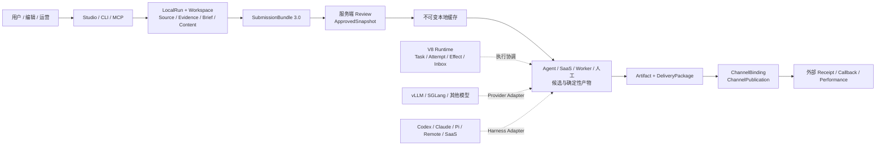
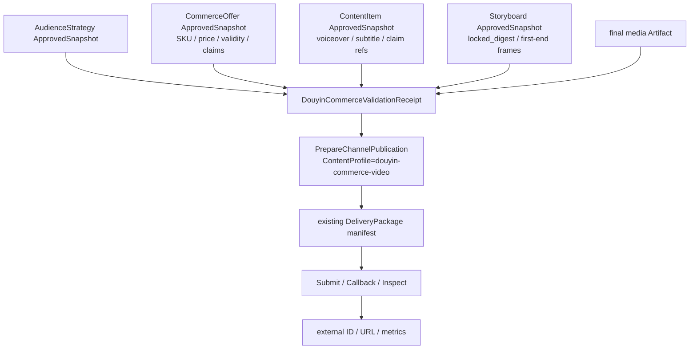

# ContentCloud 内容创作 AI Infra

状态：`当前实现对账 + 外部接通边界`。

更新时间：2026-08-17。

## 0. 首个用户前的 Clean-room 规则

当前按“没有用户、没有外部数据迁移义务”治理。技术路径可以破坏性重构；不要为了假想的旧客户端、旧数据库或旧插件增加兼容层。

| 治理类别 | 首个用户前的处理 | 允许保留的理由 |
| --- | --- | --- |
| `current` | 唯一继续演进的事实源 | 有真实主链、测试和明确所有权 |
| `current-local` | 本地工作区已可运行，外部/服务端闭环尚未全部具备 | 本地 CLI、排版、小说和人工交付 |
| `current-server` | 服务端契约、存储、API 和测试已具备 | 搜索、连接器、Runtime、渠道状态机 |
| `partial` | 内部 Adapter 或局部链路已具备，仍缺少真实外部验证 | 媒体 SaaS、指标回流等 |
| `external-dependency` | 需要真实平台账号、配额、授权或第三方服务 | 微信后台、抖音账号、vLLM/SGLang 集群 |

业务修订、ApprovedSnapshot、Artifact、Delivery 和外部 Receipt 是产品血缘，不能因为“清理历史”删除；技术 Schema、Adapter、Fallback 和重复入口不是产品血缘，优先重写或删除。

## 1. 结论

ContentCloud 不应成为另一个 vLLM 或 SGLang。它们解决模型推理的吞吐、延迟、显存、并行和服务兼容问题；ContentCloud 解决的是一项内容工作如何被发现、固定、生产、审核、交付、复用和复盘。

> **内容创作 AI Infra：连接资料、证据、知识、Agent、模型、Worker、人工、创作工具和发布渠道，并管理任务状态、版本、权利、成本、质量、审批、产物血缘和外部回执。**

这个定义必须建立在仓库已经存在的 Content Work OS 之上，而不是重新发明一套通用的任务、内容或资产模型。

## 2. 现有系统的三个执行平面

当前不是单一 Runtime 中心化系统，而是三个相互连接、责任不同的执行平面：

```text
本地交互生产平面
  ContentCloud Plugin / Skill / MCP / Agent-SaaS Adapter
  -> LocalRun + Claim + Handoff
  -> 本地来源、知识、Brief、ContentBatch、StoryboardPackage、DeliveryPackage

服务端治理与审核平面
  SubmissionBundle 3.0
  -> SubmissionRevision
  -> Internal/Client Review
  -> ApprovedSnapshot
  -> Pull 到本地不可变缓存

服务端自动化执行平面
  WorkTask
  -> JobRun -> NodeRun -> RuntimeAttempt
  -> ContextView / Effect / Outbox / Provider Reconciliation
  -> 运营投影和恢复动作
```

普通交互创作默认留在本地；服务端只在明确的环境准备、审核、拉取、提交或自动化任务动作中介入。Runtime 协调执行，但不拥有来源正文、知识正文、内容正文、批准事实或交付正文。

执行平面和用户工作面是两个维度。Desktop 不是第四个 Runtime，也不接管 Codex 渲染：

| 工作面 | 连接的执行/治理平面 | 主要职责 |
| --- | --- | --- |
| Codex | 本地交互生产 + Runtime Harness | 对话期推理、生成、工具调用、Proposal 确认 |
| Desktop | 本地工作区 + 服务端治理 + Runtime 摘要 | 持续目录、同步、上传、审批、任务、通知、交付 |
| Web Studio / Operations | 服务端治理 + Runtime 运营投影 | 团队协作、租户治理、发布配置、跨租户诊断 |

Desktop Renderer 只通过 typed Preload -> Electron Main -> 认证本地 API 访问 Go Daemon。同步、上传、Workspace、审批命令和 Runtime Worker 都留在 Go；SQLite 只保存可重建索引、outbox、上传恢复和事件游标。

### 2.1 执行者是开放集合，不是 Codex/Claude 专属流程

内容生产 SOP 不得把任何 Agent 品牌写进业务语义。Codex 和 Claude Code 是当前已有实现基础的宿主/Harness；Pi Agent、其他本地或远程 Agent、Agent 工作流 SaaS、垂直创作 SaaS 都可以在满足接入契约后参与同一条内容生产链。

| 执行方式 | 例子 | 当前事实 | 接入边界 |
| --- | --- | --- | --- |
| 本地通用 Agent | Codex、Claude Code、Pi Agent、其他 CLI/Desktop Agent | `current`：Pi、remote-http、agent-saas Harness 已有注册与 Runtime 测试；具体宿主接通仍取决于本地环境 | Plugin Host 或 Agent Harness Adapter |
| 远程/托管 Agent | 自建远程 Agent、托管 Agent Runtime | `current-server`：远程 Harness、durable callback inbox、重放和终态幂等已实现 | Agent Harness、任务租约、结构化事件和恢复 |
| Agent 工作流 SaaS | 多 Agent 编排、研究或自动化 SaaS | `current-server`：Agent SaaS callback 契约已实现；SaaS 账号和业务连接是 `external-dependency` | API/Webhook Connector、Effect、Inspect、Receipt |
| 垂直创作 SaaS | 图片、视频、音频、剪辑、排版、翻译、发布工具 | `partial`：固定输入、Artifact 和人工 Handoff 已有；真实服务账号为 `external-dependency` | Provider/Creative Tool Adapter 或人工 Handoff |
| 确定性 Worker | 解析、Lint、转码、渲染、打包、摘要校验 | `current` | Runtime Worker，不使用自由推理替代确定性规则 |
| 用户浏览器/Computer Use | 只能通过登录态 UI 完成的排版、上传、预览、发布 | `external-dependency`，当前微信仍是人工操作 | 明确授权、最小步骤、截图/外部绑定回执 |
| 人工 | 创作者、编辑、审核人、运营、发布人 | `current` | Human Gate、Review、Delivery Runbook |

所有执行者都通过同一条最小契约接入：

```text
Capability + ExecutionProfile + fixed input refs/digests
  -> executor-specific adapter
  -> structured candidate/artifact/events
  -> schema + rights + cost + quality validation
  -> Handoff / Effect / Receipt
  -> existing ContentCloud domain fact
```

这里的 Plugin Host Adapter 是“插件如何安装到特定本地宿主”的架构角色；代码中的 `AgentHarnessAdapter` 解决 Agent 如何检测、启动、恢复、中断和输出结构化事件；外部 SaaS 通过 Provider/Connector Adapter 接入。三者不能合并成“Codex 执行器”，也不能让外部会话成为业务事实源。

## 3. 已验证的内容纵向链路

### 3.1 本地到服务端治理链

```text
.contentcloud/workspace.yaml
  -> source register / source ingest
  -> LocalRun claim
  -> Knowledge candidate -> knowledge lint/query/diagnose/pack
  -> Brief lint
  -> ContentBatch init -> ContentItem lint -> batch finalize
  -> publish_preflight
  -> 用户确认同一 plan_id
  -> publish_apply
  -> SubmissionRevision
  -> 服务端审核
  -> ApprovedSnapshot pull
```

本地 V3 不是“未来 Evidence Intake”，而是当前可运行的 governed workspace 主链。其稳定对象和版本来自 `contracts/` 以及 `internal/local/workspace`，例如：

- `contentcloud.local-run/3.0`
- `contentcloud.evidence-bundle/3.0`
- `contentcloud.knowledge-pack/3.0`
- `contentcloud.brief/3.0`
- `contentcloud.content-batch/3.0`
- `contentcloud.content-item/3.0`
- `contentcloud.handoff/1.0`
- `contentcloud.submission-bundle/3.0`

### 3.2 已批准内容到媒体与人工交付

```text
content_batch ApprovedSnapshot
  -> StoryboardPackage candidate
  -> review_ready + locked_digest
  -> storyboard publish / server review
  -> storyboard ApprovedSnapshot pull
  -> 首尾帧和参考素材摘要校验
  -> Seedance copy-ready package
  -> 人工在外部工具生成/选择
  -> Artifact / final render / DeliveryPackage
```

### 3.3 公众号文章交付

公众号当前是“服务端审核 + 本地交付包 + 操作员手工发布”，不是自动渠道 API 发布：

```text
article Brief
  -> article batch / item lint
  -> content_batch Submission
  -> ApprovedSnapshot pull
  -> wechat_package_export
  -> wechat_package_lint
  -> 操作员登录公众号后台并发布
  -> 另行记录 external binding / publication result
```

## 4. 当前能力与外部接通边界

Infra 文档使用两个维度标记能力：

| 实现状态 | 含义 |
| --- | --- |
| `current` | 已有代码、契约和测试支撑，可继续演进 |
| `current-local` | 本地工作区可运行，服务端或外部闭环仍有限 |
| `current-server` | 服务端治理/审核/投影已实现，外部平台可能未接通 |
| `partial` | 有代码、契约和测试，但真实 Provider、平台账号或运营闭环仍缺 |
| `external-dependency` | ContentCloud Adapter/契约已具备，真实平台账号、配额或 SaaS 服务由外部提供 |

历史入口和重复契约不属于产品状态。首个用户前直接删除无消费者的平行实现，不建立兼容分支。

截至 2026-08-11 的真实基线：

| 能力 | 当前状态 | 事实入口 |
| --- | --- | --- |
| LocalRun、Claim、Handoff、跨对话恢复 | `current-local` | `internal/local/workspace`、Workspace Skill |
| 本地来源登记、摘要校验、解析、EvidenceBundle | `current-local` | `internal/local/workspace/source.go` |
| Web 搜索、平台趋势、受控网页采集 | `current-server` / `external-dependency` | `source.search/fetch` Provider、Fetcher、白名单、SSRF/大小限制与 Evidence 物化已实现；搜索源和平台账号仍是外部依赖 |
| Knowledge、Brief、视频脚本、公众号文章 | `current-local` | V3 本地 Schema、Skills 和 CLI |
| Submission、内部/客户审核、ApprovedSnapshot | `current-server` | `internal/review`、`internal/application` 命名审核服务、`internal/transport/http`、Submission contracts |
| 资产资料与创作结果投影 | `current-server` / `partial` | WorkspaceMaterialProjection、CreativeResultAssetProjection |
| Storyboard、媒体登记、Seedance 导出 | `current-local` / `current-server` | `storyboard-package`、`seedance-prompt-package` |
| 微信交付包和人工操作说明 | `current-local` | `wechat-delivery` contract 和 Skill |
| Agent Plugin 签名、Registry、宿主安装 | `current` / `partial` | `internal/catalog/environment`、`internal/integration/plugin*`，宿主通过 Adapter 选择，不绑定品牌 |
| 开放 Agent Harness 与 SaaS 执行适配 | `current-server` | Pi、remote-http、agent-saas Harness、durable callback ingress、事件/结果幂等已实现 |
| V8 Durable Runtime | `current` | `internal/runtime`、`internal/persistence/postgres`，租约、Attempt、SessionRef、Outbox/回放已覆盖 |
| 渠道发布、回执、撤回和效果同步 | `current-server` / `partial` | Channel Binding/Publication/Callback/Reconcile/Performance 已实现；真实平台 Adapter 和账号属于 `external-dependency` |

## 5. 最窄产品闭环

首个 Infra 闭环不是“接入所有模型和连接器”，而是：

```text
已授权资料/人工灵感
  -> 本地证据与知识治理
  -> V3 Brief / ContentBatch
  -> Agent/Skill/Worker 协作
  -> 服务端审核与 ApprovedSnapshot
  -> Storyboard / 文章交付包
  -> 人工发布或未来渠道 Adapter
  -> 结果资产与人工复盘
```

搜索、采集、数据互通、Agent handoff、产物管理和发布渠道都围绕这条已存在的链路补齐。每个新增能力必须回答：

1. 它消费哪个现有版本化对象？
2. 它产生哪个现有业务事实或投影？
3. 它通过本地、服务端还是 Runtime 哪个平面执行？
4. 它是否有外部副作用、审批、回执和对账要求？
5. 它如何进入下一次任务复用，而不是变成第二套资产？

## 6. Camunda、vLLM、SGLang 的边界

Camunda 可借鉴设计、连接、人工任务、运营和优化的产品分层；vLLM/SGLang 可作为模型执行端；Temporal/LangGraph/LiteLLM/Langfuse 可作为特定实现或参考。它们都不能替代 ContentCloud 已有的：

- 来源、EvidenceBundle、KnowledgePack 和权利事实。
- ContentBatch、ContentItem、StoryboardPackage 和 ApprovedSnapshot。
- LocalRun、Handoff、SubmissionBundle 和显式 publish preflight/apply。
- Workspace Material、Creative Result、Artifact、DeliveryPackage 和血缘。
- Agent Plugin 包、能力声明、环境锁和宿主安装治理。

这些能力的“当前实现”可以落在 Codex/Claude，但它们的业务契约必须保持 provider-neutral。Pi Agent 或任意 SaaS 的接入不应要求复制 Brief、ContentBatch、Handoff、Review 或 Artifact 模型。

不要为了画出“编排集群”就提前拆微服务，也不要用通用 `Asset`、`PublishPlan` 或“大上下文 JSON”覆盖已有领域边界。

## 7. 文档导航

| 文档 | 回答的问题 |
| --- | --- |
| [01-capability-map.md](./01-capability-map.md) | 现有能力、契约、执行平面和真实状态是什么 |
| [02-landscape-and-comparison.md](./02-landscape-and-comparison.md) | 外部 AI Infra 项目与 ContentCloud 当前模块如何对应、哪些复用 |
| [03-delivery-roadmap.md](./03-delivery-roadmap.md) | 基于当前 V3/Plugin/Runtime 基线，下一步先补哪些缺口 |
| [04-architecture-and-flow-diagrams.md](./04-architecture-and-flow-diagrams.md) | 当前架构、搜索/Agent/渠道时序、场景血缘和故障恢复图 |
| [05-content-production-scenario-matrix.md](./05-content-production-scenario-matrix.md) | 抖音电商、公众号、小说等内容类型的专有工序、执行者组合和交付矩阵 |
| [Content Work OS Desktop](../product/content-work-os-desktop/README.md) | 持续项目工作面、Electron 技术栈、同步、上传、审批和分发门禁 |

相关事实文档：

- [平台基线](../foundation/README.md)
- [当前代码证据与迁移基线](../foundation/10-current-state-inventory.md)
- [客户创作台](../product/customer-creation-studio/README.md)
- [客户资产](../product/creative-asset-library/README.md)
- [Runtime V8](../roadmap/v8/README.md)
- [公众号文章交付](../content/guides/wechat-article/codex.md)

## 8. 固定原则

1. 复用现有事实拥有域，不创建第二套任务、审批、内容和资产权威模型。
2. 本地工作区、服务端治理和 Runtime 自动化分别描述，不把它们画成一条已上线链路。
3. 每个业务域只保留一条继续演进的 Schema 主线；冲突契约在首个用户前直接迁移 Fixture/代码并删除旧版本，不为假想用户保持 major 兼容。
4. 候选不等于事实；搜索摘要、模型推断和生成候选必须经过证据、权利、质量和人工门禁。
5. 产物不可覆盖；修订、批准快照、Artifact 和交付包保留摘要与血缘。
6. 发布分为 ContentCloud 提交、人工渠道交付和自动渠道发布，状态不可混用。
7. 发布和撤回属于显式授权的外部 Effect；未知结果先对账，不盲目重试。
8. 发布能力、插件能力和 Provider 能力都必须有版本、摘要、权限、费用和撤回策略。
9. 先用真实内容任务验证缺口，再把共同需求平台化。
10. Agent/模型/SaaS 品牌不是业务事实；业务阶段只引用 Capability、Schema、策略和版本化产物。
11. 新功能只能落到五种实现状态；发现重复实现时先收口或删除，再加能力。

## 9. 非目标

- 自研 GPU 推理引擎，与 vLLM、SGLang 竞争内核性能。
- 用通用 BPMN 或万能 Agent 取代 Experience、SOP、V3 内容 Schema 和确定性 Worker。
- 把 Codex、Claude Code、Pi Agent 或任何 SaaS 固化成内容生产的唯一执行路径。
- 为旧 Schema、旧 Runtime、旧插件或旧渠道入口建立没有真实消费者的长期兼容层。
- 首期覆盖所有社交平台、办公系统、DAM、CRM 和模型服务商。
- 让 Agent 自行扩大网络、工具、预算、发布或数据披露权限。
- 把连接器数量、模型数量或 DAG 节点数量作为唯一成功指标。

## 10. 已实现需求追踪

这里的“已实现”指仓库内有代码、契约和测试；真实平台账号、搜索供应商配额、SaaS 账号和渠道审核仍单列为外部依赖。

| 需求 | 代码事实 | Contract | API/CLI | Test | 状态 | 外部依赖 |
| --- | --- | --- | --- | --- | --- | --- |
| 搜索/趋势/受控采集 | `internal/integration/provider/source`、`internal/application` 命名来源服务 | `source-intake-1.0` | `source.search/fetch`、`local.source.*` | `internal/application/source_infra_test.go` | `current-server` | 搜索 Provider、目标站点授权 |
| 数据互通/增量/删除 | `internal/integration/connector`、cursor lease、tombstone、replay | `connector-sync-1.0` | `connector.sync` | `connector_infra_test.go` | `current-server` | OAuth/远端数据源 |
| 多 Agent/Harness | `internal/integration/agent`、`internal/runtime` | `agent-execution-1.0` | `runtime.worker.*` | Harness/Pi/remote tests | `current` | 具体 Agent 安装和进程 |
| Agent SaaS durable callback | `internal/transport/http/agent_ingress.go`、`runtime_provider_inbox` | `agent-execution-1.0` | `POST /api/v1/agent-harnesses/{kind}/tenants/{tenant}/callbacks` | `agent_ingress_test.go`、`agent_callback_test.go` | `current-server` | SaaS Webhook、签名 Secret |
| vLLM/SGLang | `internal/integration/provider/model` OpenAI-compatible Provider | `model-generation-1.0` | `model.generate` | `model_infra_test.go` | `current-server` / `external-dependency` | 推理端点、模型、GPU 配额 |
| 微信排版 | `internal/local/workspace/article.go` | `wechat-delivery-1.0` | `local.wechat.package.*` | article/layout tests | `current-local` | 公众号后台账号；人工发布 |
| 小说 Canon/连续性 | `internal/local/workspace/novel.go` | `novel-*-1.0` | `local.novel.*` | `novel_test.go` | `current-local` | 发布平台账号 |
| 渠道发布/回执/指标 | `internal/delivery`、`internal/integration/provider/channel`、`internal/application` 命名交付服务 | `channel-publication-1.0`、`channel-callback-1.0` | `channel.publication.*`、HTTP callbacks | `channel_infra_test.go` | `current-server` | 真实渠道 Adapter/账号 |
| 抖音电商事实校验 | `internal/local/workspace/douyin_commerce.go`、`internal/application` 命名工作服务 | `douyin-commerce-validation-1.0` | `local.douyin-commerce.validate/lint`、typed prepare input | `douyin_commerce_test.go`、publication lineage test | `current-local` / `current-server` | 商品锚点、账号、平台发布 |

## 11. 当前系统总图



### 11.1 抖音电商发布血缘



`DouyinCommerceValidationReceipt` 不是第二个内容或发布聚合；它是可复算的发布前证明，最终仍写入现有 `ChannelPublication.Metadata`。`published` 只能来自渠道适配器或人工外部回执。
