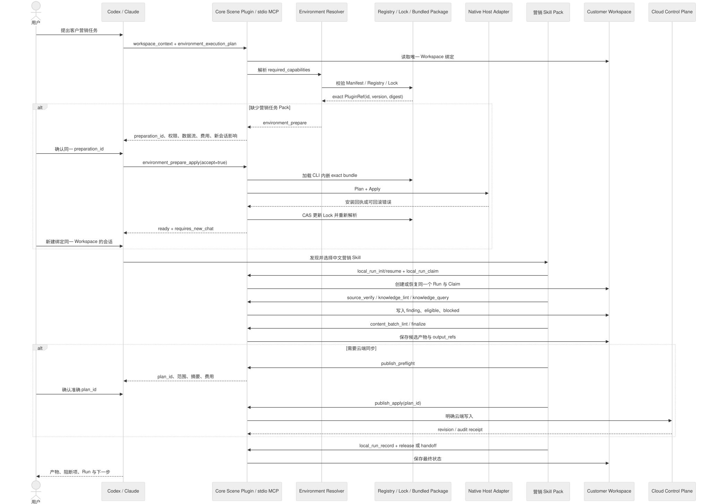

# ContentCloud 营销 Skill Pack 技术方案

本文定义 `contentcloud-marketing` 如何进入 ContentCloud 的插件、Environment、Workspace、运行和业务交付链路。它不是某个客户项目的复制品，也不把客户资料打进公共程序。

## 1. 结论

`contentcloud-marketing` 是一个公共 `skill_pack`，版本 `0.1.0`，包含 8 个中文 Skills，不包含 MCP Server。它复用 Core 已有的 `contentcloud-local` stdio MCP、Workspace Command Kernel 和 `local_run_*` 状态机。

它位于三层业务边界的中间层：

| 层 | 持有内容 | 代表能力 |
| --- | --- | --- |
| Core | 通用执行、文件安全、Workspace、Run、Claim、知识和内容工具 | `workspace_context`、`knowledge_lint`、`content_batch_finalize`、`publish_preflight` |
| `contentcloud-marketing` | 中文营销任务路由、客户 Agent 编排、知识门禁和跨形态交接 | 知识包、意图内容、交付报告 |
| 客户 Workspace | 客户资料、品牌规则、素材、权利、知识状态、Run 和产物 | 客户事实与业务决策 |

视频和文章属于下游形态 Pack。营销 Pack 可以交接给它们，但不在自身 Skill 中伪造镜头、文章区块或渠道私有格式。

## 2. 组件和数据边界



可编辑源：[contentcloud-marketing-architecture.mmd](../../diagrams/contentcloud-marketing-architecture.mmd)。

### 2.1 公共包内允许的内容

- `plugin.json` 和 ContentCloud claims。
- 8 个中文 `SKILL.md`，只写流程、工具顺序、门禁、失败恢复和交接规则。
- 不包含客户名称、客户目录、原始素材、报价、客户 profile、私有提示词或渠道凭据。
- 不包含 `mcp.json`，也不启动长期 Node/Ruby 服务。

### 2.2 只能留在 Workspace 的内容

- 客户资料、品牌规范、产品事实、素材和权利记录。
- 来源证据、知识候选、批准快照、客户意图、方法论映射。
- `local_run`、Claim、finding、handoff、候选内容和最终本地产物。

包根目录只读。`PLUGIN_DATA` 只能存插件自己的可删除缓存，不能替代 Workspace 事实源。

## 3. 八个 Skill 与整体编排

| Skill | 责任 | 上游 | 下游/结果 |
| --- | --- | --- | --- |
| `contentcloud-marketing-knowledge-pipeline` | 端到端恢复、阶段路由和 Run 交接 | 用户意图、Workspace | 摄取、校验、查询、编排 |
| `contentcloud-marketing-knowledge-ingest` | 单来源登记、校验、证据摄取和候选导入 | `source_*` | `knowledge_import` |
| `contentcloud-marketing-knowledge-lint` | 来源、知识、权利和状态确定性检查 | 摄取结果 | `kb-lint=passed/failed` |
| `contentcloud-marketing-knowledge-query` | 查询可用、阻断和参考对象 | 合格知识快照 | `eligible_ids`、`blocked_ids` |
| `contentcloud-marketing-client-knowledge-pack` | 组织客户知识包和缺口诊断 | Workspace 资料、方法论 | `knowledge_pack`、诊断报告 |
| `contentcloud-marketing-intent-content` | 按客户意图生成可追溯候选 | 知识查询、渠道意图 | `CreativeDraft` 或交接 |
| `contentcloud-marketing-content-compile` | 跨形态编排、内容 lint 和交接 | Brief、意图、知识 | 视频/文章 Pack、ContentBatch |
| `contentcloud-marketing-client-agent-delivery` | 串联客户 Agent 建设、交付和复盘 | 全部前置阶段 | 交付报告、release 或 handoff |

编排原则：每个阶段都使用同一个 Run；失败后 `local_run_resume`，不创建第二个 Run 隐藏历史。`local_run_record`、`local_run_check`、`local_run_advance`、`local_run_fail` 和 `local_run_resume` 通过 Core stdio MCP 与 CLI 共享同一套 Claim/CAS 实现。所有写入都经过 Core MCP，Skill 不直接写客户文件。

## 4. Environment 与 Capability 编排

平台层有两套互补的解析：

1. **Environment Resolver** 根据签名 Manifest、Registry、Lock 和请求的 Capability 决定允许哪些 Pack。
2. **Marketing Skills** 在已允许的 Pack 内决定任务顺序、输入检查和交接。

营销包在 claims 中声明两个能力：

- `contentcloud.marketing.knowledge-governance`
- `contentcloud.marketing.content-orchestration`

当前 `.agents/plugins/registry.draft.json` 条目是 `draft`，签名和评测均为 `pending`；生产 `.agents/plugins/registry.json` 仍只包含已签名条目。因此它可以被源码 Loader 和内嵌包测试加载，但不会被默认生产 Environment Manifest 自动选中。完成安全签名、确定性评测和兼容 Profile 发布后，才可通过 `environment_prepare_plan` 进入租户环境；不修改默认视频环境的已签名清单。

Environment 只声明能力和 Pack 引用，不保存客户资料。客户项目需要营销能力时，流程是：

```text
Environment Manifest
  -> required_capabilities
  -> Registry exact(id, version, digest)
  -> Environment Lock
  -> environment_execution_plan
  -> 缺 Pack 时 environment_prepare_plan/apply
  -> 新会话加载 Skills
```

`environment_prepare_apply` 不按名称下载任意远端包。它从已验证计划取得 `PluginRef.ID` 和 `PluginRef.Version`，只允许 `pluginbuiltin.Load` 加载当前 CLI 内嵌的标准包，再校验 Manifest 身份和计划中的 digest。包未随当前 CLI 发布、缓存身份不匹配或无法加载时统一返回 `ENVIRONMENT_PLUGIN_ARTIFACT_UNAVAILABLE`，绝不下载、猜测或回退到其他 Pack。校验通过后才调用对应宿主的 `Plan/Apply`；安装成功后以 CAS 更新 `environment.lock`，重新解析到 `ready`，最后返回新会话交接。任一步失败都回滚本次新安装和 Lock，不修改客户业务文件。

## 5. 业务流程



可编辑源：[contentcloud-marketing-flow.mmd](../../diagrams/contentcloud-marketing-flow.mmd)。

关键门禁：

1. `workspace_context` 先确定唯一 Workspace，不从聊天历史或父目录猜客户。
2. `local_run_claim` 取得单写入者占用；旧 owner、错误 epoch 或 revision 必须被拒绝。
3. 知识必须经过 `knowledge_lint`；事实、主张、权利分别要求 `verified`、`approved`、`valid`。
4. 内容候选必须经过 `content_batch_lint` 和 `content_batch_finalize`。
5. 云端写入只能先 `publish_preflight`，再由用户确认相同 `plan_id` 后调用 `publish_apply`。

## 6. 端到端时序



可编辑源：[contentcloud-marketing-sequence.mmd](../../diagrams/contentcloud-marketing-sequence.mmd)。时序图可以渲染为 SVG/PNG，但当前转换器只为流程图生成 Excalidraw，因此它没有 `.excalidraw` 文件。

## 7. Run 状态和恢复



可编辑源：[contentcloud-marketing-state.mmd](../../diagrams/contentcloud-marketing-state.mmd)。状态图只读表达状态机，正式状态仍以 Core `localworkspace` 文件为准。

| 阶段 | 必须存在 | 通过条件 | 失败动作 |
| --- | --- | --- | --- |
| `planned` | Run 输入摘要 | 选择意图和输入 | 停止并补输入 |
| `claimed` | Claim、owner、revision | 当前写入者有效 | 选择、续租或确认 takeover |
| `ingest` | 已登记来源 | 摘要、MIME、证据定位有效 | 记录 finding |
| `knowledge-lint` | 知识候选 | `kb-lint=passed` | `local_run_fail`，修复后 resume |
| `query` | 当前知识快照 | 产生 eligible/blocked | 明确阻断，不补事实 |
| `compile` | Brief、意图、形态能力 | 交接到形态 Pack | 保持候选 |
| `output-lint` | ContentBatch | lint 和 finalize 通过 | 保留草稿并 resume |
| `done` | 输出引用和检查结果 | 用户可审阅 | release 或 handoff |

## 8. Codex、Claude 和其他渠道

### Codex

通过标准包发现 `skills/`，通过宿主投影安装。安装或升级后新建会话；新会话第一步调用 `workspace_context`。营销包不带第二个 MCP，复用已有 stdio MCP。

### Claude Code

使用 Claude 私有投影生成 Skill 和 MCP 配置，但公共包仍保持 Agent Plugins 标准结构。工作区根通过宿主项目变量注入到 Core MCP。当前已验证的是 NativeHost 安装/回滚、已注册 `claude-plugin` 目标的 Environment prepare/apply，以及新会话要求；客户侧 Workspace Bootstrap、Web 连接入口和交互式启动仍由客户端能力注册表保持 `planned`，不能标记为完整可用。

### 其他宿主

只要支持 Agent Skills 或 stdio MCP，就可以使用 Headless 控制面；要成为正式 NativeHost，必须另外证明安装、升级、删除、Workspace 绑定、stdio 生命周期和回滚。不能因为某个客户端出现在上游兼容列表，就直接宣称 ContentCloud 已支持。

## 9. 本地与云端协作

本地优先不是本地和云端各维护一套事实源：

- 本地 Workspace 保存来源、知识、候选、Run 和输出。
- 云端只接收明确披露范围和准确 `plan_id` 对应的提交。
- `publish_apply` 回执带云端 revision 和审计引用，再写回 Workspace 的同步状态。
- 断网时可以继续读取、摄取、查询、lint 和本地编排；需要云端的动作保持待处理。

## 10. 安全与故障处理

- 禁止 Skill 读取包外路径，禁止扫描其他客户目录。
- 不把 token、Cookie、绝对路径或客户原文写入诊断、handoff 或宿主 transcript。
- 包摘要变化必须生成新版本，不能原地修复 CAS 包。
- Registry 撤回或签名不通过时，Environment Resolver 阻止新安装和新 Run。
- 多个活动 Run 时必须显式选择；Claim 过期只能按用户确认 takeover。
- 任何“缺资料”的请求输出 blocked 候选和缺口，不用模型常识补产品事实、价格、功效、历史或权利。

## 11. 验证与发布门禁

### 包结构与业务编排

```bash
pnpm check:marketing-plugin
go test ./internal/integration/plugin ./internal/integration/pluginbuiltin ./internal/integration/pluginhost ./internal/catalog/environment
go test ./internal/transport/cli -run TestEnvironmentPreparationLoadsMarketingPackForCodexAndClaude -count=1
```

检查内容包括：8 个中文 Skills、0 个 MCP、claims 能力、Registry 摘要、Workspace/Core 边界、视频/文章交接、Run 恢复和发布确认门禁。

### 全仓库

```bash
go test ./...
go test -race ./internal/integration/plugin ./internal/integration/pluginbuiltin ./internal/transport/cli ./internal/local/workspace ./internal/local/workbench ./internal/runtime
go vet ./...
pnpm check:plugin
pnpm check:marketing-plugin
pnpm governance:content
pnpm governance:v3
pnpm test:plugin-signing
git diff --check
```

宿主原生生命周期冒烟使用隔离临时配置；将包名设为营销包可验证真实投影、安装、检测和删除：

```bash
CONTENTCLOUD_PLUGIN_SMOKE_PACKAGE=contentcloud-marketing CONTENTCLOUD_CODEX_PLUGIN_SMOKE=1 \\
  go test ./internal/integration/pluginhost/codex -run TestRealCodexAgentPluginLifecycle -count=1 -v
CONTENTCLOUD_PLUGIN_SMOKE_PACKAGE=contentcloud-marketing CONTENTCLOUD_CLAUDE_PLUGIN_SMOKE=1 \\
  go test ./internal/integration/pluginhost/claude -run TestRealClaudeAgentPluginLifecycle -count=1 -v
```

### 客户 Workspace 回归

客户项目的资料和测试必须在客户 Workspace 内运行，不进入公共包：

```bash
node tests/run-tests.mjs
bash scripts/kb-lint.sh
node scripts/check-skills.mjs
node scripts/check-workflows.mjs
node scripts/check-service-config.mjs
node scripts/check-ontology.mjs
node scripts/check-links.mjs
node scripts/check-source-refs.mjs
node scripts/check-content-refs.mjs
node scripts/run-context.mjs validate --all
```

验收标准不是“目录存在”，而是：Loader 能加载、Host 能投影、Environment 能验证、Workspace 能恢复、Run 能续接、候选能 lint、云端写入有准确确认。

## 12. 实施清单

- [x] Go 内嵌包和稳定 Plugin 身份已接入。
- [x] 仓库 Loader 和内嵌 Bundle 测试覆盖 8 个 Skills、0 个 MCP。
- [x] 中文 Skills 与客户 Workspace 边界检查已自动化。
- [x] Codex/Claude 通过同一 Core stdio MCP 复用业务执行入口。
- [x] Environment prepare/apply 按计划中的 Plugin ID、版本和摘要加载营销包，不再硬编码场景插件。
- [x] Codex 正式 Workspace 与已注册 Claude 目标均有营销包 prepare/apply 集成测试。
- [x] 视频、文章和客户交付之间的交接关系已写入 Skill 与文档。
- [x] Registry 草稿条目已登记真实包摘要，未伪造签名和评测。
- [ ] 对营销包完成独立签名、确定性评测和至少一个正式 Environment Profile 发布。
- [ ] Claude 客户侧 Workspace Bootstrap、Web 连接与交互式启动通过完整发布验收。
- [x] 在 Codex、Claude 各自隔离配置目录执行营销包真实安装/检测/删除冒烟。

未完成项属于生产发布准入和宿主渠道开放门禁；在它们完成前，营销包不能作为生产环境必选 Pack，也不能把 Claude 客户侧 Workspace Bootstrap、Web 连接与交互式启动标记为完整可用。
