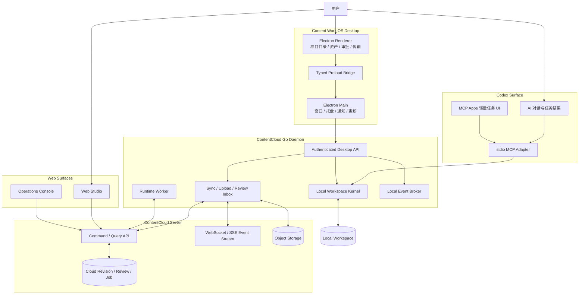
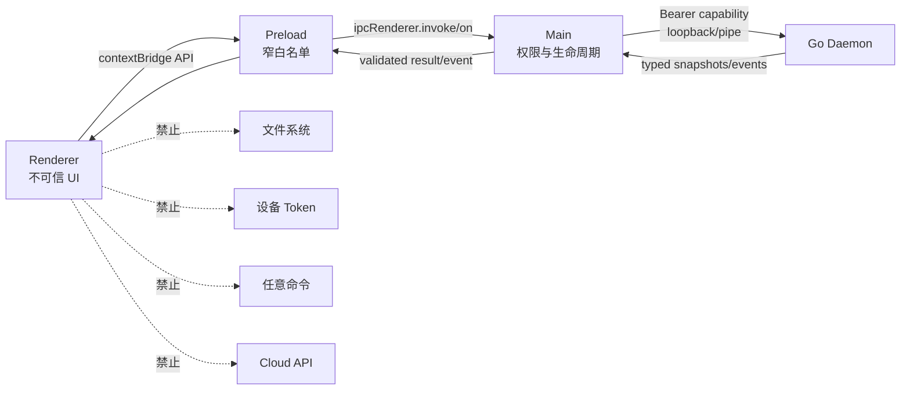
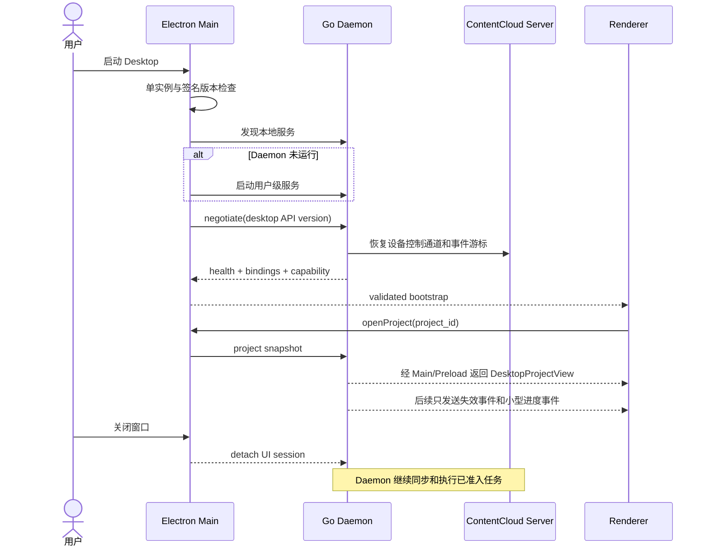

# Desktop 架构与技术栈

状态：`目标规范`。

更新时间：2026-08-17。

## 1. 总体架构



核心不变量：

- Electron Renderer 不能绕过 Main/Preload 访问本机或服务端。
- Codex 和 Desktop 进入同一个 Local Workspace Kernel。
- Local Workspace 与 Cloud Revision 只通过显式同步协议交换。
- Web 只读取云端事实，不假装拥有本地未提交文件。
- Runtime Worker 与 Sync Engine 可以同进程托管，但使用独立状态、命令和错误域。

## 2. Electron 进程模型



Main 负责：

- 单实例、窗口、托盘、系统通知和自定义协议。
- Daemon 发现、启动、版本兼容检查和健康恢复。
- 文件选择器、目录选择器和允许的外部链接。
- 更新下载、签名验证、安装与重启协调。
- 把 Renderer 命令映射为版本化 Desktop API。

Main 不负责：

- 解析业务文件、决定同步冲突、执行审批或保存上传状态。
- 直接持久化业务对象、Cloud Revision 或 Runtime 状态。
- 将设备 Token 注入 Renderer 或 Codex。

## 3. 技术栈

| 层 | 选择 | 约束 |
| --- | --- | --- |
| Desktop Shell | Electron | 实施时锁定受支持稳定版本 |
| 构建与打包 | Electron Forge + Vite Plugin | 不并用 electron-vite/electron-builder |
| Renderer | React 18 + TypeScript 5.7 + Vite 6 | 与 Web 保持同代，不在整改中升级 |
| 路由 | React Router | Desktop 路由与 Web 路由独立 |
| 图标 | Lucide | 复用 DESIGN.md 规则 |
| 服务状态 | TanStack Query | snapshot、失效、重试、分页 |
| UI 状态 | React state/context | 没有证据前不引入第二状态库 |
| IPC Schema | 版本化 TS Schema + 运行时校验 | 禁止只依赖 TypeScript 类型 |
| 本地服务 | Go Daemon | Workspace、同步、上传、审批、Runtime |
| 本地缓存 | Go + SQLite | 索引、outbox、游标和传输恢复，可重建 |
| 自动测试 | Go test、Vitest、Playwright Electron | 不用 mock 代替进程 E2E |
| 分发 | Forge makers/publishers + 平台签名 | macOS notarization、Windows signing |

## 4. Desktop View 契约

Desktop 不直接复用 Codex `WorkspaceView` 的整页结构，而是从同一事实生成专用投影：

```text
DesktopProjectView
├── project identity and binding
├── local revision and observed digest
├── cloud revision and event cursor
├── directory summary and typed entries
├── sync counters and conflicts
├── upload/download queue
├── pending reviews and comments
├── job/run summaries
├── delivery readiness
└── allowed actions
```

每个命令至少包含：

```text
schema_version
request_id
workspace_id
project_id
subject_ref
base_revision
observed_digest
idempotency_key
```

服务端和 Local Kernel 根据当前事实返回 `allowed_actions`。Renderer 只能呈现允许动作，不能自行从 status 推导权限。

## 5. 组件生命周期时序



## 6. 本地 API 与事件

本地 API 使用随机 loopback 端口或平台本地 pipe，由 Main 持有启动时 capability。Renderer 永远看不到 bearer token。若 Windows named pipe 的发布实现尚未完成，可以先使用 exact-host loopback，但仍必须满足：

- 只监听 loopback，不监听局域网。
- capability 高熵、短期、绑定 Desktop instance 和 API audience。
- 所有命令有 body 上限、Schema 校验和幂等键。
- 事件有单调 ID、重连游标、gap 和 full-resync 语义。
- 路径序列化为 Workspace-relative ref，不返回绝对路径。

## 7. 安全基线

- 禁止 `nodeIntegration`、`remote`、任意 `shell.openExternal` 和任意新窗口。
- `will-navigate`、`setWindowOpenHandler`、permission handler 和下载行为默认拒绝。
- 只加载应用自带资源；开发服务器只在显式开发模式允许。
- CSP 至少限制为应用自身脚本、样式和受控连接端点。
- Preload API 不暴露通用 `invoke(channel, payload)`，每个命令有独立方法和类型。
- 更新只能安装签名且版本允许的包；更新失败保留当前可运行版本。
- Renderer 崩溃不影响 Daemon 的 outbox、上传和 Runtime lease。

## 8. 发布平台

正式首发目标：

| 平台 | 架构 | 门槛 |
| --- | --- | --- |
| macOS | arm64、x64 | Developer ID、hardened runtime、notarization、升级冒烟 |
| Windows | x64 | Authenticode、安装/卸载、升级和 Defender 冒烟 |
| Linux | x64 preview | deb/rpm、权限和桌面集成；未签名不标记正式 |

Universal macOS 包只有在下载体积、原生依赖和发布流水线证明收益时才增加；默认分别发布 arm64/x64。
