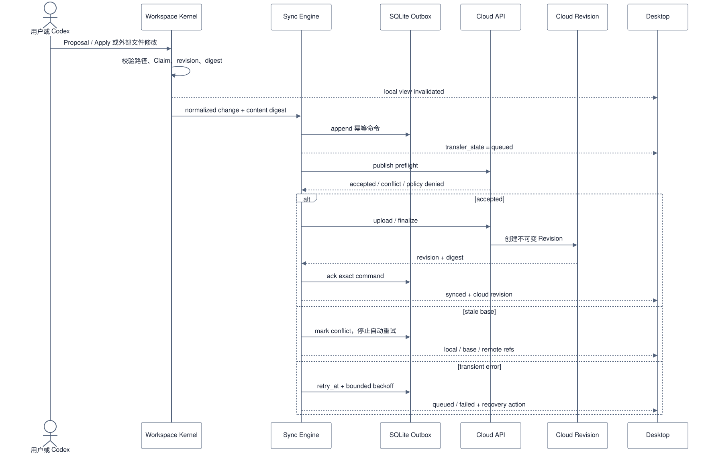
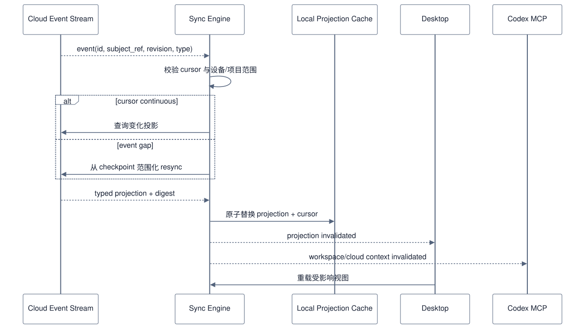
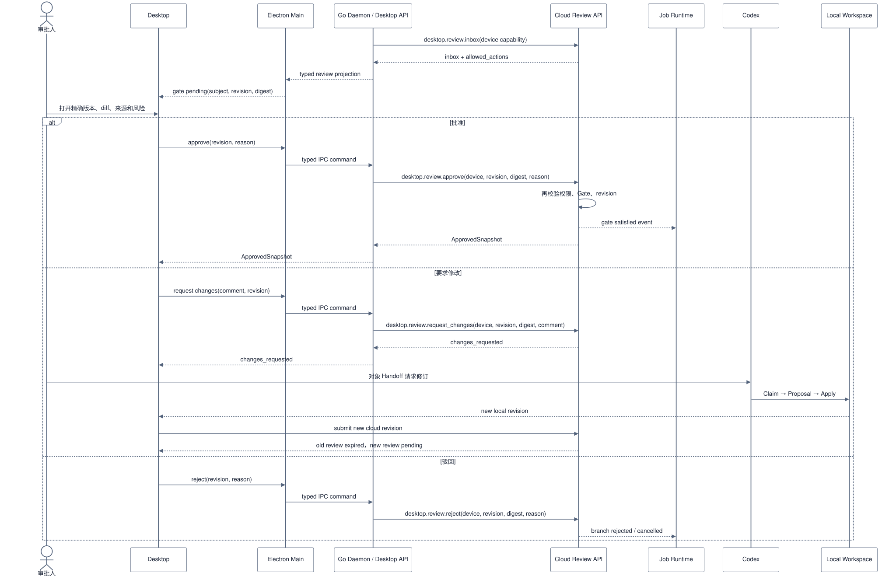

# Desktop 同步、审批与上传

状态：`Preview 协议已落地；冲突合并和签名分发仍在门禁中`。

更新时间：2026-08-18。

## 1. 状态模型

Desktop 对每个对象同时展示独立状态轴：

| 轴 | 状态 | 权威 |
| --- | --- | --- |
| 本地文件 | clean / modified / deleted / conflict | Local Workspace |
| 传输 | idle / queued / hashing / uploading / downloading / synced / failed | Local Sync Engine |
| 审批 | unsubmitted / pending / changes_requested / approved / rejected / expired | Cloud Review |
| 生命周期 | draft / ready / delivered / archived | 业务拥有域 |
| 执行 | queued / running / waiting / failed / succeeded | Runtime |

UI 可以组合显示，但 API、持久化和测试不能合并这些状态。

## 2. 本地修改到云端 Revision

图源：[Mermaid](../../tech/contentcloud-desktop-local-sync-sequence.mmd) · [PNG](../../tech/contentcloud-desktop-local-sync-sequence.png)

`synced` 只在服务端返回并重新核对 revision/digest 后成立。上传完成、HTTP 2xx 或 WebSocket 在线都不能单独推导同步成功。

## 3. 云端事件回流

图源：[Mermaid](../../tech/contentcloud-desktop-cloud-event-sequence.mmd) · [PNG](../../tech/contentcloud-desktop-cloud-event-sequence.png)

事件不携带完整客户正文和短期凭据。事件丢失通过 cursor gap 与范围化 resync 修复，不靠客户端猜测。

## 4. 大文件上传

图源：[Mermaid](../../tech/contentcloud-desktop-upload-flow.mmd) · [PNG](../../tech/contentcloud-desktop-upload-flow.png) · [Excalidraw](../../tech/contentcloud-desktop-upload-flow.excalidraw)

约束：

- 当前实现使用 4 MiB 固定分片，单文件上限 512 MiB；分片逻辑在 Go Daemon/Cloud 链路，不在 Renderer。
- 上传 URL 绑定 tenant、project、object、part、device 和绝对 TTL。
- 重试只发送服务端未确认分片。
- finalize 必须核对完整 digest 和预期 size。
- finalize 成功后才创建 WorkspaceObject；Revision 发布前批量确认每个 manifest 对象已完成。
- 本地文件变化后旧上传会话作废，不能把混合分片合成为新对象。
- 处理状态与审批状态分开；OCR 完成不表示资料已批准。

## 5. 审批与修改回流

图源：[Mermaid](../../tech/contentcloud-desktop-review-sequence.mmd) · [PNG](../../tech/contentcloud-desktop-review-sequence.png)

审批不允许：

- Codex、Worker、Provider 或 Electron 自动点击替代人工决定。
- 上游内容变化后沿用旧批准。
- 使用文件名、路径或 UI 当前选中项代替 revision/digest。
- Renderer 离线时先显示“已批准”再等待服务端确认。

Desktop 审批命令：

- `desktop.review.inbox`：按项目返回当前 Revision、未解决批注数量和服务端计算的 `allowed_actions`。
- `desktop.review.show`：返回当前 Revision、上一 Revision、对象级 digest/content diff 和批注。
- `desktop.review.comment`：只新增内部批注，不改变提交状态。
- `desktop.review.approve` / `desktop.review.reject` / `desktop.review.request_changes`：服务端重新校验设备项目绑定、设备所有者租户角色、当前 Revision、Gate 和批注状态。

设备凭据只代表绑定设备。审批写操作会重新读取设备所有者在租户中的角色，不能因为 `device` actor 类型而绕过 `reviewer`、`project_manager` 或 `tenant_admin` 约束。

## 6. 冲突决策图

图源：[Mermaid](../../tech/contentcloud-desktop-conflict-flow.mmd) · [PNG](../../tech/contentcloud-desktop-conflict-flow.png) · [Excalidraw](../../tech/contentcloud-desktop-conflict-flow.excalidraw)

禁止 last-write-wins。自动三方合并也只能产生 Proposal，不能绕过 Apply。

## 7. 离线与恢复状态机

图源：[Mermaid](../../tech/contentcloud-desktop-offline-state.mmd) · [PNG](../../tech/contentcloud-desktop-offline-state.png)

> Sequence/State Diagram 暂不生成 Excalidraw：上游 Mermaid-to-Excalidraw 转换器只支持 flowchart，SVG/PNG 与 `.mmd` 均已生成。

## 8. 删除、归档和空间管理

- 本地删除形成 tombstone，并等待服务端确认。
- 已批准、被任务固定引用或已交付的对象不能直接物理删除；进入 archived 或新建撤销事实。
- 云端归档不删除本地 modified 内容。
- 缩略图、转码缓存、下载缓存和本地索引可按空间策略清理并重建。
- 用户执行“释放本地空间”时必须预览将清理的缓存与仍保留的原始文件，不能混用。

## 9. 必测故障矩阵

| 故障 | 预期 |
| --- | --- |
| 文件写入一半时被监听 | 等待稳定窗口，不上传部分内容 |
| Daemon 在 outbox append 后崩溃 | 重启继续同一幂等命令 |
| 服务端创建 Revision 后响应丢失 | 重试返回原 Revision，不重复创建 |
| 分片上传到 70% 后断网 | 从服务端已确认分片恢复 |
| 两台设备同时修改文本 | 出现三方 diff，不静默覆盖 |
| 本地修改与远端二进制更新冲突 | 两版本均保留 |
| 审批后内容改变 | 旧审批 expired，交付被阻断 |
| 事件 ring/cursor gap | scoped resync 后与服务端一致 |
| 设备被撤销 | 停止上传和新任务，保留本地内容 |
| SQLite 损坏或删除 | 从 Workspace 与 Cloud 重建 |

## 10. Runtime 与 Delivery 投影

Daemon 在生成项目快照时调用设备范围化的 `desktop.project.projection`，读取 Runtime 最新 JobRun 状态和 DeliveryPackage 是否存在。SQLite 只缓存项目游标和传输元数据；Runtime、ApprovedSnapshot、Artifact、DeliveryPackage 的终态仍由 Cloud 负责。Electron 只展示该投影，不在本地复制 Runtime 状态机或交付事实。
