# Desktop 一次性交付计划

状态：`执行中；D1-D7 核心实现已落地，D8 正式分发门禁未完成`。

更新时间：2026-08-18。

## 1. 交付策略

项目仍处于早期研发期，本次采用一次性目标结构：

- 不保留旧目录、旧 import、类型别名、兼容 Facade、双写或弃用转发。
- 不先发布只有安装壳、没有项目闭环的 Electron Demo。
- 不在目录迁移时升级 React、Vite、Go 或业务 Schema major。
- 开发数据可以按当前 Fixture 和迁移重建。
- 最终合并点必须同时通过 Go、Web、Desktop、架构、文档、容器和安装包验证。

## 2. 一次性代码整改

```text
1. 文档与 ADR 冻结
2. apps/web 与 apps/desktop Surface 定位
3. internal/local 与 Desktop API
4. transport / integration / persistence 迁移
5. identity / workspace / source / catalog / work / review / delivery / performance 迁移
6. Composition Root 重写
7. 删除 app/domain/store/httpapi/cli/localworkspace/workbench 等旧包
8. 更新所有脚本、CI、Docker、生成器和文档路径
9. 全量验证与签名分发门禁
```

目录迁移结束条件不是“新目录已经存在”，而是旧目录和旧引用归零。

## 3. Desktop 首个完整闭环



图源：[Mermaid](../../tech/contentcloud-desktop-delivery-loop.mmd) · [PNG](../../tech/contentcloud-desktop-delivery-loop.png) · [Excalidraw](../../tech/contentcloud-desktop-delivery-loop.excalidraw)

只有该闭环通过真实进程 E2E，Desktop 才能从目标状态进入 Preview。

## 4. 工作包

| 工作包 | 内容 | 当前状态 | 完成门槛 |
| --- | --- | --- | --- |
| D1 Repository | `apps/`、业务模块、local、integration、transport、persistence | 进行中 | 旧目录/import 为零 |
| D2 Electron Shell | Main、Preload、Renderer、Forge、CSP、安全窗口 | 基线完成 | 安全 E2E 通过 |
| D3 Desktop API | snapshot、project projection、commands、events、version negotiation | 已完成 | typed Local API 和 capability 鉴权通过 |
| D4 Local Sync | digest、SQLite outbox、cursor、resync、conflict | 已完成 | 离线/重启/幂等命令测试通过 |
| D5 Upload | 4 MiB、512 MiB、hash、dedupe、multipart、resume、finalize | 已完成 | 分片中断恢复和完整摘要校验通过 |
| D6 Review Inbox | inbox、Revision diff、comment、approve/reject/request changes | 已完成 | 设备项目范围和角色复核通过 |
| D7 Runtime/Delivery | 项目投影、Runtime 状态、Delivery readiness | 已完成（投影） | Daemon 快照与 Cloud Runtime/Delivery 查询连通 |
| D8 Distribution | macOS/Windows/Linux 构建、签名、更新、卸载、诊断 | Forge makers、更新通道契约、本地 package 与 CI 矩阵已建立；签名和真实升级仍待外部门禁 | 安装与升级矩阵通过 |

## 5. 测试分层

```text
Go Unit / Contract
  Workspace / Sync / Upload / Review / Outbox / Cursor / Conflict
        |
        v
Desktop Main + Preload Unit
  schema / channel allowlist / navigation / capability lifetime
        |
        v
Renderer Component
  empty / loading / offline / conflict / approval / progress
        |
        v
Process Integration
  Electron Main <-> Go Daemon <-> fixture Cloud Server
        |
        v
Playwright Electron E2E
  open project -> Codex-like Apply -> sync -> review -> continue
        |
        v
Packaged App Smoke
  install / launch / update / restart / uninstall / recovery
```

## 6. 发布门禁

Desktop Preview 必须同时满足：

1. Renderer 没有 Node、文件系统、设备 Token和通用 shell 权限。
2. Desktop 关闭后 Daemon 继续完成已排队传输。
3. Daemon/Renderer 任一崩溃后恢复队列和事件游标。
4. Codex Apply、外部编辑和 Desktop 操作进入同一 Workspace revision。
5. 多设备冲突不静默覆盖。
6. 审批绑定精确 revision/digest，stale approval 不能交付。
7. 512 MiB 级媒体上传、暂停、恢复和失败清理有验收记录；本地预览仍按媒体类型补齐。
8. macOS 和 Windows 包经过签名、安装、升级和卸载冒烟。
9. 诊断包默认本地生成、脱敏且不自动上传。
10. `docs/content` 只描述已经通过上述门禁的能力。

## 7. 明确不做

- Electron 内嵌第二套 Chat。
- Electron 直接连接数据库或对象存储长效凭据。
- Node 业务后端或 Renderer 本地业务数据库。
- 任意文件管理、代码执行、插件市场或实时多人 CRDT。
- 在同一次整改中升级前端主版本或改写业务 Schema。
- 为旧开发目录、旧 API 或旧本地缓存保留兼容层。

## 8. 完成定义

- 目标目录与 ADR-0018 一致。
- 旧目录、旧 import、旧脚本路径和兼容层扫描结果为零。
- Desktop、Codex、Web 对同一对象使用一致 revision/digest 和 allowed actions。
- 同步、上传、审批、Runtime、交付、离线和恢复图中的每条分支均有自动测试或明确真实环境门禁。
- 所有相关 foundation、product、infra、roadmap、运行手册和用户文档状态口径一致。

当前未关闭事项：

- Daemon 在 Electron 关闭后继续同步的真实进程 E2E。
- cursor gap、stale Revision、断网重启和多设备冲突的完整 Playwright/fixture Cloud 矩阵。
- macOS arm64/x64、Windows x64、Linux x64 的签名、安装、升级、卸载和自动更新验证。
