# Content Work OS 本地工作台技术方案

状态：`本地查看与受治理编辑闭环、真实 Chromium E2E 已通过；Codex 右侧 Browser 私有交接与发布分发仍待宿主验收`。

更新时间：2026-08-14。

上位规范：[ContentCloud 平台基线](../../foundation/README.md)、[客户创作台产品层](./README.md)、[项目级执行客户端连接](./04-execution-client-connection.md)、[Agent Plugin 架构](../../plugin/README.md)、[Runtime 运行手册](../../roadmap/v8/10-runtime-operations-runbook.md)。调研证据见[参考工作台实现分析](./06-reference-workbench-analysis.md)。

本文是本地 Workbench 的唯一技术事实源。它同时说明当前实现、可验证边界和发布门禁；不再保留旧静态 HTML renderer、presentation Resource/cache 或长期 Node sidecar 的兼容方案。

## 1. 结论

本地工程采用唯一运行链路：

```text
Canonical Skill
  -> stdio MCP
  -> Workspace Kernel
  -> 同进程 Go Presenter
  -> go:embed Workbench SPA
  -> Codex Browser
```

核心决策：

1. Agent Plugin 只发布 Canonical Skills 和 stdio MCP 声明。
2. `contentcloud mcp serve` 是 Agent 的唯一可移植本地控制面，也是 Presenter 的父进程。
3. `workspace_open_workbench` 按需创建 `127.0.0.1:0` loopback listener，服务嵌入 Go 二进制的 SPA 和版本化 `/api/v1/*`。
4. Browser handoff 的 tokenized URL 只进入 Host 私有 Tool Result `_meta`，模型可见结果只包含无秘密 descriptor 和类型化 fallback View。
5. stdio MCP 与 Browser API 共用 `localworkspace.ProposalStore`、Claim v2、revision、digest 和原子写入实现，不存在第二套业务写路径。
6. Workspace 是未发布本地事实源；Cloud Revision 是已提交云端事实源。二者只通过明确 pull/publish 交换。
7. Browser 不可用时降级到 `workspace_view`、`structuredContent` 和 digest 固定 MCP Resource，不生成另一套 HTML 页面。
8. 云端发布当前仍只通过 stdio MCP 的 `publish_preflight`/`publish_apply`，Browser API 不越过现有云端确认边界。

## 2. 当前能力边界

### 2.1 已实现

- stdio MCP：`workspace_view`、`workspace_open_workbench`、`workspace_workbench_status`、`workspace_close_workbench`。
- 同进程 Go Presenter：随机 loopback 端口、嵌入式 SPA、一次性交接、内存 capability、CSRF、资源专用会话 Cookie、CSP、安全响应头和绝对 TTL。
- 类型化 View：Workspace summary、文件/目录、Run、Handoff、内容、render、diff、delivery 视图入口。
- digest Resource：opaque Browser resource ID、MCP Resource fallback、图片/PDF/音视频 HTTP Range 和 stale digest 阻断。
- SSE：单调事件 ID、`Last-Event-ID`、有界 ring buffer、gap 恢复、慢订阅者断开。
- Claim v2：`owner_kind`、`owner_id`、单调 `epoch`、持久化 `token_hash`、主动 takeover 和旧 owner fencing。
- Draft -> Proposal -> Apply：精确影响、10 分钟 TTL、一次性消费、CAS 重验、幂等重放、原子替换、LocalRun revision 推进和失败回滚。
- Workbench UI：目录导航、类型化文档、图片/PDF/音视频、所有权、草稿编辑、takeover、Proposal 确认、Apply 后刷新。

### 2.2 当前发布边界

- Presenter 只支持本地查看与本地 Proposal/Apply；云端 publish 没有 Browser HTTP 路由。
- 事件外部变更检测当前为 5 秒受限轮询，不声明 `fsnotify`。
- Workbench session 使用 4 小时绝对 TTL，handoff 为 60 秒，Browser capability 为 30 分钟；当前没有独立 idle TTL 或 capability 滚动续期。
- SSE ring buffer 当前为 128 条，单订阅者队列为 16 条。
- Workspace 单个可展示资源上限为 512 MiB；MCP 内联读取上限为 2 MiB，大文件必须走 Browser Resource。
- Chromium Browser 的导航、桌面/移动交互、媒体 Range、受治理编辑和关闭恢复已通过。Codex 右侧内置 Browser 自动消费私有 `_meta` 仍待真实宿主验收；在此之前不能宣称正式宿主交付完成。

### 2.3 非目标

- 不建设通用文件管理器、IDE、任意代码编辑器或多人实时协作。
- 不允许 Browser 访问 `file://`、绝对路径、任意目录或任意外部 URL。
- 不把 loopback HTTP 变成第二个 MCP transport、局域网服务或长期 daemon。
- 不让 UI 隐藏、按钮状态或自然语言确认承担授权。
- 不在 Presenter 中复制 Workspace 校验、Claim、Proposal 或 publish 逻辑。
- 不保留旧 renderer、旧 presentation URI、旧 Tool alias 或双写 facade。

## 3. 总体架构

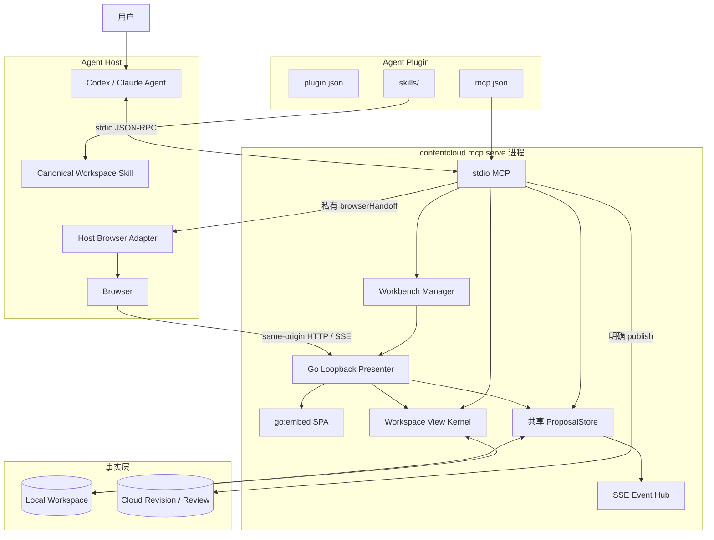

架构不变量：

- `MCP -> localworkspace` 与 `Presenter -> localworkspace` 进入相同 Kernel primitive。
- Presenter 不通过回调 MCP Tool 执行业务操作，避免循环依赖、重复序列化和取消丢失。
- Browser 只拿 opaque resource ID；本机路径不进入 HTML、API、日志或 Tool descriptor。
- Local/Cloud 可以共享 View/Action 语义，但不共享隐式可写状态。
- Host Adapter 只负责安全导航，不拥有业务事实或授权。

## 4. 组件职责

| 组件 | 唯一职责 | 不拥有 |
| --- | --- | --- |
| Workspace Skill | 路由、确认、恢复、降级和下一步规则 | 文件 I/O、token、宿主 DOM |
| stdio MCP | Tool/Resource 协议、单 Workspace 绑定、Host 私有 metadata | 富 UI、长期 HTTP、业务状态副本 |
| Workbench Manager | 每 Workspace 一个进程内 Session、listener、handoff、关闭 | 正式文件校验与写入 |
| Go Presenter | SPA、HTTP 认证、SSE、Range、传输映射 | Claim/Proposal 的第二实现 |
| Workbench SPA | 展示 View、收集草稿、展示精确 Proposal、触发确认 | 直接文件系统、云端权限 |
| `localworkspace` | View、Resource、Claim v2、CAS、Proposal、原子替换、revision | Browser 导航和视觉布局 |
| `ProposalStore` | MCP/Browser 共用的 Proposal 生命周期和幂等结果 | 持久业务正文 |
| Workspace | 本地正文、素材、Run、Handoff 和正式本地产物 | 云端审核与批准 |
| Cloud | SubmissionRevision、审核、批准、Runtime 和审计 | 未发布本地草稿 |

## 5. 事实与状态

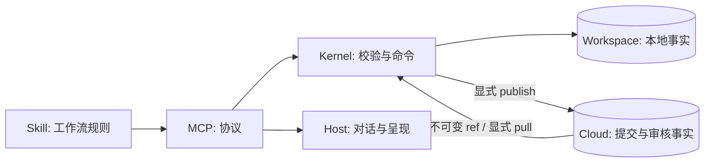

必须始终分离：

```text
local_viewed != local_proposed != local_applied != cloud_submitted != cloud_approved
```

| 状态 | 唯一事实源 |
| --- | --- |
| View、digest、LocalRun revision | Workspace |
| Claim owner/epoch/token hash | `.contentcloud` coordination state |
| handoff、capability、CSRF、事件订阅 | MCP 进程内存 |
| Proposal body 与未消费状态 | MCP 进程共享 `ProposalStore` |
| Browser tab、Host 能力 | Host |
| 发布、审核、批准 | Cloud |

## 6. 打开与降级流程

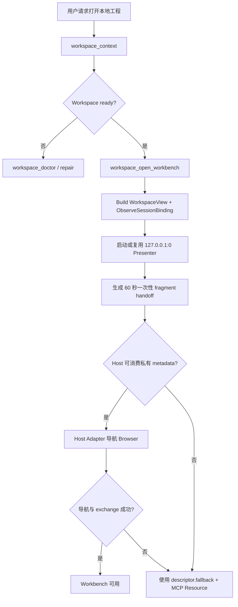

### 6.1 MCP 打开结果

模型可见 descriptor 使用 `contentcloud.workbench-handoff/1.0`，包含：

- `workbench_id`、Workspace/Project/Run 身份。
- `session_generation`、View 和 ref。
- 无秘密 `browser_handoff` 意图。
- 完整 `fallback` WorkspaceView。

私有 metadata 固定为：

```text
_meta["run.zhongcao.contentcloud/browserHandoff"]
```

其中包含 `workbench_id`、实际 origin 和 `/#handoff=<one-time-token>`。这些字段不得出现在 `structuredContent`、模型文本、日志、持久化 Handoff 或错误。

### 6.2 打开时序

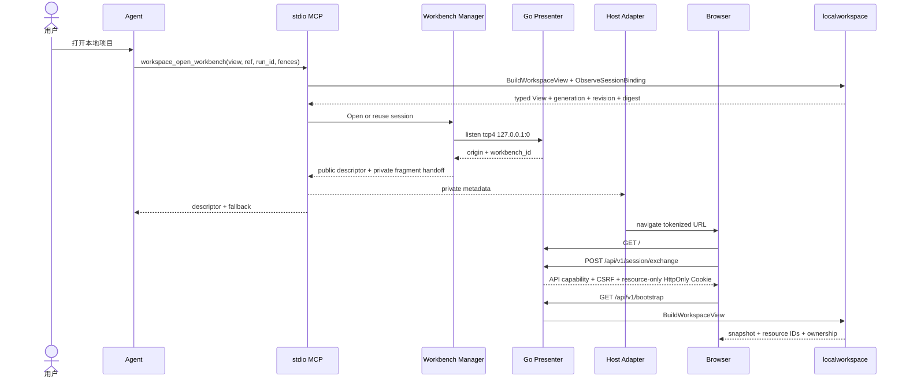

Tool 成功只证明 Presenter 已就绪。只有 Host 实际导航并验证页面后，才能报告“已在 Browser 打开”。

## 7. Presenter HTTP 契约

### 7.1 当前路由

| Method | Path | 用途 | 正式副作用 |
| --- | --- | --- | --- |
| `GET` | `/`、`/assets/{name}` | 嵌入式 SPA | 无 |
| `POST` | `/api/v1/session/exchange` | 一次性交接兑换 | 仅内存 capability |
| `DELETE` | `/api/v1/session` | 关闭当前 Presenter | 仅进程内会话 |
| `GET` | `/api/v1/bootstrap` | 初始 View、资源和 ownership | 无 |
| `GET` | `/api/v1/views/{kind}` | 重新读取类型化 View | 无 |
| `GET` | `/api/v1/resources/{id}` | digest 固定资源与 Range | 无 |
| `GET` | `/api/v1/events` | SSE 失效通知 | 无 |
| `POST` | `/api/v1/ownership/claim` | Browser 取得未占用/过期 Claim | Claim v2 |
| `POST` | `/api/v1/ownership/takeover` | 精确接管活跃 owner | Claim v2 |
| `POST` | `/api/v1/proposals` | 生成一次性 Proposal | 仅进程内 Proposal |
| `POST` | `/api/v1/proposals/{id}/apply` | CAS 重验并写入 | 本地正式写入 |

没有 Browser publish 路由。任何云端写入继续通过 stdio MCP。

### 7.2 传输边界

- Listener 固定 `tcp4 127.0.0.1:0`，每个 session 记录实际 Host。
- 最外层 handler 对每个请求执行 exact Host 校验。
- exchange 和所有 mutation 要求 exact Origin、`Sec-Fetch-Site: same-origin`、JSON Content-Type 和 body 上限。
- Bootstrap、View、SSE 和 mutation API 使用只保存在页面内存中的 `Authorization: Bearer <memory-capability>`；mutation 再要求 `X-Workbench-CSRF`。
- exchange 同时设置独立的资源专用会话 Cookie：`HttpOnly; SameSite=Strict; Path=/api/v1/resources/`，不设置持久化 expiry。Cookie 使用独立 capability，只能授权 digest-bound Resource GET，不能调用 Bootstrap、View、SSE、exchange 或 mutation。
- 资源 Cookie 的明文值不进入 exchange JSON、页面 JavaScript、模型内容或日志；session 关闭时显式清除，服务端有效期不超过 Browser capability 和 Presenter TTL。
- mutation 需要 8-128 字符 `Idempotency-Key`，相同 key 不同操作/参数返回冲突。
- SSE 使用 fetch stream，因此 capability 和 `Last-Event-ID` 只在 header 中。
- `sw.js` 通过 `Service-Worker-Allowed: /` 获得根作用域，并按 Browser client 隔离内存 capability；它只为同源 `/api/v1/resources/*` 附加 Bearer，不能跨标签共享、不持有 CSRF，也不能兑换 handoff 或调用 mutation。原生媒体元素可直接使用资源专用 Cookie。
- 所有 JSON 和资源响应 `no-store`；资源用 digest ETag。

认证边界如下：

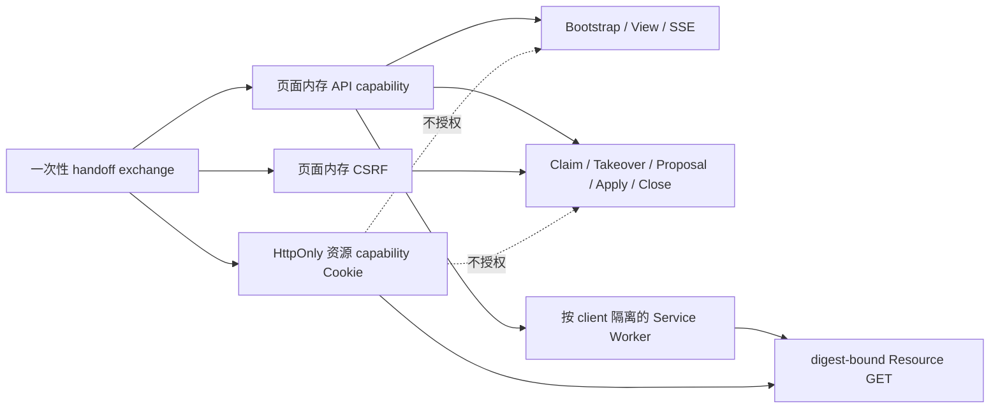

### 7.3 安全响应头

当前实现：

```text
Content-Security-Policy: default-src 'self'; connect-src 'self'; img-src 'self' blob: data:; media-src 'self' blob:; style-src 'self'; script-src 'self'; worker-src 'self'; object-src 'none'; base-uri 'none'; frame-ancestors 'none'; form-action 'none'
Referrer-Policy: no-referrer
X-Content-Type-Options: nosniff
X-Frame-Options: DENY
Cross-Origin-Opener-Policy: same-origin
Cross-Origin-Resource-Policy: same-origin
Permissions-Policy: camera=(), microphone=(), geolocation=(), payment=(), usb=()
```

当前页面要求由 Host Browser 直接导航，不允许第三方 iframe 嵌入。

## 8. View 与资源

### 8.1 路径边界

允许的内容根：

```text
10-context/  20-sources/  30-knowledge/  40-work/
50-production/  60-delivery/  70-results/  90-archive/
```

每次读取都执行 Workspace-relative 规范化、root containment、allowlist、普通文件、大小、MIME 和 digest 校验。绝对路径、隐藏路径、越界路径、symlink 逃逸、设备文件和非普通文件拒绝。

### 8.2 Resource

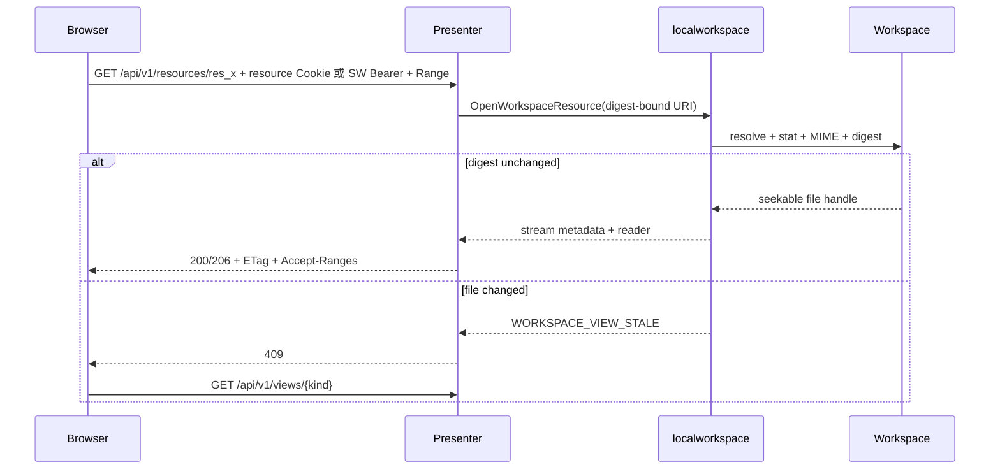

Browser resource ID 只映射到进程内 digest-bound URI。页面永远看不到本机路径。MCP Resource 超过 2 MiB 时返回明确错误并引导使用 Workbench；Presenter 通过 seekable reader 交给 Go `ServeContent` 处理 HTTP Range。

## 9. SSE 与恢复

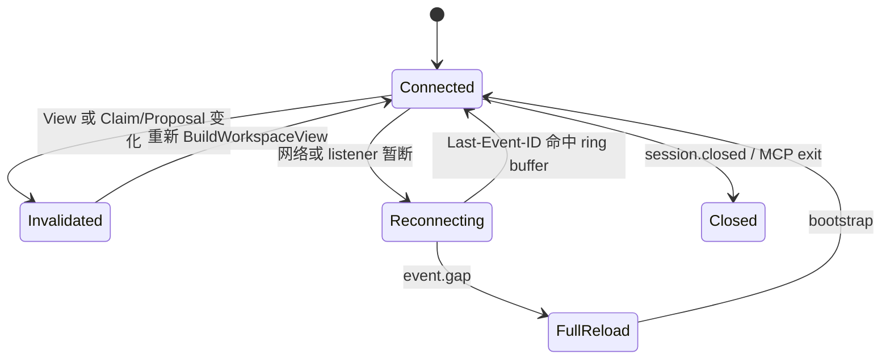

当前事件来源：

- Claim、takeover、Proposal prepare/apply 由命令提交后直接 publish。
- 外部 Workspace 变化由 Presenter 每 5 秒重新构建当前 View 并比较 revision key。
- ring buffer 保留 128 条事件，事件 ID 单调递增。
- 订阅者队列为 16；慢客户端被断开后带 `Last-Event-ID` 重连。
- 游标早于 ring buffer 时发送 `event.gap`，SPA 丢弃旧读模型并重新 load。
- 15 秒 heartbeat 只保活，不推进 revision。
- `view.invalidated` 和 `event.gap` 都从服务端 Session 当前 View 执行完整 Bootstrap；客户端旧 query 不能覆盖 MCP 或其他入口设置的新 View。
- 收到 `session.closed` 后，SPA 标记会话关闭并终止 SSE 重连循环，不再对已关闭 listener 重试。

SSE 只通知快照可能失效，不携带新的权威正文。

同一个 origin 收到新的 `/#handoff=...` 时只会产生 hash 导航。SPA 监听 `hashchange`，重新 exchange、清除 fragment 并按服务端 Session 当前 View Bootstrap，避免同源重开停留在旧 capability 或旧视图。

## 10. Claim v2 与接管

持久 Claim Schema：

```text
schema_version: contentcloud.run-claim/2.0
run_id
owner_kind: agent | browser
owner_id: opaque stable id
epoch: monotonic uint64
token_hash: sha256
context_revision
claimed_at / expires_at
```

明文 token 只在成功 claim/takeover 的当次结果中返回。每次新 claim 或 takeover 使用持久化 epoch 计数器递增；旧 token 即使尚未过期，也会因 owner/epoch fencing 失败。

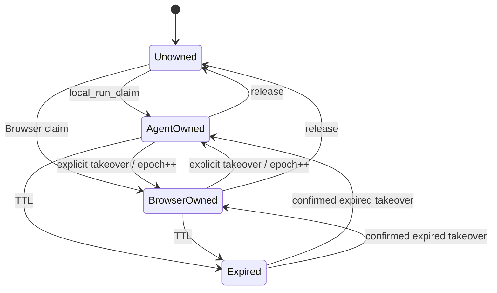

主动接管必须精确匹配：

```text
expected_owner_kind
+ expected_owner_id
+ expected_epoch
+ expected_context_revision
```

任何一项漂移都返回冲突，不尝试“接管最新值”。

## 11. Draft -> Proposal -> Apply

### 11.1 单一事务流

```mermaid
flowchart LR
    Draft[Browser 或 Agent 草稿]
    Validate[路径/MIME/JSON/YAML/大小校验]
    Fence[owner + epoch + revision + digest]
    Proposal[一次性 Proposal]
    Confirm[用户查看准确影响]
    Recheck[CAS 全量重验]
    Atomic[临时文件 + fsync + rename]
    Revision[推进 LocalRun revision]
    Event[SSE invalidation]

    Draft --> Validate --> Fence --> Proposal --> Confirm --> Recheck --> Atomic --> Revision --> Event
```

Browser 与 stdio MCP 都调用同一个 `ProposalStore`：

```mermaid
flowchart TB
    MCPPrepare[workspace_proposal_prepare]
    HTTPPrepare[POST /api/v1/proposals]
    Store[localworkspace.ProposalStore]
    Kernel[PrepareWorkspaceProposal / ApplyWorkspaceProposal]
    MCPApply[workspace_proposal_apply]
    HTTPApply[POST /api/v1/proposals/{id}/apply]

    MCPPrepare --> Store
    HTTPPrepare --> Store
    Store --> Kernel
    MCPApply --> Store
    HTTPApply --> Store
```

### 11.2 当前允许范围

- `typed_action` 只允许 `workspace_file.replace`。
- 只修改 `40-work/` 或 `50-production/` 下已经存在的普通文件。
- 明确排除 `40-work/runs/` 和 `40-work/handoffs/`。
- 内容必须不超过 2 MiB，并且是 UTF-8 text、JSON、YAML 或 YML。
- JSON/YAML 在 Proposal prepare 和 Apply 两次解析。
- 媒体、来源、知识、交付、结果、隐藏文件、新建和删除全部拒绝。

### 11.3 Proposal 绑定

Proposal 固定：Workspace/Project/Run、owner kind/id/epoch、base revision、源文件 digest、目标 digest、字节数、准确 affected path、checks、创建时间和 10 分钟 expiry。

Apply 流程：

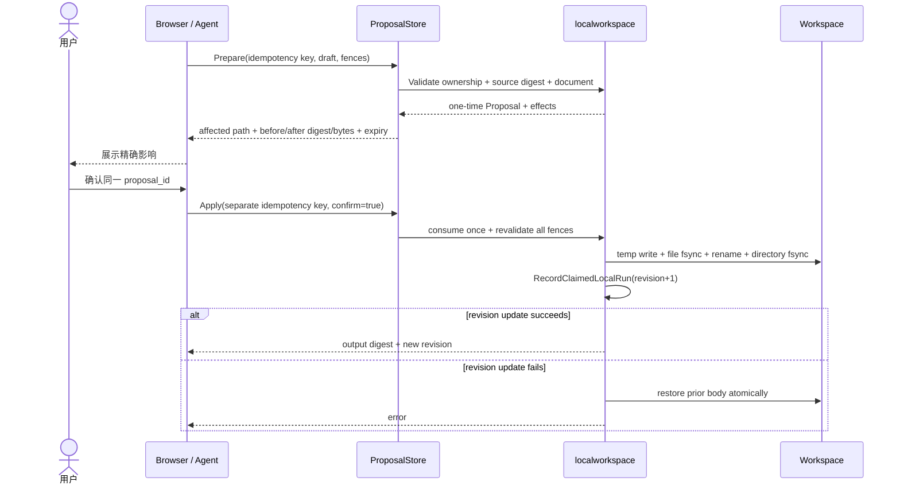

相同幂等 key 和相同参数重放返回原结果；相同 key 不同参数返回冲突。Proposal 在首次非幂等 Apply 时被消费，后续 Apply 返回 not found。

## 12. Workbench UI

UI 遵守根目录 `DESIGN.md`，是紧凑生产工作面：

```text
+----------------------------------------------------------------------------+
| Content Work OS | Workspace / Project | revision | Local | close           |
+--------------------+-----------------------------------+-------------------+
| Navigator          | Primary View                      | Inspector         |
| - Overview         | - typed document / directory     | - ref / MIME      |
| - Runs/Handoffs    | - image / PDF / audio / video    | - digest          |
| - Production       | - draft editor                   | - generation      |
| - Delivery         | - exact Proposal confirmation    | - owner / epoch   |
| - Results          |                                   | - checks          |
+--------------------+-----------------------------------+-------------------+
| Activity: connecting / synced / stale / error / closed                     |
+----------------------------------------------------------------------------+
```

交互要求：

- 中央区域只执行类型化 View 渲染，不执行 Workspace HTML 或脚本。
- 编辑按钮只在 View 绑定 LocalRun、revision、digest 且路径可写时出现。
- Agent owner 存在时先展示 owner/epoch/revision，再允许明确 takeover。
- Proposal 弹层展示路径、源/目标 digest、字节变化和 owner fence。
- Apply 后重新读取 View，刷新 revision、digest、ownership 和检查状态。
- 桌面 `1440 x 1000`、移动 `390 x 844` 和最低 320px 不产生横向溢出。
- 键盘 focus-visible、ARIA label、dialog 和 `prefers-reduced-motion` 必须保留。

## 13. Presenter 生命周期

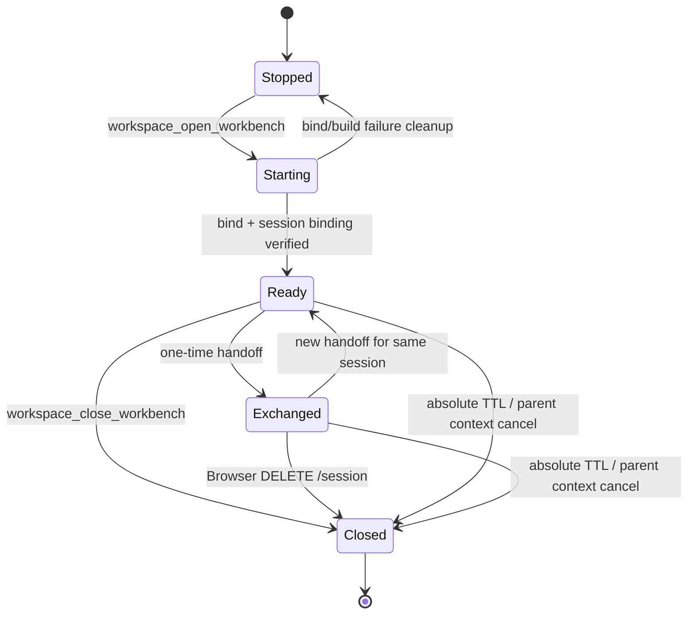

| 项目 | 当前值 |
| --- | --- |
| handoff token TTL | 60 秒，一次性 |
| Browser capability TTL | 30 分钟，不超过 session TTL |
| Presenter absolute TTL | 4 小时 |
| HTTP ReadHeaderTimeout | 5 秒 |
| HTTP IdleTimeout | 30 秒 |
| graceful shutdown | 5 秒 |

MCP 进程退出、`workspace_close_workbench` 或 Browser `DELETE /session` 都会关闭 listener 和所有 capability。关闭后再次 open 必须创建新的 `workbench_id`、origin 和 handoff。

## 14. 安全模型

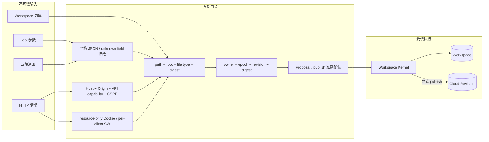

| 威胁 | 当前控制 | 验证 |
| --- | --- | --- |
| DNS rebinding | tcp4 loopback + exact Host | 错 Host 403 |
| CSRF/跨站调用 | exact Origin + Sec-Fetch-Site + capability + CSRF | evil Origin/missing nonce 拒绝 |
| token 泄露 | fragment、一次性、内存 hash、60 秒 TTL、私有 `_meta` | public descriptor/HTML/API 无 token |
| 资源凭据越权 | 独立 HttpOnly 会话 Cookie、Strict SameSite、Resource-only Path 和服务端 capability map | Cookie 无法访问非 Resource API，Bearer/Cookie 缺失返回 401 |
| 路径穿越 | relative + root containment + allowlist + ordinary file | `..`、absolute、symlink 拒绝 |
| stale 写入 | owner + epoch + revision + digest CAS | takeover/digest/expiry 测试 |
| XSS | textContent/JSON stringify + embed UI + CSP | 不执行 Workspace HTML |
| 媒体路径泄露 | opaque resource ID + digest URI | API 不返回路径 |
| 重放 | handoff single-use + idempotency fingerprint + Proposal consume-once | 重放/冲突测试 |
| 孤儿 listener | 父 context、显式 close、绝对 TTL | close/reopen 与 manager close 测试 |

## 15. 错误与恢复

HTTP 错误使用统一 envelope：

```json
{
  "error": {
    "code": "WORKSPACE_PROPOSAL_STALE",
    "message": "Apply 时运行所有权已经变化",
    "hint": "重新读取当前 View，创建新的 Proposal 并再次确认"
  }
}
```

关键恢复规则：

| 错误/状态 | 恢复 |
| --- | --- |
| handoff expired/replayed | 再次调用 `workspace_open_workbench` 生成新 handoff |
| capability expired | 从 MCP 重新打开，不在 Browser 持久化 token |
| session generation 漂移 | Manager 关闭旧 session 并创建新 session |
| `WORKSPACE_VIEW_STALE` | 重新读取 View 与 Resource |
| `RUN_CLAIM_FENCE_CONFLICT` | 读取当前 owner/epoch，未经确认不接管 |
| `WORKSPACE_PROPOSAL_STALE` | 重新读取、重新 prepare、重新确认 |
| `event.gap` | 全量 bootstrap/load |
| Browser 不可用 | 使用 descriptor fallback 与 MCP Resource |
| Cloud publish 未知 | 使用 publish idempotency/status，不在 Browser 重复提交 |

## 16. 本地与云端流程

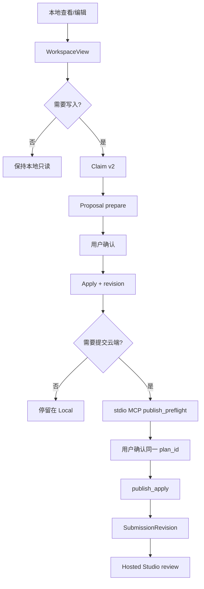

Browser 本地保存不能自动触发 publish。Cloud 提交也不能反向覆盖当前本地草稿；pull 必须是独立、明确操作。

## 17. 分发

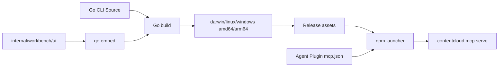

当前 UI 是无远程依赖的嵌入式 HTML/CSS/JS，运行时不需要 Vite、Node server、Electron 或 CDN。Agent Plugin 仍只声明固定版本 npm launcher 和 stdio MCP。

发布门禁：

- Go embed 资源存在并通过 JS 语法检查。
- 插件包摘要与 Ed25519 registry 签名匹配最终 Skill 内容。
- 标准包、宿主投影、environment profile 和内嵌包使用同一个 release digest。
- Go 全量测试、Web 114 项测试、插件/环境/架构/治理脚本通过。
- race、目标平台构建和真实 Browser 流程通过。

## 18. 实现索引

| 能力 | 唯一实现 |
| --- | --- |
| View/Resource | `internal/localworkspace/view.go` |
| Claim v2/takeover/Handoff | `internal/localworkspace/runcoordination.go` |
| Proposal/Apply/rollback | `internal/localworkspace/proposal.go` |
| 原子文件替换 | `internal/localworkspace/workspace.go` |
| Presenter/session/security/SSE/Range | `internal/workbench/manager.go` |
| Embedded SPA | `internal/workbench/ui/` |
| stdio MCP Tool/私有 handoff envelope | `internal/cli/workspace_commands.go` |
| MCP 生命周期接线 | `internal/cli/root.go`、`internal/cli/local_commands.go` |
| Canonical workflow | `plugins/contentcloud-video-production/skills/contentcloud-workspace/SKILL.md` |

## 19. 测试覆盖图

```text
workspace_open_workbench
  +-- Workspace binding/generation --------- localworkspace + CLI integration
  +-- start/reuse/close/reopen -------------- workbench integration
  +-- private handoff/public fallback ------- MCP contract
  +-- exchange TTL/replay ------------------- HTTP security
  +-- Host/Origin/capability/CSRF ----------- HTTP security
  +-- embedded SPA/CSP/no secret leak ------- HTTP contract
  +-- View/Resource
  |   +-- text/JSON/YAML/directory ---------- unit + integration
  |   +-- image/PDF/audio/video/Range ------- integration + Browser
  |   +-- stale digest/path/symlink/size ---- security integration
  +-- SSE
  |   +-- direct command events ------------- integration
  |   +-- external change polling ----------- integration
  |   +-- Last-Event-ID/gap/slow client ----- integration + Browser
  +-- ownership
  |   +-- claim/token_hash ------------------ localworkspace
  |   +-- active takeover/epoch fencing ----- concurrency + race
  +-- Proposal/Apply
      +-- path/MIME/schema/TTL/CAS ----------- localworkspace
      +-- Browser end-to-end ---------------- workbench integration
      +-- MCP shared store/idempotency ------- CLI integration
      +-- rollback on revision failure ------- fault path
```

已存在的直接测试：

- `TestWorkbenchHandoffAndHTTPBoundary`
- `TestWorkbenchRangeDigestAndCloseLifecycle`
- `TestWorkbenchServiceWorkerInjectsOnlyResourceCapability`
- `TestWorkbenchUIKeepsTheBootstrappedViewCurrent`
- `TestWorkbenchBrowserClaimProposalApplyEndToEnd`
- `TestRunClaimActiveTakeoverFencesPreviousOwner`
- `TestWorkspaceProposalAppliesWithOwnershipRevisionAndDigestCAS`
- `TestWorkspaceProposalRejectsStaleDigestFenceAndExpiry`
- `TestMCPWorkbenchKeepsBrowserHandoffPrivateAndClosesCleanly`
- `TestMCPWorkspaceProposalUsesSameKernelAndIsIdempotent`

### 19.1 真实 Chromium 验收

使用临时 Workspace、临时 MCP Host 驱动器、随机 loopback 端口和无生产凭据环境完成了真实 Chromium 验收。Node 只作为 `/tmp` 下的测试驱动器，不进入产品运行时或发布包。

| 场景 | 实测结果 |
| --- | --- |
| 私有 handoff | 一次性 token 完成 exchange 后立即从 fragment 清除，不落盘、不进入模型可见结果 |
| View 稳定性 | 打开文件、Apply 和 SSE 刷新后保持服务端当前文件，不回退到 Workspace 概览 |
| 所有权 | claim、显式 takeover 和旧 owner epoch fencing 均生效 |
| Proposal/Apply | prepare 不修改文件；两次 Apply 令 revision `1 -> 2 -> 3`，正文和 digest 同步刷新 |
| 外部变化 | Workspace 外部修改在 5 秒受限轮询后通过 SSE 自动刷新 |
| 图片 | WebP 在 Browser 中实际解码为 `1536 x 864` |
| Range | `bytes=0-31` 返回 `206`、`Content-Range: bytes 0-31/85024` 和 32 字节正文 |
| 响应式 | `1440 x 1000`、`390 x 844`、`320 x 844` 均无横向滚动、遮挡或重叠 |
| 关闭与重开 | 关闭后显示“会话已关闭”、无控制台错误且不再重连；status 返回不存在；重开产生新的 `workbench_id` 和 origin |

这组结果证明 Presenter、SPA、资源认证、Range、SSE、Claim 和 Proposal/Apply 在真实浏览器内闭环可用。它不等于 Codex 右侧内置 Browser 宿主验收；后者还必须证明宿主能私下消费 `_meta`，且不会把 token 暴露给模型。

## 20. 完成定义

本次本地 Workbench 重构只有在以下条件全部满足后完成：

1. 标准 Plugin 仍为 Skills + stdio MCP，不引入运行时 Node server。
2. Workbench 只由同一 MCP 进程内的 `127.0.0.1:0` Presenter 提供。
3. private handoff 不进入模型可见内容，fallback View 始终可用。
4. 旧 renderer、presentation Resource/cache 和兼容入口在运行时与 Skill 中全部删除。
5. Browser 与 MCP 共享 Claim v2、epoch、revision、digest 和 `ProposalStore`。
6. Proposal prepare 不写正式文件；Apply 只消费明确确认的同一 Proposal。
7. 本地保存与云端 publish/approve 在契约和 UI 中完全分离。
8. Host、Origin、capability、CSRF、CSP、path、digest、Range 和重放测试通过。
9. close/reopen、MCP 退出、handoff replay、resource stale 和 ownership conflict 可恢复。
10. Workbench 通过 `1440 x 1000`、`390 x 844`、最低 320px、控制台和真实媒体解码验收；键盘专项验收仍需在正式宿主完成。
11. Plugin digest/signature、全量 Go/Web/治理测试、race 和跨平台构建通过。
12. Codex 右侧内置 Browser 能私下消费 `_meta`，并完成打开、查看、claim/takeover、编辑、确认、apply、刷新和关闭；token 全程不得进入模型上下文。

## 21. 验收命令

```bash
go test ./internal/localworkspace ./internal/workbench ./internal/cli -count=1
go test ./... -count=1
go test -race ./internal/localworkspace ./internal/workbench ./internal/cli -count=1
node --check internal/workbench/ui/app.js
node --check internal/workbench/ui/sw.js
pnpm --dir web test
pnpm --dir web typecheck
pnpm --dir web build
pnpm architecture
pnpm check:plugin
pnpm governance:content
pnpm governance:v3
```

真实 Chromium 验收已使用临时 Workspace、随机端口和无生产凭据环境通过。Codex 右侧内置 Browser 验收仍必须使用隔离宿主配置；不得修改开发者现有 `CODEX_HOME`、Plugin Store 或生产账号。

## 22. 参考规范

- Agent Plugins 官方文档：<https://agent-plugins.org/docs.md>
- Agent Plugins 1.0.0 规范：<https://agent-plugins.org/specification>
- Agent Plugins 中文社区译文：<https://agent-plugin.org/zh>
- MCP Transport：<https://modelcontextprotocol.io/specification/2025-06-18/basic/transports>
- OpenAI Plugin 概念：<https://developers.openai.com/plugins/concepts/plugins>
- OpenAI Plugin 构建：<https://developers.openai.com/plugins/build/plugins>
- 本仓库 Agent Plugin 架构：[docs/plugin/README.md](../../plugin/README.md)
