# Content Work OS 本地工作台技术方案

状态：`可移植控制面、Direct Browser Presenter、Claude Code 工作区注入、MCP Apps 最小协议闭环和 MCP Roots 请求/绑定闭环已实现；各正式宿主 UI/Roots 仍待真实验收`。

更新时间：2026-08-15。

上位规范：[ContentCloud 平台基线](../../foundation/README.md)、[客户创作台产品层](./README.md)、[项目级执行客户端连接](./04-execution-client-connection.md)、[Agent Plugin 架构](../../plugin/README.md)、[Runtime 运行手册](../../roadmap/v8/10-runtime-operations-runbook.md)。调研证据见[参考工作台实现分析](./06-reference-workbench-analysis.md)。

本文是本地 Workbench 的唯一技术事实源。它同时说明当前实现、目标架构、宿主差异和发布门禁；不再保留旧静态 HTML renderer、presentation Resource/cache 或长期 Node sidecar 的兼容方案。MCP Apps 是 MCP 扩展，不是 Agent Plugins 1.0.0 核心字段，两者必须独立协商和测试。

## 1. 结论

本地工程采用一个可移植核心、三种呈现通道：

```text
中文 Canonical Skills
  -> stdio MCP
  -> Workspace Kernel
  -> Host Capability Negotiation
       |-> MCP Apps: ui:// Resource + App Bridge
       |-> Direct Browser: Go Presenter + private handoff
       `-> Headless: structuredContent + MCP Resource
```

核心决策：

1. 标准 Agent Plugin 只发布中文 Skills 和 stdio MCP 声明；`ui://`、`_meta.ui.resourceUri` 与 `text/html;profile=mcp-app` 属于 MCP Apps 扩展。
2. `contentcloud mcp serve` 是唯一可移植本地控制面。任何 UI 都只能调用同一 Workspace Kernel，不能拥有第二套 Claim、Proposal、Apply 或 publish 实现。
3. 支持 MCP Apps 的宿主优先使用标准 App 通道；不支持 App 但支持安全私有导航的宿主可使用 Direct Browser；两者都不支持时必须退化为完整的 Headless Tool/Resource 工作流。
4. Direct Browser 继续由同一个 Go MCP 进程按需创建 `127.0.0.1:0` Presenter，不启动长期 Node 服务。
5. Workspace 是未发布本地事实源；Cloud Revision 是已提交云端事实源。两者只通过明确 pull/publish 交换。
6. 云端发布仍只通过 `publish_preflight`/`publish_apply`，任何本地 UI 都不能越过现有确认边界。
7. “官方兼容目录存在”只证明某项协议能力候选，不等于 ContentCloud 已完成安装投影、工作区绑定、生命周期、UI 和安全验收。

## 2. 当前能力边界

### 2.1 已实现

- stdio MCP：`workspace_view`、`workspace_open_workbench`、`workspace_workbench_status`、`workspace_close_workbench`。
- 同进程 Go Presenter：随机 loopback 端口、嵌入式 SPA、一次性交接、服务端内存 capability、标签页刷新恢复、CSRF、资源专用会话 Cookie、CSP、安全响应头和绝对 TTL；同一 Session 的多个 capability 保留各自打开时的 View。
- 类型化 View：Workspace summary、文件/目录、Run、Handoff、内容、render、diff、delivery 视图入口。
- digest Resource：opaque Browser resource ID、MCP Resource fallback、图片/PDF/音视频 HTTP Range 和 stale digest 阻断。
- SSE：单调事件 ID、`Last-Event-ID`、有界 ring buffer、gap 恢复、慢订阅者断开。
- Claim v2：`owner_kind`、`owner_id`、单调 `epoch`、持久化 `token_hash`、主动 takeover 和旧 owner fencing。
- Draft -> Proposal -> Apply：精确影响、10 分钟 TTL、一次性消费、CAS 重验、幂等重放、原子替换、LocalRun revision 推进和失败回滚。
- Workbench UI：目录导航、类型化文档、图片/PDF/音视频、所有权、草稿编辑、takeover、Proposal 确认、Apply 后刷新。
- Claude Code 私有投影：保留 `${CLAUDE_PLUGIN_ROOT}`/`${CLAUDE_PLUGIN_DATA}`，并通过 `${CLAUDE_PROJECT_DIR}` 注入 `CONTENTCLOUD_WORKSPACE_ROOT`；`workspace_context` 无需显式 `directory` 即可绑定当前项目。

### 2.2 当前发布边界

- Presenter 只支持本地查看与本地 Proposal/Apply；云端 publish 没有 Browser HTTP 路由。
- 事件外部变更检测当前为 5 秒受限轮询，不声明 `fsnotify`。
- Workbench session 使用 4 小时绝对 TTL，handoff 为 60 秒，Browser capability 为 30 分钟；当前没有独立 idle TTL 或 capability 滚动续期。普通刷新从当前标签页 `history.state` 恢复 capability、CSRF 和 Claim token；新的 handoff exchange 会重新返回该 Workbench 仍持有的 Browser Claim token。Session 关闭会主动释放这些 Claim。
- SSE ring buffer 当前为 128 条，单订阅者队列为 16 条。
- Workspace 单个可展示资源上限为 512 MiB；MCP 内联读取上限为 2 MiB，大文件必须走 Browser Resource。
- Chromium Browser 的导航、桌面/移动交互、媒体 Range、受治理编辑和关闭恢复已通过。仓库仅生成私有 `_meta` handoff，不包含 Codex 右侧 Browser Host Adapter；因此仍不能宣称正式宿主交付完成。
- 当前已提供会话协商、`ui://` MCP App Resource、`_meta.ui.resourceUri`、`text/html;profile=mcp-app` 和最小 App 生命周期页面；没有注册 app-only Tool。正式宿主沙箱、Bridge 代理和宿主 E2E 尚未完成，不能把协议闭环写成全渠道 UI 已交付。
- MCP Server 已在宿主声明 `capabilities.roots` 后主动请求 `roots/list`，支持单 root 自动绑定、多 root 要求显式 `directory` 和 `notifications/roots/list_changed` 重取；未声明或不响应 Roots 的宿主仍需显式 `directory` 或经验证的宿主注入，禁止把 Plugin Root 误认成 Workspace Root。

### 2.3 目标发布能力

- MCP Apps：同一个 stdio Server 返回 `ui://` Resource，由支持 `io.modelcontextprotocol/ui` 的宿主在沙箱 iframe 中呈现。
- Direct Browser：保留现有 Go Presenter，承担无 MCP Apps 宿主的安全导航以及大媒体 Range 通道。
- Headless：所有宿主始终可以通过 Tool、`structuredContent` 和 digest-bound Resource 完成同一业务流程。
- Host Capability Probe：会话初始化时记录 Plugin、Skills、stdio MCP、Roots、MCP Apps、private handoff、loopback/iframe/CSP/Range 能力，不根据客户端名称猜测。
- UI 共用同一展示组件与类型化 View 契约；MCP App 与 Direct Browser 不能分叉业务逻辑。

### 2.4 非目标

- 不建设通用文件管理器、IDE、任意代码编辑器或多人实时协作。
- 不允许 Browser 访问 `file://`、绝对路径、任意目录或任意外部 URL。
- 不把 loopback HTTP 变成第二个 MCP transport、局域网服务或长期 daemon。
- 不让 UI 隐藏、按钮状态或自然语言确认承担授权。
- 不在 Presenter 中复制 Workspace 校验、Claim、Proposal 或 publish 逻辑。
- 不保留旧 renderer、旧 presentation URI、旧 Tool alias 或双写 facade。

## 3. 总体架构

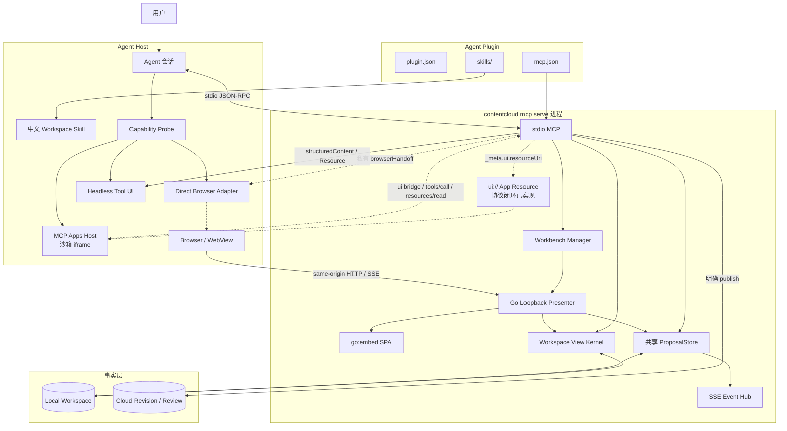

架构不变量：

- `MCP -> localworkspace` 与 `Presenter -> localworkspace` 进入相同 Kernel primitive。
- `MCP App -> tools/call -> MCP -> localworkspace` 也必须进入相同 Kernel primitive。
- Presenter 不通过回调 MCP Tool 执行业务操作，避免循环依赖、重复序列化和取消丢失。
- Browser 只拿 opaque resource ID；本机路径不进入 HTML、API、日志或 Tool descriptor。
- Local/Cloud 可以共享 View/Action 语义，但不共享隐式可写状态。
- MCP App Host 与 Direct Browser Adapter 只负责呈现和传输，不拥有业务事实或授权。

## 4. 组件职责

| 组件 | 唯一职责 | 不拥有 |
| --- | --- | --- |
| Workspace Skill | 路由、确认、恢复、降级和下一步规则 | 文件 I/O、token、宿主 DOM |
| Host Capability Probe | 协商 Roots、MCP Apps、private handoff、loopback 和 Resource 能力 | 根据产品名推断能力 |
| stdio MCP | Tool/Resource、MCP Apps Resource、单 Workspace 绑定、Host 私有 metadata | 业务状态副本 |
| MCP App UI | 在宿主沙箱中展示 View，经 Bridge 调用 Tool/Resource | 直接文件系统、秘密 token、第二套写路径 |
| Workbench Manager | 每 Workspace 一个进程内 Session、listener、handoff、关闭；为每个 exchanged capability 保存独立 View | 正式文件校验与写入 |
| Go Presenter | SPA、HTTP 认证、SSE、Range、传输映射 | Claim/Proposal 的第二实现 |
| Workbench SPA | 展示 View、收集草稿、展示精确 Proposal、触发确认 | 直接文件系统、云端权限 |
| `localworkspace` | View、Resource、Claim v2、CAS、Proposal、原子替换、revision | Browser 导航和视觉布局 |
| `ProposalStore` | MCP/Browser 共用的 Proposal 生命周期和幂等结果 | 持久业务正文 |
| Workspace | 本地正文、素材、Run、Handoff 和正式本地产物 | 云端审核与批准 |
| Cloud | SubmissionRevision、审核、批准、Runtime 和审计 | 未发布本地草稿 |

## 5. 事实与状态

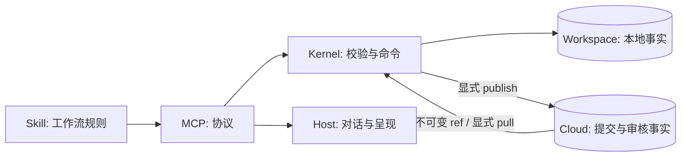

必须始终分离：

```text
local_viewed != local_proposed != local_applied != cloud_submitted != cloud_approved
```

| 状态 | 唯一事实源 |
| --- | --- |
| View、digest、LocalRun revision | Workspace |
| Claim owner/epoch/token hash | `.contentcloud` coordination state |
| handoff、capability、CSRF、事件订阅 | MCP 进程内存 |
| Proposal body 与未消费状态 | MCP 进程共享 `ProposalStore` |
| Browser tab、Host 能力 | Host |
| 发布、审核、批准 | Cloud |

## 6. 工作区绑定、打开与降级

### 6.1 工作区绑定优先级

目标顺序固定为：

```text
MCP roots/list 中唯一且通过 Workspace 校验的 file:// root
  -> Host 私有投影注入的稳定项目根
  -> Tool 显式 directory
  -> WORKSPACE_NOT_BOUND
```

约束：

- 多个 Roots 都包含有效 Workspace 时必须要求用户选择，不能扫描后猜测。
- 第一次成功解析后，MCP 子进程锁定单一 canonical Workspace；后续不同 root 返回 `MCP_WORKSPACE_SESSION_CONFLICT`。
- Plugin Root、Plugin Data、进程启动目录本身都不是 Workspace 证据。
- Claude Code 当前通过 `${CLAUDE_PROJECT_DIR}` 注入稳定项目根，已具备第二级绑定。
- MCP Roots Server 请求与绑定校验已实现；跨宿主缺口变为宿主是否声明并正确响应 `roots/list`、多 root 选择和重启恢复。宿主尚未通过验证前，Codex 等客户端必须显式传 `directory` 或提供已验证的受控注入。

### 6.2 宿主准入流程

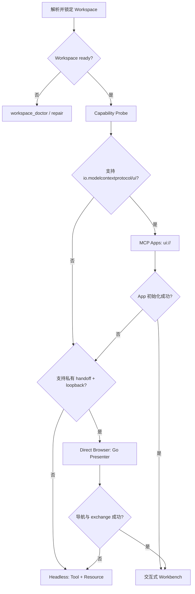

### 6.3 MCP Apps 时序（协议闭环已实现，宿主 E2E 待验收）

```mermaid
sequenceDiagram
    actor User as 用户
    participant Host as MCP Apps Host
    participant MCP as contentcloud stdio MCP
    participant App as 沙箱 MCP App
    participant Kernel as Workspace Kernel

    Host->>MCP: initialize + io.modelcontextprotocol/ui capability
    MCP-->>Host: Tool 定义 + _meta.ui.resourceUri=ui://contentcloud/workbench
    User->>Host: 打开本地工程
    Host->>MCP: tools/call workspace_view/open
    MCP->>Kernel: BuildWorkspaceView
    Kernel-->>MCP: typed View + digest + revision
    MCP-->>Host: structuredContent + app metadata
    Host->>MCP: resources/read ui://contentcloud/workbench
    MCP-->>Host: text/html;profile=mcp-app
    Host->>App: 在沙箱 iframe 初始化 Tool Result
    App->>MCP: ui bridge tools/call 或 resources/read
    MCP->>Kernel: Claim / Proposal / Apply
    Kernel-->>App: 类型化结果，不返回本机路径或秘密
```

MCP App 必须满足：

- Tool 通过 `_meta.ui.resourceUri` 关联 `ui://` Resource；不支持该扩展的宿主仍获得完整 `structuredContent`。
- UI 只经宿主 Bridge 调用同一 MCP Server；不把 iframe 消息、DOM 状态或按钮状态当作授权。
- 当前不注册仅供 App 使用的辅助 Tool，因此不会扩大模型 Tool 列表；后续若增加 app-only Tool，必须对模型隐藏，并由 Server 复核 Workspace、Claim、revision 和 digest。
- UI bundle 与 Direct Browser 尽量复用展示组件和 View schema，但传输适配器分离。

### 6.4 Direct Browser 打开结果

模型可见 descriptor 使用 `contentcloud.workbench-handoff/1.0`，包含：

- `workbench_id`、Workspace/Project/Run 身份。
- `session_generation`、View 和 ref。
- 无秘密 `browser_handoff` 意图。
- 完整 `fallback` WorkspaceView。

私有 metadata 固定为：

```text
_meta["run.zhongcao.contentcloud/browserHandoff"]
```

其中包含 `workbench_id`、实际 origin 和 `/#handoff=<one-time-token>`。这些字段不得出现在 `structuredContent`、模型文本、日志、持久化 Handoff 或错误。

### 6.5 Direct Browser 时序（当前已实现 Presenter）

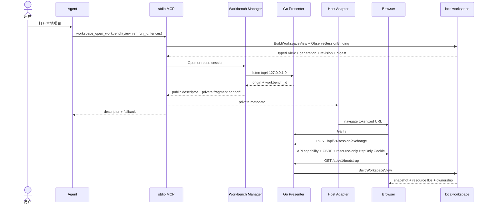

Tool 成功只证明 Presenter 已就绪。只有 Host 实际导航并验证页面后，才能报告“已在 Browser 打开”。

### 6.6 Headless 降级

Headless 不是错误页，而是正式、可完成业务的最低能力面：

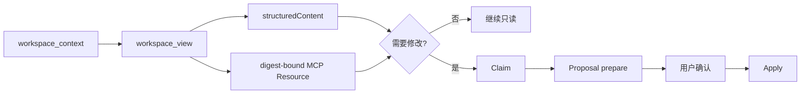

### 6.7 宿主能力矩阵

状态语义：`已验证` 表示本仓库有实现和对应测试；`官方能力` 只表示上游文档声明；`候选` 表示协议可行但缺 ContentCloud Adapter/E2E；`计划` 表示证据或实现均不足。

| 宿主/Surface | Plugin/Skill | stdio MCP | 工作区绑定 | 富 UI | ContentCloud 状态 |
| --- | --- | --- | --- | --- | --- |
| Codex CLI | Agent Plugins 已验证 | 已验证 | 显式 `directory`；Server Roots 已实现，客户端响应未验证 | 无内联 UI，Headless | 控制面已验证 |
| Codex Desktop | Agent Plugins 已验证 | 已验证 | 显式 `directory`；Server Roots 已实现，宿主响应未验证 | 上游源码具备 MCP Apps 管道；本项目 E2E 未完成 | UI 候选 |
| Claude Code CLI | Claude 私有 Plugin/Skills 已验证 | 自动生命周期已验证 | `${CLAUDE_PROJECT_DIR}` 注入已实现 | 无 MCP Apps 内联证据 | 控制面已验证 |
| Claude Code + Chrome/Edge | 同上 | 同上 | 同上 | 可操作 localhost，但不是私有 handoff | 实验候选 |
| Claude Desktop / Web | 非本仓库 Plugin 投影 | 官方 MCP 能力 | 本地绑定未实现 | 官方 MCP Apps 支持 | 候选，未准入 |
| Cursor | Agent Plugins 官方兼容 | 官方 MCP 能力 | NativeHost/Roots 未实现 | 官方 MCP Apps 支持 | 候选，未准入 |
| VS Code GitHub Copilot | Agent Plugins 官方兼容 | 官方 MCP 能力 | NativeHost/Roots 未实现 | 官方 MCP Apps 支持 | 候选，未准入 |
| GitHub Copilot CLI/App | Agent Plugins 官方兼容 | 依具体 Surface | 未实现 | 依具体 Surface，不能合并推断 | 计划 |
| Kiro | Agent Plugins 官方兼容 | 官方 MCP 候选 | 未实现 | 无本项目证据 | 计划 |
| Gemini CLI | Agent Skills 候选 | MCP 候选 | 未实现 | 无本项目证据 | Headless 候选 |
| Cline / Windsurf / Continue | 各自具备部分 Skill 或 MCP 能力 | MCP 候选 | 未实现 | 无统一 MCP Apps 证据 | 计划 |
| Hermes / OpenClaw | Agent Plugins 官方兼容 | Skill/MCP 候选 | 未实现 | 无本项目证据 | 计划 |
| WorkBuddy | 无足够稳定官方证据 | 未验证 | 未实现 | 未验证 | 计划 |
| Grok Bot / NanoClaw | Agent Plugins 官方兼容目录存在 | 未验证 | 未实现 | 未验证 | 非首发 |
| 通用 MCP Client | 不要求 Plugin | 按能力协商 | Roots 或显式 `directory` | MCP Apps 可选 | Headless 基线 |

Claude Code 不在 Agent Plugins 官方兼容客户端目录中；ContentCloud 的支持来自 Claude 自己的 Plugin/Marketplace 格式和本仓库私有投影。反过来，进入 Agent Plugins 或 MCP Apps 官方矩阵也不能自动升级为 ContentCloud 正式支持。

## 7. Presenter HTTP 契约

### 7.1 当前路由

| Method | Path | 用途 | 正式副作用 |
| --- | --- | --- | --- |
| `GET` | `/`、`/assets/{name}` | 嵌入式 SPA | 无 |
| `POST` | `/api/v1/session/exchange` | 一次性交接兑换 | 仅内存 capability |
| `DELETE` | `/api/v1/session` | 关闭当前 Presenter | 仅进程内会话 |
| `GET` | `/api/v1/bootstrap` | 初始 View、资源和 ownership | 无 |
| `GET` | `/api/v1/views/{kind}` | 重新读取类型化 View | 无 |
| `GET` | `/api/v1/resources/{id}` | digest 固定资源与 Range | 无 |
| `GET` | `/api/v1/events` | SSE 失效通知 | 无 |
| `POST` | `/api/v1/ownership/claim` | Browser 取得未占用/过期 Claim | Claim v2 |
| `POST` | `/api/v1/ownership/takeover` | 精确接管活跃 owner | Claim v2 |
| `POST` | `/api/v1/proposals` | 生成一次性 Proposal | 仅进程内 Proposal |
| `POST` | `/api/v1/proposals/{id}/apply` | CAS 重验并写入 | 本地正式写入 |

没有 Browser publish 路由。任何云端写入继续通过 stdio MCP。Host Adapter 不在本仓库内实现，`_meta` 的生成不能替代宿主消费、导航、页面断言和 token 不入模型上下文的真实验收。

### 7.2 传输边界

- Listener 固定 `tcp4 127.0.0.1:0`，每个 session 记录实际 Host。
- 最外层 handler 对每个请求执行 exact Host 校验。
- exchange 和所有 mutation 要求 exact Origin、`Sec-Fetch-Site: same-origin`、JSON Content-Type 和 body 上限。
- Bootstrap、View、SSE 和 mutation API 使用标签页会话 capability；mutation 再要求 `X-Workbench-CSRF`。前端只把 capability、CSRF、expiry 和当前标签页持有的 Claim token 保存到该标签页的 `history.state`，用于同页刷新恢复；不写入 URL、`localStorage`、`sessionStorage`、Cookie、日志或模型内容，关闭 Session 或收到 `session.closed` 时立即清除。
- exchange 同时设置独立的资源专用会话 Cookie：`HttpOnly; SameSite=Strict; Path=/api/v1/resources/`，不设置持久化 expiry。Cookie 使用独立 capability，只能授权 digest-bound Resource GET，不能调用 Bootstrap、View、SSE、exchange 或 mutation。
- 资源 Cookie 的明文值不进入 exchange JSON、页面 JavaScript、模型内容或日志；session 关闭时显式清除，服务端有效期不超过 Browser capability 和 Presenter TTL。
- mutation 需要 8-128 字符 `Idempotency-Key`，相同 key 不同操作/参数返回冲突。
- SSE 使用 fetch stream，因此 capability 和 `Last-Event-ID` 只在 header 中。
- `sw.js` 通过 `Service-Worker-Allowed: /` 获得根作用域，并按 Browser client 隔离内存 capability；它只为同源 `/api/v1/resources/*` 附加 Bearer，不能跨标签共享、不持有 CSRF，也不能兑换 handoff 或调用 mutation。原生媒体元素可直接使用资源专用 Cookie。
- 所有 JSON 和资源响应 `no-store`；资源用 digest ETag。

认证边界如下：

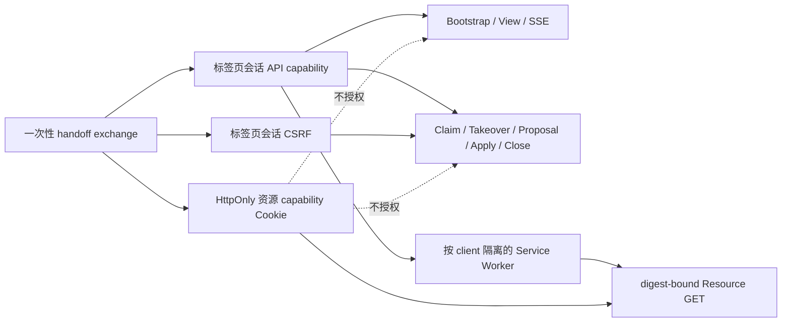

### 7.3 安全响应头

当前实现：

```text
Content-Security-Policy: default-src 'self'; connect-src 'self'; img-src 'self' blob: data:; media-src 'self' blob:; style-src 'self'; script-src 'self'; worker-src 'self'; object-src 'none'; base-uri 'none'; frame-ancestors 'none'; form-action 'none'
Referrer-Policy: no-referrer
X-Content-Type-Options: nosniff
X-Frame-Options: DENY
Cross-Origin-Opener-Policy: same-origin
Cross-Origin-Resource-Policy: same-origin
Permissions-Policy: camera=(), microphone=(), geolocation=(), payment=(), usb=()
```

这些响应头只适用于 Direct Browser Presenter 页面，它要求 Host Browser 直接导航且不允许第三方 iframe 嵌入。MCP App 是独立的 `ui://` Resource，由宿主自己的沙箱策略承载，不能复用这里的 `X-Frame-Options: DENY` 响应。

## 8. View 与资源

### 8.1 路径边界

允许的内容根：

```text
10-context/  20-sources/  30-knowledge/  40-work/
50-production/  60-delivery/  70-results/  90-archive/
```

每次读取都执行 Workspace-relative 规范化、root containment、allowlist、普通文件、大小、MIME 和 digest 校验。绝对路径、隐藏路径、越界路径、symlink 逃逸、设备文件和非普通文件拒绝。`workspace_context` 的内部 Root 只用于 CLI 解析和环境检查，序列化给模型的 ContextView 与 MCP Resource 会省略该字段，不暴露本地绝对路径。

### 8.2 Resource

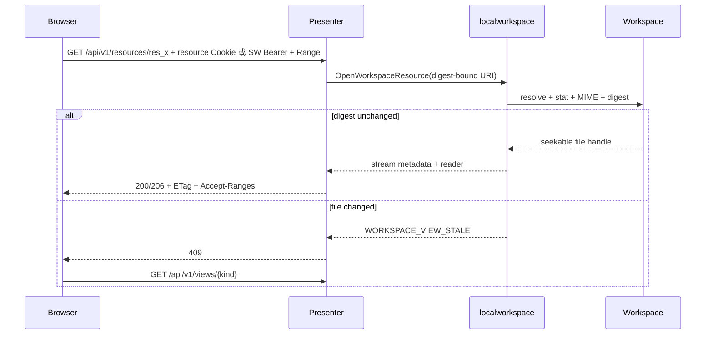

Browser resource ID 只映射到进程内 digest-bound URI。页面永远看不到本机路径。MCP Resource 超过 2 MiB 时返回明确错误并引导使用 Workbench；Presenter 通过 seekable reader 交给 Go `ServeContent` 处理 HTTP Range。

### 8.3 MCP Apps 大媒体通道（目标）

小型文本和结构化数据直接使用 `resources/read`。图片、PDF、音频、视频或接近 2 MiB 上限的对象不能整体 base64 编码进 stdio；目标方案复用 Go Presenter 的资源内核，增加短生命周期 Media Gateway：

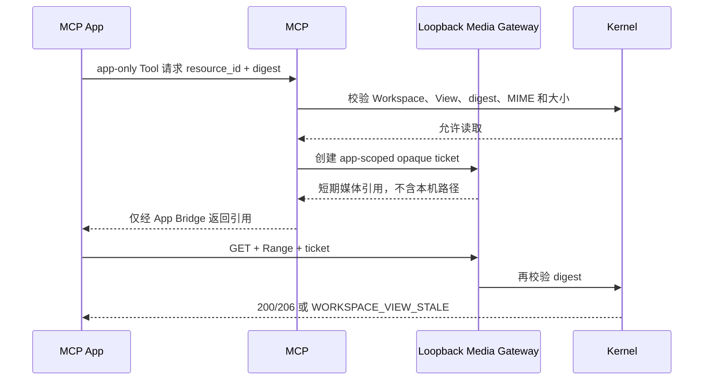

发布前必须验证 iframe CSP、宿主允许的连接目标、CORS/Fetch Metadata、Range、ticket audience、绝对 TTL、单次/有限次消费和页面销毁后的撤销。ticket 不得进入模型可见 Tool Result、日志、持久化 Workspace 或普通 MCP Resource；宿主不允许该 Gateway 时回退为小资源内联和 Headless 元数据，不绕过大小限制。

## 9. SSE 与恢复

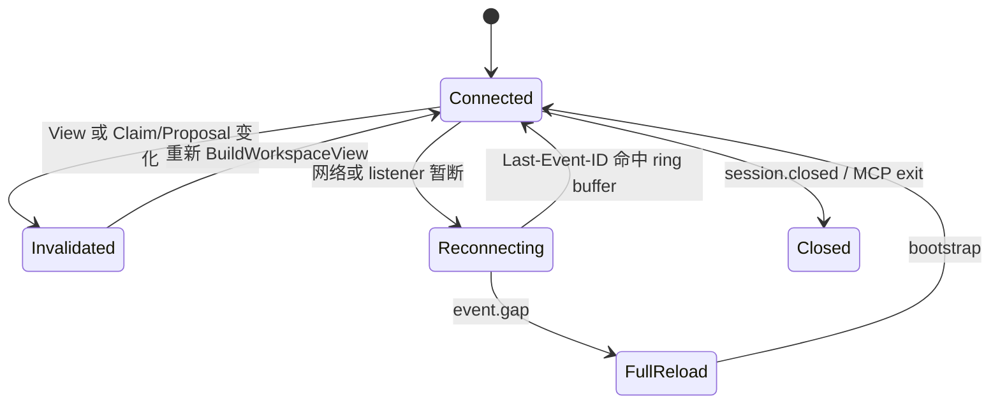

当前事件来源：

- Claim、takeover、Proposal prepare/apply 由命令提交后直接 publish。
- 外部 Workspace 变化由 Presenter 每 5 秒重新构建当前 View 并比较 revision key。
- ring buffer 保留 128 条事件，事件 ID 单调递增。
- 订阅者队列为 16；慢客户端被断开后带 `Last-Event-ID` 重连。
- 游标早于 ring buffer 时发送 `event.gap`，SPA 丢弃旧读模型并重新 load。
- 15 秒 heartbeat 只保活，不推进 revision。
- `view.invalidated` 和 `event.gap` 都从服务端 Session 当前 View 执行完整 Bootstrap；客户端旧 query 不能覆盖 MCP 或其他入口设置的新 View。
- 收到 `session.closed` 后，SPA 标记会话关闭并终止 SSE 重连循环，不再对已关闭 listener 重试。

SSE 只通知快照可能失效，不携带新的权威正文。

同一个 origin 收到新的 `/#handoff=...` 时只会产生 hash 导航。SPA 监听 `hashchange`，重新 exchange、清除 fragment 并按服务端 Session 当前 View Bootstrap，避免同源重开停留在旧 capability 或旧视图。

普通页面刷新从当前标签页的 `history.state` 恢复原 capability、CSRF 和该标签页持有的 Claim token，再按 capability 固定的 View 重新 Bootstrap；其他标签页无法通过共享 Web Storage 取得这些凭据。

## 10. Claim v2 与接管

持久 Claim Schema：

```text
schema_version: contentcloud.run-claim/2.0
run_id
owner_kind: agent | browser
owner_id: opaque stable id
epoch: monotonic uint64
token_hash: sha256
context_revision
claimed_at / expires_at
```

明文 token 在成功 claim/takeover 的结果中返回；同一 Workbench Session 后续 exchange 只向该已认证 Session 恢复它自己持有的 Run token，其他 Session 不可读取。每次新 claim 或 takeover 使用持久化 epoch 计数器递增；旧 token 即使尚未过期，也会因 owner/epoch fencing 失败。

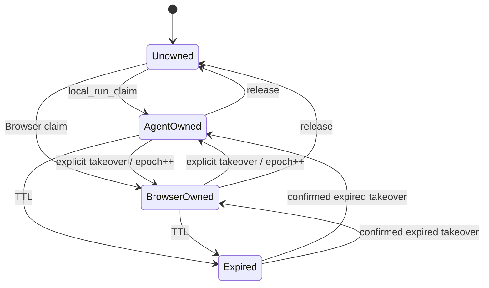

主动接管必须精确匹配：

```text
expected_owner_kind
+ expected_owner_id
+ expected_epoch
+ expected_context_revision
```

任何一项漂移都返回冲突，不尝试“接管最新值”。

## 11. Draft -> Proposal -> Apply

### 11.1 单一事务流

```mermaid
flowchart LR
    Draft[Browser 或 Agent 草稿]
    Validate[路径/MIME/JSON/YAML/大小校验]
    Fence[owner + epoch + revision + digest]
    Proposal[一次性 Proposal]
    Confirm[用户查看准确影响]
    Recheck[CAS 全量重验]
    Atomic[临时文件 + fsync + rename]
    Revision[推进 LocalRun revision]
    Event[SSE invalidation]

    Draft --> Validate --> Fence --> Proposal --> Confirm --> Recheck --> Atomic --> Revision --> Event
```

Browser 与 stdio MCP 都调用同一个 `ProposalStore`：

```mermaid
flowchart TB
    MCPPrepare[workspace_proposal_prepare]
    HTTPPrepare[POST /api/v1/proposals]
    Store[localworkspace.ProposalStore]
    Kernel[PrepareWorkspaceProposal / ApplyWorkspaceProposal]
    MCPApply[workspace_proposal_apply]
    HTTPApply[POST /api/v1/proposals/{id}/apply]

    MCPPrepare --> Store
    HTTPPrepare --> Store
    Store --> Kernel
    MCPApply --> Store
    HTTPApply --> Store
```

### 11.2 当前允许范围

- `typed_action` 只允许 `workspace_file.replace`。
- 只修改 `40-work/` 或 `50-production/` 下已经存在的普通文件。
- 明确排除 `40-work/runs/` 和 `40-work/handoffs/`。
- 内容必须不超过 2 MiB，并且是 UTF-8 text、JSON、YAML 或 YML。
- JSON/YAML 在 Proposal prepare 和 Apply 两次解析。
- 媒体、来源、知识、交付、结果、隐藏文件、新建和删除全部拒绝。

### 11.3 Proposal 绑定

Proposal 固定：Workspace/Project/Run、owner kind/id/epoch、base revision、源文件 digest、目标 digest、字节数、准确 affected path、checks、创建时间和 10 分钟 expiry。

Apply 流程：

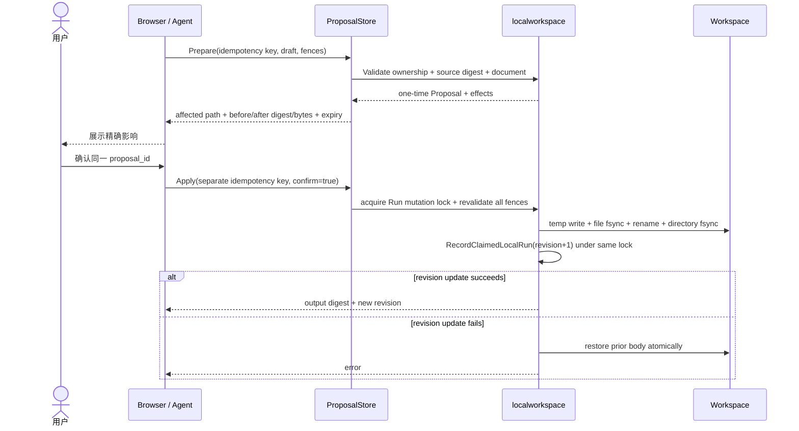

相同幂等 key 和相同参数重放返回原结果；相同 key 不同参数返回冲突。Proposal 只有在 Apply 成功推进文件和 LocalRun revision 后才被消费；失败会保留 Proposal 以便诊断或按新 fence 重试，成功后的后续 Apply 返回 not found。

## 12. Workbench UI

UI 遵守根目录 `DESIGN.md`，是紧凑生产工作面：

```text
+----------------------------------------------------------------------------+
| Content Work OS | Workspace / Project | revision | Local | close           |
+--------------------+-----------------------------------+-------------------+
| Navigator          | Primary View                      | Inspector         |
| - Overview         | - typed document / directory     | - ref / MIME      |
| - Runs/Handoffs    | - image / PDF / audio / video    | - digest          |
| - Production       | - draft editor                   | - generation      |
| - Delivery         | - exact Proposal confirmation    | - owner / epoch   |
| - Results          |                                   | - checks          |
+--------------------+-----------------------------------+-------------------+
| Activity: connecting / synced / stale / error / closed                     |
+----------------------------------------------------------------------------+
```

交互要求：

- 中央区域只执行类型化 View 渲染，不执行 Workspace HTML 或脚本。
- 编辑按钮只在 View 绑定 LocalRun、revision、digest 且路径可写时出现。
- Agent owner 存在时先展示 owner/epoch/revision，再允许明确 takeover。
- Proposal 弹层展示路径、源/目标 digest、字节变化和 owner fence。
- Apply 后重新读取 View，刷新 revision、digest、ownership 和检查状态。
- 桌面 `1440 x 1000`、移动 `390 x 844` 和最低 320px 不产生横向溢出。
- 键盘 focus-visible、ARIA label、dialog 和 `prefers-reduced-motion` 必须保留。

## 13. Presenter 生命周期

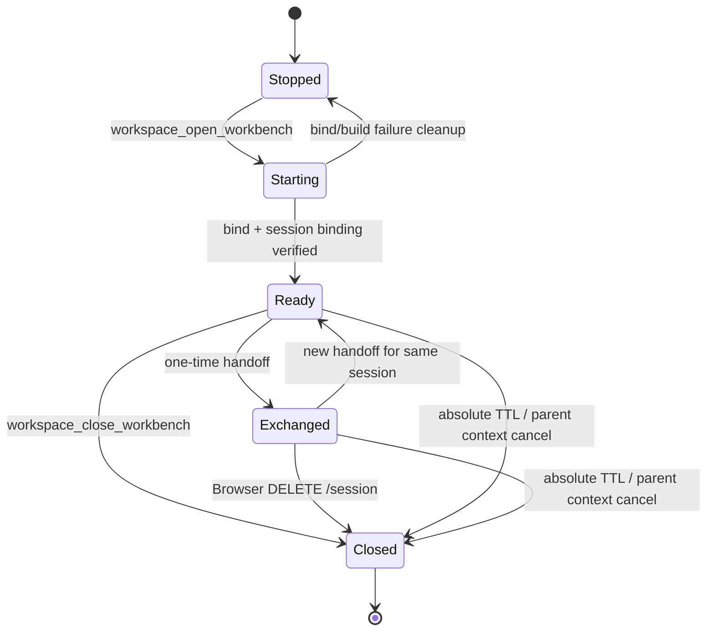

| 项目 | 当前值 |
| --- | --- |
| handoff token TTL | 60 秒，一次性 |
| Browser capability TTL | 30 分钟，不超过 session TTL |
| Presenter absolute TTL | 4 小时 |
| HTTP ReadHeaderTimeout | 5 秒 |
| HTTP IdleTimeout | 30 秒 |
| graceful shutdown | 5 秒 |

MCP 进程退出、`workspace_close_workbench` 或 Browser `DELETE /session` 都会关闭 listener 和所有 capability。关闭后再次 open 必须创建新的 `workbench_id`、origin 和 handoff。

## 14. 安全模型

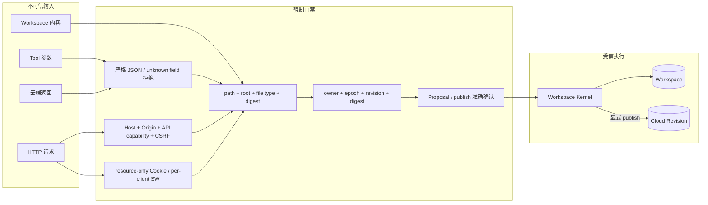

| 威胁 | 当前控制 | 验证 |
| --- | --- | --- |
| DNS rebinding | tcp4 loopback + exact Host | 错 Host 403 |
| CSRF/跨站调用 | exact Origin + Sec-Fetch-Site + capability + CSRF | evil Origin/missing nonce 拒绝 |
| token 泄露 | fragment、一次性、内存 hash、60 秒 TTL、私有 `_meta` | public descriptor/HTML/API 无 token |
| 资源凭据越权 | 独立 HttpOnly 会话 Cookie、Strict SameSite、Resource-only Path 和服务端 capability map | Cookie 无法访问非 Resource API，Bearer/Cookie 缺失返回 401 |
| 路径穿越 | relative + root containment + allowlist + ordinary file | `..`、absolute、symlink 拒绝 |
| stale 写入 | owner + epoch + revision + digest CAS | takeover/digest/expiry 测试 |
| XSS | textContent/JSON stringify + embed UI + CSP | 不执行 Workspace HTML |
| 媒体路径泄露 | opaque resource ID + digest URI | API 不返回路径 |
| 重放 | handoff single-use + idempotency fingerprint + Proposal consume-once | 重放/冲突测试 |
| 孤儿 listener | 父 context、显式 close、绝对 TTL | close/reopen 与 manager close 测试 |

## 15. 错误与恢复

HTTP 错误使用统一 envelope：

```json
{
  "error": {
    "code": "WORKSPACE_PROPOSAL_STALE",
    "message": "Apply 时运行所有权已经变化",
    "hint": "重新读取当前 View，创建新的 Proposal 并再次确认"
  }
}
```

关键恢复规则：

| 错误/状态 | 恢复 |
| --- | --- |
| handoff expired/replayed | 再次调用 `workspace_open_workbench` 生成新 handoff |
| capability expired | 从 MCP 重新打开，不在 Browser 持久化 token |
| session generation 漂移 | Manager 关闭旧 session 并创建新 session |
| `WORKSPACE_VIEW_STALE` | 重新读取 View 与 Resource |
| `RUN_CLAIM_FENCE_CONFLICT` | 读取当前 owner/epoch，未经确认不接管 |
| `WORKSPACE_PROPOSAL_STALE` | 重新读取、重新 prepare、重新确认 |
| `event.gap` | 全量 bootstrap/load |
| Browser 不可用 | 使用 descriptor fallback 与 MCP Resource |
| Cloud publish 未知 | 使用 publish idempotency/status，不在 Browser 重复提交 |

## 16. 本地与云端流程

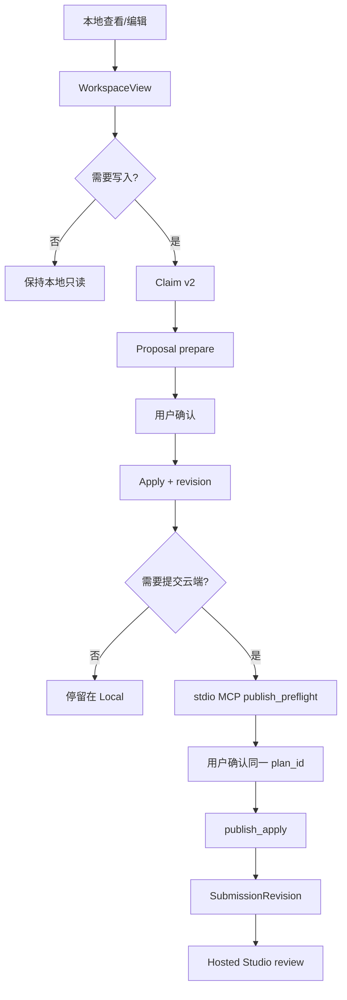

Browser 本地保存不能自动触发 publish。Cloud 提交也不能反向覆盖当前本地草稿；pull 必须是独立、明确操作。

## 17. 分发

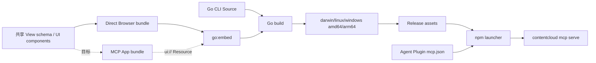

当前 Direct Browser UI 是无远程依赖的嵌入式 HTML/CSS/JS，运行时不需要 Vite、Node server、Electron 或 CDN。目标 MCP App 也必须随同一 Go 二进制嵌入并通过 `ui://` Resource 返回，不能在运行时依赖 CDN 或长期 Node 服务。Agent Plugin 仍只声明固定版本 npm launcher 和 stdio MCP。

发布门禁：

- Go embed 资源存在并通过 JS 语法检查。
- 插件包摘要与 Ed25519 registry 签名匹配最终 Skill 内容。
- 标准包、宿主投影、environment profile 和内嵌包使用同一个 release digest。
- Go 全量测试、Web 114 项测试、插件/环境/架构/治理脚本通过。
- race、目标平台构建和真实 Browser 流程通过。

## 18. 实现索引

| 能力 | 唯一实现 |
| --- | --- |
| View/Resource | `internal/localworkspace/view.go` |
| Claim v2/takeover/Handoff | `internal/localworkspace/runcoordination.go` |
| Proposal/Apply/rollback | `internal/localworkspace/proposal.go` |
| 原子文件替换 | `internal/localworkspace/workspace.go` |
| Presenter/session/security/SSE/Range | `internal/workbench/manager.go` |
| Embedded SPA | `internal/workbench/ui/` |
| stdio MCP Tool/私有 handoff envelope | `internal/cli/workspace_commands.go` |
| Claude Code 稳定项目根注入 | `internal/integration/pluginhost/claude/projection.go`、`internal/cli/workspace_commands.go` |
| MCP Apps Resource/metadata/App lifecycle | 已实现最小协议闭环；正式宿主 Bridge/沙箱 E2E 待验收 |
| MCP 生命周期接线 | `internal/cli/root.go`、`internal/cli/local_commands.go` |
| Canonical workflow | `plugins/contentcloud-video-production/skills/contentcloud-workspace/SKILL.md` |

## 19. 测试覆盖图

```text
workspace_open_workbench
  +-- Workspace binding
  |   +-- Claude project-root injection -------- Claude projection + CLI
  |   +-- explicit directory/session lock ------ CLI integration
  |   `-- MCP roots/list ----------------------- CLI protocol/selection tests; host E2E pending
  +-- presentation negotiation
  |   +-- MCP Apps ui:// + lifecycle ----------- CLI contract tests; host E2E pending
  |   +-- private Direct Browser handoff ------- MCP contract
  |   `-- structuredContent fallback ----------- MCP contract
  +-- start/reuse/close/reopen -------------- workbench integration
  +-- private handoff/public fallback ------- MCP contract
  +-- exchange TTL/replay ------------------- HTTP security
  +-- Host/Origin/capability/CSRF ----------- HTTP security
  +-- embedded SPA/CSP/no secret leak ------- HTTP contract
  +-- View/Resource
  |   +-- text/JSON/YAML/directory ---------- unit + integration
  |   +-- image/PDF/audio/video/Range ------- integration + Browser
  |   +-- stale digest/path/symlink/size ---- security integration
  +-- SSE
  |   +-- direct command events ------------- integration
  |   +-- external change polling ----------- integration
  |   +-- Last-Event-ID/gap/slow client ----- integration + Browser
  +-- ownership
  |   +-- claim/token_hash ------------------ localworkspace
  |   +-- active takeover/epoch fencing ----- concurrency + race
  +-- Proposal/Apply
      +-- path/MIME/schema/TTL/CAS ----------- localworkspace
      +-- Browser end-to-end ---------------- workbench integration
      +-- MCP shared store/idempotency ------- CLI integration
      +-- rollback on revision failure ------- fault path
```

已存在的直接测试：

- `TestWorkbenchHandoffAndHTTPBoundary`
- `TestWorkbenchRangeDigestAndCloseLifecycle`
- `TestWorkbenchServiceWorkerInjectsOnlyResourceCapability`
- `TestWorkbenchUIKeepsTheBootstrappedViewCurrent`
- `TestWorkbenchBrowserClaimProposalApplyEndToEnd`
- `TestWorkbenchCapabilitiesKeepIndependentViews`
- `TestWorkspaceViewParsesJSONAsStructuredData`
- `TestConversationContextReadsPersistedOfflineState`
- `TestRunClaimActiveTakeoverFencesPreviousOwner`
- `TestWorkspaceProposalAppliesWithOwnershipRevisionAndDigestCAS`
- `TestWorkspaceProposalRejectsStaleDigestFenceAndExpiry`
- `TestMCPWorkbenchKeepsBrowserHandoffPrivateAndClosesCleanly`
- `TestMCPWorkspaceProposalUsesSameKernelAndIsIdempotent`

### 19.1 真实 Chromium 验收

使用临时 Workspace、临时 MCP Host 驱动器、随机 loopback 端口和无生产凭据环境完成了真实 Chromium 验收。Node 只作为 `/tmp` 下的测试驱动器，不进入产品运行时或发布包。

| 场景 | 实测结果 |
| --- | --- |
| 私有 handoff | 一次性 token 完成 exchange 后立即从 fragment 清除；MCP `structuredContent` 只有无 token descriptor，正式宿主是否私下消费 `_meta` 仍是独立门禁 |
| 刷新恢复 | handoff 从 fragment 清除后刷新页面，仍从当前标签页 `history.state` 恢复同一 capability、View 和 Claim owner/epoch |
| View 稳定性 | 打开文件、Apply、刷新和 SSE invalidation 后保持 capability 固定的当前文件，不回退到 Workspace 概览 |
| JSON 结构化展示 | `.json` 识别为 `application/json`，MCP 与 Bootstrap 返回 `view.data`，Workbench 使用结构化事实表而非原始文本块 |
| 所有权 | claim、显式 takeover 和旧 owner epoch fencing 均生效 |
| Proposal/Apply | prepare 不修改文件；确认 Apply 后 revision `1 -> 2`，正文和 digest 同步刷新 |
| 外部变化 | Workspace 外部修改在 5 秒受限轮询后通过 SSE 自动刷新 |
| 图片 | WebP 在 Browser 中实际解码为 `1536 x 864` |
| Range | `bytes=0-31` 返回 `206`、`Content-Range: bytes 0-31/85024` 和 32 字节正文 |
| 响应式 | `1440 x 1000`、`390 x 844`、`320 x 844` 均无横向滚动、遮挡或重叠 |
| 安全边界 | 无凭据 Bootstrap/Resource 返回 `401`，错误 Host 返回 `403`，handoff 重放返回 `410`，CSP 与 scoped HttpOnly Resource Cookie 均存在 |
| 模型可见上下文 | `workspace_context` 与 conversation-context Resource 不再序列化本地绝对 Root |
| 关闭与重开 | 关闭后显示“会话已关闭”、释放 Browser Claim、无控制台错误且不再重连；status 返回不存在；重开产生新的 `workbench_id` 和 origin |

这组结果证明 Presenter、SPA、资源认证、Range、SSE、Claim 和 Proposal/Apply 在真实浏览器内闭环可用。它不等于 Codex 右侧内置 Browser 宿主验收；后者还必须证明宿主能私下消费 `_meta`，且不会把 token 暴露给模型。

### 19.2 发布级实现矩阵

| 能力 | 本地代码状态 | 自动验证 | 仍缺少的外部证据 |
| --- | --- | --- | --- |
| Skills + stdio MCP 控制面 | 已实现 | Go MCP/CLI 契约测试、Plugin 治理 | 无 |
| Claude Code 稳定 Workspace 注入 | 已实现 | 私有投影 JSON、真实 Plugin lifecycle、`workspace_context` 无目录测试 | 真实 Claude 模型会话内的 Tool 调用 smoke |
| MCP Roots 绑定 | Server 请求、单/多 root 选择、变更通知已实现 | Roots transport/selection tests | 各宿主 Roots 响应、重启恢复和真实 E2E |
| MCP Apps Tool/Resource/App lifecycle | 已实现最小闭环 | 协商、metadata、Resource MIME、fallback、自包含 HTML | Codex Desktop、Claude Desktop、Cursor、VS Code 的真实 App/Bridge E2E |
| MCP Apps 大媒体 Gateway | 未实现 | 现有 Direct Browser Range 可复用内核 | iframe CSP、ticket、Range、TTL、撤销和无 transcript 泄漏 |
| Go Presenter + 嵌入式 SPA | 已实现 | Workbench 集成测试、真实 Chromium | 正式宿主的启动方式约束 |
| 多 capability 独立 View | 已实现 | `TestWorkbenchCapabilitiesKeepIndependentViews` | 多宿主并行标签压力测试 |
| Claim 刷新恢复与关闭释放 | 已实现 | Browser claim/apply/close 集成测试 | 正式宿主刷新和崩溃恢复 |
| digest Resource 与 Range | 已实现 | stale、Range、媒体解码测试 | 512 MiB 大媒体长时吞吐基线 |
| Markdown/JSON/结构化 View | 已实现基础渲染 | MIME 单测、MCP/HTTP 黑盒、UI/Chromium 视觉检查 | diff、时间线、领域动作等深层 View |
| Proposal 串行化与失败保留 | 已实现 | Proposal Store 幂等/回滚测试 | 跨独立 CLI 进程的故障注入压测 |
| Direct Browser Host Adapter | 未实现于本仓库 | 仅验证 `_meta` 生成和私有字段边界 | 各宿主消费、导航、页面断言、token 不入模型上下文 |

因此当前发布结论必须写成：**本地控制面、Direct Browser 基础闭环、MCP Apps 最小协议闭环和 MCP Roots Server 请求/绑定闭环已实现，Claude Code 项目根注入已实现；各宿主 Roots 响应、正式宿主 App/Bridge UI 接入和逐宿主 E2E 仍未完成，不能把整体标记为“全部完成”。**

## 20. 完成定义

本次本地 Workbench 重构只有在以下条件全部满足后完成：

1. 标准 Plugin 仍为 Skills + stdio MCP，不引入运行时 Node server。
2. MCP Apps、Direct Browser、Headless 三条通道共用同一 Workspace Kernel、Claim、ProposalStore、revision 和 digest。
3. MCP Apps 使用标准 `ui://`/Bridge；Direct Browser 只由同一 MCP 进程内的 `127.0.0.1:0` Presenter 提供。
4. App ticket、private handoff 和 Browser capability 不进入模型可见内容，fallback View 始终可用。
5. 旧 renderer、presentation Resource/cache 和兼容入口在运行时与 Skill 中全部删除。
6. Proposal prepare 不写正式文件；Apply 只消费明确确认的同一 Proposal。
7. 本地保存与云端 publish/approve 在契约和 UI 中完全分离。
8. Workspace 按 Roots、受控宿主注入、显式 directory 的顺序绑定，并锁定单一 canonical root。
9. Host、Origin、capability、CSRF、CSP、path、digest、Range、ticket 和重放测试通过。
10. close/reopen、MCP 退出、handoff replay、resource stale 和 ownership conflict 可恢复。
11. Direct Browser 与 MCP App 分别通过桌面、移动、键盘、控制台和真实媒体解码验收。
12. Plugin digest/signature、全量 Go/Web/治理测试、race 和跨平台构建通过。
13. 每个正式宿主分别具备代码 Adapter、安装投影、Workspace 绑定、生命周期 smoke、真实 UI E2E 和秘密不入 transcript 证据。

## 21. 分层验收手册

### 21.1 自动门禁

```bash
go test ./internal/localworkspace ./internal/workbench ./internal/cli -count=1
go test ./... -count=1
go test -race ./internal/localworkspace ./internal/workbench ./internal/cli ./internal/runtime -count=1
go vet ./...
node --check internal/workbench/ui/app.js
node --check internal/workbench/ui/sw.js
pnpm --dir web test
pnpm --dir web typecheck
pnpm --dir web build
pnpm architecture
pnpm check:plugin
pnpm governance:content
pnpm governance:v3
pnpm test:plugin-signing
```

CLI 目标平台编译门禁：

```bash
CGO_ENABLED=0 GOOS=darwin GOARCH=amd64 go build -trimpath -o /tmp/contentcloud-darwin-amd64 ./cmd/contentcloud
CGO_ENABLED=0 GOOS=darwin GOARCH=arm64 go build -trimpath -o /tmp/contentcloud-darwin-arm64 ./cmd/contentcloud
CGO_ENABLED=0 GOOS=linux GOARCH=amd64 go build -trimpath -o /tmp/contentcloud-linux-amd64 ./cmd/contentcloud
CGO_ENABLED=0 GOOS=linux GOARCH=arm64 go build -trimpath -o /tmp/contentcloud-linux-arm64 ./cmd/contentcloud
CGO_ENABLED=0 GOOS=windows GOARCH=amd64 go build -trimpath -o /tmp/contentcloud-windows-amd64.exe ./cmd/contentcloud
```

### 21.2 MCP 与 Presenter 黑盒

在临时 Workspace 中启动 `contentcloud mcp serve`，按顺序验收：

1. `initialize` 返回 MCP `2025-06-18`、Tool 和 Resource capability。
2. `workspace_context` 是离线只读结果，不包含 token、URL 或绝对 Root。
3. `workspace_view` 对 Markdown 返回 `text`，对 JSON/YAML 返回 `data`，对媒体返回 digest-bound Resource。
4. `workspace_open_workbench` 的模型可见结果只有 descriptor/fallback；tokenized URL 只存在于私有 `_meta`。
5. 立即 exchange 返回 `200`；同一 handoff 重放返回 `410`；超过 60 秒也返回 `410`。
6. 无 Bearer 的 Bootstrap/Resource 返回 `401`，错误 Host 或 Origin 返回 `403`，mutation 缺 CSRF 或确认被拒绝。
7. Range `bytes=0-31` 返回 `206`、32 字节正文和正确 `Content-Range`；同尺寸文件替换后旧 Resource 返回 `409 WORKSPACE_VIEW_STALE`。
8. `resources/read` 能读取小型 digest Resource；超过 MCP 内联上限时明确引导到 Workbench。

### 21.3 真实 Browser 操作

使用隔离临时 Workspace、随机端口和无生产凭据环境：

1. 打开 handoff，确认 fragment 被清除，URL、Cookie、`localStorage`、`sessionStorage` 中没有通用 API capability 或 Claim token。
2. 导航目录、Markdown、结构化 JSON、图片、PDF、音频和视频；视频必须实际解码，不能只断言元素存在。
3. 在 `1440 x 1000`、`390 x 844` 和 `320 x 844` 检查无横向滚动、文字裁切、遮挡和控制台错误。
4. 刷新页面，确认仍是同一 View；已 claim 时 owner/epoch 不变，编辑与 Apply 仍可继续。
5. 执行 Claim、Proposal prepare、取消、再次确认 Apply；核对文件 digest 和 LocalRun revision 只在 Apply 成功后变化。
6. 模拟外部文件变化，确认 SSE invalidation 后重读；用同尺寸替换验证 stale digest 不能绕过。
7. 关闭 Session，确认 Claim 释放、凭据从 `history.state` 清除、SSE 不重连，旧 capability 不再可用。

### 21.4 MCP Apps 宿主门禁

对 Codex Desktop、Claude Desktop、Cursor 和 VS Code GitHub Copilot 分别执行，不能用一个宿主结果替代另一个：

1. 初始化明确协商 `io.modelcontextprotocol/ui`，Tool 关联 `ui://` Resource，MIME 为 `text/html;profile=mcp-app`。
2. 不支持扩展时 Tool 仍返回相同业务 `structuredContent`，不得失败或丢失 Headless 流程。
3. App 在宿主沙箱中接收初始 Tool Result，并通过 Bridge 调用 View、Claim、Proposal、Apply；模型不可见 app-only Tool。
4. 验证 iframe CSP、外部连接限制、页面销毁、重新打开、宿主重启和 Server 退出。
5. 小资源经 `resources/read`；大媒体经短期 ticket/Range，并验证 stale digest、TTL、撤销和 ticket 不进入 transcript。
6. 抓取宿主 transcript，确认无本机路径、handoff、ticket、capability、CSRF、Cookie 或 Claim token。

### 21.5 Direct Browser 宿主门禁

该门禁不能由仓库测试替代，必须在声明支持 private handoff 的正式宿主逐一完成：

1. 从已安装 Plugin 的中文 Workspace Skill 发起“打开本地工作台”。
2. 抓取宿主可见的 Tool transcript，确认其中没有 `_meta` token、capability、CSRF、Cookie 或本地绝对路径。
3. 确认 Browser/WebView 由宿主私下导航，而不是模型复制 URL 或启动独立 Node 服务。
4. 在右侧 Browser 重复 21.3 的刷新、Claim、编辑、确认、Apply 和关闭流程。
5. 关闭宿主会话，确认 stdio MCP 子进程和 loopback listener 一起退出。

### 21.6 多宿主准入门禁

每个宿主必须独立保存一份版本化证据：版本、安装/升级/删除、Skill 发现、MCP 自动启停、Workspace 绑定、会话恢复、可用呈现通道、无 UI 降级、安全 transcript 和真实截图。缺任一项只能标记为候选或计划，不能进入客户连接选择器。

当前 21.1 至 21.3 的仓库可控部分、Claude Code 注入单测以及 Codex/Claude 隔离 Plugin lifecycle smoke 已通过；21.4 至 21.6 的 UI 与模型会话部分仍需实现或正式宿主验收。不得为验收修改开发者现有 `CODEX_HOME`、`CLAUDE_CONFIG_DIR`、Plugin Store 或生产账号。

## 22. 参考规范

- Agent Plugins 官方文档：<https://agent-plugins.org/docs.md>
- Agent Plugins 1.0.0 规范：<https://agent-plugins.org/specification>
- Agent Plugins 中文社区译文：<https://agent-plugin.org/zh>
- MCP Transport：<https://modelcontextprotocol.io/specification/2025-06-18/basic/transports>
- MCP Roots：<https://modelcontextprotocol.io/specification/2025-11-25/client/roots>
- MCP Apps 概览：<https://modelcontextprotocol.io/extensions/apps/overview>
- MCP Apps 客户端矩阵：<https://modelcontextprotocol.io/extensions/client-matrix>
- MCP Apps 构建规范：<https://modelcontextprotocol.io/extensions/apps/build>
- OpenAI Plugin 概念：<https://developers.openai.com/plugins/concepts/plugins>
- OpenAI Plugin 构建：<https://developers.openai.com/plugins/build/plugins>
- OpenAI ChatGPT UI：<https://developers.openai.com/plugins/build/chatgpt-ui>
- Claude Code Plugins：<https://code.claude.com/docs/en/plugins>
- Claude Code MCP：<https://code.claude.com/docs/en/mcp>
- Claude Code Chrome：<https://code.claude.com/docs/en/chrome>
- 本仓库 Agent Plugin 架构：[docs/plugin/README.md](../../plugin/README.md)
