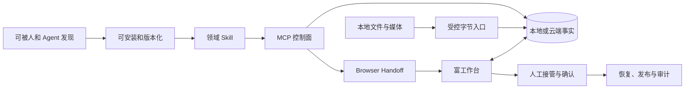
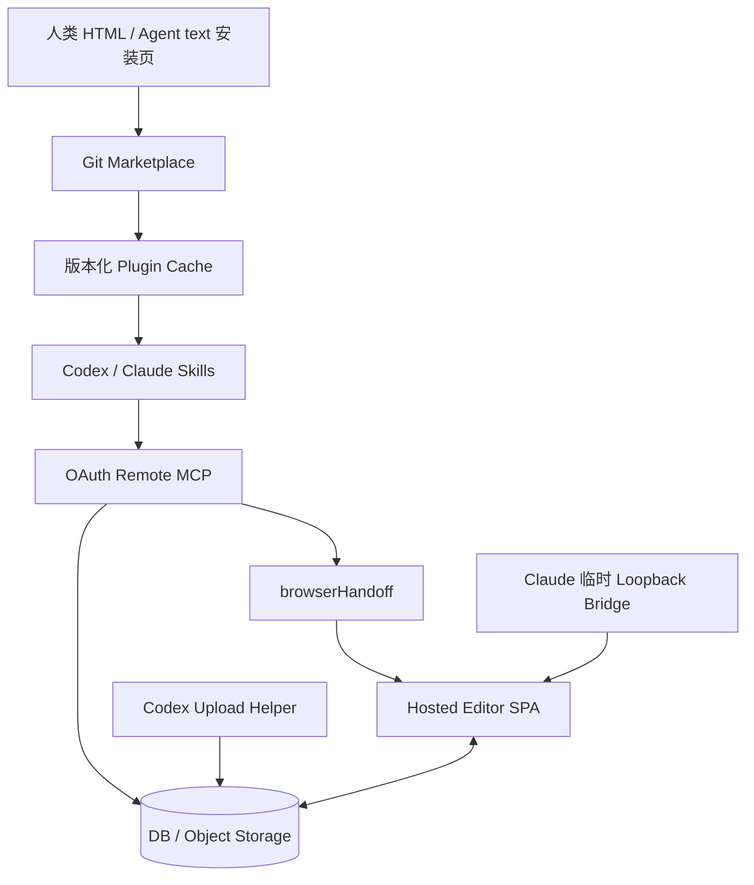
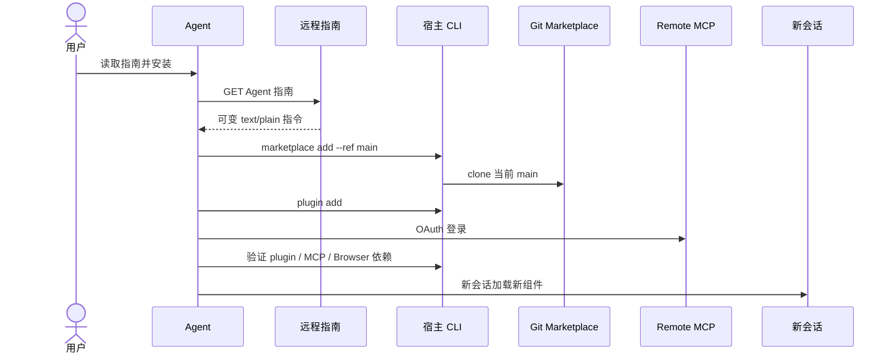
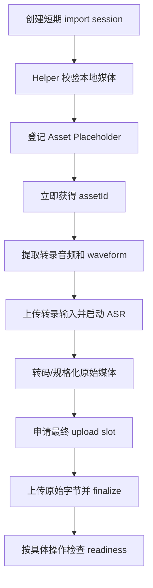
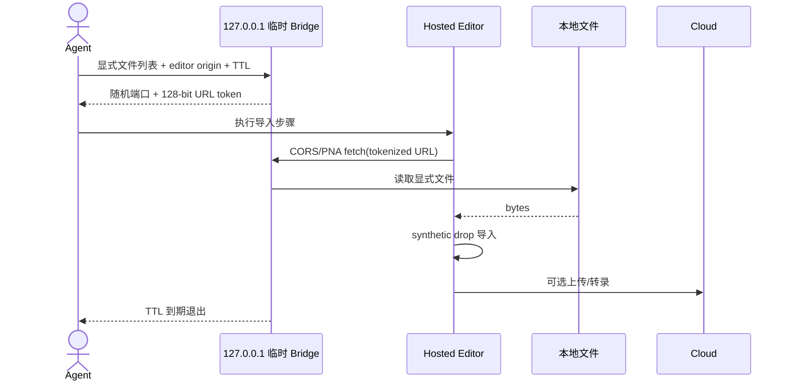
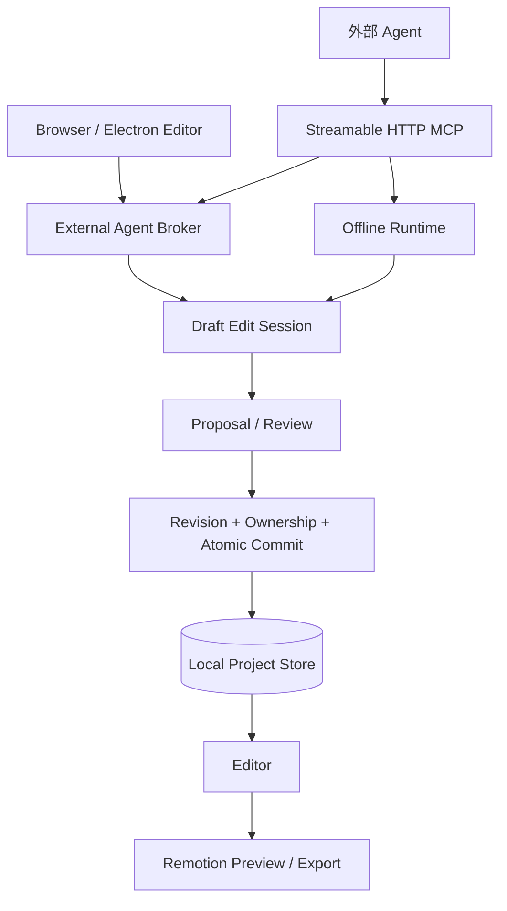
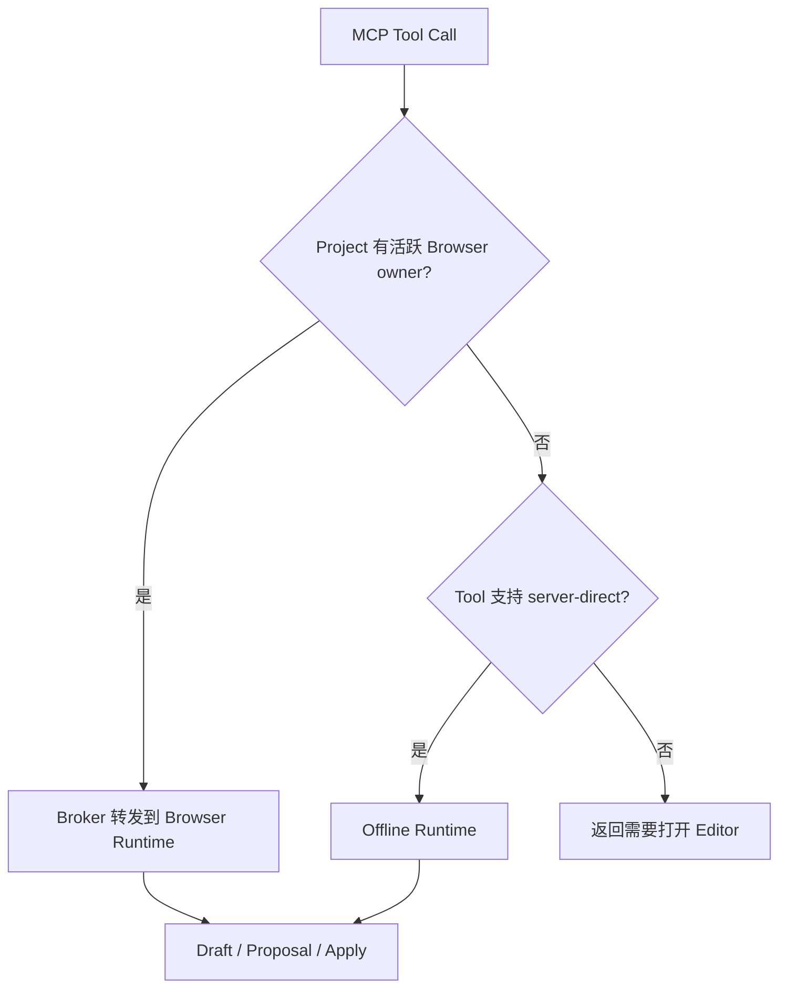
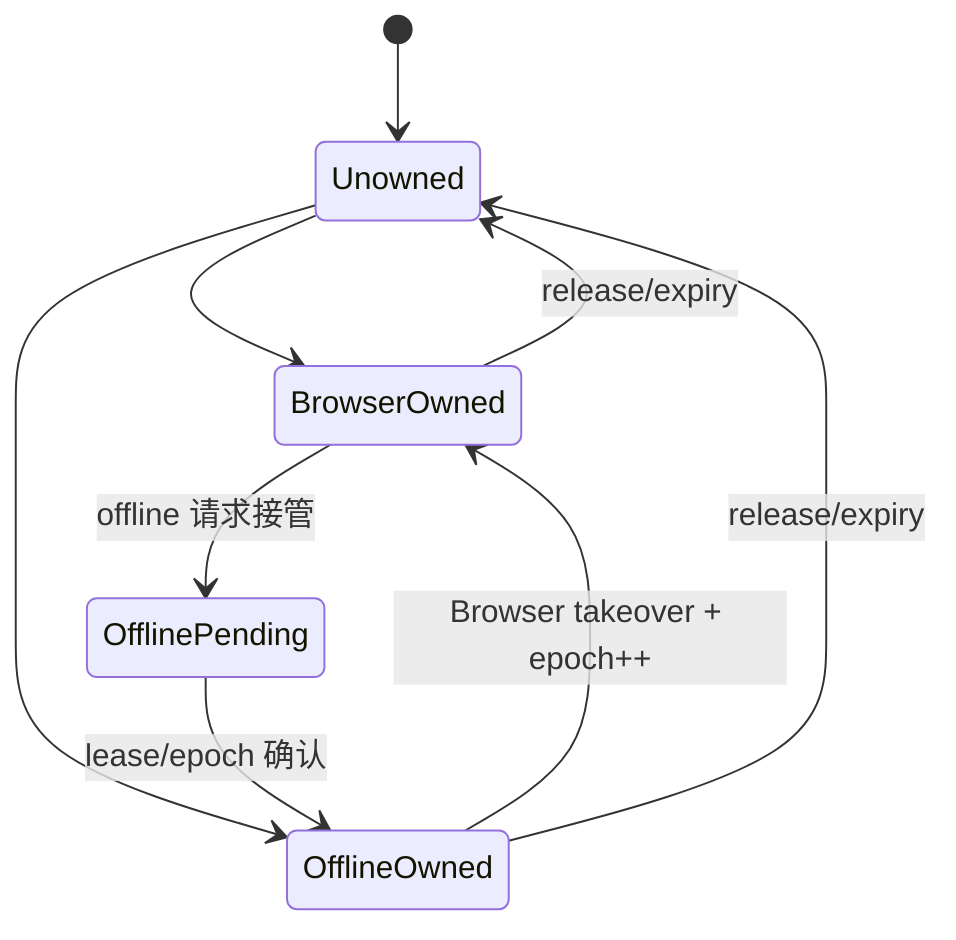
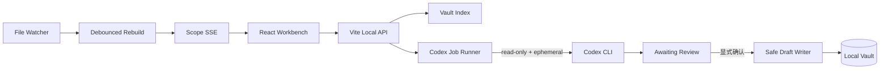
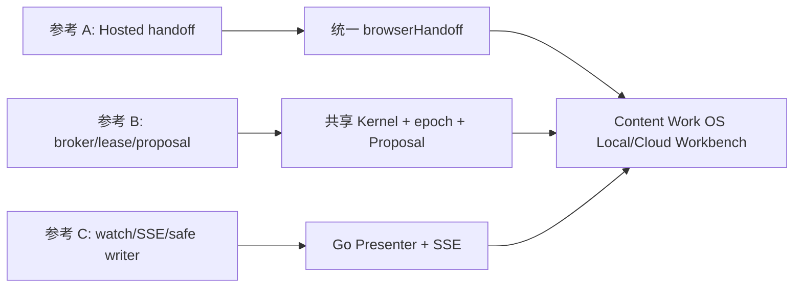

# 参考工作台实现全维度分析

状态：`架构证据附录；Content Work OS 当前实现状态以 05 技术方案和代码为准`。

更新时间：2026-08-14。

当前方案见[Content Work OS 本地工作台技术方案](./05-local-workbench-browser.md)。本文匿名记录公开参考实现的可复核机制、风险和取舍，不复制第三方代码、Schema、提示词或产品素材。

## 1. 调研对象与证据

### 1.1 固定版本

| 代号 | 产品形态 | 固定版本 | 证据方式 |
| --- | --- | --- | --- |
| 参考 A | 云端专业视频编辑器的 Agent Plugin | `cadff48fb7d25fbd79d430186b0a0b8f2de3afa0`，插件 `0.2.23` | 公开安装页响应、隔离 clone、模拟安装、manifest/Skill/脚本/二进制检查 |
| 参考 B | 本地 Electron 专业视频编辑器 | `637665f3f5524a36f054b7c7846803c867369b6d` | 源码、Embedded Server、MCP、Broker、Ownership、Proposal 和测试检查 |
| 参考 C | 本地个人知识工作台 | `017fd146934c0995da1602f65ea16d43b75bb08f` | Vite Workbench、Vault API、SSE、Codex Runner、安全边界和测试检查 |
| Content Work OS | 本地 Workspace + 云端治理系统 | 当前工作树，2026-08-14 | Go Workspace/MCP、Plugin、发布和文档检查 |

第三方名称不进入目标技术方案。提交哈希仅用于复核本次结论，不能作为 Content Work OS 运行时依赖或供应链来源。

### 1.2 证据等级

- **已实测**：在隔离临时目录中实际执行，或由公开 HTTP 响应确认。
- **源码确认**：由固定提交中的 manifest、Skill、Server、UI 或测试直接证明。
- **推断**：由公开契约推导，需要真实账号、生产服务或宿主 UI 才能最终验证。

### 1.3 验证边界

本次没有：

- 登录第三方账号或执行 OAuth。
- 调用第三方生产 MCP/API。
- 上传本地客户文件。
- 修改真实 Codex/Claude 配置。
- 验证生产编辑器延迟、计费、云端导出或账号权限。

因此，公开包和本地源码可以证明架构形态，不能证明其生产服务的可用性、安全运营或商业承诺。

### 1.4 文件级证据索引

| 代号 | 机制 | 固定提交内的主要证据 |
| --- | --- | --- |
| 参考 A | Codex Remote MCP | `codex/.mcp.json` |
| 参考 A | Hosted Editor 与 handoff 规则 | `codex/skills/*-plugin-basics/SKILL.md`、Claude 对应基础 Skill |
| 参考 A | Codex 短期上传 | `codex/skills/asset-import/scripts/upload-media.mjs` |
| 参考 A | Claude loopback 文件桥 | `claude/skills/asset-import/scripts/serve-local-media.mjs` |
| 参考 A | 安装和 Marketplace | 公开安装页响应、`.claude-plugin/marketplace.json`、宿主安装指南 |
| 参考 B | Embedded HTTP 生命周期 | `desktop/embedded-server.ts`、`desktop/embedded-server.verify.ts` |
| 参考 B | Streamable HTTP MCP | `server/external-agent/mcp.ts`、`mcp-session-verifier.ts`、`mcp.verify.ts` |
| 参考 B | Browser/Offline broker | `server/external-agent/broker.ts`、`broker.verify.ts`、`offline-runtime.ts` |
| 参考 B | ownership/epoch | `server/external-agent/project-edit-ownership.ts`、对应 codec/verify 文件 |
| 参考 B | Proposal/Apply | `src/agent/proposal.verify.ts`、`src/persist/proposalStore.ts`、`proposalStore.verify.ts` |
| 参考 B | Store 与恢复 | `server/external-agent/offline-project-store.ts`、`offline-run-recovery.ts`、相关 verify 文件 |
| 参考 B | 渐进 Tool surface | `server/external-agent/mcp-tool-exposure.ts`、`mcp-tool-exposure.verify.ts` |
| 参考 C | 本地 API 与 Host 限制 | `Workbench/server/vite-plugin-workbench.mjs`、`security.mjs` |
| 参考 C | Vault 索引、watch、SSE | `Workbench/server/vault-index.mjs`、`vault-sync.mjs` |
| 参考 C | read-only Codex Job | `Workbench/server/codex-runner.mjs` |
| 参考 C | 显式确认写入 | Workbench route、writer 与 `tests/*.test.mjs` |

隔离验证还包括：固定 HEAD、统计 Skill/测试文件、检查安装缓存大小、解析 JSON manifest、对 helper 执行 `node --check` 和 `--help` smoke、核对压缩二进制 SHA-256，以及比较安装页在浏览器导航与普通 Agent 请求下的响应头和正文类型。

## 2. 不能只比较 Node、MCP 或 Browser

值得借鉴的是完整闭环，而不是某个运行时：



完整系统至少包含十个问题：

1. 用户和 Agent 如何发现、理解并安装能力。
2. 插件包如何固定版本、摘要、依赖和许可。
3. 领域 Skill 如何跨宿主复用。
4. MCP 如何鉴权、绑定项目和暴露工具。
5. 富 UI 在本地还是云端运行。
6. Browser 如何获得安全、可恢复的 handoff。
7. 本地大文件如何进入 UI 或云端。
8. Browser 与 Agent 如何避免双写。
9. Draft、Proposal、Apply、发布如何分层。
10. 测试如何覆盖跨进程、跨宿主和故障恢复。

只研究“是否启动 Node Server”，会漏掉后九项。

## 3. 参考 A：云端插件与 Hosted Editor

### 3.1 全链路



关键事实：

- Codex 插件包中没有本地编辑器 SPA、HTML Widget 或 UI Server。
- MCP 是 OAuth 远程控制面，项目和编辑状态在云端。
- MCP Tool 返回项目事实与 `browserHandoff.url`。
- 宿主 Browser 打开完整 Hosted SPA，形成“右侧编辑器”体验。
- Codex 与 Claude 使用不同宿主适配 Skill，但领域工作流基本一致。

结论：右侧富编辑器不等于 MCP App，也不等于 Tool Result 中的静态 HTML。它是 `Remote MCP -> handoff -> Hosted SPA` 的独立呈现链路。

### 3.2 同一安装页的双内容面

公开安装入口会按请求上下文返回不同内容：

| 请求类型 | 响应 | 目的 |
| --- | --- | --- |
| 浏览器文档导航 | Astro HTML 营销与安装页 | 面向用户解释产品、视频和步骤 |
| 普通 Agent/curl | `text/plain` 指南 | 面向 Agent 的安装与排障指令 |

两个响应都使用 `Cache-Control: no-store` 和 `Vary: User-Agent, Sec-Fetch-Mode, Sec-Fetch-Dest`；Agent 文本响应还声明 `X-Robots-Tag: noindex, nofollow`。

这个模式降低安装摩擦，但远程指南是可变、不可信输入。Agent 可以读取它，不能让它：

- 扩大用户授权。
- 覆盖仓库 `AGENTS.md` 或系统策略。
- 绕过危险操作确认。
- 读取无关本机文件或凭据。
- 把远程 `main` 当作不可变发布身份。

### 3.3 安装生命周期



供应链检查结果：

- 安装示例固定 `main`，不是 commit SHA 或签名 tag。
- 调研时无可见 Git tag，manifest 版本为 `0.2.23`。
- 插件 manifest 声明 `GPL-3.0-only`。
- Codex 和 Claude 各有 15 个 Skills。
- 安装缓存约 114MiB，主要是 macOS arm64 和 Windows x64 的 FFmpeg/FFprobe 压缩二进制。
- 公开插件仓库没有测试或 verify 文件。
- 两个 `.mjs` helper 通过语法与 `--help` smoke；已检查的压缩二进制摘要匹配脚本固定摘要。

Content Work OS 的对应要求是固定 `(plugin_id, version, package_digest)`、签名和评测，不能让 Git ref 取代包身份。

### 3.4 Browser Handoff

Tool 结果区分：

- 项目、素材、转录或时间线的业务事实。
- Agent 可读的结构化摘要。
- 用户可见、不含宿主临时 token 的干净 URL。
- 宿主 Browser 使用、可能包含短期 boot token 的 handoff URL。

公开 Skill 还要求保留特定布局和 boot 参数，并明确内部 Widget 不能直接渲染到 Codex host。这证明 handoff 是一等契约，而不是在自然语言中随手返回链接。

### 3.5 跨宿主适配

| 维度 | Codex 路径 | Claude 路径 |
| --- | --- | --- |
| 领域工作流 | Codex 基础 Skill | Claude 基础 Skill |
| Browser | 内置 Browser adapter | embedded preview adapter |
| 登录 | MCP OAuth | login helper / MCP OAuth |
| 本地文件 | 短期 token + upload helper | loopback bridge + 页面导入 |
| Browser 不可用 | 干净链接或 upload helper | 干净链接或 upload helper |
| 内部 Widget | 转普通对话/表单 | 转普通对话/表单 |

正确方向是 `Canonical Domain Skill + Host Adapter`。公开包通过两棵大部分重复的 Skill 目录维护，未提供生成器或 drift test；Content Work OS 应只有一个 canonical source，由投影器和一致性测试产生宿主适配层。

### 3.6 Codex 本地媒体上传



可借鉴机制：

1. **Placeholder-first**：先获得稳定 asset ID，元数据和工程编排不等待大字节。
2. **Transcription-first**：先让语音编辑可用，再完成原始媒体上传。
3. **Readiness 分离**：转录、上传、远程解码和导出分别判断。

安全缺口：helper 信任 MCP 返回的 endpoint 和 presigned URL，缺少固定域名 allowlist、token audience 和跳转约束。若上游被攻破，本地字节可能被发送到非预期域名。

### 3.7 Claude 临时本地媒体桥



已有控制：

- 只绑定 `127.0.0.1`。
- 128-bit 随机 URL token。
- 只暴露显式普通文件。
- 校验 Origin 并处理 PNA preflight。
- 默认 900 秒 TTL 和 `no-store`。

风险：

- 整个大视频通过 `blob()` 进入 Browser 内存。
- DOM selector 与 synthetic drop 依赖具体 UI 结构。
- token 在 TTL 内可重复使用。
- `origin` 接受任意合法 URL，缺少产品域名 allowlist。
- 不支持 Range。
- PNA、mixed content 和宿主 Browser 策略变化可能破坏流程。

Content Work OS 只借鉴短期、显式文件、token、TTL 和 loopback 边界，不复制 DOM 注入。正式方案必须是稳定 same-origin API + Range。

## 4. 参考 B：本地专业编辑器与 Offline Broker

### 4.1 产品架构

参考 B 是完整本地产品，不是轻量 Agent Plugin：React 19 + Vite 8 + Electron 43 提供编辑器，Remotion Player/Renderer 提供预览和导出，Embedded HTTP Server 同时服务应用和 Streamable HTTP MCP。



localhost 在这里合理，因为 HTTP Server 属于持续运行的本地编辑器产品本体。它不能推导出每个 Agent Plugin 都应自带长期 Server。

### 4.2 Embedded Server

- 只绑定 `127.0.0.1`。
- 优先端口 `5199`，冲突时回退随机端口并记录实际 origin。
- MCP 使用 SDK `StreamableHTTPServerTransport`。
- 单请求 body 上限 2MiB。
- MCP session 空闲上限一小时、最多 64 个。
- 清理断开的 pending editor calls 和 session 状态。
- Electron/Browser 页面、项目存储和 MCP 都共享应用生命周期。

### 4.3 Browser/Offline Broker

每个 MCP transport 固定绑定一个 project，不能隐式切换：



Offline 模式不是完整 Browser 替代：

- 只支持自动批准；人工审核需要打开 Editor。
- generation、upload、network、render、export 和视觉画布检查仍要求 Browser。
- MCP session 固定 binding；binding stale 后需要新 session。

这比“Browser 有就走 Browser，没有就随便写文件”严谨。每个 Tool 都声明可执行平面，Server 再强制校验。

### 4.4 Ownership Lease

参考 B 使用 90 秒项目写租约，owner 区分 `browser` 和 `offline`，并以 `ownerId + epoch + lease` 围栏写入。



Offline commit 会同时校验：

- 预期 project revision。
- project index 和 versions metadata token。
- 当前 ownership claim。
- Browser 是否在提交中途接管。
- draft generation 是否仍为当前版本。

旧 owner 即使继续运行，也会被新 epoch 围栏阻止。Content Work OS 已采用 Claim v2 的 `owner_kind + owner_id + epoch + token_hash + revision` 完成这一升级。

### 4.5 Draft、Proposal、Apply 与恢复

```text
Agent intent
  -> Draft edit session
  -> typed operations
  -> Proposal persisted for review
  -> owner/revision/generation recheck
  -> atomic commit
  -> version/index/document update
  -> recovery or rollback on partial failure
```

Browser live apply 和 offline commit 都有失败恢复。多项持久化中途失败时，会恢复已写条目或旧 project。这说明 Proposal 不是“把 diff 给用户看一下”，而是带所有权、版本、重放防护和故障恢复的事务边界。

### 4.6 渐进工具暴露

该实现支持 `progressive` 和 `full` Tool surface。渐进模式首批只暴露 Tool Search、Skill Load、核心读取和 edit-session 工具；命中后扩展工具并发送 `tools/list_changed`。

优点是大型工具集降低上下文成本；限制是宿主必须可靠支持动态列表。授权仍由 Server 强制，不能靠隐藏 Tool。Content Work OS 首版保留 Skill 路由和静态列表，跨宿主验证后再评估动态暴露。

### 4.7 测试密度

固定提交有 456 个 `*.verify.*` 或测试文件，覆盖：

- 外部 MCP 与 session binding。
- Browser broker 和 offline runtime。
- ownership、epoch、takeover。
- Draft、Proposal、review、Apply。
- 项目 store、迁移、版本和恢复。
- 媒体持久化、上传恢复和重链。
- 时间线、字幕、音频、预览和导出。
- Electron 生命周期、Embedded Server 和生产契约。

数量不自动代表质量，但跨进程编辑协议没有资格只做 happy-path smoke。

## 5. 参考 C：本地知识工作台

### 5.1 产品架构



它的价值不是 Vite，而是本地内容产品的完整边界：索引、watch、SSE、只读 Agent job、待审核候选和唯一写入 primitive。

### 5.2 安全与写入

- Vite 只绑定 `127.0.0.1` 并限制 Host。
- mutation 校验 `Sec-Fetch-Site`、Origin/Host 和 JSON Content-Type。
- Vault path 同时做 lexical、realpath、allowlist 和 symlink 校验。
- Codex 使用 `exec --json --sandbox read-only --ephemeral`。
- Agent 输出先进入 `awaiting_review`。
- 用户 confirm 后才调用唯一 writer。
- writer 使用 `flag: "wx"`，避免覆盖同名文件。

局限：没有 MCP、跨宿主 adapter、统一 owner lease、epoch 或云端发布协议。它适合参考本地内容工作台，不足以直接成为 Content Work OS 的 Agent Plugin 架构。

### 5.3 实时更新

Vite watcher 经 debounce 重建 Vault index，再通过 SSE 只刷新受影响页面 scope。这个模式避免每次文件变化都刷新整个 UI，但仍需要周期 reconciliation，因为文件 watcher 可能合并、丢失或乱序事件。

固定提交有 23 个 Node test 文件，覆盖安全、Vault、路由、job、同步和 UI 数据模型。根目录许可与 Workbench README 提示存在不一致，本调研不作法律判断，也不复制实现。

## 6. 四方全维度对比

| 维度 | 参考 A | 参考 B | 参考 C | Content Work OS 当前实现 |
| --- | --- | --- | --- | --- |
| 产品本体 | 云端专业视频编辑器 | 本地专业视频编辑器 | 本地知识工作台 | 本地 Workspace + 云端治理 |
| Plugin 角色 | 安装、Skill、Remote MCP | 外部 Skill + 本地 MCP | 无 Plugin | 标准 Agent Plugin |
| 控制 transport | OAuth Remote HTTP | Loopback Streamable HTTP | Vite REST | Local stdio MCP |
| 富 UI | Hosted SPA | Electron/Vite SPA | Vite/React SPA | Embedded Local SPA + Hosted Studio |
| 右侧打开 | browser handoff | editor URL | 手工打开 | 统一 local/cloud handoff |
| 本地 UI Server | 无 | 产品本体 Embedded Server | Vite dev/product Server | MCP 进程内 Go Presenter |
| Server 生命周期 | 云端持续 | Editor 持续 | Workbench 持续 | 会话级、TTL、父进程绑定 |
| Node 运行时 | helper 脚本 | 产品主运行时 | 产品主运行时 | 仅构建与 npm launcher，不做 Server |
| 项目绑定 | OAuth + project ID | transport 固定 project | 单 Vault root | workspace/project/generation |
| 本地文件入口 | upload helper / 临时 bridge | project store / blob / relink | Vault API | opaque Resource + Range |
| 大媒体 | 上传到云端或 Browser 导入 | 本地媒体管线 | 非核心 | digest + single Range + bounded memory |
| 实时更新 | 云端同步 | broker + project store | watcher + SSE | 命令事件 + 5 秒 View 轮询 + SSE |
| Browser/Agent broker | Host adapter | 显式 broker | 无 | Host adapter + shared Kernel |
| Offline | 有限本地 helper | server-direct runtime | 完全本地 | Workspace 读写可离线 |
| 状态权威 | DB/Object Storage | local project store | Vault | Workspace / Cloud Revision 分治 |
| 写所有权 | 公开包未披露 | browser/offline lease + epoch | job 级确认 | agent/browser lease + epoch |
| 草稿 | 云端工具状态 | Draft session | Agent candidate | Browser 文本草稿 |
| 确认 | Skill/Editor 操作 | Proposal/Review | awaiting_review/confirm | Proposal/Apply |
| 原子提交 | 公开包未披露 | 多 store commit + recovery | exclusive create | Kernel CAS + fsync/rename + revision 失败回滚 |
| stale | Skill 要求刷新 | revision/generation/metadata/owner | content hash | generation/revision/digest/epoch |
| 发布 | 云端即核心 | 可选云端 | 无 | 独立 preflight/apply |
| 审核 | Hosted Editor | Editor review | 本地 confirm | 本地确认 + 云端审核分离 |
| Host Adapter | Codex/Claude 两套投影 | Browser/offline 两平面 | 无 | 私有 handoff 契约已接线；真实宿主待验收 |
| Tool 渐进披露 | Skill 路由 | Search + list changed | 无 | 首版 Skill 路由，后续验证动态列表 |
| UI 与模型共享 | 云端内部 | 本地产品内部 | 本地产品内部 | Local 共享 View/Proposal Kernel；Cloud 保持独立事实源 |
| token | OAuth/import/URL token | session/editor auth | same-origin guard | one-time fragment + memory capability |
| Origin/Host | bridge 有 Origin | loopback/address policy | Host/Origin/Sec-Fetch | exact Host + same-origin + no CORS |
| Range | bridge 不支持 | 本地媒体管线支持多类读取 | 非核心 | 明确单 Range 契约 |
| 恢复 | upload/relink/progress | checkpoint/lease/rollback | job/SSE | Handoff/revision/event gap/reopen |
| 测试规模 | 公开插件无测试 | 456 个 verify/test | 23 个 Node tests | Go unit/integration 与 Chromium E2E 已通过；宿主 E2E 仍为发布门禁 |
| 供应链 | 可变 main、大缓存 | 本地产品发布链 | 源码运行 | 签名 digest + 跨平台 Go binary |
| 许可风险 | GPL-3.0-only | AGPL-3.0 | MIT/README 提示不一致 | Apache-2.0，思想借鉴不复制代码 |

## 7. 可直接采用的思想

1. **控制面与呈现面分离**：MCP 返回业务事实，handoff 打开富 UI。
2. **Canonical Skill + Host Adapter**：领域工作流不复制，宿主差异有窄边界。
3. **Browser handoff 一等化**：tokenized URL、clean URL、mode、revision、TTL 和 capability 分开建模。
4. **项目固定绑定**：每个 session 绑定一个 Workspace/Project/generation，禁止隐式切换。
5. **单写者租约**：Browser 与 Agent 使用 owner + epoch + lease 围栏。
6. **Draft -> Proposal -> Apply**：用户看到准确影响，Apply 时再次 CAS。
7. **Placeholder/readiness 分离**：媒体登记、预览、转录、云端字节和导出独立。
8. **SSE 作为失效通知**：事件不取代 revision/digest 快照。
9. **降级不是伪 UI**：无 Browser 时返回类型化内容与原始 Resource。
10. **跨进程协议需要高密度测试**：ownership、恢复和故障注入必须是一等测试。

## 8. 改造后采用

| 参考机制 | 原始形态 | Content Work OS 改造 |
| --- | --- | --- |
| Local Server | Node/Electron/Vite 产品服务 | 同一 Go MCP 进程内的短生命周期 Presenter |
| Browser 媒体桥 | cross-origin fetch + DOM drop | same-origin opaque Resource API + Range |
| 上传 helper | 信任 MCP endpoint | HTTPS origin、audience、storage allowlist、redirect hard limit |
| 两套宿主 Skill | 手工同步目录 | canonical source + generated adapter + drift tests |
| Browser/offline owner | project store owner | 扩展现有 LocalRun Claim 为 owner kind + epoch |
| Offline Runtime | 单独执行业务 Tool | MCP/Browser 共用同一个 Workspace Kernel |
| Vite watcher | dev/product Server 内 watch | 当前采用 5 秒 View reconciliation 轮询 + SSE，后续有证据再引入 watcher |
| Hosted handoff | 只面向云端项目 | local/cloud 共用 Schema，认证实现分离 |

## 9. 明确拒绝

1. 可变 `main` 作为生产安装身份。
2. 远程安装指南扩大 Agent 权限。
3. 每个宿主包复制百 MiB 级媒体二进制。
4. 静态 HTML 作为富工作台或宿主 E2E 的替代。
5. CSS selector、DOM 注入或 synthetic drop 作为稳定协议。
6. Browser 一次性读取完整大媒体到内存。
7. Browser、MCP 和 Workspace 各维护可写业务状态。
8. 长期 Node sidecar 作为标准 Agent Plugin 组成。
9. 前端隐藏、Tool 隐藏或自然语言确认取代 Kernel 授权。
10. 本地保存、云端提交和批准使用同一个 `success` 状态。
11. 未验证的动态 Tool List 作为首版正确性依赖。
12. 复制第三方代码、Schema、Skill 文案或 UI 资产。

## 10. 对当前架构的直接影响



| 决策 | 理由 |
| --- | --- |
| stdio MCP 保持控制面 | 它是本地 Agent 最小、可移植、宿主管理的协议 |
| 增加 Go loopback Presenter | Browser 需要 HTTP，且 Presenter 可与 MCP 同生共死 |
| Workbench SPA 编译进 Go | 保留富交互，不增加运行时 Server 依赖和供应链面 |
| 统一 local/cloud handoff | Host Adapter 不需要知道业务工具细节 |
| 删除通用 HTML renderer | 它无法提供实时、媒体、操作、接管和恢复体验 |
| Claim 增加 owner kind + epoch | 现有 token/revision 不足以围栏 Browser 接管后的旧 Agent |
| SSE 只通知 invalidation | 防止事件流成为第二事实源 |
| 媒体用 opaque ID + Range | 避免路径泄露、整文件内存和 digest 漂移 |
| Hosted Studio 复用 Schema/组件 | 保持一个产品体验，同时维持本地/云端事实分治 |

## 11. 当前实现与发布缺口

| 能力 | 当前事实 | 剩余门禁 | 状态 |
| --- | --- | --- | --- |
| stdio MCP | 唯一 Agent 控制面 | 保持协议回归测试 | 已实现 |
| Workspace Kernel | View、Claim v2、Proposal/Apply 均在 `localworkspace` | 继续阻止 Presenter 复制业务逻辑 | 已实现 |
| View + digest Resource | 类型化 View、MCP Resource、opaque Browser Resource | 扩展业务 View 时保持同一事实模型 | 已实现 |
| 旧 HTML renderer | 公共 Tool、Resource/cache 和 Skill 入口已删除 | 治理扫描持续阻止回归 | 已清理 |
| Claim v2 | owner kind/id、epoch、token hash、revision、takeover fencing | 真实宿主冲突流程验收 | 已实现 |
| local browser handoff | 私有 `_meta` + 无秘密 descriptor + fallback | Codex 右侧内置 Browser 私有交接验收 | 契约已实现 |
| Go Presenter | listener、session、安全头、TTL、shutdown | 跨平台发行包验收 | 已实现 |
| SSE | 有界事件环、gap、慢订阅者断开、5 秒外部变更轮询 | race/leak/长时运行验证 | 已实现 |
| Range | digest 固定 opaque resource + `ServeContent` | Chromium 已验证 `206`、Content-Range 和真实图片解码 | 已通过 |
| Workbench SPA | 本地 View、媒体、ownership、草稿、Proposal/Apply | Chromium 桌面、390px、320px 与控制台验收已通过；正式宿主键盘专项仍待验收 | 浏览器闭环已通过 |
| Codex Host Adapter | 私有 handoff metadata 契约已接线 | 真实右侧 Browser E2E | 待宿主验收 |
| Proposal/Apply | Browser/MCP 共用 `ProposalStore` 与原子替换 | 故障、race 和重放回归 | 已实现 |
| Hosted Studio | 云端页面和 handoff 已存在 | 继续对齐语义，不合并本地/云端写状态 | 独立演进 |
| Claude Host Adapter | Agent harness 已存在 | 真实宿主验证后接入 | 后续范围 |

## 12. 验证矩阵

```text
REFERENCE EVIDENCE
  [x] 安装页的人类/Agent 双响应
  [x] Plugin manifest、Skill、MCP 和 helper
  [x] Hosted handoff 链路
  [x] Embedded Server / Streamable HTTP MCP
  [x] Browser/offline broker、lease、epoch、Proposal
  [x] Vault watcher、SSE、read-only Agent、confirm writer
  [x] 三个固定提交的测试文件统计
  [ ] 第三方生产 OAuth、编辑、上传、导出和计费

CONTENT WORK OS CURRENT
  [x] stdio initialize / tools / resources
  [x] Workspace generation / Claim v2 / Handoff
  [x] typed View / digest Resource / Range
  [x] publish preflight / apply
  [x] Go Presenter / private local handoff / fallback
  [x] SSE / Browser SPA
  [x] owner epoch / Browser takeover
  [x] shared ProposalStore / Proposal / Apply / rollback
  [x] 真实 Chromium Browser E2E
  [ ] Codex 右侧内置 Browser 私有 `_meta` E2E

TARGET RELEASE GATE
  [x] local contract and loopback security tests
  [x] Range / SSE / ownership / Proposal integration tests
  [x] Chromium interaction and responsive E2E
  [ ] 真实 Codex 宿主 E2E
  [ ] distribution and upgrade E2E
  [ ] race / leak / performance / fault injection
```

## 13. 结论

最有价值的不是某种前端框架，而是四个结构性机制：

1. MCP 控制与 Browser 呈现分离，通过 handoff 连接。
2. Browser 与无 UI 执行共享业务内核，但通过 ownership epoch 避免双写。
3. Draft、Proposal、Apply、发布和批准是不同事务与事实。
4. 本地大文件、实时事件、恢复和供应链必须按生产系统测试，不能以静态页面 smoke 代替。

Content Work OS 已保留 Go CLI、stdio MCP、Workspace 事实和发布门禁，并完成呈现层重构：同进程 Go Presenter、嵌入式 Workbench SPA、私有 local handoff、SSE、Range、Claim v2 和共享 Proposal/Apply 已落地；旧通用 HTML renderer 已删除。真实 Chromium 已跑通文件、媒体、所有权、编辑、外部刷新、响应式、关闭与重开。正式发布仍以 Codex 右侧内置 Browser 私有交接、分发升级、race/leak/性能和故障注入验收为准。

## 14. 公开规范

- Agent Plugins 官方文档：<https://agent-plugins.org/docs.md>
- Agent Plugins 1.0.0 规范：<https://agent-plugins.org/specification>
- Agent Plugins 中文社区译文：<https://agent-plugin.org/zh>
- MCP Transport：<https://modelcontextprotocol.io/specification/2025-06-18/basic/transports>
- OpenAI Plugin 概念：<https://developers.openai.com/plugins/concepts/plugins>
- OpenAI Plugin 构建：<https://developers.openai.com/plugins/build/plugins>
