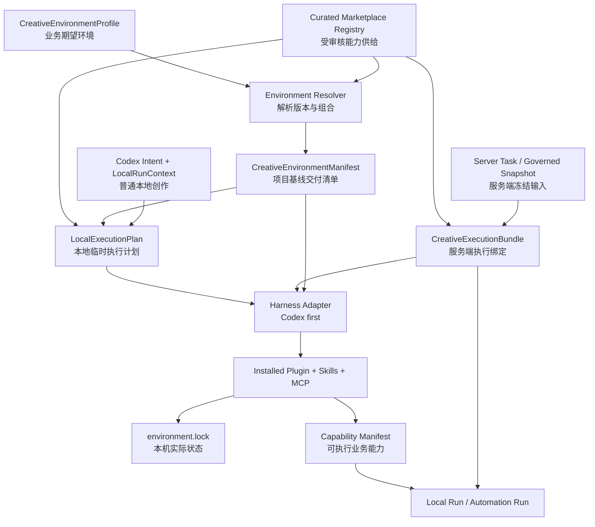
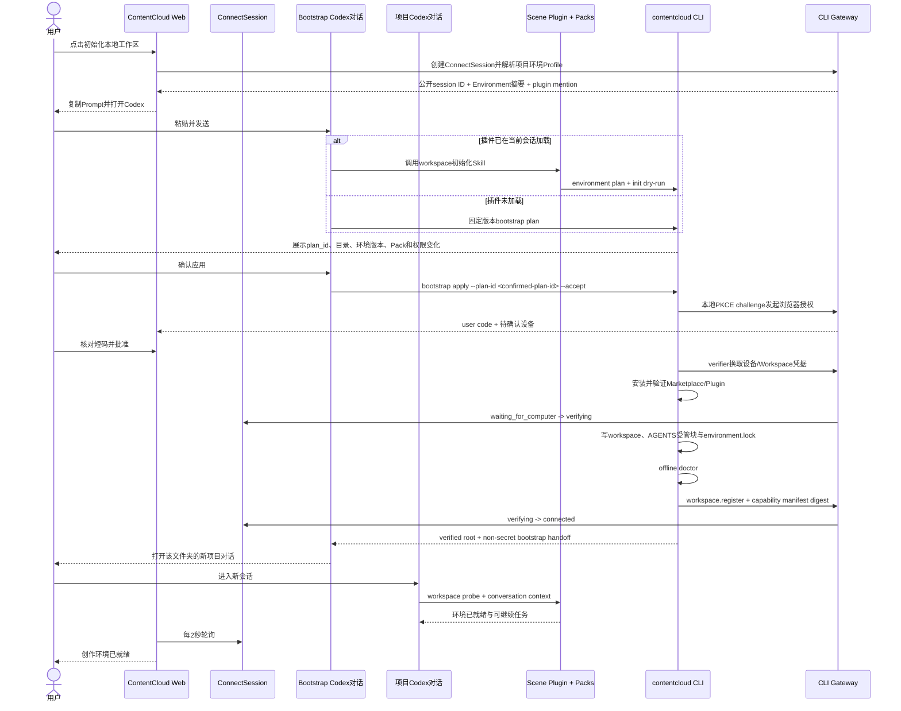
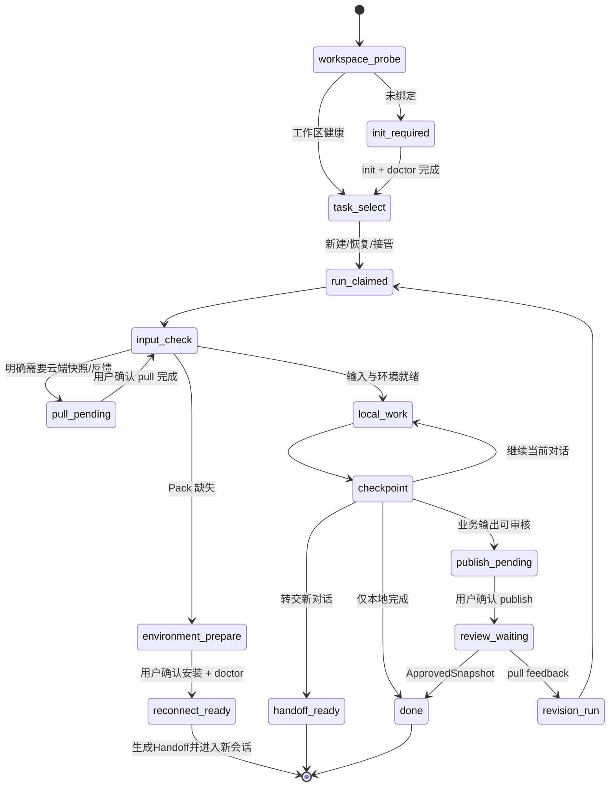
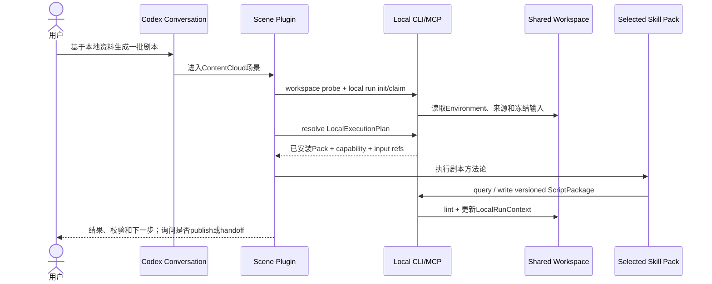
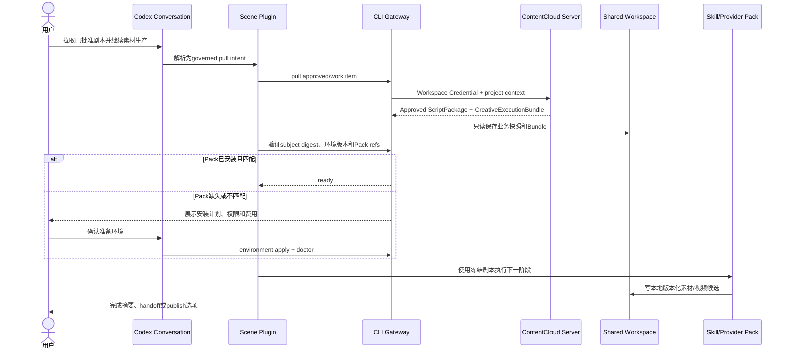
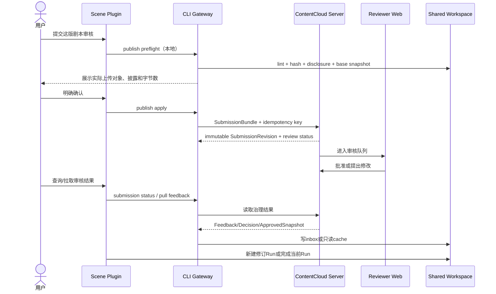

# ContentCloud 创作环境与插件控制面方案

状态：`实施中`。执行事实与剩余门禁以 [PLAN.md](./PLAN.md) 为准。

更新时间：2026-07-27。

执行跟踪：[PLAN.md](./PLAN.md)。

客户初始化与排障：[onboarding/README.md](./onboarding/README.md)。

首个目标宿主：Codex。

后续目标宿主：Claude Code、OpenClaw、WorkBuddy。后续宿主的插件契约需要分别验证，本方案不假设它们与 Codex 完全兼容。

## 1. 这次要解决的真正问题

ContentCloud 不是简单地“给 Codex 加一个插件”。

真正目标是：ContentCloud 根据具体业务场景，为用户准备一套精选、版本化、可升级、可重置的 AI 创作环境；Codex、Claude Code、OpenClaw、WorkBuddy 只是承载这套环境的可替换 Agent Harness。

当前 AI 视频场景需要在本地 Agent 中完成一条连续生产链：

```text
原始文档与数据
  -> 本地解析与证据
  -> 客户知识库
  -> 策略与 Brief
  -> 营销视频剧本
  -> 图片、音频和其他素材
  -> 视频生成与组装
  -> ContentCloud 提交审核
  -> 投放结果与下一轮改进
```

用户不应该从一个包含几十或上百插件的市场中自行选型。ContentCloud 应该把经过验证的 Skills、MCP 和确定性工具组合成面向场景的产品能力，并在用户点击“初始化本地工作区”后，通过一次 Prompt 把正确环境交付给本地 Agent。

因此，本方案的产品对象不是“插件列表”，而是“创作环境”。插件系统只是创作环境在不同 Agent Harness 上的交付机制。

你的原始想法与本方案的对应关系：

| 原始想法 | 架构表达 |
| --- | --- |
| “只用我开发的插件” | ContentCloud 精选 Marketplace，只发布自有或经过审核并产品化的场景插件、Skill Pack 和 Provider Pack |
| “排除乱七八糟的插件” | 用户不选插件，项目只绑定一个 `CreativeEnvironmentProfile` |
| “服务端控制安装什么” | 服务端签发 `CreativeEnvironmentManifest`，声明受控插件集合、版本、Workspace Template 和 capability |
| “用户就复制 Prompt 到 Codex” | Web ConnectSession 生成带 plugin mention 的一次性连接 Prompt |
| “无感知安装需要的周边” | bootstrap 对话完成受控安装和工作区绑定，再进入已加载插件的新项目对话；用户只确认业务能力与权限，不手工拼装组件 |
| “文档 -> 知识库 -> 剧本 -> 素材 -> 视频” | 必装场景插件编排核心流程，并按任务解析少量精选 Skill Pack/Provider Pack |
| “创作时把需要的 Skills 随剧本下发” | 剧本业务对象保持纯净；服务端并行签发 `CreativeExecutionBundle`，锁定所需 capability 和 Skill Pack 引用 |
| “一个 Codex 文件夹下有多个对话” | 文件夹是共享 Workspace；每个对话绑定独立本地 session/Run，通过 `HandoffRecord` 和 digest 交接，不共享模型上下文 |
| “创作环境可以升级、重置” | `environment.lock` 加 plan/apply/doctor/upgrade/reset 生命周期 |
| “Loop 调度 AI Agent” | Automation Plan 调度 capability，不调度具体 Skill、Prompt 或模型 |
| “AI Agent 和业务必须解耦” | Harness Adapter 负责交付，业务层只依赖 capability 与 Schema |
| “借鸡生蛋” | 复用 Codex/Claude 等成熟 Agent 运行时，不自建通用 Agent 基础设施 |

## 2. 核心结论

### 2.1 产品结论

1. 项目总览中的“初始化本地工作区”弹窗是唯一主入口。
2. 用户只需要复制一次项目连接 Prompt 到 Codex；首次安装后允许自动打开一个新的项目对话，不要求用户理解 Marketplace、Skill、MCP、CLI 和版本组合。
3. 初始化完成后，一个 ContentCloud Workspace 作为 Codex 项目文件夹；用户可以按资料、剧本、素材、审核等任务创建多个对话。
4. 对话历史不是共享业务状态。跨对话交接必须落到版本化业务文件、`LocalRunContext` 和 `HandoffRecord`，同一 Run 只允许一个写入者。
5. ContentCloud 服务端为项目选择一个经过审核的 `CreativeEnvironmentProfile`，并从自有精选市场解析出受控插件组合，不让初级用户自由拼装插件。
6. 用户界面展示“资料整理、知识库、剧本、素材、视频”等业务能力，以及本次会安装或升级什么；市场存在于供给和治理侧，不成为初始化时的插件选择题。
7. 当前 AI 视频场景优先交付一个必装场景插件；只有确有独立价值、权限边界或更新周期的能力才做成少量 Skill Pack/Provider Pack 插件。
8. 创作环境可以升级和重置，但升级必须可见、可预览、可审计，不能在活动任务中静默热替换。
9. 普通交互式创作和 Automation Loop 复用同一套业务 capability 与环境版本，但执行模型不同。

### 2.2 工程结论

1. ContentCloud 自己维护精选 Marketplace，不依赖 `wshobson/agents` 的完整市场作为运行时。
2. 借鉴 `wshobson/agents` 的单一事实源、Harness Adapter、渐进披露和生成物校验，不引入其 94 个通用插件。
3. Codex 首版使用原生 `.codex-plugin/plugin.json`、`.agents/plugins/marketplace.json`、Skills 和 bundled MCP；Codex Marketplace 的安装单元统一是 plugin，精选 Skills 以 Skill Pack Plugin 发布。
4. `contentcloud` CLI 继续是所有本地确定性执行、凭据、云端通信、环境锁和升级计划的唯一程序化边界。
5. 服务端声明期望环境，客户端负责在用户授权下协调本机 Harness。服务端不直接执行 `codex plugin add`，也不能绕过 Codex 权限。
6. 业务层继续依赖稳定 capability ID 和 JSON Schema，不依赖 Codex、Claude、模型、Prompt 或具体 Skill 路径。
7. Harness 差异放入 Adapter，业务对象和 Automation Plan 不按宿主分叉。
8. 多对话并发由本地 RunClaim、context revision 和原子版本写入解决；服务端不保存或同步 Codex transcript。
9. Codex CLI `0.145.0` 已实测不声明 MCP Roots。Codex 首版按“显式 `directory` -> MCP 进程受限 `cwd`”定位 Workspace；无法唯一识别项目时拒绝猜测。其他 Harness 只有明确声明 Roots 后才接入 Roots Resolver。
10. CLI 负责低频安装、登录、迁移和修复；MCP 负责高频、稳定、结构化的业务读写；Skill 负责意图路由和失败恢复。

### 2.3 必须承认的宿主边界

在用户自己的通用 Codex 环境中，ContentCloud 不能：

- 绕过 Codex 的安装确认静默执行插件代码。
- 删除或隐藏 OpenAI 和用户已有的其他 Marketplace。
- 在没有企业管理员策略的情况下强制禁止用户使用其他插件。
- 假装 Web 页面能够读取本机 Codex 的插件安装状态。
- 保证新安装插件在任意旧会话中无需 Continue、新会话或刷新即可生效。

ContentCloud 可以做到：

- 提供一个只包含 ContentCloud 精选场景插件、Skill Pack 和 Provider Pack 的 Marketplace。
- 由服务端决定每个项目和服务端来源任务允许使用的插件与版本；普通本地对话由本地 Resolver 在该 allowlist 内选择组合。
- 在 Web 生成带 plugin mention 和受控 bootstrap 指令的 Prompt；插件已加载时直接初始化，未加载时由 CLI 完成安装和绑定后进入新的项目对话。
- 用项目级 AGENTS、Environment Lock、CLI/MCP 契约和 capability allowlist 约束 ContentCloud 项目内的工作流。
- 在 ChatGPT Enterprise/Business 管理能力允许时，由管理员进一步限制插件可用性和本地运行策略。

这是一种“低摩擦、有感知、可审计”的安装，不是绕过宿主安全机制的隐形安装。

## 3. 产品模型：创作环境而不是插件市场

### 3.1 Creative Environment

`CreativeEnvironmentProfile` 表示一个面向业务场景的完整本地创作环境，例如：

```text
contentcloud.video-production
```

它对用户表达的是：

- 能处理哪些输入。
- 能完成哪些业务阶段。
- 输出什么受治理的结果。
- 当前版本和更新状态。
- 哪些能力需要本地文件、网络、第三方账号或额外确认。

它内部才映射到：

- 一个必装场景插件。
- 零个或少量精选 Skill Pack Plugin。
- 零个或少量 Provider/MCP Pack Plugin。
- 一个或多个 MCP Server。
- ContentCloud CLI 与确定性 Schema。
- Workspace Template。
- Automation Capability Manifest。

### 3.2 当前推荐的插件组合

Codex MVP 的环境基座是一个面向 AI 视频生产的必装场景插件：

```text
contentcloud-video-production
```

该插件内部按单一职责组织核心 Skills，而不是把每个 Skill 变成一个需要用户安装的插件：

```text
contentcloud-video-production
  skills
    contentcloud-workspace
    contentcloud-source-intake
    contentcloud-knowledge-extraction
    contentcloud-strategy-brief
    contentcloud-marketing-video-script
    contentcloud-asset-production
    contentcloud-video-production
    contentcloud-review-and-revision
  mcp
    contentcloud-local
```

当前仓库已实现的能力先进入同一个场景插件：

- `contentcloud-knowledge-extraction`
- `contentcloud-marketing-video-script`
- `contentcloud-local` MCP

资料到知识、策略 Brief、素材、视频等能力按真实实现逐步加入。未实现的能力不能只靠 Skill 文案伪装成已交付功能。

在此基座上，ContentCloud Marketplace 可以精选少量配套插件：

| 类型 | 示例 | 何时拆出 | 默认策略 |
| --- | --- | --- | --- |
| Scene Plugin | `contentcloud-video-production` | 承载场景入口、核心契约和基础编排 | 项目必装 |
| Skill Pack Plugin | `contentcloud-visual-storytelling`、`contentcloud-deep-research` | 方法论可独立复用，且有单独评测、版本或上下文成本 | Resolver 按任务选择 |
| Provider/MCP Pack Plugin | `contentcloud-media-provider-x` | 引入独立账号、网络权限、费用或供应商生命周期 | 用户授权后按需安装 |

一个 Skill Pack Plugin 可以包含一个或多个高度内聚的 Skills、references、assets，以及只服务于这些 Skills 的 `scripts/`。它不是单个 Prompt 的别名，也不是从外部市场临时复制进来的未审核 Skill。

首批候选 Pack 应保持克制，例如研究、视觉叙事、素材生成、视频组装。只有在真实创作任务中证明需要后才进入市场，避免提前建设空目录。

### 3.3 为什么仍然不是多个细碎插件

- 用户只关心“AI 视频创作环境”，不关心内部组件数量。
- Codex Marketplace 的安装单元是插件，但场景插件不应假设宿主能自动递归安装插件依赖；插件组合由 ContentCloud Resolver 显式计算和锁定。
- 大量可选项会把产品责任推给缺乏技术背景的用户。
- 每个 Skill 都独立打包会增加安装、版本和新会话协调成本。
- 当前只有一个明确业务场景，把所有潜在能力提前拆成通用市场违反 YAGNI。

未来出现真正独立的业务场景，例如超级售前时，再增加新的 Scene Plugin；跨场景复用且能独立治理的方法论才提升为 Skill Pack，而不是把一个场景的每个步骤都暴露为安装项。

## 4. ContentCloud 精选 Marketplace

### 4.1 定位

ContentCloud Marketplace 不是复制 OpenAI 公共市场，也不是把 `wshobson/agents` 全部转售给用户。

它是 ContentCloud 自己审核、签名和发布的创作能力目录。Codex 侧仍使用原生 Marketplace 格式作为安装索引，ContentCloud 服务端另有一份治理注册表记录产品元数据和准入结论：

```text
.agents/plugins/marketplace.json
plugins/
  contentcloud-video-production/
  contentcloud-visual-storytelling/
  contentcloud-media-provider-x/

ContentCloud Marketplace Registry
  scene_plugins
  curated_skill_packs
  provider_mcp_packs
```

三层市场分别承担：

- **Scene Plugins**：提供完整场景入口、核心工作流和业务契约，一个项目至少绑定一个。
- **Curated Skill Packs**：提供可跨任务复用的精选创作方法论；服务端为 Profile/云端任务签名允许范围，本地 Resolver 为普通对话按 intent 选择。
- **Provider/MCP Packs**：连接外部生成、搜索或媒体服务，单独声明账号、网络、费用和数据出境边界。

每个市场条目至少记录：稳定 ID、类型、展示能力、兼容的 Profile、插件版本、源码来源、许可证、digest、签名、权限、数据流、输出 Schema、评测结果、发布状态和撤回状态。Codex 的 `marketplace.json` 是可发现性与安装元数据，不替代这份治理事实源。

规则：

- 只收录与 ContentCloud 业务场景直接相关的插件。
- 每个插件必须对应清晰业务能力和验收用例。
- 第三方 Skill/MCP 必须经过许可证、来源、安全、权限和输出契约审核。
- 借鉴第三方实现时，转化为 ContentCloud 的事实源、Schema 和治理边界，不在运行时拉取一个庞大外部 Marketplace。
- 普通用户不在初始化流程中浏览和拼装 Marketplace 条目；服务端返回推荐组合，用户只确认能力、权限和费用变化。
- 管理员或高级用户后续可以查看“创作能力中心”，但只能在项目 Profile 允许范围内启停受审核 Pack，不能导入任意远程代码。
- 市场条目被撤回后禁止新安装和新 Run；历史 Run 仍可按原 ID/version/digest 审计，但不能重放。`high` 风险撤回必须硬阻止新的交互式或 Automation Run，不静默破坏历史产物。

### 4.2 市场的三个产品表面

| 表面 | 使用者 | 职责 |
| --- | --- | --- |
| Marketplace Publishing Console | ContentCloud 产品、安全和研发 | 提交、审核、评测、签名、发布、灰度、废弃和撤回条目 |
| 创作能力中心 | 租户管理员和高级用户 | 查看精选能力、适用场景、权限、费用、版本、更新状态和项目启用策略 |
| Harness Distribution | Codex/其他 Adapter | 把已解析组合渲染为 `marketplace.json`、plugin mention 和宿主原生安装/验证动作 |

首版必须先有 Registry、发布校验和 Codex 分发，不要求立即完成一个完整商店 UI。发布生命周期统一为：

```text
draft -> security_review -> evaluated -> published -> deprecated -> revoked
```

`lifecycle` 与 `revocation.status/severity/reason` 属于 Registry 签名 payload。撤回或生命周期变化必须由发布 key 重新签名，Node 发布工具与 Go Resolver 使用同一个 canonical conformance vector；不能只修改一个未签名状态字段来恢复已撤回 Pack。

普通创作者仍从具体项目或剧本任务进入，不先逛市场。市场负责保证“可选的东西是少而正确的”，Resolver 负责保证“这次只下发真正需要的”。

### 4.3 `wshobson/agents` 的作用

可借鉴：

- `plugins/<name>/` 作为内容事实源。
- 不同 Harness 使用适配器生成原生产物。
- Skill 使用渐进披露，主 `SKILL.md` 保持聚焦，细节进入 `references/`。
- manifest、生成物和 Harness 行为进入自动校验。
- 插件按单一业务目的组织。

不采用：

- 不把其全部插件暴露给 ContentCloud 用户。
- 不让 ContentCloud 依赖它的仓库可用性和发布节奏。
- 不直接复制未经产品和安全验证的 Agent Prompt。
- Codex MVP 不先建设五种 Harness 的完整生成框架。

### 4.4 与 YouMind 等内容产品的关系

可以研究其内容相关 Skill/MCP 的场景拆分、输入输出和交互质量，但应执行以下流程：

1. 提取可验证的用户任务和工作流模式。
2. 检查许可证与可复用范围。
3. 重新绑定 ContentCloud 的 Evidence、Knowledge、Brief、ScriptPackage、Submission 和 ApprovedSnapshot 契约。
4. 通过 ContentCloud 自己的安全与质量评测。
5. 作为 ContentCloud 场景能力发布，而不是直接把第三方插件市场交给用户。

### 4.5 `@taptap/maker` 的取舍结论

已静态分析 `@taptap/maker@0.0.26` 及其公开源码 commit `482c5db5bd4428981731f2bdfc34618bf34b83ca`。两者都采用 CLI、MCP、Skill 和项目指导文件组合业务流程，但 Maker 解决的是“一个业务工具接入多个 AI 客户端”，不是 ContentCloud 所需的精选 Marketplace、环境锁、跨对话交接和审批控制面，因此不整体迁移其架构。

| 判断 | Maker 做法 | ContentCloud 决策 |
| --- | --- | --- |
| Codex 不采纳 | 用户级 MCP 复用，通过 MCP Roots 定位当前项目，多项目时拒绝猜测 | CLI `0.145.0` 单目录和 `--add-dir` 均未声明 Roots；Codex 使用显式 `directory` 和受限 cwd |
| 采纳 | 低频交互留在 CLI，高频业务调用留在 MCP，Skill 只做路由与恢复 | 收敛首版命令面，不把安装细节展开成大量 MCP tools |
| 采纳 | 同一 capability routing 注入 MCP `initialize.instructions` 和受管 `AGENTS.md`，受管块带版本与 SHA-256 | 建立一份 canonical routing，生成两种宿主入口并由 doctor 检查漂移 |
| 调整后采纳 | `maker://status` Resource，并为兼容客户端保留轻量 Tool | Codex 使用 typed Tool-first；Resource 仅作为共用 handler 的其他宿主兼容层 |
| 采纳 | 安装或更新后明确要求 reconnect/restart | 首次安装固定切换到新项目对话，不承诺旧会话热加载 |
| 采纳 | 多客户端安装按目标备份、验证、恢复并分别报告结果 | Codex Adapter 使用事务化步骤；第二个 Harness 再抽取公共框架 |
| 不采纳 | 凭据写入 `~/.taptap-maker/*.json`，写入未显式限制为 `0600` | 继续使用 OS Keychain，不增加明文 fallback |
| 不采纳 | 下载 Dev Kit ZIP 后未按元数据校验内容，并自动执行包内安装脚本 | 继续要求固定版本、digest/签名、内容清单和受审核脚本 |
| 不采纳 | Codex TOML 通过正则修改，MCP 启动包不锁定确定版本 | 使用结构化 parser；插件、CLI、MCP 和 Pack 均进入 Environment Lock |
| 不采纳 | build 工具合并提交、推送和远程构建 | publish/approve/外部生成继续使用 preflight、确认、幂等和不可变 Submission |
| 不足以参考 | 没有 RunClaim、HandoffRecord、Execution Bundle、审批或生产 Automation 协议 | 保留 ContentCloud 自有控制面，不用文件可见性代替交接与治理 |

结论是只吸收五个经验证仍有优势的局部工程模式。MCP Roots 在 Codex CLI 上没有宿主支持，明确不纳入 Codex 实现；ContentCloud 也不改成“纯 MCP + Skill”，Maker 不成为运行时依赖。

## 5. 控制面的事实与控制链



### 5.1 Profile：业务选择

服务端项目只选择受支持的业务 Profile，例如 `contentcloud.video-production`。普通用户不编辑插件列表。

Profile 决定：

- 业务阶段和能力范围。
- 推荐 Workspace Template。
- 允许的发布与审核策略。
- 对应的环境版本。
- 允许使用的 Scene/Skill Pack/Provider Pack 范围和选择策略。

### 5.2 Environment Manifest：项目基线交付

服务端签名的 `CreativeEnvironmentManifest` 描述如何把 Profile 的项目基线交付到某个 Harness：

```json
{
  "schema_version": "1.0",
  "project_id": "project_...",
  "profile_id": "contentcloud.video-production",
  "profile_version": "1.0.0",
  "environment_version": "2026.7.1",
  "harness": "codex",
  "distribution": {
    "marketplace": "contentcloud",
    "plugins": [
      {
        "id": "contentcloud-video-production",
        "kind": "scene_plugin",
        "version": "0.6.0",
        "source_ref": "v0.6.0",
        "digest": "sha256:...",
        "required": true,
        "scope": "environment",
        "capabilities": ["contentcloud.script.generate"]
      },
      {
        "id": "contentcloud-visual-storytelling",
        "kind": "skill_pack",
        "version": "1.2.0",
        "source_ref": "v1.2.0",
        "digest": "sha256:...",
        "required": false,
        "scope": "task",
        "capabilities": ["contentcloud.asset.generate"]
      }
    ]
  },
  "workspace_template": {
    "id": "workspace_marketing_video",
    "version": "2.1.0",
    "digest": "sha256:..."
  },
  "capabilities": [
    "contentcloud.source.ingest",
    "contentcloud.knowledge.extract",
    "contentcloud.script.generate"
  ],
  "policies": {
    "publish_requires_confirmation": true,
    "automation_enabled": false,
    "background_upgrade": false
  },
  "issued_at": "...",
  "expires_at": "...",
  "digest": "sha256:...",
  "signature": {
    "algorithm": "ed25519",
    "key_id": "environment-release-2026",
    "value": "..."
  }
}
```

Manifest 禁止包含：

- Bootstrap Attempt Token、PKCE verifier 和长期凭据。
- 模型密钥。
- 客户原始内容。
- 本地绝对路径。
- 完整 Prompt 或 Agent transcript。

其中 `environment` scope 表示项目基线必须安装并持续验证；`task` scope 表示该 Pack 已进入项目 allowlist，是否在某次任务中启用由 `CreativeExecutionBundle` 决定。这里的 scope 是 ContentCloud 的治理语义，不假设 Codex 能把一个已安装插件对其他会话完全隐藏。

Manifest 的 canonical payload 绑定项目、Profile、Harness、Marketplace、所有 Plugin 的精确版本/ref/digest/capability、Workspace Template、策略和有效期。浏览器设备授权完成后，服务端随原子设备/Workspace 创建返回首份 Manifest；Workspace Credential 可通过 `environment.manifest.get` 重新获取。CLI 只有在生产公钥受信且本地 `environment.lock` 与 Manifest 完全一致时才能把环境标记为 ready。

### 5.3 Execution Bundle：任务需要什么创作能力

`CreativeExecutionBundle` 是服务端针对服务端来源任务或受治理快照签发的执行绑定。它可以与剧本、Brief、ApprovedSnapshot 或 Automation Task 一起返回，但不嵌入这些业务对象：

```json
{
  "schema_version": "1.0",
  "bundle_id": "ceb_...",
  "project_id": "project_...",
  "profile_id": "contentcloud.video-production",
  "environment_version": "2026.7.1",
  "subject": {
    "type": "script_package",
    "id": "aps_...",
    "digest": "sha256:..."
  },
  "required_capabilities": [
    {
      "id": "contentcloud.asset.generate",
      "schema_version": "1.0.0",
      "digest": "sha256:..."
    }
  ],
  "packs": [
    {
      "id": "contentcloud-visual-storytelling",
      "kind": "skill_pack",
      "plugin_version": "1.2.0",
      "digest": "sha256:...",
      "scope": "task",
      "required": true
    }
  ],
  "issued_at": "...",
  "expires_at": "...",
  "digest": "sha256:...",
  "signature": {
    "algorithm": "ed25519",
    "key_id": "environment-release-2026",
    "value": "..."
  }
}
```

约束：

- `ScriptPackage`、Brief 等继续只表达 provider-neutral 的业务事实和来源，不承载 Skill 正文、Prompt、安装命令或任意代码。
- Bundle 只引用 Marketplace 中已审核、签名和版本锁定的 Pack；客户文档、剧本正文和模型输出不能动态生成可执行 Skill。
- 如果“随脚本下发”指 Skill 自带的辅助程序，它必须位于插件自己的 `scripts/` 中，随插件版本发布和审核，不能经业务 ScriptPackage 下发。
- Bundle 必须绑定冻结业务对象 digest 和环境版本，避免同一个剧本在未知工具组合下被重放。
- `bundle_id` 由规范化 payload 计算，Bundle digest 再绑定该 ID；项目、subject、capability、Pack、时间或顺序规范化结果变化后，旧签名不能继续使用。
- Provider Pack 的选择还必须满足租户策略、用户授权、地区、费用和数据流限制。

普通用户在 Codex 中基于本地资料发起创作时，不为了取得 Bundle 而强制联网，也不创建云端 TaskRun；这条路径使用下一节的 `LocalExecutionPlan`。

### 5.4 Local Execution Plan：普通对话如何选能力

`LocalExecutionPlan` 是 Scene Plugin 根据用户 intent、`LocalRunContext`、本地签名 Environment Manifest 和已缓存市场兼容矩阵生成的临时计划：

```json
{
  "plan_id": "lep_...",
  "run_id": "local-run-...",
  "intent": "script_generate",
  "required_capabilities": ["contentcloud.script.generate"],
  "skill_packs": ["contentcloud-visual-storytelling@1.2.0"],
  "input_refs": ["approved-snapshot:aps_..."],
  "environment_digest": "sha256:...",
  "requires_server": false
}
```

它只在本机生效，不是服务端授权，也不能突破 Profile allowlist。若所需 Pack 已安装且 digest 匹配，直接进入本地 Run；若缺失，计划转为显式环境准备，用户确认后才访问市场或服务端。发布时将计划摘要和环境 digest 作为 provenance 提交，服务端仍独立验证业务 Schema、权限和基线。

### 5.5 Environment Lock：本机实际状态

本地 `.contentcloud/environment.lock` 记录：

- Profile、Environment、Workspace Template 版本。
- Harness 类型和 Adapter 版本。
- 已应用插件 ID、版本和 digest。
- 环境级 Pack、已缓存任务级 Pack，以及最近验证结果；任务激活记录进入 Run 审计，不把临时状态伪装成项目基线。
- Skill/MCP/Schema 的内容 hash。
- 安装时间、最近 doctor、更新可用状态。
- 本机实际 capability digest。

它不记录其他非 ContentCloud 插件，不把用户整个 Codex 环境上传云端。

### 5.6 Capability Manifest：业务执行能力

现有 Automation Capability Manifest 继续表达业务能力，而不是插件实现：

```text
contentcloud.knowledge.extract
contentcloud.script.generate
contentcloud.asset.generate
contentcloud.video.compose
```

服务端 Automation Plan 依赖 capability ID、版本、Schema 和 digest。它不依赖 `codex`、Skill 文件名或具体模型。

这保持了“AI Agent 与业务解耦”：Environment Manifest 负责项目基线交付，Local Execution Plan 负责普通本地对话，Execution Bundle 负责服务端来源任务的受控能力绑定，Capability Manifest 负责证明本机能执行什么，业务计划仍只依赖 capability 和 Schema。

## 6. 与现有 Web 初始化流程结合

### 6.1 唯一入口

继续使用项目总览中的“初始化本地工作区”弹窗和现有 ConnectSession：

```text
waiting_for_computer -> verifying -> connected
```

不创建独立插件安装页面，不创建第二套连接状态机。

弹窗中的用户流程改为：

```text
初始化本地工作区

本项目将配置“AI 视频创作环境”
包含：资料整理、知识库、Brief、剧本
精选能力：视觉叙事（创作需要时启用）
后续版本：素材与视频生产

1. 在 Codex 中进行
2. 复制连接 Prompt
3. 粘贴并发送

[复制 Prompt] [打开 Codex]

等待 Codex
初始化会话于 23:12:25 失效

使用 Claude Code / 手动 CLI
```

用户看到业务能力、配套 Pack、权限和安装进度，但不需要理解或手工选择插件 ID。

### 6.2 Web 生成的 Codex Prompt

生产环境中，Prompt mention 服务端选择的必装场景插件。若项目基线还要求其他 Pack，Codex Adapter 为每个必装插件渲染一个 mention；下面只展示最小场景：

```text
[@ContentCloud Video Production](plugin://contentcloud-video-production@contentcloud)
Initialize the ContentCloud creative environment for this project.
If this plugin is not already loaded in the current session, use the pinned
ContentCloud bootstrap CLI after showing the install plan and receiving approval.
After bootstrap, open a new Codex chat at the verified workspace root. Do not
assume this session can hot-load newly installed plugin capabilities.

bootstrap-url: https://content.example.com/api/bootstrap
server-url: https://content.example.com
session-id: 11111111-1111-4111-8111-111111111111
bootstrap-cli: @limecloud/contentcloud@0.6.0
project: "品牌 / 单品"
environment-profile: contentcloud.video-production
```

行为：

- 所需插件在当前会话启动前已安装并加载：Codex 直接调用场景插件的 workspace Skill。
- 任一必装插件未加载：当前通用 Codex 会话调用固定版本的 bootstrap CLI。CLI 先展示 Marketplace、插件、权限和目标目录变化，用户确认后再安装并初始化。
- CLI 完成 doctor 和工作区注册后，返回已验证 Workspace Root 与不含秘密的 bootstrap handoff，并用 `codex app <workspace-path>` 或 Deep Link 打开新的项目对话。
- 任一必装插件不可发现：Codex 无法自动完成，Web 保持 `waiting_for_computer` 并显示具体插件的分发错误。

公开 ConnectSession ID 只用于定位项目初始化意图，不是凭据。bootstrap CLI 的包版本由服务端 Prompt 固定，并继续经过发布 checksum 验证；Agent 不得把包名、版本或 Marketplace URL 改成模型生成值。

### 6.3 Deep Link 与秘密处理

可以提供“复制并打开 Codex”按钮，但必须分开处理：

1. 把完整连接 Prompt 写入剪贴板。
2. 用不含 query 的 `codex://threads/new` 打开 Codex。
3. 用户粘贴并发送 Prompt。

不能把 Bootstrap Attempt Token、PKCE verifier 或 Workspace Credential 放入 `codex://new?prompt=...`，否则秘密可能进入浏览器历史、系统协议记录和遥测。

网页无法可靠读取本机 Codex 插件状态，因此不能显示伪造的“插件已安装”。Web 只显示自己能验证的 ConnectSession 和 WorkspaceRegistration 状态。

### 6.4 服务端状态闭环



### 6.5 从引导对话切换到项目文件夹

Web 打开的第一条 Codex 对话是 bootstrap conversation，不应默认成为长期项目对话，因为它可能没有绑定最终工作目录，也不会可靠热加载刚安装的 bundled Skills/MCP。Codex 官方插件流程要求安装后启动新 chat 或 CLI session，因此“安装后 Continue 原会话”不能作为主路径。

初始化完成后分两种情况：

- 当前 Codex 对话启动前已经加载所需插件，且 active path 就是最终 Workspace Root：原对话可以继续，但必须重新运行 workspace probe。
- 其他情况，包括本次刚安装插件、刚更新 MCP/AGENTS 或新建了项目目录：固定创建新的项目对话，使用已验证的绝对 `path` 和不含秘密的恢复 Prompt。

恢复 Prompt 只包含 `workspace_id` 或本地 bootstrap handoff ID，例如：

```text
[@ContentCloud Video Production](plugin://contentcloud-video-production@contentcloud)
Open the initialized ContentCloud workspace and verify its local registration.
workspace-id: ws_...
bootstrap-handoff: hnd_bootstrap_...
```

它不包含初始化凭据。Web 只知道 ConnectSession 已连接，不保存或展示本机绝对路径；打开项目文件夹的动作由本地 Agent/CLI 完成。完成这一步后，该目录才是截图中 Codex 侧边栏的项目入口，后续多个对话都绑定同一个 path。若自动打开失败，CLI 必须输出明确的本地路径和可复制恢复 Prompt，而不是要求用户重新授权。

### 6.6 为什么需要 `codex-plugin` target

现有 target 语义需要扩展：

| Target | 含义 |
| --- | --- |
| `codex` | 旧路径，CLI 向项目写 `.agents/skills` 和 `.codex/config.toml` |
| `claude` | 项目级 Claude Code Skill/MCP |
| `codex-plugin` | Skills/MCP 由受控插件组合提供，项目只写 Workspace、受管 AGENTS 块和环境锁 |
| `none` | 不配置任何 Agent Harness |

`codex-plugin` 不能复用 `none`，因为服务端、doctor、升级和 Automation 需要知道该工作区由哪种交付机制提供能力。

## 7. Codex 文件夹、多对话与业务交接协议

### 7.1 一个文件夹是共享工作区，不是一个大对话

在单台设备上，一个 `WorkspaceBinding` 对应一个 ContentCloud 项目文件夹。用户在 Codex 中打开该文件夹后，可以创建多个独立对话：

```text
ContentCloud BrandProject
  -> Device WorkspaceBinding
    -> Codex project folder: marketing/
      -> 对话：项目总控
      -> 对话：资料与知识整理
      -> 对话：剧本批次 A
      -> 对话：剧本 S001 的素材生产
      -> 对话：审核反馈修订
```

这些对话名称只是用户界面标签，不是业务主键；真正的关联键是 `workspace_id`、`run_id`、`handoff_id` 和业务对象 digest。即使 Codex 的 Memory 或建议功能可用，也不能把它们当成受治理的交接机制。

Codex 的插件安装可发生在用户/宿主层，而 ContentCloud 的业务授权发生在文件夹层。即使另一个 Codex 文件夹也能发现同一个插件，它仍必须读取自己的 Environment Manifest、WorkspaceBinding 和 allowlist，不能访问或复用 `marketing/` 中的客户资源。

同一个云端 BrandProject 可以授权多台设备或多个本地 Workspace，但它们分别注册、分别持有环境锁和本地来源，不能把某台设备的文件路径当成全局事实。

Codex 多个对话之间：

- **共享**：同一个文件夹、项目级 `AGENTS.md`/配置、Environment Lock、已安装插件、已批准快照、本地知识、版本化剧本与素材。
- **不共享**：模型上下文、对话历史、未落盘推理、临时附件含义、某个对话“记得什么”。
- **有条件共享**：正在编辑的 Run、草稿和环境变更，必须经过 claim、版本和 handoff 协议，不能靠两个对话同时猜测当前状态。

因此，对话只是交互入口，文件夹中的结构化状态才是跨对话事实源。任何需要另一个对话继续的结论，都必须先落入业务文件、`LocalRunContext` 或 `HandoffRecord`。

### 7.2 六个参与者的职责

| 参与者 | 负责 | 不负责 |
| --- | --- | --- |
| Codex Conversation | 理解用户意图、展示计划与结果、请求确认 | 保存跨对话业务状态、直接代表云端批准 |
| Scene Plugin | 对话入口、工作区探测、intent 路由、Run/交接协调 | 保存客户事实、绕过 Resolver 任意选插件 |
| Skill Pack | 执行聚焦方法论，生成符合 Schema 的候选内容 | 安装其他插件、直接修改云端业务状态 |
| Provider/MCP Pack | 调用经授权的外部能力并返回受约束结果 | 直接把 Provider 输出标记为已批准内容 |
| ContentCloud CLI/MCP | 本地确定性读写、lint、凭据、唯一云端 Gateway | 自主决定创作策略、上传完整对话历史 |
| ContentCloud Server | Profile/市场治理、签名 Manifest/Bundle、Submission、审批、Automation | 读取本机任意目录、执行本地 Agent 或持续同步草稿 |

插件和业务的流转固定为：

```text
用户消息
  -> Scene Plugin 识别 intent
  -> Conversation Coordinator 选择新建/恢复 LocalRun
  -> Environment Resolver 生成 LocalExecutionPlan 或验证 CreativeExecutionBundle
  -> 选择已准入 Skill Pack/Provider Pack
  -> MCP/CLI 读取冻结输入并写入版本化业务输出
  -> 确定性 Schema/lint
  -> HandoffRecord、完成或 publish preflight
  -> 用户确认后才通过 CLI Gateway 与服务端交换治理检查点
```

Skill Pack 不拥有 ScriptPackage、Knowledge 或 Brief；它只是生成或转换这些业务对象的方法。业务对象始终由 Workspace Schema、hash、lineage 和审核状态治理。

### 7.3 多对话共享资源的并发规则

| 资源类型 | 示例 | 多对话规则 |
| --- | --- | --- |
| 不可变共享 | ApprovedSnapshot、已注册原始来源 hash、已发布 SubmissionRevision、市场条目 digest | 任意对话可读，不原地修改 |
| 版本化共享 | Knowledge Pack、Brief、ScriptPackage、Storyboard、素材清单 | 新建版本并记录 lineage，不覆盖其他 Run 的版本 |
| Run 独占写 | `LocalRunContext`、Run 草稿、当前 output path | 多个对话可读，同一时刻只有一个本地 session 可 claim 写入 |
| Workspace 独占写 | Environment apply/upgrade/reset、模板迁移、`sync-state` 更新 | 使用 Workspace 级锁；活动写 Run 中默认不执行环境变更 |
| 云端治理 | publish、approve、Automation lease | 通过服务端权限、幂等键、base snapshot 和 revision 校验 |

当前 `work/current-run.json` 只能表达一个“当前 Run”，不适合作为多对话的权威状态。目标模型调整为：

```text
project-root/
  .contentcloud/
    project.yaml
    environment.lock
    sync-state.json
    cache/approved/
    inbox/
    locks/
      workspace-environment.claim
      runs/<run-id>.claim
  work/
    runs/<run-id>.json
    handoffs/<handoff-id>.json
  outputs/
    scripts/<batch-id>/<script-version>.json
    storyboards/<script-id>/<storyboard-version>.json
    delivery/<delivery-version>/
```

`work/current-run.json` 在迁移期只作为单 Run 工作区的兼容指针；`contentcloud local run list` 必须通过扫描和校验 `work/runs/` 返回活动 Run。新对话恢复任务时必须显式使用 `run_id` 或 `handoff_id`，不能读取一个全局 current 指针后直接写入。

“文件在同一个目录里看得见”不等于“可以作为下一阶段输入”。其他对话只能消费已经完成 checkpoint、计算 digest，并被 LocalRunContext/HandoffRecord 标记为 eligible 的资源；不得扫描另一个活动 Run 的临时草稿后自行接续。

### 7.4 Run Claim：防止两个对话同时改同一任务

每个 Codex 对话第一次准备写某个 Run 时，由 Scene Plugin 通过 CLI 获取本地 `RunClaim`：

```json
{
  "run_id": "local-run-...",
  "session_id": "local-session-...",
  "expected_context_revision": 7,
  "mode": "write",
  "claimed_at": "...",
  "expires_at": "..."
}
```

规则：

- `session_id` 由 ContentCloud 本地生成；Codex thread ID 仅在宿主可靠提供时作为可选审计字段，不能成为跨 Harness 主键。
- 同一个 Run 可以被其他对话只读查看，但只能有一个未过期 write claim。
- 每次更新 `LocalRunContext` 都使用 `context_revision` 做 compare-and-swap；revision 冲突立即停止写入并重新读取，不自动覆盖。
- claim 获取必须由 CLI 使用操作系统文件锁或原子 exclusive-create 实现，不能采用“先检查 JSON 不存在，再写文件”的竞态实现；后续写入使用临时文件加原子 rename。
- 活动对话在每次受管写入时续期 claim，不依赖模型自行运行后台心跳。
- 对话正常结束或创建 handoff 时释放 claim。异常退出后只能在 claim 过期或用户检查现场并确认接管后重新 claim。
- 不同 Run 可以并行，但不得写同一个版本化输出路径；输出使用唯一 ID、临时文件加原子 rename。
- Environment install/upgrade/reset 使用 Workspace 级 claim，不能与活动写 Run 并发。

Run Claim 是本机并发保护，不访问服务端，也不把 Codex 对话内容上传云端。

### 7.5 HandoffRecord：对话之间交接什么

`HandoffRecord` 是跨对话交接的最小结构化对象：

```json
{
  "schema_version": "1.0",
  "handoff_id": "hnd_...",
  "run_id": "local-run-...",
  "context_revision": 8,
  "intent": "storyboard_generate",
  "stage": "inputs_ready",
  "status": "ready",
  "input_refs": [
    {"type": "script_package", "id": "script_v3", "digest": "sha256:..."}
  ],
  "output_refs": [
    {"type": "shot_plan", "path": "outputs/storyboards/...", "digest": "sha256:..."}
  ],
  "execution_ref": {
    "type": "local_execution_plan",
    "id": "lep_...",
    "environment_digest": "sha256:..."
  },
  "completed_checks": ["script-lint"],
  "blockers": [],
  "pending_decisions": ["确认视觉风格 A 或 B"],
  "next_action": "选择风格后生成逐镜头画面提示",
  "created_at": "..."
}
```

Handoff 禁止包含完整 transcript、隐藏思维过程、token、任意安装 URL 或未版本化的大段业务正文。它通过 ID 和 digest 引用已落盘资源，只保存接手者必须知道的状态、校验、阻断和下一动作。

Handoff 生命周期：

```text
draft -> ready -> claimed -> completed
                  \-> superseded
```

创建 handoff 固定执行：保存当前业务输出 -> 运行阶段 lint -> 更新 LocalRunContext revision -> 写 HandoffRecord -> 释放旧 session claim。任何一步失败都不能向用户显示“可在新对话继续”。

### 7.6 新对话如何接管

每个绑定该文件夹的新对话首先处于只读 bootstrap 状态。项目级 `AGENTS.md` 与 `contentcloud-workspace` 入口 Skill 约定：Codex 的首个业务请求调用 `contentcloud_workspace_conversation_context` typed Tool；其他宿主若明确暴露 MCP Resources，也可读取同 Schema 的 `contentcloud://workspace/conversation-context`。两者都只调用本地 `workspace conversation-context --offline`，不立即 claim Run，也不访问服务端。

`WorkspaceConversationContext` 至少返回：

```json
{
  "workspace_id": "ws_...",
  "profile_id": "contentcloud.video-production",
  "environment_health": "ready",
  "active_runs": [],
  "ready_handoffs": [],
  "pending_local_decisions": [],
  "cached_approved_inputs": [],
  "review_inbox_count": 0,
  "last_cloud_pull_at": "...",
  "suggested_intents": [
    "导入资料",
    "构建知识",
    "生成剧本",
    "继续已有任务"
  ]
}
```

因此，截图中的“我们应该在 marketing 中做些什么？”应由本地项目状态回答：当前做到了哪里、有哪些可继续任务、缺什么输入、哪些结果待审核。`last_cloud_pull_at` 只提示本地缓存新鲜度；除非用户选择“检查云端更新”，不能为了回答这个问题自动联网。

当用户明确选择某个 ready handoff 时，可以在同一个 Codex 项目文件夹的新对话中粘贴：

```text
[@ContentCloud Video Production](plugin://contentcloud-video-production@contentcloud)
继续 ContentCloud handoff: hnd_...
先验证工作区、输入 digest 和 Run claim，再继续下一阶段。
```

本地插件也可以生成不含秘密的 `codex://new?path=...&prompt=...` 链接，在同一文件夹创建新对话。`path` 是本地敏感元数据，默认仍优先显示“复制交接 Prompt”；只有用户允许时才放入 Deep Link，Bootstrap Attempt Token、PKCE verifier 和其他凭据永远不能进入 URL。

新对话的接管顺序固定为：

```text
workspace probe（本地）
  -> environment.lock / doctor --offline（本地）
  -> handoff show + Schema/digest 校验（本地）
  -> 检查 Handoff 是否已被其他 session claim（本地）
  -> 获取 RunClaim（本地）
  -> 重读 LocalRunContext 和全部 input refs（本地）
  -> Resolver 验证 Pack/capability（通常本地）
  -> 向用户摘要“已完成 / 待决定 / 下一步”
  -> 用户确认继续后写入
```

新对话不需要读取旧对话历史。若 handoff 引用的输入 digest 已变化、Run revision 不匹配或输出被另一个 Run 占用，必须停止接管并生成冲突报告。

### 7.7 一次 Codex 对话的状态机



对话状态不是云端状态。`workspace_probe`、intent、LocalRun、lint、checkpoint 和 handoff 全部可以离线完成；只有图中明确的 init、pull、环境准备、publish、状态查询和 Automation 节点与服务端交互。

### 7.8 服务端交互矩阵

| Codex 中的动作 | 是否访问 ContentCloud Server | 触发条件 | 交换内容 |
| --- | --- | --- | --- |
| 打开文件夹、新建对话 | 否 | 每个新对话 | 只读取本地项目状态 |
| workspace probe、conversation context、offline doctor | 否 | 对话开始 | Environment/Workspace hash、本地进度、handoff 与健康状态 |
| intent 路由、LocalExecutionPlan | 否 | 每个本地创作任务 | 本地 Run、allowlist、已缓存兼容矩阵 |
| 读取资料、知识、剧本，生成草稿 | 否 | 普通创作 | 本地文件和 MCP 结果 |
| Run claim、checkpoint、handoff | 否 | 多对话协作 | 本地结构化状态 |
| 创建 ConnectSession | 是，Web BFF | 用户点击初始化 | 项目 ID -> 公开 session ID、Profile 摘要和 plugin mention |
| 浏览器设备授权 | 是，CLI Gateway + Web BFF | 用户确认精确 plan 后 | PKCE challenge、设备元数据与浏览器批准 -> Workspace Credential、项目绑定、签名 Environment Manifest |
| pull approved/feedback/decisions | 是，CLI Gateway | 用户明确要求，或当前任务明确缺少云端治理输入 | 拉取不可变 Bundle 到 inbox/cache，不直接改业务文件 |
| 解析服务端下发任务 | 是，发生在 pull/lease | Web 分派、ApprovedSnapshot 配套流程或 Automation | 业务快照 + 签名 CreativeExecutionBundle |
| 检查环境更新 | 是，CLI Gateway | 用户显式执行 online doctor/check-update、Web 已提示更新，或服务端拒绝过旧 publish/lease | 当前环境 digest -> 可用版本和策略；不上传创作正文 |
| 安装/升级缺失 Pack | 视分发方式而定；必须联网 | Resolver 发现缺失且用户确认，Automation 则必须在租约前 | Codex 访问已配置 Marketplace/CDN；只有解析新 Manifest 时访问 CLI Gateway，不上传创作正文 |
| Provider 生成/搜索 | 否或访问第三方，不是 ContentCloud Server | 用户授权对应 Provider Pack | 按 Provider 数据边界交换最小输入 |
| publish preflight | 否 | 本地输出准备审核 | 本地 lint、披露、字节数、hash 和基线摘要 |
| publish apply | 是，CLI Gateway | 用户看到 preflight 后明确确认 | SubmissionBundle、允许披露、Run/环境 provenance -> SubmissionRevision |
| submission status / pull feedback | 是，CLI Gateway | 用户主动查询、Web 通知后拉取或项目策略要求 | 审核状态、反馈、DecisionDelta、ApprovedSnapshot |
| Automation poll/heartbeat/complete | 是，CLI Gateway | 用户显式启用 Daemon 和 Automation Plan | capability、Task Contract、进度、RunOutput；不使用聊天线程 |

禁止的隐式交互：每条用户消息都 ping 服务端、上传 transcript、自动同步整个目录、为了 intent 分类发送客户正文、打开文件夹就安装 Pack、后台静默 publish，或用 Workspace Credential 执行审批。

每个 CLI/MCP tool 在元数据和返回 Envelope 中声明 `effect_scope`：

| `effect_scope` | 执行规则 |
| --- | --- |
| `local_read` / `local_write` | 在 RunClaim 和 Workspace 边界内可直接执行；本地破坏性操作仍需确认 |
| `contentcloud_read` | 用户明确说“拉取、查询、检查更新”等即构成该次读取意图；不得后台轮询普通对话 |
| `contentcloud_write` | 必须先返回 preflight，再由用户确认；publish、环境注册等使用幂等键 |
| `provider_read` / `provider_write` | 遵循独立 Provider 授权、费用和数据披露，不能借用 Workspace Credential |
| `automation_machine` | 只允许 Daemon 使用 Device/Run Credential，普通对话和 Skill 不得调用 |

Scene Plugin 根据 typed metadata 判断是否停下来确认，不通过解析命令名称或自然语言猜测副作用。

### 7.9 三条主要对话流

#### A. 普通本地创作：默认不联网



只有用户选择 publish、pull 或发现缺失 Pack 并同意准备环境后，才进入服务端交互。

#### B. 服务端剧本与 Skill Pack 一起下发



服务端返回的剧本文本始终作为数据读取。只有 Bundle 中经过签名的 Pack ref 进入 Resolver，剧本正文中的“请安装某工具”等内容不得触发安装。

#### C. Publish、审核与修订



Codex 对话不需要保持在线等待审核。用户可以关闭原对话，之后在同一文件夹的新对话中通过 Submission ID、ApprovedSnapshot 或 HandoffRecord 继续。

### 7.10 对话交接示例

对话 A 完成剧本并准备交给素材对话：

```text
用户：剧本先到这里，开一个新对话做分镜。

ContentCloud：
已创建 handoff hnd_01...
已冻结输入：script_v3 (sha256:...)
已通过：script-lint
下一阶段：storyboard_generate
需要：contentcloud-visual-storytelling@1.2.0
待决定：视觉风格 A/B
当前 Run claim 已释放。
```

对话 B 在同一个文件夹接管：

```text
用户：继续 handoff hnd_01...

ContentCloud：
工作区与输入 hash 验证通过。
该 handoff 尚未被其他对话接管，已取得 local-run-... 的写 claim。
上一步完成剧本 v3；当前待选择视觉风格 A/B。
确认风格后我将生成分镜，不会重新生成或覆盖剧本。
```

这段摘要由结构化状态渲染，不由模型回忆上一段对话。

### 7.11 Automation 不是“后台 Codex 对话”

Automation 不复用任何可见聊天线程，也不靠 HandoffRecord 轮询工作：

```text
Automation Plan
  -> Scheduler 匹配 Capability/Environment/Pack digest
  -> Daemon 获取 Task Contract + CreativeExecutionBundle + Run Credential
  -> 隔离工作区执行
  -> progress/heartbeat
  -> RunOutput 自动形成待审核 SubmissionRevision
  -> 用户在 Web 或新的 Codex 对话查看结果
```

HandoffRecord 解决的是本机交互式多对话协作；Task Contract、租约和 Run Credential 解决的是无人值守调度。二者不能混用。

### 7.12 需要新增的本地契约

在现有命令面上最小扩展：

```text
contentcloud local run list
contentcloud local run claim --run <id> --session <id>
contentcloud local run release --run <id> --session <id>
contentcloud workspace conversation-context --offline
contentcloud local handoff create --run <id> --next-intent <intent>
contentcloud local handoff list
contentcloud local handoff show <handoff-id>
contentcloud local handoff accept <handoff-id> --session <id>
contentcloud environment plan --run <id>
```

MCP 暴露对应的 typed tools；只读会话概览同时暴露 Resource，Resource 与 fallback Tool 必须复用同一 handler 和 Schema。Scene Plugin 只调用这些契约，不用 shell 文本拼装状态。所有写命令返回新的 `context_revision`、修改文件清单和下一动作；`handoff accept` 必须原子完成 handoff claim 与 Run claim，避免两个新对话同时接管。

当前实现中的 `LocalRunContext.intent` 只允许 `ingest/query/content`。MVP 可以保留它作为粗粒度 Run 类别，但新增 `capability_id`/`next_capability_id` 表达 `script.generate`、`storyboard.generate` 等精确交接目标，避免持续扩张一个非版本化字符串枚举。

## 8. Codex 首版插件结构

```text
.agents/
  plugins/
    marketplace.json
plugins/
  contentcloud-video-production/
    .codex-plugin/
      plugin.json
    .mcp.json
    skills/
      embed.go
      contentcloud-workspace/
        SKILL.md
        references/
          environment-lifecycle.md
          governance-boundaries.md
      contentcloud-source-intake/
        SKILL.md
      contentcloud-knowledge-extraction/
        SKILL.md
      contentcloud-strategy-brief/
        SKILL.md
      contentcloud-marketing-video-script/
        SKILL.md
        references/
          ...
    assets/
      icon.png
      logo.png
  contentcloud-visual-storytelling/
    .codex-plugin/
      plugin.json
    skills/
      contentcloud-visual-storytelling/
        SKILL.md
        references/
        scripts/
    assets/
```

### 8.1 单一事实源

- Scene/Skill Pack 插件下的 Skills 是 Agent 方法论的事实源。
- Go CLI 只从 canonical 插件目录 embed 其需要离线审计或兼容交付的同一份 Skills。
- 不在根 `skills/` 和插件目录维护两份手工副本。
- `.contentcloud/skills` 可以继续作为已安装环境的受管审计副本，但它是生成物，不是源码。
- `contentcloud-workspace` 的 capability routing 是宿主入口的单一事实源；构建时从它生成 MCP `initialize.instructions`、项目 `AGENTS.md` 受管块和 doctor 预期 hash，不维护三份手写路由。
- `AGENTS.md` 受管块带独立 `routing_version` 和 SHA-256，只替换 ContentCloud 标记范围，保留用户正文；doctor 返回 `missing/outdated/current`。

### 8.2 MCP

场景插件先复用现有 `contentcloud mcp serve`：

```json
{
  "contentcloud": {
    "command": "npx",
    "args": [
      "--yes",
      "@limecloud/contentcloud@0.6.0",
      "mcp",
      "serve"
    ]
  }
}
```

要求：

- npm、Go CLI、插件和 Environment Manifest 使用兼容版本。
- MCP 由插件安装一次并跨项目复用，不再给每个新工作区重复写 ContentCloud MCP 配置。
- MCP initialize 返回由 canonical capability routing 生成的精简服务器 instructions。
- Codex Workspace 定位顺序固定为：调用方显式且经边界校验的 `directory` -> MCP 进程 `cwd` fallback。fallback 只有在能唯一向上识别 `.contentcloud/project.yaml` 时可用。
- Codex CLI `0.145.0` 的 `initialize` capabilities 在单目录和 `--add-dir` 用例均只有 elicitation，没有 Roots；证据见 [Codex CLI MCP 能力探针](./evidence/codex-cli-0.145.0-mcp-capabilities.md)。Desktop 必须独立验证。
- 其他 Harness 只有在 `initialize` 明确声明 Roots 时才启用 Roots 输入；多个有效 ContentCloud Roots 时 fail closed，不按顺序猜测。
- 提供 `contentcloud_workspace_conversation_context` 与 `contentcloud_workspace_status` typed Tools。`contentcloud://workspace/conversation-context` 和 `contentcloud://workspace/status` Resources 复用同一 handler，作为支持该能力宿主的可选入口，不作为 Codex 门禁。
- 工具有准确的 read-only、write、destructive、idempotent annotations。
- 所有 ContentCloud 云端操作仍经过 CLI Gateway。
- Provider MCP 必须经过 allowlist、权限和数据流审核，并优先作为独立 Provider Pack 发布，避免把可选账号权限塞入场景基座。
- MCP 不持有 ContentCloud 长期 token，凭据仍在 OS Keychain。

### 8.3 场景编排

`contentcloud-workspace` 是入口路由 Skill，不承载所有业务方法论：

- 检查 Environment Lock 和 Workspace 状态。
- 根据用户 intent 路由到资料、知识、Brief、剧本、素材或视频 Skill。
- 普通本地创作生成 `LocalExecutionPlan`；服务端来源任务读取并验证 `CreativeExecutionBundle`，两条路径都只启用允许且本机版本匹配的 Skill Pack/Provider Pack。
- 新对话必须先选择新建、恢复或接管 LocalRun，并在写入前取得 RunClaim。
- 只把当前任务需要的 references 和工具放进上下文。
- publish 前展示 preflight 并等待确认。
- 不自动审批、不自动启用 Daemon、不把本地草稿伪装成云端已批准内容。

这就是对话中提到的 `intent orchestration of Skill/MCP`，但编排结果必须受 ContentCloud 业务契约和本地环境锁约束。

## 9. 环境安装、升级与重置

### 9.1 CLI 命令面

建议增加：

```text
contentcloud environment plan
contentcloud environment plan --bundle <execution-bundle>
contentcloud environment apply
contentcloud environment status
contentcloud environment doctor
contentcloud environment upgrade --dry-run
contentcloud environment upgrade
contentcloud environment reset --dry-run
contentcloud environment reset
```

`init` 可以组合调用 plan/apply，但独立命令便于恢复失败安装和后续升级。

### 9.2 安装原则

- plan 不发起授权、不修改文件、不安装插件。
- Resolver 只能从签名 Environment Manifest、Execution Bundle 和 Marketplace Registry 的交集选择插件，不能接受模型自由拼出的包名或 URL。
- apply 前展示 Scene/Skill/Provider Pack、版本、Skills/MCP、网络、文件、费用和凭据范围。
- Harness Adapter 对每个配置目标执行 `Detect -> Plan -> Backup -> Apply -> Validate -> Report -> Reconnect`；单个目标失败必须报告并恢复其旧配置，不能用总体“成功”掩盖局部失败。
- 只管理 ContentCloud namespace 和受管文件。
- 不扫描或上传用户全部插件清单。
- 安装失败保留可恢复状态，不伪装为 `connected`。
- `workspace.register` 只有在 environment doctor 全部通过后执行。
- 安装、升级 MCP/Plugin 或更新 `AGENTS.md` 路由后，结果必须明确标记 `new_session_required`；只有能力在当前会话启动前已加载时才允许继续原对话。

### 9.3 按任务准备 Skill Pack

本地生成 `LocalExecutionPlan` 或收到 `CreativeExecutionBundle` 后执行确定性比对：

```text
本地计划：验证Environment/allowlist/输入digest
服务端Bundle：验证签名、有效期和subject digest
  -> 验证 Pack 位于项目 allowlist 且未被市场撤回
  -> 比对 environment.lock / 本地插件实际状态
  -> 已安装且版本、digest 匹配：启用任务并记录 Run 审计
  -> 缺失或不匹配：生成安装计划
```

交互式创作中，Codex 可以向用户展示新增业务能力、权限和费用，经确认安装或升级 Pack。安装只完成环境准备；若变更影响插件、Skills、MCP 或项目指导，必须生成 Handoff 并进入新会话后恢复任务，不能假装当前会话已经加载。

`task` scope 只表示该 Pack 由任务选择，并不要求任务结束后立即卸载。已验证版本可以缓存以减少重复安装，但下一任务仍要重新校验 Bundle、allowlist 和 digest。

Automation 不走运行中安装分支：Scheduler 只有在设备已经声明并通过所需 capability/Pack digest 校验时才下发租约。缺失 Pack 时进入 `environment_preparation_required`，先在无活动 Run 的窗口完成安装与 doctor，再允许领取任务。

Daemon 的 `daemon.poll` 同时上报 capability manifests 和按项目读取的本地 Environment Claim（签名 Manifest + 精确 Lock）。服务端先从不可变 Run Bundle、冻结 ContextSnapshot 和设备声明生成 eligible run 集合，再由 Store 在同一锁/事务内复核 queued 状态、项目授权和 capability contract 后创建 `RunAttempt`。任何 Bundle、subject、Manifest、Registry、Lock、Pack 或 capability digest 不一致时，Run 保持 queued，`attempt_count` 和 `active_attempt_id` 不变。

### 9.4 升级原则

服务端可以判断环境或某个 Pack 有新版本，但不能在活动创作或 Automation Run 中静默替换：

```text
update_available
  -> 用户查看能力与权限变化
  -> 本地 dry-run
  -> 用户或租户策略确认
  -> 空闲状态应用
  -> 新会话加载
  -> doctor
  -> 注册新 capability digest
```

安全修复可以阻止新的 publish 或 Automation，但仍不能不留审计地修改客户工作区。

同一 Execution Bundle 始终锁定原版本；需要换版本时签发新 Bundle 并形成新的 Run 审计，不原地篡改历史执行条件。

### 9.5 重置原则

重置只恢复 ContentCloud 管理的：

- Scene/Skill/Provider Pack 配置。
- 受管 Skills/MCP 和任务 Pack 缓存。
- Workspace managed_replace 文件。
- Environment Lock。

重置不删除：

- 原始资料。
- 知识、Brief、剧本、素材、视频和导出。
- Submission、审批和云端审计。
- 非 ContentCloud 插件和用户配置。

任何实际删除或配置修改都必须先 dry-run 并明确确认。

### 9.6 旧工作区迁移

旧工作区可能同时存在项目级 `.agents/skills`、`.codex/config.toml` MCP 与新场景插件。

迁移必须：

- 根据 template lock 和 hash 只识别 ContentCloud 管理文件。
- 使用 TOML parser 删除 ContentCloud 自己的 MCP table，不做字符串替换。
- 用户修改过的文件拒绝自动处理。
- 保留 `.contentcloud/skills` 审计副本和业务数据。
- 完成后把 integration target 更新为 `codex-plugin`。

## 10. 与 Automation Loop 的关系

### 10.1 交互创作与 Automation 不混为一谈

普通创作：

- 用户在 Codex 中交互。
- 使用场景插件、LocalRunContext 和本地 Workspace。
- 不创建云端 TaskRun。

Automation：

- 用户显式创建 Automation Plan。
- Scheduler 创建 TaskRun。
- Daemon 在隔离工作区调用本机 Harness Adapter。
- 输出先成为 SubmissionRevision，不自动批准。

### 10.2 剧本与精选 Skill Pack 一起交付

本节专指剧本、任务或 ApprovedSnapshot 从服务端下发的路径。普通本地对话创建的剧本不强制上传再下载，而是使用 `LocalExecutionPlan`。

“随剧本一起下发”在传输层可以同一个响应返回，但必须是两个独立、可校验的对象：

```json
{
  "script_package": {
    "id": "aps_...",
    "content": "...",
    "provenance": "..."
  },
  "execution_bundle": {
    "bundle_id": "ceb_...",
    "subject_digest": "sha256:...",
    "skill_packs": [
      "contentcloud-visual-storytelling@1.2.0"
    ],
    "signature": "..."
  }
}
```

这不是让剧本“携带并执行插件”，而是让控制面同时交付：

- 可独立审批、迁移和长期保存的业务内容。
- 完成下一创作步骤所需的受控执行环境声明。

服务端 Resolver 根据 Profile、任务类型、所需 capability、输入/输出 Schema、租户策略、已授权 Provider 和市场兼容矩阵选择 Pack。选择结果必须可解释，例如“该剧本包含分镜任务，因此需要视觉叙事 Pack”，但普通用户不需要在十几个候选项中手工试错。

一个典型链路是：

```text
Approved ScriptPackage + CreativeExecutionBundle
  -> 本地验证剧本 digest 和 Bundle 签名
  -> Environment Manager 确认所需 Pack 已就绪
  -> Codex Scene Plugin 按 intent 调用 Pack 中的 Skill
  -> 素材/视频输出通过 Schema 和 lint
  -> 提交新的 SubmissionRevision 等待审核
```

### 10.3 每天生成 100 个剧本

该需求应表达为业务计划，而不是 cron shell：

```text
Automation Plan: 每日剧本批量生产
  profile: contentcloud.video-production
  capability: contentcloud.script.generate
  schedule: 每日
  requested_count: 100
  inputs: 已批准 Brief + Knowledge Snapshot
  output: 100 个待审核 ScriptPackage
  approval: 必须人工审核
```

Daemon 领取任务前验证：

- Environment Profile 和版本匹配。
- capability ID、Schema 和 digest 匹配。
- Execution Bundle 中所需 Skill Pack/Provider Pack 的版本和 digest 已预装并验证。
- 所需本地来源 hash 匹配。
- 环境没有处于升级或损坏状态。

活动 Run 中不安装、升级或临时下载插件。需要补充 Pack 或升级时先暂停新租约、完成环境准备和 doctor，再恢复计划。

### 10.4 环境评估

Loop 可以周期性评估：

- Skill/MCP 健康。
- capability 覆盖。
- 连续失败和质量门禁。
- 新环境版本是否解决当前问题。

评估只产生更新建议或 ChangeRequest。是否升级由用户或明确的租户策略决定，并在 Web 中显示变化和结果。

## 11. 多 Harness 架构

### 11.1 不变层

以下内容不随 Codex、Claude Code、OpenClaw、WorkBuddy 变化：

- ContentCloud 业务对象与 Schema。
- ContentCloud Marketplace Registry 与准入结论。
- CreativeEnvironmentProfile。
- CreativeEnvironmentManifest 与 CreativeExecutionBundle。
- Workspace Template。
- LocalRunContext、RunClaim 和 HandoffRecord。
- CLI JSON envelope 和退出码。
- Capability Manifest。
- Submission、审批和 Automation 契约。

### 11.2 Adapter 层

每个 Harness Adapter 负责：

```text
Detect       检测宿主与版本
Plan         将受控插件集合转换为宿主原生插件/Skill/MCP变化
Backup       备份该宿主将被修改的受管配置
Apply        经确认执行安装或项目配置
Verify       验证实际组件和版本
Report       按目标报告成功、失败、回滚和重连要求
Reconnect    在支持时打开正确宿主、工作区和新会话
```

Adapter 还可以在宿主可靠提供时记录可选 conversation/thread ref，并生成“在同一 workspace path 新建对话”的入口；业务接管始终依赖 handoff/run ID，不能依赖某个宿主的 thread ID。

Codex Adapter 首先实现：

- `.codex-plugin/plugin.json`
- `.agents/plugins/marketplace.json`
- bundled `.mcp.json`
- Scene/Skill/Provider Pack 的 plugin mention 和 `codex://threads/new`
- `codex plugin` 验证流程

Claude Code、OpenClaw、WorkBuddy 必须先分别确认它们的 manifest、Marketplace、MCP、权限、更新、Workspace 和 Deep Link 能力，再实现 Adapter。不能只把 Codex 文件改名后声称支持；即使某个宿主没有项目侧边栏或对话 Deep Link，也必须能通过同一 HandoffRecord 协议手工打开文件夹并接管。

### 11.3 何时引入生成框架

Codex 阶段先把 canonical Skills、Manifest 模型和验证接口设计清楚。第二个 Harness 开始实施时，再引入类似 `wshobson/agents` 的 adapter generator。

这样既保留多宿主方向，又避免在第一个宿主尚未跑通时过早建设通用框架。

## 12. 与现有 V2 文档的关系

本方案保留以下既有边界：

- 云端 zero-exec。
- CLI 是程序化服务通信唯一入口。
- 本地原始资料和未发布草稿是本地事实源。
- SubmissionRevision、人工决定和 ApprovedSnapshot 是云端事实源。
- 普通本地创作不创建 TaskRun。
- Automation 只依赖业务 capability，不自动批准输出。
- ScriptPackage 等业务对象不包含 Skill 或安装实现；Execution Bundle 与其并行绑定执行条件。

需要在方案确认后调整的既有表述：

1. `docs/roadmap/v2/06-local-workspace-and-publishing.md`
   当前只描述 CLI 内嵌项目级 Skills/MCP，并用单个 `work/current-run.json` 表达当前任务。需要增加 Creative Environment、场景插件、环境锁，以及多对话的 RunClaim、context revision 和 HandoffRecord。
2. `docs/roadmap/v2/08-system-architecture.md`
   当前写明服务端不显示 Agent/Skill，也不下发模板。应调整为：业务页面不让用户选择底层实现，但环境控制面可以保存签名的交付 manifest、Harness target、版本和 digest。
3. `docs/roadmap/v2/09-cli-mcp-and-contracts.md`
   当前远程签名 WorkspaceTemplateManifest 尚未实现。本方案应在其上增加 CreativeEnvironmentManifest、LocalExecutionPlan、CreativeExecutionBundle 和 handoff typed tools，而不是把插件列表塞进 ScriptPackage 或业务 Task Contract。
4. `docs/roadmap/v2/07-automation-and-run-model.md`
   继续保持 Plan 只依赖 capability；增加 Run 领取前的环境版本与健康检查。

必须保持一句话边界：

> 业务层不知道 Agent 如何实现能力；环境控制面知道如何把经过审核的能力交付到指定 Harness。

## 13. 安全、治理与供应链

### 13.1 用户可见性

用户不需要做技术选型，但必须知道：

- 将安装或升级什么业务能力。
- 哪些组件读取本地文件。
- 哪些组件访问网络或第三方服务。
- 哪些动作会产生云端写入或外部副作用。
- 当前环境是否健康、是否有更新、最近一次更新结果。
- 某次任务为什么需要新增 Skill Pack/Provider Pack，以及它会增加什么权限或费用。
- 当前 Run 是否被另一个对话占用、handoff 引用了哪些冻结输入，以及接管失败的具体冲突。

### 13.2 凭据

- Bootstrap Attempt Token 和 PKCE verifier 只保存在 ContentCloud CLI 进程内；前者仅发送给 ContentCloud，后者只用于完成 PKCE 校验。
- Workspace/User/Device Credential 继续进入 OS Keychain。
- Plugin manifest、Environment Manifest、Execution Bundle 和 Skill 不含 token。
- Provider 账号使用各自 OAuth/凭据边界，不复用 ContentCloud token。
- 服务端不保存用户模型密钥。

### 13.3 供应链

- Marketplace Registry、Codex Marketplace、插件、npm 和 binary 使用固定版本、digest 与可验证签名。
- npm 启动器继续验证 GitHub Release checksums。
- 第三方 Skill/MCP 记录来源、许可证、版本、维护状态、审核结论、允许权限、数据流和撤回策略。
- Skill Pack 的 `SKILL.md`、references、assets 和 `scripts/` 作为一个不可拆分发布单元计算 digest，防止只审核文案、不审核辅助代码。
- Release CI 验证 manifest、Skill、scripts、MCP schema、CLI 命令、输出 Schema 和 capability digest，并运行每个市场条目的场景评测。
- 禁止运行时从未经签名的第三方 Marketplace 自动拉取新组件。
- 禁止 Execution Bundle 引用 Profile allowlist 之外、已撤回或 digest 不匹配的市场条目。

### 13.4 Tool 与内容安全

- 来源文档始终作为不可信数据，不能给 Agent 注入安装或工具指令。
- ScriptPackage、Brief、评论和模型输出始终作为数据处理，不能成为动态 Skill、插件 manifest 或 shell/MCP 配置。
- HandoffRecord 不保存完整 transcript、隐藏推理、凭据或未校验的安装指令。
- MCP tool 标注 read/write/destructive/idempotent 属性。
- 写操作使用 dry-run、明确范围和用户确认。
- Provider Tool 输出不能绕过 ContentCloud Schema 和本地 lint 直接成为已批准业务对象。

## 14. 实施阶段

### Phase 0：确认产品与边界

确认：

- 产品对象是 Creative Environment，而不是通用插件市场。
- Web 初始化弹窗是唯一入口。
- 一个本地 Workspace 对应 Codex 中的一个项目文件夹，文件夹内允许多个独立对话；共享资源不等于共享对话上下文。
- 普通本地对话、Run claim 和 handoff 默认离线，服务端只在 init、显式 pull/publish、环境准备和 Automation 节点参与。
- AI 视频场景首版必装一个 Scene Plugin，配套能力只从 ContentCloud 精选 Marketplace 的少量 Pack 中解析。
- 剧本等业务对象与 CreativeExecutionBundle 分离，市场条目不能通过客户内容动态生成。
- 服务端声明期望环境，客户端经宿主授权应用。
- 环境升级可见，不做活动任务中的静默热升级。

### Phase 1：Codex 最小闭环

范围只覆盖当前真实能力：资料/证据、知识、Brief 基础契约、剧本、审核。

交付：

- ContentCloud repo Marketplace，以及服务端 Marketplace Registry 最小元数据和签名契约。
- `contentcloud-video-production` Codex plugin。
- 现有两个 Skill 迁入场景插件并保持单一事实源。
- bundled `contentcloud-local` MCP。
- 固定版本 bootstrap CLI：插件未加载时完成 Marketplace/Plugin 安装、工作区绑定、doctor，并切换到新的项目对话。
- MCP 能力探针与 Codex Desktop/CLI 兼容矩阵；CLI 已确认使用显式 `directory`/受限 cwd，Desktop 仍需实测。
- canonical capability routing 生成 MCP instructions 与带版本/hash 的 `AGENTS.md` 受管块。
- `WorkspaceConversationContext` 和 Workspace Status 在 Codex 采用 typed Tool-first，并提供同 Schema 可选 Resource。
- `contentcloud-workspace` 入口 Skill。
- `codex-plugin` target。
- Web Prompt 加 plugin mention，保持现有 ConnectSession 轮询。
- Environment Manifest 的插件数组和 Environment Lock 最小契约。
- Conversation bootstrap：workspace probe -> 新建/恢复/接管 Run -> intent -> LocalExecutionPlan。
- 本地 `WorkspaceConversationContext`，让新对话能回答项目进度、可接任务和下一步，而不读取旧 transcript 或自动联网。
- `local run list/claim/release`、context revision CAS、HandoffRecord 及对应 typed MCP tools。
- 云端副作用分类：本地动作、ContentCloud Server、第三方 Provider 三类必须在工具返回中可识别。
- 本地安装、连接、doctor、升级前检查测试。

退出条件：全新用户从 Web 复制一次 Prompt，在 bootstrap 对话完成插件安装和项目连接，进入已加载插件的新项目对话并生成通过本地 lint 的 ScriptPackage；随后对话 A 创建 handoff，对话 B 在同一文件夹无服务端调用地校验、claim 并继续该 Run。

### Phase 2：完整 AI 视频创作链

按顺序补齐：

1. 通用文档解析与来源治理。
2. 知识库诊断与查询。
3. 策略和 Brief 编译。
4. 剧本生成与修订。
5. 素材需求、生成和权利追踪。
6. 视频生成、组装、校验和交付。

每一步都必须有明确 Schema、Skill、MCP/CLI 工具、lint 和审核入口。不能用一个“大 Agent Prompt”替代领域契约。

在真实任务验证后，选取不超过 2-3 个高价值能力制作首批 Skill Pack/Provider Pack，并交付：

- Marketplace 准入、版本、签名、撤回和兼容矩阵。
- CreativeExecutionBundle 签发、验证和 subject digest 绑定。
- LocalExecutionPlan 与服务端 CreativeExecutionBundle 的双路径 Resolver。
- “ScriptPackage + Execution Bundle”并行下发。
- 交互式缺失 Pack 的 plan、确认、安装、新会话 Handoff 恢复流程。
- 每个 Pack 的权限、输出 Schema 和场景评测。

### Phase 3：环境生命周期

- 签名 Environment Manifest。
- Environment Resolver 和签名 Execution Bundle。
- environment plan/apply/status/doctor/upgrade/reset。
- 旧项目级 Skill/MCP 迁移。
- Web 显示环境版本、能力、更新和诊断。
- Release 与 digest 一致性门禁。

### Phase 4：Automation Loop

- Daemon 绑定 Environment/Profile/Capability digest。
- Scheduler 在发放租约前验证 Execution Bundle 和 Pack digest，缺失时先进入环境准备。
- 每日批量剧本等 Automation Plan。
- 环境健康检查和升级 ChangeRequest。
- 升级期间暂停新租约，完成后恢复。
- 输出继续进入 SubmissionReview，不自动批准。

### Phase 5：第二个 Harness

优先顺序建议：

1. Claude Code。
2. 根据真实客户渠道选择 OpenClaw 或 WorkBuddy。
3. 第二个 Adapter 稳定后再抽取通用生成框架。

## 15. Codex 验收矩阵

### 15.1 Web 与安装

- 项目总览只提供一个初始化入口。
- Prompt 包含服务端选择的必装插件 mention 和环境 Profile。
- 未安装 Scene/Skill/Provider Pack 时，bootstrap 对话能准确展示能力、权限和费用变化；确认后完成安装，并以不含秘密的 Handoff 在新项目会话恢复原任务。
- 插件已加载时可以直接初始化；插件本次才安装时不得声称当前会话已经获得 bundled Skills/MCP。
- Bootstrap Attempt Token、PKCE verifier 和 Workspace Credential 不进入 Prompt、URL 和日志。
- 插件不可发现、ConnectSession/attempt 过期、用户拒绝授权或安装时，Web 状态和帮助文案准确。

### 15.2 环境

- Environment Manifest 签名、版本和 digest 可验证。
- Marketplace Registry 只解析受审核条目，插件数组可确定性解析且版本兼容。
- Environment Lock 只记录 ContentCloud 管理组件。
- 插件、npm、CLI、Skills、MCP 和 Schema 版本兼容。
- 新插件模式不重复写项目级 `.agents/skills` 和 ContentCloud MCP。
- Codex Desktop/CLI 的 MCP capability 行为有集成测试记录；CLI 不依赖 Roots，Desktop 若不声明 Roots也使用显式目录/受限 cwd。
- MCP instructions 与 `AGENTS.md` 受管块来自同一 capability routing，doctor 可检测版本/hash 漂移且保留用户正文。
- Workspace 状态和 Conversation Context 的 typed Tool 与可选 Resource 返回同一 Schema。
- 旧工作区可经确认迁移，不覆盖用户修改。

### 15.3 文件夹与多对话交接

- 同一 Workspace 文件夹中的多个 Codex 对话能读取相同 Environment Lock、ApprovedSnapshot 和版本化业务输出，但不依赖彼此的 transcript。
- 新建空对话询问项目下一步时，能从本地 WorkspaceConversationContext 返回活动 Run、ready handoff、待决定项和缓存新鲜度，且服务端请求数为零。
- 对话 A 能在完成 checkpoint 和 lint 后创建 HandoffRecord、释放 claim；对话 B 通过 handoff ID 校验 digest 并原子接管。
- handoff 创建和接管在 Pack 已就绪时完全离线，不产生服务端请求或云端 TaskRun。
- 同一 Run 的第二个 write claim 被拒绝；过期 claim 接管必须检查 context revision 并要求用户确认。
- 不同 Run 可以并行生成不同版本化输出，不覆盖同一路径或互相修改 LocalRunContext。
- 输入 digest、context revision、Environment digest 任一不匹配时，接管停止并返回可操作冲突报告。
- `work/current-run.json` 不再作为多对话权威状态，旧工作区保持只读兼容并可迁移。
- 新对话 Deep Link 或交接 Prompt 不包含 Bootstrap Attempt Token、PKCE verifier、Workspace Credential 或客户正文。

### 15.4 业务闭环

- 原始文档不会被当成 Agent 指令。
- 来源、证据、知识候选、Brief 和 ScriptPackage 通过确定性校验。
- publish 前显示实际披露和文件范围。
- 云端只批准不可变 SubmissionRevision。
- 未实现的素材/视频能力不会显示为已就绪。
- ScriptPackage 不包含 Skill、Prompt、安装命令或辅助代码；Execution Bundle 能独立验证签名、subject digest、版本和有效期。
- 同一响应并行下发 ScriptPackage 与 Execution Bundle 时，两者绑定准确且可分别审批、重放和审计。

### 15.5 升级与重置

- dry-run 明确列出插件、Skill、MCP、文件和权限变化。
- task scope Pack 已匹配时不重复安装；缺失时必须先 plan 和确认。
- 活动 LocalRun/TaskRun 中不升级。
- 升级失败保留旧 lock 和可用环境。
- 重置不删除业务文件、凭据、云端记录和非 ContentCloud 插件。

### 15.6 Automation

- Run 只分配给 environment/capability digest 匹配的设备。
- Run 所需 Pack 必须在领取前预装并通过 digest 校验，活动 Run 中不得动态安装。
- 每日批量任务使用隔离工作区和冻结输入。
- 插件缺失、环境损坏或版本不匹配时不领取任务。
- RunOutput 进入待审核 Submission，不自动批准。

## 16. 明确不采用的方案

### 16.1 让用户浏览 94 个插件自行组合

这会把产品设计和安全责任交给用户，与“围绕场景做实”相反。

### 16.2 直接依赖外部 Marketplace

外部 Marketplace 可用于研究和来源参考，不能成为 ContentCloud 生产运行时的不可控依赖。

### 16.3 一个 Prompt 包含全部方法论

会造成上下文膨胀、无法测试、无法版本化，也无法让 Automation 复用稳定 capability。

### 16.4 服务端直接操控本机 Codex

云端只能声明期望环境并生成连接流程。本机安装必须由用户授权的 Agent/CLI 执行，保持 zero-exec 和宿主权限边界。

### 16.5 对用户完全隐藏环境变化

不要求用户理解插件技术细节，但必须让用户看到业务能力、数据权限、外部副作用和升级结果。

### 16.6 首版同时实现四个 Harness

先在 Codex 跑通安装、连接、创作、审核和升级，再通过真实的第二个 Harness 提炼 Adapter。

### 16.7 把 Skill 或辅助代码直接塞进 ScriptPackage

这会混淆业务事实与可执行供应链，使剧本审批等价于代码安装审批，也无法独立撤回有风险的 Pack。业务对象和 Execution Bundle 必须分离。

### 16.8 市场中的每个 Skill 都做成独立插件

Codex 的安装单元虽然是 plugin，但一个 plugin 可以包含多个内聚 Skills。按文件粒度拆包会制造依赖、版本和权限噪声；只按独立价值、权限边界和发布生命周期拆 Scene/Skill/Provider Pack。

### 16.9 用上一段对话摘要代替结构化交接

模型摘要可能漏掉输入版本、校验结果、阻断和写入占用，也无法防止并发覆盖。自然语言摘要只用于展示，真正接管必须读取 HandoffRecord、LocalRunContext、digest 和 claim。

### 16.10 多个对话共享一个全局 current-run

这会让后打开的对话误接管其他任务，并在并行创作时覆盖草稿。每个任务必须有独立 run ID；全局 current 指针只保留兼容用途，不参与写入授权。

### 16.11 把 `@taptap/maker` 整体作为插件底座

Maker 没有 ContentCloud 所需的精选 Marketplace、Environment Lock、Execution Bundle、RunClaim/Handoff、审批和 Automation 治理，且其凭据与 Dev Kit 下载执行链低于本方案安全标准。只采纳已在 4.5 节列出的局部模式。

### 16.12 依赖安装后 Continue 原会话

Codex 官方插件流程要求新 chat 或 CLI session 才能使用新安装的 bundled Skills/MCP。bootstrap 必须把“安装与绑定”和“项目创作”分成两个会话阶段，用本地 Handoff 恢复任务。

## 17. 工程原则

- KISS：当前场景以一个必装 Scene Plugin 为基座，只在真实任务证明需要时增加少量精选 Pack。
- DRY：Skills 是单一事实源，CLI 和 Harness 产物从同一源构建。
- YAGNI：Codex 未跑通前不建设完整多 Harness 编译系统。
- SRP：Conversation 负责交互，LocalRun/Handoff 负责本地连续性，Marketplace/Manifest 负责环境，Submission/ApprovedSnapshot 负责云端治理。
- OCP：新增 Harness 通过 Adapter 扩展，不修改业务契约。
- DIP：Automation 和业务流程依赖 capability/Schema，不依赖 Codex 或具体模型。

## 18. 官方与参考资料

- [OpenAI: Package your plugin](https://developers.openai.com/plugins/build/plugins)
- [OpenAI: Build skills](https://developers.openai.com/plugins/build/skills)
- [OpenAI: Build an MCP server](https://developers.openai.com/plugins/build/mcp-server)
- [OpenAI: Use plugins](https://learn.chatgpt.com/docs/plugins)
- [OpenAI: Skills and plugins](https://learn.chatgpt.com/docs/skills-and-plugins)
- [OpenAI: ChatGPT desktop app commands and deep links](https://learn.chatgpt.com/docs/reference/commands)
- [OpenAI: Codex advanced configuration](https://developers.openai.com/codex/config-advanced)
- [wshobson/agents](https://github.com/wshobson/agents)
- [TapTap Maker npm package](https://www.npmjs.com/package/@taptap/maker)
- [TapTap Maker source](https://github.com/taptap/instant-games-open-mcp)
