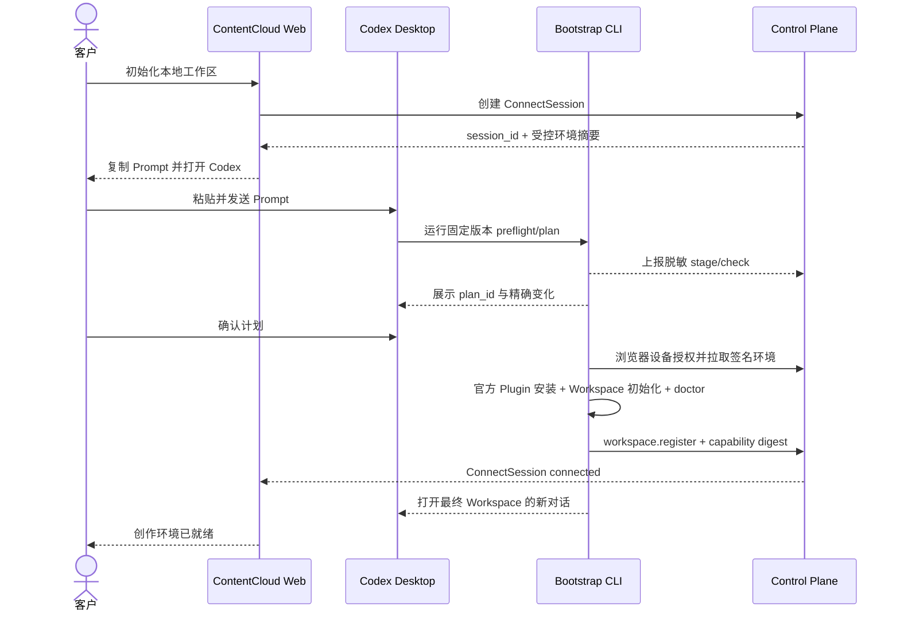

# 客户初始化流程

状态：`代码完成，macOS Desktop 实机验收待执行`。

本文件定义客户从 ContentCloud Web 进入 Codex 创作环境的四条路径。所有路径复用同一个 ConnectSession、同一份服务端 Environment Profile 和同一个 Bootstrap CLI，不为“手工安装”维护第二套实现。

## 1. 支持基线

Web 在创建 ConnectSession 前展示简短前提，Bootstrap CLI 在任何写操作前进行真实检测：

| 检查 | 首版要求 | 检测责任 |
| --- | --- | --- |
| 操作系统 | 首批验收 macOS；Windows 达到同等探针后开放 | CLI |
| Node.js | `>=20` | CLI/启动脚本 |
| npm/npx | 能运行固定版本 `@limecloud/contentcloud` | CLI/启动脚本 |
| macOS Keychain | 当前用户默认 Keychain 可用 | CLI |
| Codex CLI | 版本满足服务端兼容矩阵 | CLI |
| Codex Desktop | 已安装并可以打开本地 Workspace | CLI + Desktop 实测 |
| Codex 登录 | CLI/Desktop 使用预期账号和 Workspace | Codex 宿主 + 用户确认 |
| 网络 | ContentCloud、npm、Git Marketplace 可达 | CLI |
| 本地权限 | Workspace 和 ContentCloud 管理路径可写 | CLI |

教程不得把“命令能执行”当作“环境已正确”。每一步都必须给出机器可验证的通过条件。

## 2. 方案 A：快速初始化

适用于所有预检通过的客户，是 Web 的默认入口。

### 2.1 客户旅程

1. 客户在项目页点击“初始化本地工作区”。
2. Web 创建 ConnectSession，展示将安装的业务能力、数据边界和预计步骤。
3. 客户点击“复制并打开 Codex”。Web 把初始化 Prompt 写入剪贴板，并用不含秘密的 Deep Link 打开新对话。
4. 客户粘贴并发送 Prompt。
5. Codex 运行固定版本 Bootstrap CLI 的只读预检和 plan。
6. CLI 展示目标目录、Marketplace、Plugin、权限、版本和 `plan_id`。
7. 客户确认该计划。
8. CLI 调用官方 `codex plugin marketplace add` 和 `codex plugin add`，完成项目绑定、Environment Lock 和 doctor。
9. CLI 注册 Workspace，并打开绑定最终目录的新 Codex 对话。
10. Web 只在收到 `workspace.register` 后显示“创作环境已就绪”。



其中 Control Plane 只签发环境、接收脱敏进度并验证 Workspace 注册，从不代表客户执行本地安装命令。

### 2.2 唯一授权方式

首次初始化只使用浏览器设备授权：

```text
Web 创建 ConnectSession
  -> Prompt 只携带公开 session_id 和固定 CLI 版本
  -> CLI 生成本地 verifier/challenge
  -> 服务端返回 verification_url 和短 user_code
  -> 浏览器使用已登录 ContentCloud 账号确认项目与设备
  -> CLI 使用仅保存在本机内存中的 verifier 轮询授权结果
  -> 批准后原子创建设备与 Workspace，并把凭据写入 OS Keychain
  -> Attempt Token、verifier 和 Workspace Credential 从不进入 Prompt/URL/日志
```

`bootstrap plan/apply/resume` 是唯一安装事务内核，不存在连接密钥或旧 `init/up` 旁路。

### 2.3 “一键”的准确含义

受 Codex 安装确认、Shell 执行审批和新会话加载边界影响，首版的一键是“一个 Web 入口将客户带到正确流程”，不是静默完成所有操作。以下动作必须对客户可见：

- 发送初始化 Prompt。
- 允许固定版本 CLI 执行。
- 确认精确安装计划。
- 在需要时完成 ContentCloud/Codex 浏览器登录。
- 切换到新项目对话。

## 3. 方案 B：分步引导

快速路径的任一预检失败后，Web 和 Codex 只展示当前失败步骤，不一次抛出完整排障文档。

### 3.1 固定步骤

| 序号 | 阶段 | 通过条件 | 失败时动作 |
| --- | --- | --- | --- |
| 1 | 本机运行环境 | Node 20+、npm/npx 可执行、默认 Keychain 可用 | 打开对应系统安装教程，完成后重新检测 |
| 2 | Codex 环境 | CLI/Desktop 已安装、版本兼容 | 打开官方安装/升级入口，再次检测 |
| 3 | 账号与网络 | Codex 登录，三个必要来源可达 | 浏览器登录或网络诊断 |
| 4 | 工作区选择 | 空目录或已识别的同项目 Workspace | 自动建议安全子目录，冲突时让客户选择 |
| 5 | Marketplace/Plugin | 来源、ref、版本和 digest 精确匹配 | 缺失可安装；同名异源直接阻断并升级支持 |
| 6 | ContentCloud 授权 | 浏览器确认且 PKCE verifier 匹配 | 重新运行 apply 发起新 attempt；过期后只刷新授权步骤 |
| 7 | Workspace doctor | 所有 required check 通过 | 展开第一个失败 check 的修复卡片 |
| 8 | Desktop 交接 | 新对话打开并读到 context | 显示本地路径和恢复 Prompt |

### 3.2 引导卡片

每张卡片固定包含：

- 发生了什么。
- 已经验证了什么。
- 客户现在只需要做的一件事。
- “重新检查”按钮或固定检测命令。
- 不成功时的下一级入口。
- 支持码，不显示秘密和完整日志。

服务端按 `action_id` 返回文案、官方文档链接和适用平台。CLI 只执行编译进版本、可审计的 action handler；服务端文案不能携带任意命令让 Agent 执行。

## 4. 方案 C：恢复已有初始化

下列情况优先恢复，不重新初始化：

- Plugin 已安装，但 Workspace 文件写入中断。
- ContentCloud 浏览器授权已完成，设备和 Workspace 凭据已经安全落盘。
- Environment Manifest/Registry 已落盘，但 doctor 失败。
- `workspace.register` 因短暂网络错误失败。
- Workspace 已就绪，但 Desktop 自动打开失败。

恢复入口：

```bash
npx --yes @limecloud/contentcloud@0.6.0 bootstrap resume <workspace> --accept --json
```

恢复必须满足：

1. 从 Workspace Binding 和安全凭据存储恢复身份，不重新发起浏览器授权。
2. 重新验证 Plugin、Manifest、Registry、Lock 和 managed files。
3. 只修复 ContentCloud 管理范围。
4. 保留业务文件和用户非 ContentCloud 配置。
5. 成功后重新生成 bootstrap handoff 并打开新对话。

若 Marketplace 或 Plugin 是同名异源，恢复必须 fail closed，不自动覆盖。

## 5. 方案 D：手工与客服协助

手工路径不是另一种安装实现，只是把同一事务拆开：

```text
bootstrap preflight/doctor
  -> bootstrap plan
  -> 客户确认 plan_id
  -> bootstrap apply
  -> workspace doctor
  -> bootstrap resume（仅恢复时）
```

客户默认复制服务端根据当前 attempt 生成的固定命令，不自行替换包名、版本、Marketplace URL、ref、Plugin ID 或 `plan_id`。

连续两次在同一个 `check_id` 失败，或出现安全/身份冲突时，Web 提供“生成诊断包”入口。客户可以先预览将上传的字段，再明确确认提交。

## 6. 服务端交互时机

| 时机 | 是否访问服务端 | 数据 |
| --- | --- | --- |
| 创建 ConnectSession | 是 | 项目 ID、邀请人、Environment Profile |
| 本机基础预检 | 默认否 | Node、npx、macOS Keychain、Codex、目录检查留在本机 |
| 拉取兼容策略 | 是 | CLI/宿主版本、平台，不含客户文件 |
| 上报初始化进度 | 是，可重试 | stage/check/status/error code、脱敏版本事实 |
| 浏览器设备授权 | 是 | session、challenge、用户明确批准 |
| 拉取 Manifest/Registry | 是 | 项目授权后的签名环境契约 |
| Plugin 安装 | 访问 Codex Marketplace 来源 | 只安装签名计划中的固定 ref/digest |
| offline doctor | 否 | 检查本地受管状态 |
| Workspace 注册 | 是 | Workspace/Environment/capability digest，不含创作正文 |
| 打开新对话 | 否 | 本地 path 和不含秘密的 handoff |
| 提交诊断包 | 是，需确认 | 允许字段清单见诊断协议 |

禁止每条对话消息 ping 服务端，也禁止为了判断 intent 上传客户正文。

## 7. Web 状态投影

现有 ConnectSession 顶层状态保持不变：

```text
waiting_for_computer -> verifying -> connected
                     -> expired / canceled / failed
```

新增 `progress` 只描述当前初始化 attempt：

```text
prerequisites
codex_ready
workspace_selected
plan_ready
awaiting_confirmation
plugin_installing
authorizing
workspace_initializing
doctor_running
registering
opening_desktop
complete
```

Web 显示真实阶段序号，例如“第 5/13 步：正在验证插件”，不根据时间估算百分比。`needs_action` 时停止自动轮播并展示对应引导卡片。

## 8. CLI 与 Desktop 共用环境

同一机器、同一系统用户、同一 `CODEX_HOME` 下，CLI 和 Desktop 共用 Codex 配置层、个人 Marketplace、已安装 Plugin 及 MCP 配置。项目 Marketplace 只有在两者打开同一 Workspace Root 时共同可见。

以下内容不共享：

- 当前对话上下文。
- 已启动的 MCP 进程。
- 不同 SSH/远程 Host 的文件系统和 `CODEX_HOME`。
- 可能受账号、Workspace 策略或宿主表面限制的授权状态。

因此 doctor 必须记录 `host_id`、`workspace_root_digest` 和有效 `CODEX_HOME` 类型，但默认不上传绝对路径。

## 9. 验收场景

至少覆盖：

1. 全新受支持环境一次成功。
2. Node 缺失、Node 版本过低、npx 不在 Desktop PATH、默认 Keychain 不可用。
3. Codex CLI 缺失、Desktop 缺失、CLI/Desktop 版本不兼容。
4. Codex 未登录或 Workspace 策略禁止 Plugin。
5. npm、Git 来源或 ContentCloud 单点不可达。
6. 目标目录非空、只读、已绑定其他 ContentCloud 项目。
7. Marketplace 缺失、Plugin 缺失、版本过旧、同名异源。
8. 客户拒绝计划、`plan_id` stale、安装中途退出。
9. 授权完成后 doctor 或注册失败，随后 resume 成功。
10. Desktop 自动打开失败，客户用路径和恢复 Prompt 手工进入。
11. 同一个失败重复两次后生成脱敏诊断包。
12. CLI 与 Desktop 使用不同 Host/CODEX_HOME 时明确提示不能共享。
