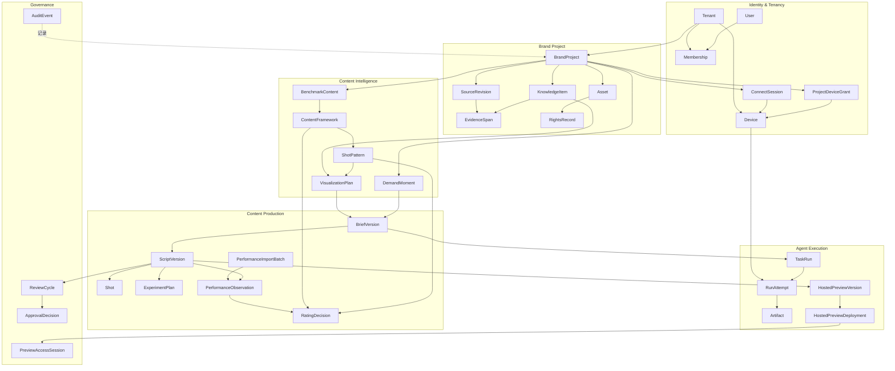
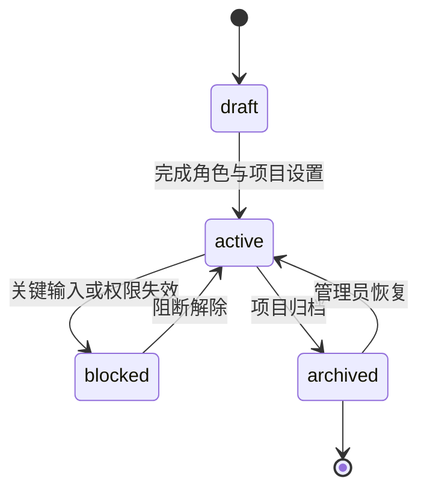
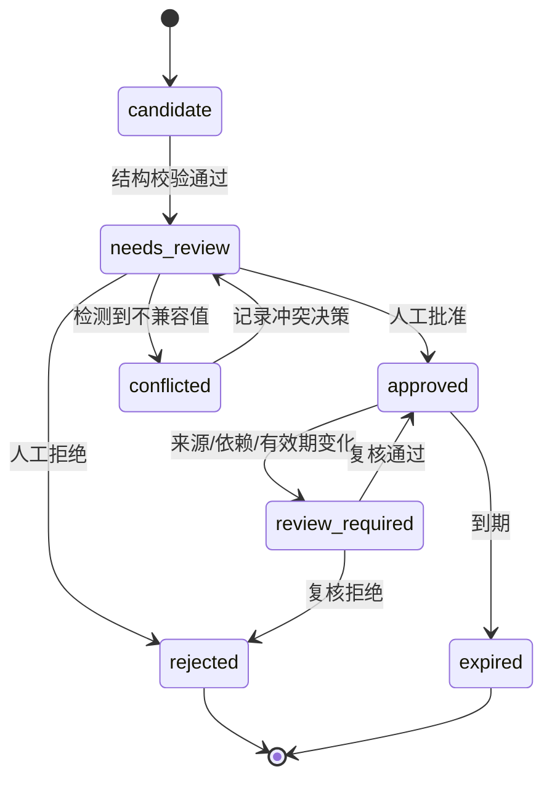
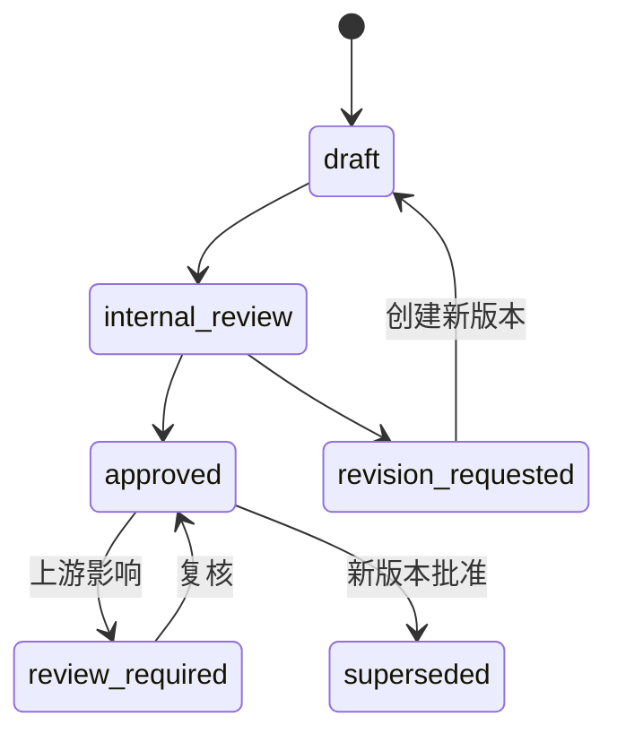
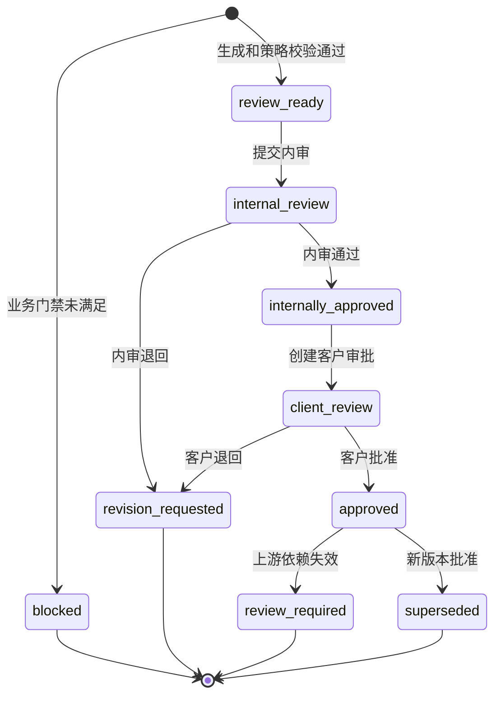
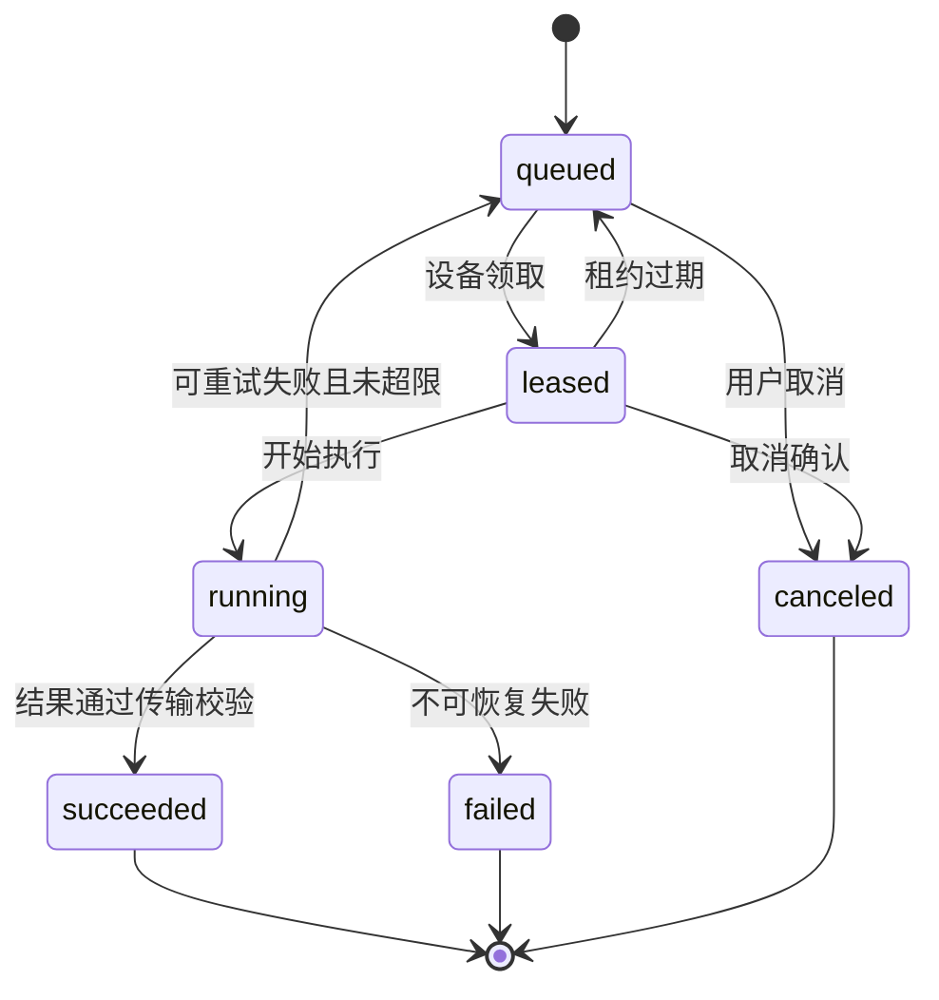

# 领域与数据模型

## 1. 建模原则

1. Postgres 是在线事务事实源；Markdown、YAML、JSON 和 XLSX 是交换格式。
2. 所有业务对象使用 UUIDv7 主键，并保留人类可读 slug；旧 Wiki ID 存入 `legacy_id`。
3. 所有租户业务表包含 `tenant_id`，所有项目业务表同时包含 `project_id`。
4. 来源、Brief、剧本、任务输入和导出均不可变版本化。
5. 状态变化通过领域服务执行，并同步写 append-only `audit_events`。
6. Agent 输出永远是候选输入，不能直接写 approved/valid/published 状态。
7. Run 描述技术执行，Deliverable 描述业务可交付性，两者不得合并。
8. 公共字段关系化；随 `kind` 变化的有限载荷使用 Zod discriminated union + JSONB，避免 EAV。

## 2. 领域边界



## 3. 通用字段

除 join 表外，业务表统一包含：

| 字段 | 类型 | 规则 |
| --- | --- | --- |
| `id` | UUIDv7 | 服务端生成，不接受客户端指定 |
| `tenant_id` | UUIDv7 | 从鉴权上下文注入，不信任请求体 |
| `project_id` | UUIDv7/null | 项目级对象必填 |
| `created_at` | timestamptz | 数据库时间 |
| `created_by` | UUIDv7 | 当前用户或 system actor |
| `updated_at` | timestamptz | 可变元数据使用 |
| `row_version` | integer | 乐观锁，每次更新加一 |
| `legacy_id` | text/null | 迁移旧 Wiki ID，不参与授权 |

不可变版本表不提供通用 UPDATE；修订通过新行和 `supersedes_id` 表达。

## 4. 身份与租户

### 4.1 `tenants`

`id`、`slug`、`name`、`status(active|suspended|closed)`、默认时区、默认保留策略。

### 4.2 `memberships`

唯一键 `(tenant_id, user_id)`；角色为：

```text
tenant_admin | project_manager | strategist | editor | reviewer | viewer
```

V1 不支持自定义角色。项目访问默认继承租户角色，可通过 `project_memberships` 缩小范围，不能扩大租户权限。

### 4.3 `client_reviewers`

记录项目级品牌联系人姓名、组织、联系方式和状态，不创建完整租户成员关系。实际访问由版本绑定的 ReviewGrant 控制。

### 4.4 `devices`

关键字段：`owner_user_id`、名称、hostname、platform、arch、daemon_version、client_capability_manifests、`token_hash`、last_seen_at、revoked_at。manifest 只保存 capability ID、semver、kind、schema 和实现 digest，不保存 Skill/Adapter/Renderer 正文或任何供应商凭据。

数据库永不保存明文 device token。设备属于租户和一个用户；只有租户管理员或设备拥有者可撤销。

### 4.5 `connect_sessions` 与 `project_device_grants`

`connect_sessions` 只能在 BrandProject 创建后由有权限用户生成，字段包括 `project_id`、`inviter_user_id`、`connect_key_hash`、`expires_at`、`consumed_at`、`consumed_device_id` 和状态：

```text
waiting_for_computer | verifying | connected | expired | canceled | failed
```

连接码明文只返回 Web 一次，默认 10 分钟有效；消费必须使用恒时 hash 比较和事务锁，同一 key 只能绑定一次。它不是 device token，也不能读取项目、上传文件或领取任务。

`project_device_grants` 唯一键 `(project_id, device_id)`，保存 `granted_by`、`granted_at`、`revoked_at`。设备属于租户，只有存在有效项目授权且 capability 匹配时才能领取该项目 Run。新项目复用设备只新增 grant，不重装 CLI、不轮换 device token。

## 5. 品牌项目与来源

### 5.1 `brand_projects`

关键字段：品牌名、单品名、渠道、阶段目标、状态、负责人、内部审核人、客户审批人。



### 5.2 `sources` 与 `source_revisions`

`sources` 表示逻辑来源；`source_revisions` 保存每次不可变上传：

- `source_type`：brand_manual、product_spec、rights_proof、visual_asset、methodology、benchmark 等。
- `object_key`、`sha256`、size、declared_mime、detected_mime。
- `processing_status`、parser_version、page_count、language。
- `supersedes_id`、effective_from、effective_to。

对象存储 key 由服务端生成：

```text
tenants/{tenant_id}/projects/{project_id}/sources/{source_id}/{revision_id}/original
```

### 5.3 `evidence_spans`

证据位置不再编码为 `source:id#page=1` 字符串，而是结构化字段：

- `revision_id`
- `locator_kind`: page、paragraph、sheet_cell、slide、image_region
- `locator`: JSONB discriminated union
- `quote_text`、quote_hash、ocr_confidence
- `preview_object_key`

`quote_hash` 防止解析器升级后静默改变引用文字。

## 6. 品牌知识

### 6.1 `knowledge_items`

公共字段：`kind`、`status`、`subject_ref`、`title`、`payload`、valid_from/to、risk_level、decision_required、supersedes_id。

`kind` 与 `payload`：

| kind | 载荷核心字段 |
| --- | --- |
| `fact` | predicate、typed_value、unit、scope |
| `claim` | text、claim_type、allowed_channels、forbidden_expansions、grounded_fact_ids |
| `rule` | rule_type、requirement、applies_to、severity |
| `audience` | identity、needs、constraints、evidence_level |
| `scenario` | context、trigger、constraints |
| `pain_point` | functional/emotional、description、evidence_level |
| `visual_rule` | rule_type、requirement、prohibited_usage |
| `methodology` | template_key、version、instructions、approval_scope |

### 6.2 `knowledge_evidence_links`

多对多连接 KnowledgeItem 与 EvidenceSpan，包含关系 `supports|contradicts|limits`。V1 中所有正式批准的 KnowledgeItem（包括 methodology）至少需要一个 supports：来源版本必须属于同一租户和项目、状态为 `ready`，且 locator kind 与未改写原文必须命中 `accepted` EvidenceSpan。创建候选和批准时都会重新校验，防止伪造 revision ID、跨项目引用、低置信 OCR 或来源状态变化绕过门禁。

ContentCloud 自带的方法论通过版本化本地 Skill 分发，不伪装为客户企业知识。未来若引入“仅由内部决策产生的方法论知识”，需要独立 ApprovalDecision 证据类型和状态机，不在 V1 中用空 evidence 特判。

### 6.3 `knowledge_conflicts`

明确记录同一 subject/predicate 的冲突 item、冲突原因和解决决策。冲突不能通过覆盖或删除解决。

### 6.4 知识状态机



V1 使用统一 `approved` 状态；`rights_records` 单独使用 `valid`，避免把事实、主张和权利状态混为一谈。

### 6.5 `assets` 与 `rights_records`

Asset 保存类型、真实性等级 `T0|T1|T2|T3`、来源修订、派生关系和预览。RightsRecord 保存权利主体、权利类型、范围、渠道、地域、期限、证明和限制。

资产可用于 Task Contract 必须满足：

```text
asset.status = approved
AND rights.status = valid
AND channel in rights.allowed_channels
AND current_time within rights.validity
```

仅用于结构分析的 Benchmark Content 不需要进入生成 Task Contract，但必须标记 `analysis_only`。

## 7. 市场内容上下文

### 7.1 `benchmark_contents`

关键字段：平台、原始 URL、作者/账号别名、内容日期、source_revision_id、rights_mode、validation_level、validation_note。

`validation_level`：

- `observed`：只观察到内容或公开互动。
- `sales_indicated`：有外部销售信号但无法独立核验。
- `internally_verified`：租户掌握真实投放或成交数据并经人工确认。

### 7.2 `content_frameworks`

一个案例可产生多个框架；框架包含：

- `visual_sequence`：镜头功能的有序数组。
- `copy_sequence`：话术功能的有序数组。
- `applicable_product_stage`、difficulty、required_capabilities。
- `status`: draft、approved、review_required、retired。

### 7.3 `shot_patterns`

镜头模式是可复用的决策单元，字段包括：role、purpose、subject、action、setting、props、composition、camera_motion、proof_type、continuity_requirements、failure_modes。

### 7.4 `demand_moments`

结构固定为：

```text
audience + identity + scene + trigger/conflict + desired_result + viewpoint
```

需求时刻必须能映射到具体画面，纯抽象人群标签不能进入正式 Brief。

### 7.5 `selling_points` 与 `visualization_plans`

SellingPoint 引用批准事实/主张，按项目排序。VisualizationPlan 把卖点转换为画面证明，引用 ShotPattern，并记录：

- proof_type：demonstration、process、comparison、sensory_proxy、social_proof、fact_overlay。
- 所需人物、场景、道具、真实素材和 AI 生成部分。
- product_truth_strategy：真实拍摄、真实素材合成、仅环境生成。
- 风险、Plan B 和验收标准。

## 8. Brief、剧本与实验

### 8.1 `briefs` 与 `brief_versions`

Brief 是逻辑对象，BriefVersion 不可变。载荷包含 PRD 定义的目标、人群、需求时刻、卖点、框架、证据、CTA、渠道、时长和测试变量。



### 8.2 `scripts`、`script_versions` 与 `shots`

Script 是逻辑对象；ScriptVersion 保存 canonical JSON、摘要哈希、输入快照 ID、校验报告和状态；Shot 单独关系化以支持镜头级批注、搜索和 XLSX 导出。

ScriptVersion 状态：



`revision_requested` 和 `review_required` 通过创建新版本解决；`blocked` 只能通过补齐输入后创建新版本解除，所有旧版本保持不可变。

### 8.3 `experiment_plans`

字段：baseline_script_version_id、hypothesis、primary_variable、control_fields、variant_values、success_metric、minimum_sample_note。V1 不计算统计显著性，但阻止“声明单变量却改变多个主要字段”。

### 8.4 `performance_observations`

`performance_import_batches` 是一次手工、JSON、CSV 或 XLSX 导入的不可变边界，保存来源文件名、格式、SHA-256、单一币种、总行数、成功行数、操作者和时间。只有整批校验通过才同时写入 Batch 与全部 Observation；失败只返回行级错误报告，不产生半批历史。

`performance_observations` 保存 import_batch_id、源行号、平台、账号别名、发布时间、剧本版本、观察窗口、样本状态、指标、币种、spend、gmv、服务端计算的 roi、问题分类和备注。唯一 dedup key 由项目、剧本版本、平台、账号、发布时间和窗口组成，应用预检与数据库唯一索引共同防并发重复。

`rating_decisions` 保存人工选择的 script_version/content_framework/shot_pattern、引用 Observation IDs、评级、原因、下一步动作和操作者。它是追加式判断证据，不更新被评级对象，不把相关性升级为因果。

## 9. 任务执行模型

### 9.1 `task_runs`

表示一个业务任务：knowledge_extract、brief_generate、script_generate、script_revise。字段包括 subject、input_snapshot_id、schema_version、idempotency_key、state、priority、cancel_requested_at。

### 9.2 `run_attempts`

每次领取创建 Attempt，字段包括 device、capability_id/version/digest、lease_expires_at、heartbeat_at、started/finished_at、exit_code、failure_class、usage 和 transcript_summary。服务端不记录或决定模型；客户端可在脱敏 usage 中自愿报告供应商计量摘要。



同一 Run 最多 3 个 Attempt；瞬时连接错误由 Daemon 在同一 Attempt 内最多重试 2 次，不创建额外业务版本。

### 9.3 `artifacts`

记录 Task Contract、标准业务 JSON、Extension Artifact Envelope、Review Projection、Rendition、校验报告、Markdown/XLSX/JSON 导出和安全日志摘要。每个 Artifact 包含 capability、schema_id、sha256、size、mime、object_key、visibility、retention_class、derived_from_artifact_id 和 purpose。未知客户端结果按 opaque artifact 保存，服务端只验证 envelope、派生关系与存储安全。

服务端根据数据计算 `presentation_tier`，不信任客户端直接声明：核心 Schema 为 `cloud_native`；V1.1 存在通过协议验证且 ready 的部署为 `hosted_preview`；存在允许 MIME 的 rendition 为 `safe_rendition`；来源设备在线为 `local_open`；其余为 `metadata_only`。扩展产物只有绑定合法 `ReviewProjectionV1` 后才可附加到客户审批投影，且审批主对象仍是 ScriptVersion。

### 9.4 Hosted Preview（V1.1/P3）

- `hosted_preview_versions`：绑定不可变 `script_version_id`、canonical manifest hash、capability digest 和 `planned|uploading|validating|ready|rejected|archived|expired`。
- `hosted_preview_deployments`：绑定 preview version，保存独立 host、CSP profile、安全报告、部署和过期时间；ready 后字节与 host 不可修改。
- `preview_access_sessions`：绑定 ReviewGrant 或内部用户、deployment、一次性 nonce hash、短期 session 和撤销状态。

完整字段、Bundle Schema 与状态机以 [09-hosted-preview-and-cli-gateway.md](09-hosted-preview-and-cli-gateway.md) 为准。

## 10. 审核与审计

### 10.1 `review_cycles`、`review_comments`

ReviewCycle 绑定 subject type + immutable version ID。Comment 可定位到 JSON Pointer、shot_id 或全文，支持 resolved 状态但不物理删除。

### 10.2 `review_grants`

保存 token_hash、subject_version_id、subject_hash、可选 `hosted_preview_version_id` 与 `hosted_preview_hash`、reviewer_id、expires_at、revoked_at、max_uses。V1 默认 7 天、最多 20 次查看、1 次最终决策；Preview 更新不自动移动既有 grant。

### 10.3 `approval_decisions`

不可变记录 actor、decision、reason、subject_hash、previous_state 和 resulting_state。最终批准必须使用重新验证过的 ReviewGrant 或内部登录会话。

### 10.4 `audit_events`

包含 actor_type、actor_id、tenant/project、action、subject、before/after 摘要、request_id、IP/设备摘要和时间。敏感正文不复制到 AuditEvent。

### 10.5 Lineage 与 Impact 只读投影

V1 不增加图数据库，也不复制一套可漂移的关系表。应用服务从现有显式外键、冻结 ID 列表和不可变引用生成 `LineageGraph`：`LineageNode` 使用稳定的 `type:id` key，`LineageEdge` 统一按上游到下游保存 relation 与人类可读 reason。聚焦任一对象后，以确定性 BFS 返回 `upstream`、`downstream` 或 `both` 子图。

`ImpactAnalysis` 是同一图上的只读下游投影，每项固定返回受影响 Node、路径深度、原因、当前状态、严重度和建议动作。它不修改业务状态，不自动创建 Brief/Script 修订，也不把效果相关性解释成因果。关系投影覆盖 Source/Revision、Asset/Rights、Knowledge、Framework/ShotPattern/VisualizationPlan、BriefVersion、TaskRun、ScriptVersion、Artifact、ImportBatch、Observation 和 RatingDecision。

## 11. 索引与约束

- 所有项目表索引 `(tenant_id, project_id, created_at)`。
- `source_revisions` 唯一 `(tenant_id, project_id, sha256)`，允许显式登记同哈希别名但不重复存字节。
- `task_runs` 唯一 `(tenant_id, idempotency_key)`。
- `connect_sessions` 的 `connect_key_hash` 全局唯一；只允许从 `waiting_for_computer` 原子消费一次。
- `project_device_grants` 唯一 `(tenant_id, project_id, device_id)`；项目和设备必须属于同一租户。
- `script_versions` 唯一 `(script_id, version_number)` 和 `(tenant_id, content_hash)` 的非唯一检索索引。
- `performance_observations` 对 `(tenant_id, project_id, dedup_key)` 建部分唯一索引；Batch、Observation 和 RatingDecision 禁止 update/delete。
- 活跃租约部分索引 `state in ('leased','running')`。
- ReviewGrant token 使用恒时哈希比较；明文只返回一次。
- RLS policy 使用事务级 `app.tenant_id`，后台 Worker 通过显式 service role 并仍要求 tenant predicate。

## 12. `jinling-gudu` 迁移映射

| 旧对象 | 新对象 | 迁移规则 |
| --- | --- | --- |
| Source | Source + SourceRevision | 校验原路径与 SHA-256；上传原件后创建修订 |
| Evidence | EvidenceSpan | 把字符串 locator 解析为结构化位置，失败则 needs_review |
| FactAssertion | KnowledgeItem(kind=fact) | 保留 typed value、source_refs 和 legacy_id |
| Claim | KnowledgeItem(kind=claim) | 保留 grounded facts、渠道、风险和 decision refs |
| BrandVisualRule | KnowledgeItem(kind=visual_rule) | 迁移适用范围和禁止用法 |
| Audience/Scenario/PainPoint | 对应 KnowledgeItem | 不自动升级 evidence_level |
| Asset/RightsRecord | Asset/RightsRecord | 必须重新绑定对象存储字节和权利证明 |
| ConflictRecord | KnowledgeConflict | 保留所有冲突 item，不迁移成 canonical 值 |
| KnowledgePack | Context Snapshot | 不作为权威实体迁移，按新模型重新编译 |
| IntentTemplate | Workflow Template | 迁移为候选模板，管理员批准后启用 |
| CreativeDraft/ContentVersion | ScriptVersion | 解析失败时保存 legacy artifact，不伪造 Shot |
| RunContext | TaskRun/RunAttempt/AuditEvent | 旧 Run 只读导入，不参与新租约系统 |
| ServiceOffer/MethodologyDimension | Tenant Template | 与客户事实分离，迁移为全局或租户模板 |

迁移器输出逐对象报告：`imported`、`needs_review`、`legacy_only`、`failed`。任何旧 `approved/verified/valid` 状态只有在证据、决策人和依据均可解析时才保留，否则降为 `needs_review`。
