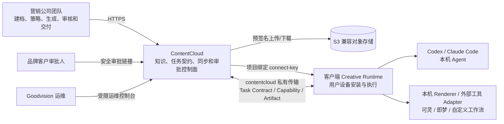
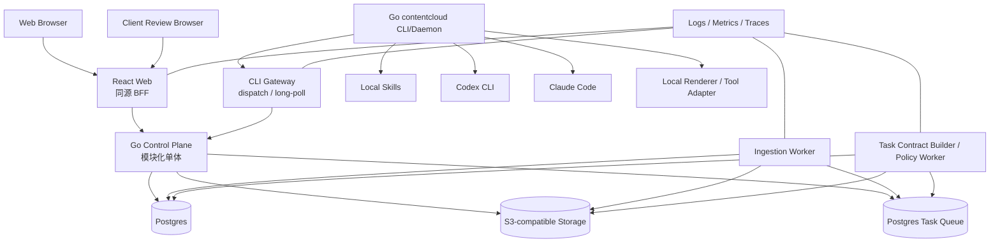
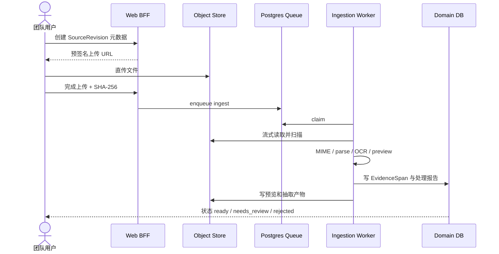
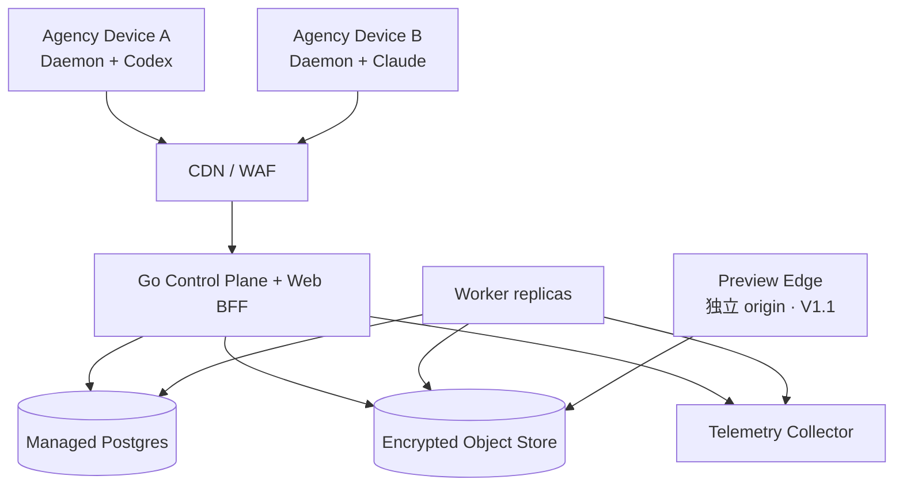

# 系统架构

## 1. 架构目标

- 云端提供可信、多租户、可审计的业务控制面和确定性同步契约。
- 本地 Creative Runtime（Daemon/CLI）使用客户自己的 Skill、Agent、Renderer、订阅、凭据和模型选择。
- 服务端不调用、代理、编排或保存任何 LLM；它不拥有 prompt、Agent 实现或模型供应商凭据。
- Agent 看见的上下文最小、不可变、可复现。
- 原始资料与 Agent 输出都视为不可信输入，经过确定性校验后才进入领域库。
- 首版组件足够支持横向扩展，但不提前引入 Redis、Kafka、Kubernetes 或微服务网络。
- 项目先于设备：服务端先建立 BrandProject 授权边界，再生成短期连接码引导本机安装。
- CLI-first：所有 Agent、Renderer、脚本和 CI 通讯只经过 `contentcloud`，内部 HTTP 和对象存储协议不作为公共 API。

## 2. 系统上下文



## 3. 容器架构



### 3.1 Web 与同源 BFF

React/TypeScript 职责：项目工作台、审批页面和客户端接入引导。Go BFF 职责：session、CSRF、租户上下文和页面聚合 DTO。浏览器只访问同源 BFF；BFF 调用领域服务，不把 HTTP 路由或上传许可定义为公开 SDK。不得执行用户 Agent 或解析不可信大型文件。

### 3.2 Ingestion Worker

职责：恶意文件扫描、MIME 检测、Office/PDF 文本提取、中文 OCR、预览生成和 EvidenceSpan 定位。每种 parser 记录版本，输出不可直接成为批准知识。

V1 Worker 镜像固定包含 ClamAV、LibreOffice headless、Poppler 和 Tesseract `chi_sim+eng`。Go Worker 负责编排、资源限制和结构化结果；低置信度 OCR 必须人工复核，不通过模型猜测补字。

### 3.3 Task Contract Builder / Policy Worker

职责：

- 从已批准领域对象确定性构建最小 Task Contract。
- 生成 manifest、输入快照、capability 要求和 JSON Schema。
- 执行事实、主张、权利、渠道、画面证据和变体规则。
- 生成影响分析、导出文件和确定性校验报告。

它不是 LLM orchestration：不生成 prompt、不选择模型、不调用 Agent/Renderer、不保存任何客户端 Skill 实现。它只能按领域关系、版本和规则生成声明式契约。

### 3.4 CLI Gateway

职责：按 user CLI session、device token 和 run token 分流统一 dispatch；处理 ConnectSession、capability 上报、long-poll、租约、heartbeat、进度、取消、结果和 Artifact 上传授权。Gateway 不信任 Daemon 回传的 tenant/project ID，只从项目授权和租约解析作用域。所有 handler 调用控制面的同一领域服务。

### 3.5 客户端 Creative Runtime（Daemon/CLI）

职责：连接服务器、声明聚合后的业务 capability、领取任务、构建临时目录、校验输入哈希、按本机策略解析 Skill/Agent/Renderer、验证输出 Schema、生成可选审阅投影与安全预览件、回传结果并清理临时文件。

Runtime 是 Go 单二进制，首次从项目页生成的命令安装到用户电脑，并注册为用户级后台服务。所有 LLM 和视频工具调用都在这里发生。Runtime 不持续同步用户目录，不接受云端指定任意绝对路径，不开放入站端口，不执行服务器下发的任意 shell、JavaScript 或插件；服务端只提供 capability ID、版本下限和声明式 Task Contract，Runtime 只解析本机已安装的对应实现。

### 3.6 本地 Skill 与 Renderer 插件

服务端只接收聚合后的业务 capability，使用稳定 `id + version + input/output schema + presentation profiles` 描述。V1 内置 `script.generate`、`knowledge.extract`、`artifact.export`；客户端可通过任意组合实现这些能力，也可新增 `video.submit`、`preview.compose` 或客户自定义工作流，而不修改服务端业务核心。

- **Skill**：把 Task Contract 转为本地 Agent 所需的上下文、提示和步骤。
- **Agent Adapter**：处理 Codex/Claude 等本机 CLI 的能力差异。
- **Renderer Adapter**：把标准 Script Package 转为具体工具输入、预览、参考资产合成或外部任务；其质量和凭据责任属于客户端。
- **客户端私有目录**：具体 Skill、Agent Adapter、Renderer Adapter、模型与凭据不上传；服务端也不展示这些实现供用户选择。
- **服务端稳定核心**：只保存业务 capability 元数据、输入/输出哈希、标准业务状态、Artifact 索引和审计事件；未知扩展结果以受限 Artifact 保存。

## 4. 推荐仓库结构

```text
contentcloud/
├── cmd/
│   ├── contentcloud-server/  # Go Web BFF + CLI Gateway
│   ├── contentcloud-worker/  # Go 摄取/策略/导出 Worker
│   └── contentcloud/         # Go CLI/Daemon 单二进制
├── internal/                 # Go 领域模块与平台适配
├── web/                      # React + TypeScript SPA
├── contracts/                # OpenAPI 3.1、JSON Schema、生成配置
├── migrations/               # PostgreSQL/Goose SQL
├── fixtures/                 # Golden Task/Script/Artifact fixtures
├── docs/roadmap/v1/
├── go.mod
└── package.json
```

依赖方向固定：`cmd -> internal application/domain -> ports`；领域模块不依赖 HTTP、Postgres、S3、Web 或具体 Agent。Web 只使用由 OpenAPI 生成的 TypeScript client。

## 5. 关键技术选择

| 领域 | 选择 | 理由 |
| --- | --- | --- |
| Control Plane | Go 1.24 模块化单体 | 并发、租约、文件流、可运维性和单一部署边界 |
| Runtime | Go 1.24 + Cobra | 无常驻 Node.js 依赖的跨平台单二进制；与飞书 CLI 的成熟分发方式一致 |
| Web | React + TypeScript + Vite | 安静高密度工作台；通过生成 client 访问同源 Go BFF |
| DB | Postgres + pgx/sqlc/goose | 多租户事务、JSONB、RLS、显式 SQL 和迁移 |
| Queue | Postgres `SKIP LOCKED` | 8 周试点规模足够，避免 Redis 双写与运维 |
| Object Store | S3 compatible | 原始资料和大产物不进入数据库 |
| Contracts | OpenAPI 3.1 + JSON Schema 2020-12 | 跨 Go/TypeScript 的单一传输事实源，供 Codex/Claude structured output 使用 |
| Auth | Go session + Argon2id + 邮件验证码 | 团队使用已验证邮箱；客户 ReviewGrant 不创建租户 session |
| Observability | OpenTelemetry + `slog` JSON | 统一 request/run/attempt trace，不记录原始敏感正文 |

## 6. 任务队列与 Worker

Worker 使用数据库事务领取任务：

```sql
SELECT id
FROM task_runs
WHERE state = 'queued' AND available_at <= now()
ORDER BY priority DESC, created_at
FOR UPDATE SKIP LOCKED
LIMIT 1;
```

领取后创建 RunAttempt 和租约。所有状态转换通过 compare-and-set 检查当前状态和 row_version。Worker 可多实例运行，不运行单进程内 scheduler。

不使用 exactly-once 假设；通过幂等键、不可变输入快照和唯一业务版本约束实现 effectively-once 结果。

## 7. 来源摄取数据流



上传完成前对象不可被任务引用。Worker 对压缩炸弹、宏、外部关系、超大 Sheet 和损坏文件设置资源上限。

## 8. Task Contract Builder

Task Contract Builder 不是简单拼接所有 Markdown，更不是 prompt 生成器。它执行确定性查询并输出以下内容：

1. `manifest.json`：contract、tenant/project、task、schema、所有文件哈希。
2. `contract.json`：任务意图、允许的输入、capability ID/最低版本、输出 Schema 和保留/变化项；不含 prompt 或执行步骤。
3. `knowledge.json`：本次所需 approved 知识和 Evidence 摘要。
4. `content-intelligence.json`：批准框架、镜头模式、需求时刻和评级依据。
5. `brief.json`：不可变 BriefVersion。
6. `assets/`：明确允许下发的小型参考素材；外部分析素材默认不下发字节。
7. `output.schema.json`：客户端最终返回的核心业务结构。

选择算法：从 Brief 引用开始沿显式关系闭包展开；不得按“可能有用”把项目全部知识塞入任务。每个 contract 保存构建器版本和输入对象版本列表，可完全重放。客户端收到 contract 后，使用本机 capability 解析实际 Agent/Renderer 行为；该行为不上传至服务端。

## 9. Artifact 展示与审阅架构

云端不追求渲染所有客户端格式。每个核心 Script Package 使用服务端稳定组件渲染；扩展 Artifact 通过同一个 envelope 接入，并按下列确定性顺序选择展示方式：

1. `cloud_native`：服务端认识的核心 Schema，显示结构化剧本、引用和校验结果。
2. `hosted_preview`：V1.1/P3 由客户端构建、通过协议验证并托管在独立 origin 的静态交互页面。
3. `safe_rendition`：客户端附带 PNG/JPEG/WebP、H.264 MP4、PDF 或纯文本预览件，服务端只做 MIME、恶意文件、大小和派生哈希校验后展示。
4. `local_open`：来源设备在线时，Web 创建只含 Artifact ID 的声明式打开请求，由客户端本机插件解释；服务端不发送命令、路径或插件代码。
5. `metadata_only`：显示类型、大小、hash、capability、来源设备和校验状态，并只允许 attachment 下载。

扩展产物若需要进入客户可见范围，客户端必须同时生成 `ReviewProjectionV1`，只包含标题、摘要、镜头/页面索引、缩略图引用、警告和与 ScriptVersion 的对应关系。Review Projection 是可审阅投影而非源文件，审批决定始终绑定核心 ScriptVersion hash。未知格式因此可以无限增加，但不会扩大云端执行面或迫使服务端安装对应 Renderer。

Hosted Preview 的独立 origin、CSP、manifest/hash 同步与审批访问以 [09-hosted-preview-and-cli-gateway.md](09-hosted-preview-and-cli-gateway.md) 为准；它不进入 V1 八周关键路径。

## 10. 客户端 Creative Runtime 安全模型

### 10.1 通用边界

- 每个 Attempt 使用全新随机临时目录，权限仅当前用户可读。
- Daemon 只写入该临时目录；输入完成后设置只读。
- 进程环境采用 allowlist，不把服务器 token、其他项目路径或通用 shell 环境注入 Agent。
- Agent 无需写文件，最终结果从 stdout 读取；Daemon 写入和上传产物。
- 超时、输出字节和 stderr 均有上限；日志先脱敏再回传。

### 10.2 Codex Adapter

使用经运行时 capability 检查确认的参数：

```text
codex exec --cd <contract_dir> --sandbox read-only --ephemeral
  --ignore-user-config --output-schema <schema> --json -
```

认证仍由本机 Codex 管理。V1 不使用 `danger-full-access` 或 bypass approvals。

### 10.3 Claude Code Adapter

使用：

```text
claude --print --safe-mode --no-session-persistence
  --permission-mode dontAsk --tools Read
  --json-schema <schema-json> --output-format stream-json <prompt>
```

`--safe-mode` 禁用项目自定义、插件、Hooks、MCP 和自动记忆，同时保留用户现有的本地认证。Daemon 启动前执行 capability probe；不开放 Bash、Write、Edit、Web、MCP 或浏览器工具。

## 11. 多租户边界

1. Web 请求解析登录会话和活动 tenant，再开始数据库事务。
2. 事务设置 `SET LOCAL app.tenant_id`，RLS 只返回当前租户。
3. Domain Service 仍显式传 tenant/project，避免只依赖 RLS。
4. 对象存储 key 不接受客户端拼接；预签名函数先验证对象归属。
5. Device token 只能访问绑定设备的租户及已分配 Run lease。
6. Run token 只能访问单个 Attempt 的 Task Contract 和结果上传位置。
7. 客户 ReviewGrant 只能读取绑定 subject version 的投影视图。

## 12. 部署拓扑



试点采用一个生产环境和一个独立 staging 环境。环境使用不同数据库、bucket、密钥和域名；禁止共享客户资料。数据库迁移由发布任务单独执行，应用实例不并发运行 DDL。

## 13. 可观测性

统一关联字段：`request_id`、`tenant_id`、`project_id`、`task_run_id`、`attempt_id`、`device_id`。日志不得包含原始文档正文、完整 prompt、审批 token、device token 或模型凭据。

核心指标：

- Web BFF 与 CLI Gateway 请求率、错误率和延迟。
- 队列深度、排队时间、租约过期率和重试率。
- 摄取成功率、OCR 低置信度率和单文件处理时长。
- Agent 按适配器的成功率、Schema 失败率、时长和用户侧估算成本。
- Script policy 阻断类型和首次校验通过率。
- Review link 创建、打开、过期和决策数量。
