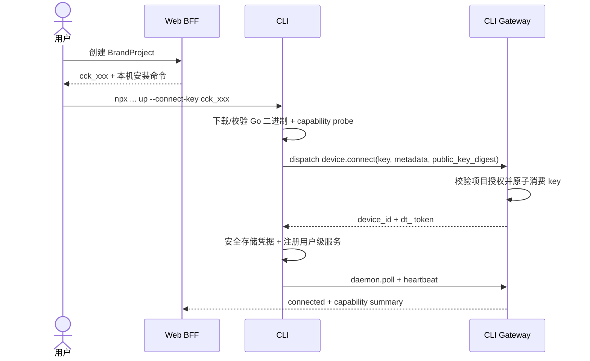
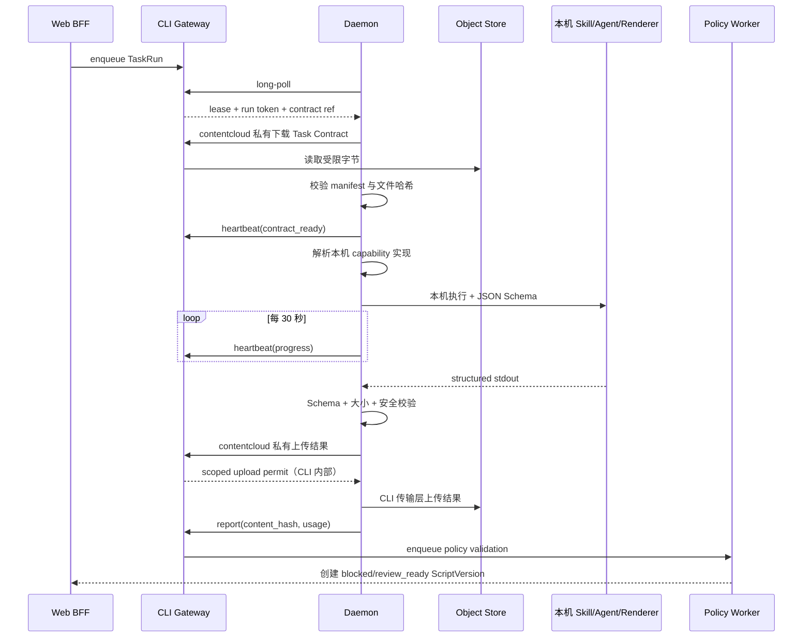

# CLI 命令、客户端创作运行时与私有传输契约

## 1. 协议原则

- CLI 是 Agent、Skill、Renderer、Shell、CI 和第三方程序访问 ContentCloud 的唯一公开程序化接口；Agent 指引不得出现 `curl`、内部 HTTP 路径、预签名 URL 或对象存储 SDK。
- Web 仅面向人工交互，通过同源 Go BFF 调用相同领域服务；它不是公共 SDK。
- CLI 私有传输前缀统一 `/api/v1`，JSON 使用 `snake_case`，时间使用 UTC RFC 3339；路径与 header 不构成集成兼容承诺。
- 所有 CLI 写命令生成幂等键；资源更新携带 row version。Daemon 使用 device bearer token，Attempt 使用短期 run token，用户 CLI 使用浏览器/device flow 会话。
- 服务端从凭据解析租户和作用域，不接受客户端用请求体覆盖。
- OpenAPI 3.1、JSON Schema 2020-12 和 golden fixtures 是 Go 服务端、Go CLI 与 TypeScript Web 的唯一传输契约源。
- HTTP handler、CLI dispatch 和 Worker 必须调用同一 application service，授权与状态转换不得复制。

## 2. CLI 输出与传输响应

默认输出简洁人类文本；Agent 和脚本必须使用 `--json`。JSON 成功只写 stdout，进度与诊断只写 stderr，结构化错误只写 stderr，成功退出码为 0。CLI 私有传输可以使用 `201/202/204`，但这些 HTTP 细节不暴露给调用方。

错误格式：

```json
{
  "ok": false,
  "command": "brief.approve",
  "request_id": "req_...",
  "error": {
    "type": "policy",
    "subtype": "knowledge_blocked",
    "code": "KNOWLEDGE_BLOCKED",
    "message": "当前 Brief 引用了不可用知识",
    "retryable": false,
    "hint": "先处理 details 中的知识项",
    "details": [
      {"path": "/primary_selling_point", "reason": "claim review_required"}
    ]
  }
}
```

CLI 成功 envelope 固定为 `{ok, command, request_id, data, meta}`；错误 envelope 固定为 `{ok:false, command, request_id, error:{type, subtype, code, message, retryable, hint, details}}`。错误码稳定，message/hint 可本地化。对无权对象统一返回 `RESOURCE_NOT_FOUND`，避免泄漏存在性；输出不得含完整 token、Cookie、上传许可或客户正文。

## 3. CLI 私有传输映射

以下 HTTP 表只用于 Go CLI、Web BFF 与服务端联调，不是公共 REST API，不得出现在 Agent Skill、客户脚本或第三方集成文档。对外 CLI 命令统一封装认证、幂等、分页、错误、上传许可与重试；长期收敛到 `/api/v1/cli/dispatch`，由 `command` 和凭据类型路由同一领域服务。

### 3.1 租户和项目

| 方法 | 路径 | 权限 | 说明 |
| --- | --- | --- | --- |
| GET | `/tenants` | 登录用户 | 列出成员租户 |
| POST | `/tenants` | 登录用户 | 创建租户 |
| POST | `/tenants/{id}/members` | tenant_admin | 邀请成员 |
| DELETE | `/tenants/{id}/members/{user_id}` | tenant_admin | 撤销成员 |
| GET/POST | `/projects` | viewer/project_manager | 列表/创建项目 |
| GET/PATCH | `/projects/{id}` | 项目成员/manager | 查看/更新可变元数据 |
| POST | `/projects/{id}/archive` | project_manager | 归档项目 |

### 3.2 来源、知识和素材

| 方法 | 路径 | 说明 |
| --- | --- | --- |
| POST | `/projects/{id}/sources` | 创建来源与 pending revision |
| POST | `/source-revisions/{id}/upload-url` | 获取单文件预签名 URL |
| POST | `/source-revisions/{id}/complete` | 提交 sha256/size 并排队摄取 |
| GET | `/source-revisions/{id}/evidence` | 分页查看证据位置 |
| POST | `/projects/{id}/knowledge-extraction-runs` | 创建提取任务 |
| GET | `/projects/{id}/knowledge-items` | 按 kind/status/risk 搜索 |
| POST | `/knowledge-items/{id}/review` | approve/reject/conflict/return |
| GET | `/knowledge-items/{id}/impact` | 上下游影响分析 |
| POST | `/projects/{id}/benchmark-contents` | 登记对标内容 |
| POST | `/benchmark-contents/{id}/frameworks` | 新建双框架 |
| POST | `/frameworks/{id}/shot-patterns` | 新建镜头模式 |

### 3.3 Brief、剧本和结果

| 方法 | 路径 | 说明 |
| --- | --- | --- |
| POST | `/projects/{id}/selling-points` | 创建/排序卖点 |
| POST | `/selling-points/{id}/visualization-plans` | 创建画面证明方案 |
| POST | `/projects/{id}/briefs` | 创建逻辑 Brief |
| POST | `/briefs/{id}/versions` | 创建不可变版本 |
| POST | `/brief-versions/{id}/review` | 内审状态转换 |
| POST | `/brief-versions/{id}/script-runs` | 创建生成任务 |
| GET | `/task-runs/{id}` | 状态、Attempt、进度和校验结果 |
| POST | `/script-versions/{id}/review-cycles` | 提交内审或客户审批 |
| POST | `/script-versions/{id}/exports` | 生成 md/xlsx/json Artifact |
| GET | `/artifacts/{id}/presentation` | 返回服务端计算的展示等级、可用 rendition 与允许操作 |
| GET | `/artifacts/{id}/download` | 返回强制 attachment 的短期预签名下载地址 |
| POST | `/artifacts/{id}/local-open` | 为兼容在线设备创建只含 Artifact ID 的声明式打开请求 |
| POST | `/projects/{id}/performance-imports` | 原子导入手工/JSON/CSV/XLSX 结果批次 |
| GET | `/projects/{id}/performance-imports` | 查看不可变 ImportBatch 历史 |
| GET | `/performance-imports/{id}` | 查看批次与 Observation 行级关系 |
| POST | `/projects/{id}/rating-decisions` | 创建引用 Observation 的人工评级决策 |
| GET | `/projects/{id}/lineage?focus_type=&focus_id=&direction=` | 项目全图或任一对象的双向追溯 |
| GET | `/projects/{id}/impact?focus_type=&focus_id=` | 下游影响对象、原因、状态和建议动作 |

## 4. CLI 命令面与安装

npm 安装器和 Go 可执行文件分别为 `@goodvision/contentcloud` 与 `contentcloud`。参考飞书官方 CLI，业务逻辑位于跨平台 Go 单二进制；npm 只负责选择 OS/arch、下载、校验并调用它，Daemon 常驻不依赖 Node.js。

```text
contentcloud auth login|status|logout
contentcloud up|status|doctor|down|update
contentcloud context show|use|clear
contentcloud tenant list
contentcloud project list|show|resolve
contentcloud device list|show|attach|detach
contentcloud source upload|status
contentcloud knowledge list|show|review
contentcloud brief show|approve
contentcloud run create|list|show|cancel|log
contentcloud artifact register|list|presentation|download|open|open-status
contentcloud preview publish|status|open|archive
contentcloud review create|status
contentcloud result list|import|batches|batch-show|rate|ratings
contentcloud lineage show|impact
contentcloud audit list
contentcloud schema [command]
contentcloud skills list|read|status|install
contentcloud request get <allowlisted-resource>
```

- 所有读命令支持 `--json`；列表默认 `--limit 20`、最大 100，并返回 `next_cursor`。
- 写命令只做一个具名动作并支持 `--dry-run`；审批与设备撤销还要求显式确认和对应 RBAC。
- `schema` 返回命令参数、输出、权限和风险级别，不返回私有 HTTP 路径或 header。
- `lineage show` 的关系方向固定为上游到下游；`--type/--id` 必须成对出现，`--direction` 只接受 `upstream|downstream|both`。`lineage impact` 只读计算下游传播，不触发 Agent 或业务状态变更。
- `request get` 是 allowlist 只读诊断出口；V1 不提供任意 POST/PUT/PATCH/DELETE raw escape hatch。
- `doctor --json` 在未登录时也成功返回安装、版本、安全凭据存储、网络、临时目录和 capability 分项状态；`--offline` 跳过网络检查。
- `up` 幂等：消费项目连接码、检测并聚合本机业务 capability、保存设备凭据并确保只有一个 Daemon；不上传 Skill/Agent/Renderer 清单、模型、prompt 或工具凭据。
- device token 只存经逐平台验收的安全凭据存储；配置文件仅保存 server URL、device ID 和非敏感偏好。Linux 无 Secret Service 时 `up` fail closed，不降级为明文或可逆配置文件。
- `skills list/read` 读取 binary 内嵌的 Agent 使用说明；`skills status/install` 检查或安装与当前 CLI 版本匹配的 ContentCloud Skill。
- 项目上下文依次取 `--project`、`CONTENTCLOUD_PROJECT_ID`、当前目录 `.contentcloud/project.json`、唯一授权项目；多项目歧义返回 `PROJECT_CONTEXT_REQUIRED`，不得静默使用最近项目。
- 命令风险固定为 `read/write/high-risk-write`。高风险写入缺少 `--yes` 时返回 `CONFIRMATION_REQUIRED` 和 exit 10；Agent 只有取得用户明确确认后才能用原 argv 追加 `--yes`。

### 4.1 稳定退出码

| Code | 含义 |
| --- | --- |
| 0 | 成功，包括空结果和 dry-run |
| 1 | 未分类内部错误 |
| 2 | 参数、Schema 或输入校验失败 |
| 3 | 登录、凭据或安全存储错误 |
| 4 | RBAC、项目授权或策略拒绝 |
| 5 | 网络、超时或服务不可达 |
| 6 | 版本、幂等或并发冲突 |
| 7 | 内容安全、Artifact 或 Task Contract 校验失败 |
| 10 | 等待用户确认高风险操作 |

### 4.2 用户 CLI 登录

用户命令与 Daemon 不能共用凭据。`contentcloud auth login --no-wait --json` 立即返回短期 `device_code`、原样 `verification_url`、过期时间和轮询间隔；Agent 把链接交给用户并结束当前交互。用户确认完成后，后续交互执行 `contentcloud auth login --device-code <code> --json`，将 `ct_` 写入平台安全凭据存储。项目安装连接继续使用 `cck_`，不要求先执行用户登录。

### 4.3 结果批次与人工评级命令

```bash
contentcloud --json result import ./results.csv --project "$PROJECT_ID" --dry-run
contentcloud --json result import ./results.csv --project "$PROJECT_ID"
contentcloud --json result batches --project "$PROJECT_ID"
contentcloud --json result batch-show "$BATCH_ID"
contentcloud --json result rate script_version "$SCRIPT_VERSION_ID" \
  --project "$PROJECT_ID" \
  --observation "$OBSERVATION_ID" \
  --rating seed_candidate \
  --reason "人工复盘依据" \
  --next-action "创建单变量变体" \
  --dry-run
contentcloud --json result ratings --project "$PROJECT_ID"
```

- `result import` 先在本机严格解析文件，再用一次 CLI dispatch 提交整批 typed rows；不逐行调用服务端。
- 服务端验证所有行的剧本归属、发布时间、窗口、指标、公式注入、批次币种和重复键。任一行失败时返回 `RESULT_IMPORT_REJECTED`，`error.details.row_errors` 包含源行号、字段和稳定错误码，批次与 Observation 均不落库。
- 去重键由 `project + script_version + platform + account_alias + published_at + window_hours` 规范化后计算，不信任客户端提交的 dedup key。
- `spend` 与 `gmv` 非零时币种必填；同一批次只允许一种 ISO 三位币种。持久化 ROI 始终由服务端计算 `gmv / spend`，客户端 `roi` 只作为兼容输入且不会成为事实源。
- ImportBatch、PerformanceObservation 和 RatingDecision 都是追加式不可变记录。评级必须由人明确选择 Observation、对象、结论、依据和下一步动作；服务端不自动修改 ScriptVersion、ContentFramework 或 ShotPattern 状态。

## 5. 项目优先的 Connect Session

1. 登录用户先在 Web 创建 BrandProject，再从项目页创建 `connect-key`；key 绑定 tenant、project 和邀请人，有效期 10 分钟、仅可消费一次。
2. Web 展示 `npx --yes @goodvision/contentcloud@latest up --server-url <url> --connect-key <cck_...>`，以及可复制给 Codex/Claude Code 的同义提示。
3. npm 安装器在用户电脑下载并校验 Go 单二进制；CLI 执行 capability probe，提交 key、设备元数据和设备公钥摘要。
4. 服务端原子消费 key，生成 32 字节随机 device token，只通过 TLS 返回一次，并创建当前项目的 ProjectDeviceGrant。
5. CLI 将 server URL/device ID 写配置，将 token 写平台安全凭据存储，并注册用户级后台服务。
6. 首次 poll 上报 CLI version 与聚合 capabilities；首个有效 heartbeat 后页面由 `verifying` 变为 `connected`。
7. 同一租户已有设备加入其他项目时只创建 ProjectDeviceGrant，不重复安装、不轮换 device token。



`cck_`、user CLI session `ct_`、device token `dt_` 和 run token `rt_` 使用不同前缀与验证器，不能互换。连接码不是读取凭据；过期或重放统一失败且不泄漏项目是否存在。

## 6. Poll、租约和 Heartbeat

### 6.1 Poll

```http
POST /api/v1/device/poll
Authorization: Bearer dt_...
Content-Type: application/json

{
  "daemon_version": "1.0.0",
  "capabilities": [
    {
      "id": "contentcloud.script.generate",
      "version": "1.0.0",
      "kind": "business_capability",
      "input_schema": "task-contract/1.0",
      "output_schema": "script-package/1.0",
      "presentation_profiles": ["review_projection/1.0", "hosted_preview/1.0", "image", "video", "local_open"]
    },
    {
      "id": "contentcloud.artifact.export",
      "version": "1.0.0",
      "kind": "business_capability",
      "input_schema": "script-package/1.0",
      "output_schema": "artifact-envelope/1.0",
      "presentation_profiles": ["review_projection/1.0", "image", "video", "pdf", "text", "local_open"]
    }
  ],
  "active_attempt_id": null
}
```

服务端最多保持 25 秒。无任务返回 `204`；有任务返回一次性 lease。一个设备同时最多执行一个 Attempt，后续可配置并发但不进入 V1。

### 6.2 Lease

默认租约 5 分钟，运行中每 30 秒 heartbeat 续租。租约响应包含：

- run_id、attempt_id、task_type。
- run token，有效期等于租约加 2 分钟 grace。
- contract manifest URL，10 分钟有效。
- timeout_ms，默认 30 分钟。
- required capability ID、最低版本和 input/output schema digest。服务端不得指定 Agent、模型或 Renderer 实现。

### 6.3 Heartbeat

```http
POST /api/v1/attempts/{attempt_id}/heartbeat
Authorization: Bearer rt_...

{
  "sequence": 4,
  "phase": "client_executing",
  "progress": {"step": 3, "label": "生成镜头约束"}
}
```

sequence 必须单调递增。取消请求在 heartbeat 响应返回；Daemon 先终止子进程，再报告 canceled。

## 7. 执行与报告时序



## 8. 重试与幂等

- 创建 TaskRun 的幂等键由客户端生成；重复请求返回原 Run。
- `report` 唯一键为 attempt_id；相同 content hash 重放返回成功，不同 hash 返回 `409 REPORT_CONFLICT`。
- 租约过期但无终态报告时，Attempt 标为 expired；Run 在重试次数未耗尽时重新 queued。
- 客户端 capability 输出 Schema 错误属于 `capability_output_invalid`，最多创建 2 个修复 Attempt；第三次失败终止 Run。
- 认证、租户、输入哈希和 policy violation 不自动重试。
- canceled、succeeded、failed 为 Run 终态，晚到报告只记录安全审计，不改变状态。

## 9. Task Contract 契约

manifest 示例：

```json
{
  "contract_version": "1.0",
  "contract_id": "019...",
  "task": {
    "run_id": "019...",
    "type": "script_generate",
    "output_schema": "script-package/1.0",
    "required_capability": {"id": "contentcloud.script.generate", "min_version": "1.0.0"}
  },
  "project": {
    "project_id": "019...",
    "brand_name": "金陵古都香",
    "product_name": "金陵古都香线香",
    "channel": "douyin"
  },
  "inputs": [
    {"path": "brief.json", "sha256": "...", "media_type": "application/json"},
    {"path": "knowledge.json", "sha256": "...", "media_type": "application/json"},
    {"path": "content-intelligence.json", "sha256": "...", "media_type": "application/json"},
    {"path": "contract.json", "sha256": "...", "media_type": "application/json"},
    {"path": "output.schema.json", "sha256": "...", "media_type": "application/schema+json"}
  ],
  "contract_builder": {"version": "1.0.0", "created_at": "2026-07-25T00:00:00Z"}
}
```

知识条目只暴露任务需要字段和安全 Evidence 摘要。`contract.json` 只声明任务和能力约束，不包含 prompt、模型调用、Agent/Renderer 实现或客户端凭据。客户内部敏感原文、无关知识、用户批注和其他项目数据不得进入 contract。

## 10. Script Package 1.0

### 10.1 顶层

```ts
interface ScriptPackageV1 {
  schema_version: "1.0";
  deliverability: "blocked" | "review_ready";
  title: string;
  channel: "douyin";
  target_duration_seconds: number;
  aspect_ratio: "9:16";
  objective: string;
  primary_selling_point_id: string;
  secondary_selling_point_ids: string[]; // 0..2
  audience: AudienceRef;
  demand_moment: DemandMomentRef;
  viewpoint: "merchant" | "authority" | "user";
  framework_refs: string[];
  hypothesis: string;
  primary_test_variable: TestVariable;
  invariant_fields: string[];
  narrative: NarrativeStructure;
  shots: ShotV1[];
  citations: CitationV1[];
  blocked_reasons: BlockReason[];
  missing_inputs: MissingInput[];
}
```

### 10.2 NarrativeStructure

按内容需要组合，但 `hook`、`product_solution`、`proof`、`cta` 必须存在：

```text
hook -> context/pain -> tension -> product_solution -> usage -> proof -> payoff -> cta
```

### 10.3 ShotV1

| 字段 | 必填 | 说明 |
| --- | --- | --- |
| `shot_id` | 是 | 版本内稳定，如 `SC01-SH01` |
| `start_ms/end_ms` | 是 | 不重叠、递增、总时长受控 |
| `role` | 是 | hook/pain/product_intro/usage/proof/payoff/cta |
| `narrative_purpose` | 是 | 本镜头影响哪个用户决策 |
| `subject` | 是 | 产品、人物、原料、环境等 |
| `visual_intent` | 是 | 一眼可理解的画面目标 |
| `subject_action` | 是 | 可观察动作，不写抽象情绪替代动作 |
| `composition` | 是 | 景别、主体位置和字幕安全区 |
| `camera_motion` | 是 | 固定、推进、横移等；无运动写 static |
| `environment_motion` | 否 | 光影、烟雾、布料等 |
| `voiceover/dialogue` | 否 | 口播或对白 |
| `on_screen_text` | 否 | 屏幕文字及位置 |
| `sound_intent` | 是 | 人声、音乐、环境声和节奏 |
| `reference_asset_ids` | 否 | 仅可用资产；analysis_only 不得作为生成输入 |
| `knowledge_refs` | 是 | 支持本镜头确定性表达的 approved item |
| `visualization_plan_id` | 条件 | proof 镜头必填 |
| `generation_prompt_zh` | 是 | 国内工具可直接使用的中文提示词 |
| `negative_constraints` | 是 | 形变、地标、文字、违规内容等 |
| `continuity_requirements` | 是 | 人物、服装、产品、空间、光线连续性 |
| `product_truth_strategy` | 是 | real_asset_composite / generated_environment / no_product_detail |
| `acceptance_criteria` | 是 | 可观察、可判断的镜头验收条件 |
| `plan_b` | 否 | 高风险或难实现镜头的替代方案 |

### 10.4 CitationV1

引用必须指向 contract 内的知识 ID，并注明用途：`spoken_claim`、`on_screen_text`、`visual_fact`、`style_rule`。服务端把 ID 解析回完整 EvidenceSpan，客户端不得自行伪造来源定位。

### 10.5 Blocked 结果

若任何核心门禁不满足，Agent 仍返回合法包：

- `deliverability=blocked`
- `shots` 可为空或仅包含不使用风险知识的探索性镜头
- `blocked_reasons` 指明 code、相关对象和说明
- `missing_inputs` 指明所需资料、责任角色和解除动作

blocked 包不能提交客户审批或批准导出。

## 11. 客户端 Capability 与扩展 Artifact

### 11.1 Capability Manifest

```ts
interface ClientCapabilityManifestV1 {
  id: string; // 反向域名或稳定命名空间
  version: string; // semver
  kind: "business_capability";
  input_schema: string;
  output_schema: string;
  presentation_profiles: Array<"review_projection/1.0" | "hosted_preview/1.0" | "image" | "video" | "pdf" | "text" | "local_open">;
  platform: Array<"darwin-arm64" | "darwin-x64" | "linux-x64">;
  local_only: true;
  digest: string; // 聚合配置 hash，不上传本机实现正文或插件拓扑
}
```

服务端只保存 manifest、兼容性与最近探测结果。它不下载、安装、审查或运行 capability 实现，也不知道该能力内部使用 Codex、Claude、私有模型或哪一个 Renderer。用户在客户端更新本机组合；服务端任务分配只做 `id + semver + schema` 交集匹配。

### 11.2 Extension Artifact Envelope

```ts
interface ExtensionArtifactEnvelopeV1 {
  envelope_version: "1.0";
  project_id: string;
  script_version_id: string;
  capability: { id: string; version: string; digest: string };
  schema_id: string;
  media_type: string;
  sha256: string;
  size: number;
  review_projection?: ArtifactRef; // schema 为 review-projection/1.0
  renditions: Array<{
    purpose: "thumbnail" | "preview" | "poster" | "transcript";
    artifact: ArtifactRef;
  }>;
  metadata: Record<string, string | number | boolean>;
}

interface ArtifactRef {
  sha256: string;
  media_type: string;
  size: number;
}

interface ReviewProjectionV1 {
  schema_version: "1.0";
  title: string;
  summary: string;
  script_version_id: string;
  sections: Array<{
    id: string;
    label: string;
    summary: string;
    script_pointer?: string;
    thumbnail_sha256?: string;
    warnings: string[];
  }>;
}
```

标准 Script Package 是审批与追溯的稳定核心；可灵提示词、即梦任务配方、Remotion 工程、图片、视频或客户私有格式作为 Extension Artifact。服务端只验证 envelope、大小、哈希、项目/版本归属、MIME、派生关系和存储安全，不解析未知业务字段，也不承诺渲染其原始内容。

V1 的 `artifact register <file>` 只登记 Envelope，并把 `artifact_id -> 绝对路径 + hash + size` 保存在本机安全配置目录；私有 dispatch 不接收路径或原始字节。需要云端下载或安全 rendition 时必须另走对象存储上传许可与扫描流程，不允许把大文件 base64 退化进控制面。

展示等级由服务端计算，客户端不能抬高：

| 等级 | 条件 | Web 行为 |
| --- | --- | --- |
| `cloud_native` | 核心 Schema 在服务端 allowlist | 使用稳定业务组件展示 |
| `hosted_preview` | V1.1 通过 Hosted Preview manifest、CSP 和独立 origin 校验 | 在审批页隔离 iframe 中打开交互演示 |
| `safe_rendition` | 存在通过扫描的 allowlist rendition | 内嵌图片、视频、PDF 或文本预览 |
| `local_open` | 来源设备在线且 capability 支持 | 发送只含 Artifact ID 的声明式打开请求 |
| `metadata_only` | 以上均不满足 | 显示元数据、校验状态和 attachment 下载 |

普通 SVG/HTML、工程文件和未知二进制永不直接内嵌；只有通过 [09-hosted-preview-and-cli-gateway.md](09-hosted-preview-and-cli-gateway.md) 发布协议验证的静态 bundle 才可在独立 origin 执行。没有合法 Review Projection 的扩展 Artifact 不进入客户审批投影；它仍可被授权内部用户下载或在来源设备打开，且不会阻塞核心 Script Package 的审核。

### 11.3 展示决策与本机打开

CLI 私有 `artifact.presentation` dispatch 返回确定性结果，不返回客户端实现信息：

```json
{
  "artifact_id": "019...",
  "tier": "local_open",
  "review_projection": null,
  "renditions": [],
  "actions": ["local_open", "download"],
  "source_device": {"id": "019...", "display_name": "MAC-STUDIO-01", "online": true}
}
```

`contentcloud artifact open <artifact-id> --device <device-id>` 由 CLI 封装私有 dispatch。服务端校验操作者、租户、项目、Artifact、设备所有权、项目授权、在线状态和 capability 兼容性后生成一次性 `open_request_id`。Daemon 从现有出站 poll 获得 `{open_request_id, artifact_id}`，自行从本地索引解析插件和路径；Gateway 不接受 `command`、`args`、`path`、URL 或插件 ID。请求 60 秒过期，执行结果只回传 `accepted|opened|not_available|failed` 与脱敏原因。

### 11.4 Agent Adapter 统一接口

```ts
interface AgentAdapter {
  readonly kind: "codex" | "claude-code";
  detect(): Promise<CapabilityReport>;
  buildSpawn(input: AgentRunInput): SpawnSpec;
  parseEvent(line: string): AgentEvent | null;
  parseFinal(events: AgentEvent[]): unknown;
  classifyFailure(exit: ExitResult): FailureClass;
}
```

Adapter 只负责本机进程和流格式差异。实际 prompt 与步骤属于本机已安装 Skill；Schema 来自 Task Contract；服务端 policy validation 只验证稳定业务核心，不复制到具体 Adapter。

## 12. 兼容策略

- Daemon 在 poll 上报自身协议范围，例如 `protocol: {min: 1, max: 1}`。
- 服务器只分配交集版本；无交集时设备显示 `upgrade_required`。
- Schema 使用 `major.minor`；minor 只能增加可选字段，删除、重命名或语义改变提升 major。
- 服务端至少接受当前 major 和前一个 major 的结果 90 天；V1 发布前只存在 major 1。
- Agent CLI capability 由实际 `--help`/版本探测，不根据 PATH 存在就假定支持 structured output。
- 服务端不识别或执行 capability 的实现；新增 Skill、Agent 或 Renderer 只要声明相同核心输入/输出 Schema 即可由兼容客户端使用。
