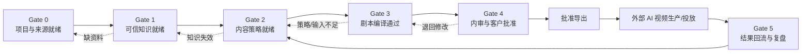
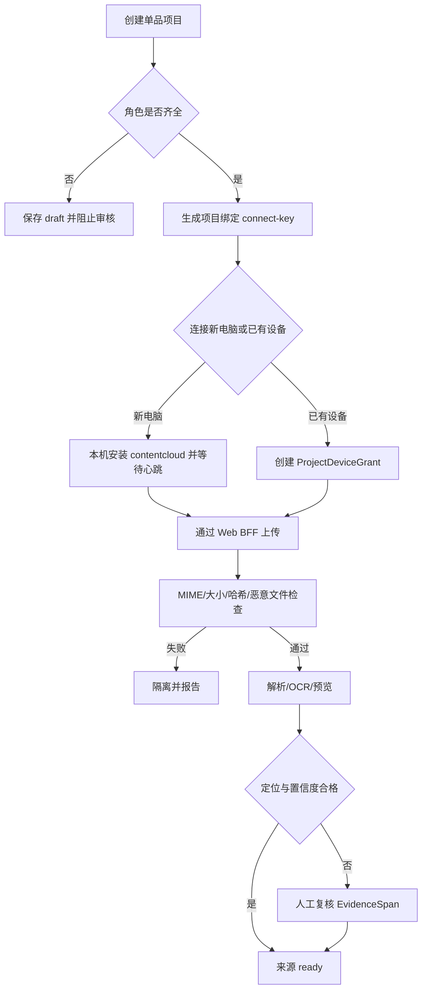
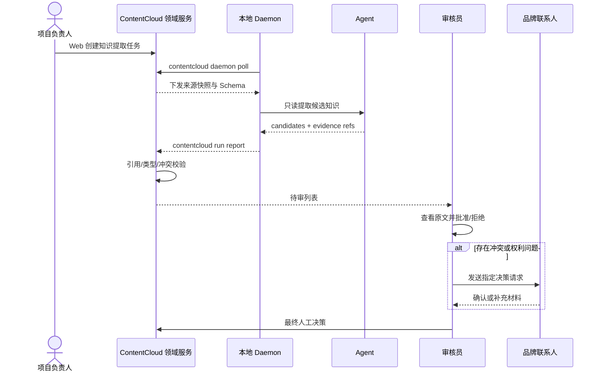
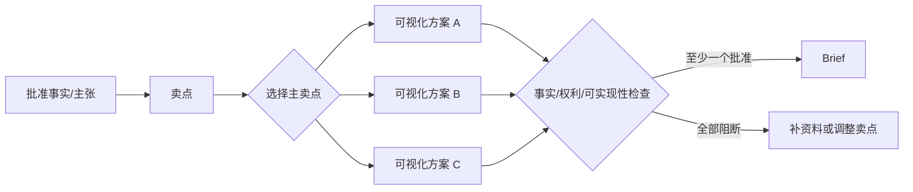
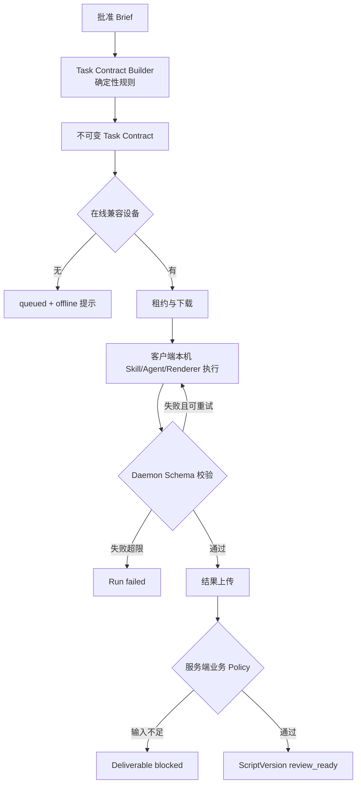
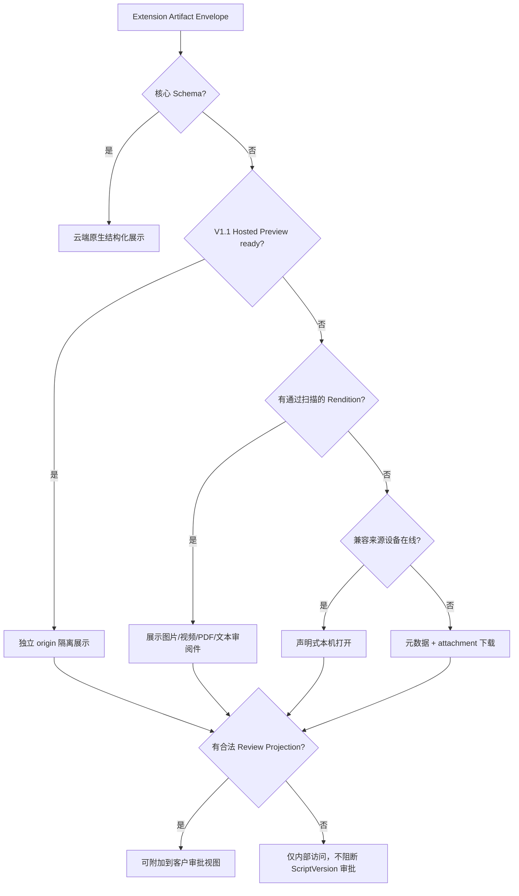
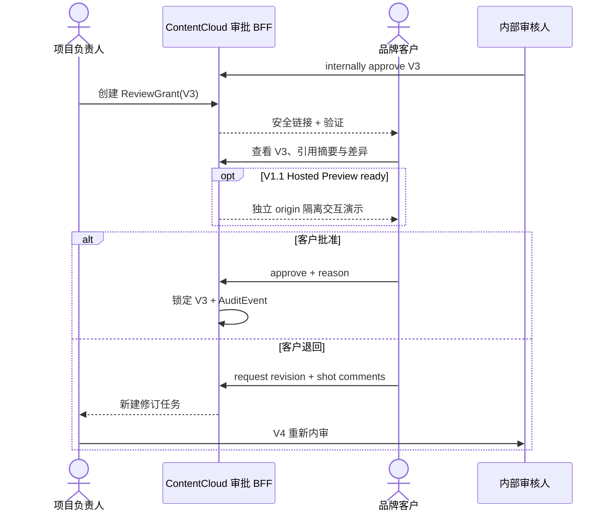
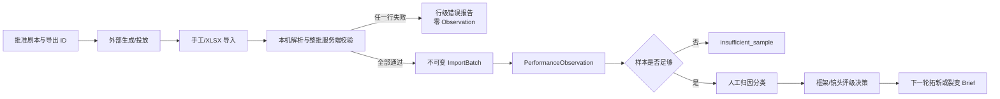
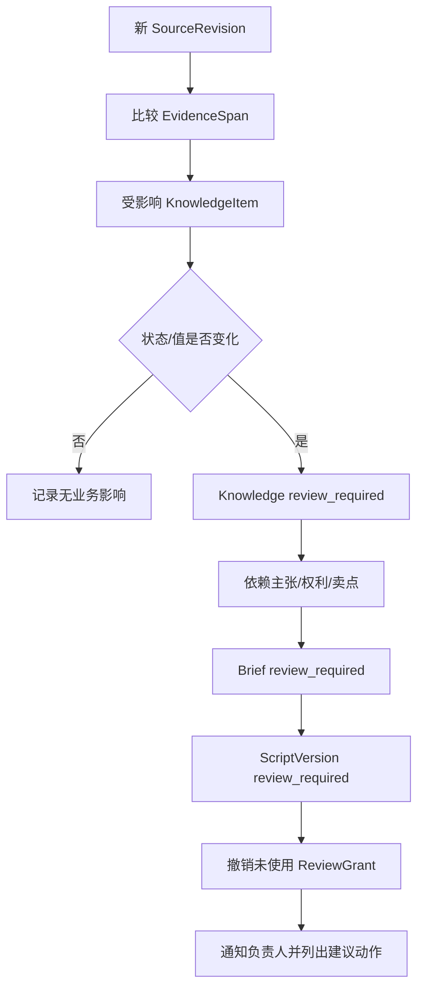

# 产品工作流与门禁

## 1. 总体流程

V1 使用六个业务 Gate。Gate 是领域条件，不等于页面步骤或 Agent Run 状态；只有满足退出条件才能进入下游正式产物。

## 2. 责任矩阵

| 工作 | Admin | Project Manager | Strategist | Editor | Reviewer | Client |
| --- | --- | --- | --- | --- | --- | --- |
| 项目角色和设备 | A/R | C | I | I | I | I |
| 资料登记 | I | A/R | C | C | C | C |
| 知识提取 | I | A | C | R | R | C |
| 知识批准 | I | C | C | I | A/R | C |
| 对标与框架 | I | A | R | C | C | I |
| 卖点与 Brief | I | A | R | C | C | C |
| 剧本生成与修订 | I | A | C | R | C | I |
| 内部剧本批准 | I | C | C | C | A/R | I |
| 品牌客户批准 | I | A | I | I | C | R |
| 结果导入与评级 | I | A | R | C | C | I |

`A` 最终负责、`R` 执行、`C` 参与、`I` 知会。Agent 永远不是 A 或 R，只是受控工具。

## 3. Gate 0：项目与来源就绪

### Gate 0 输入

- 租户和品牌项目。
- 一个明确主攻单品、渠道和阶段目标。
- 内部负责人、知识审核人、剧本审核人和品牌联系人。
- 原始品牌、产品、权利和视觉资料。

### Gate 0 流程

### Gate 0 退出条件

- 项目角色完整。
- 至少一台 Creative Runtime 已连接并获得当前项目授权；若项目暂不使用本地 Agent，可人工豁免 Gate 0，但后续 Agent 动作继续 blocked。
- 至少一个产品来源、一个品牌表达来源和必要权利来源 ready。
- 原始字节、哈希、解析版本和定位信息可追踪。
- 密码文件、损坏文件、低置信度 OCR 均有明确结论。

### 阻断输出

`missing_project_role`、`creative_runtime_not_connected`、`project_device_not_authorized`、`source_processing_failed`、`source_integrity_failed`、`evidence_locator_unverified`、`rights_source_missing`。

## 4. Gate 1：可信知识就绪

### Gate 1 输入

- Gate 0 ready SourceRevision 和 EvidenceSpan。
- 当前项目知识 Schema 与租户方法论模板。

### Gate 1 流程

### Gate 1 退出条件

- 产品名称、核心规格、使用方式和当前包装有批准事实或明确禁用结论。
- 正式 Brief 所需主张均 approved，禁用主张有可执行规则。
- 计划使用素材均有真实性等级和 valid 权利。
- 所有冲突已解决，或明确从正式内容中排除。
- 风险项可按渠道判断，而不是一份全局 allow/deny 列表。

### 失败规则

- 候选项不能支持正式剧本。
- 引用不存在、位置错误或来自其他项目时整项拒收。
- Agent 不得通过弱化措辞绕过事实、主张或权利状态。
- 知识不足可生成 blocked 诊断，不能伪造 ready。

## 5. Gate 2：内容策略就绪

Gate 2 把培训材料的方法论变成可审核业务对象，不把所有培训建议变成硬编码。

### 5.1 对标与内容资产

1. 登记来源、权利模式和验证依据。
2. 分开拆解画面框架与文案框架。
3. 标记镜头的决策功能，而非只记录镜头表象。
4. 区分框架、镜头、话术、达人、账号和承接验证。
5. 无销售依据时最多标记 observed。

### 5.2 卖点可视化

团队可设置“每个主卖点 3 个方案”的运营目标，但系统硬门禁只要求正式 Brief 至少有 1 个 approved VisualizationPlan。

### 5.3 Brief 锁定

Brief 必须明确：

- 一个主要营销目标。
- 一个主卖点，最多两个次卖点。
- 受众、需求时刻、场景、冲突和视角。
- 一个主要测试变量及保持不变的字段。
- 框架、关键镜头、画面证据、CTA、时长和画幅。
- 禁止表述、真实素材策略、预算/工具/执行限制。

### Gate 2 退出条件

- BriefVersion 已内部批准并不可变。
- 所有引用对象仍处于可用状态。
- 主卖点有 approved VisualizationPlan。
- 测试变量唯一且假设可观察。
- 框架难度与团队执行能力匹配。

## 6. Gate 3：剧本生成通过

### 6.1 执行流程

### 6.2 确定性校验

- Schema 版本、字段类型、枚举和大小。
- 时码递增、不重叠，镜头总时长在目标值 ±10% 内。
- Hook、Product Solution、Proof 和 CTA 均存在。
- 一个主卖点、最多两个次卖点。
- proof 镜头必须引用 VisualizationPlan。
- 所有确定性口播、字幕和视觉事实链接 approved KnowledgeItem。
- 所有生成参考素材满足 Asset/Rights 条件。
- 画面与文案不得表达冲突事实。
- 产品精确外观、包装和 Logo 必须声明 product truth strategy。
- 变体只改变已声明主要变量；其他关键字段在 invariant list 中。
- 每个镜头存在中文生成提示词、负面约束、连续性和验收标准。

### 6.3 业务结果与运行结果

| Run | Deliverable | 含义 |
| --- | --- | --- |
| succeeded | review_ready | 技术与业务校验通过，可进入内审 |
| succeeded | blocked | Agent 正常完成，但关键输入不足或业务规则阻断 |
| failed | 无 | 技术执行没有形成可信结果 |
| canceled | 无 | 用户取消或设备确认终止 |

### 6.4 扩展产物展示流程

原始扩展格式不参与审批状态机。用户审批的是标准 ScriptVersion；Review Projection 只帮助理解关联产物，并明确显示其派生来源和校验状态。

Hosted Preview 属于 V1.1/P3。客户端显式执行 `contentcloud preview publish` 发布已构建静态目录；服务端只校验、存储和隔离托管。`planned|uploading|validating|rejected|expired` 均回退到 cloud native 或 safe rendition，不出现空白 iframe，也不阻断 Gate 4。

## 7. Gate 4：内审与品牌客户批准

### 7.1 内审

Reviewer 必须检查：

1. 用户决策路径是否完整。
2. 画面证据是否比抽象话术更清晰。
3. 卖点、场景、产品出现和 CTA 是否一致。
4. 确定性内容是否有批准引用。
5. 镜头在目标 AI 视频工具中是否可实现。
6. 产品、人物、场景和光线连续性是否可执行。
7. 平台与行业风险是否有 Plan B。

### 7.2 客户审批

### Gate 4 退出条件

- 内部和客户 ApprovalDecision 均绑定同一 ScriptVersion hash。
- 上游依赖在批准瞬间重新校验。
- 所有批注已解决或明确接受。
- 版本状态为 approved，可生成正式导出。

## 8. Gate 5：结果回流与复盘

V1 不连接平台 API，但必须支持业务闭环的最小手工结果。

### 结果分类

- `seed_candidate`：存在跑量或成交潜力，需人工确认裂变。
- `repairable`：方向合理，但画面、节奏、承接或执行有问题。
- `discarded`：痛点、框架或证据无效。
- `insufficient_sample`：载体或样本不足，不能判断。

分类不是算法因果结论。系统展示数据与关联关系，最终评级由 Strategist 作出并审计。

同一批次出现混合币种、未知剧本、重复键、负数/非有限指标、错误比例或公式注入时整批拒绝。`spend/gmv` 使用同一 ISO 币种；ROI 由服务端计算。PerformanceObservation 与 RatingDecision 都不可变，重新判断必须追加新的决策，不覆盖历史。

## 9. 来源变化与影响分析

当前 V1 实现以项目内显式引用实时生成统一只读图，不依赖 LLM 或图数据库。Web“追踪与影响”页按阶段列稳定展示任意数量对象，CLI 使用 `contentcloud lineage show|impact --json` 查询同一应用服务；聚焦对象时支持上游、下游和双向遍历。影响清单固定包含对象、原因、当前状态、严重度和建议动作，人工确认后再进入既有修订流程。

已下载的历史导出不删除，但 Artifact 页面显示上游已变化和失效时间。系统不静默更新已批准剧本。

## 10. 恢复与人工干预

| 场景 | 自动动作 | 人工动作 |
| --- | --- | --- |
| 设备离线 | Run 保持 queued | 连接设备或取消 |
| lease 过期 | Attempt expired，有限重排 | 检查设备日志 |
| Agent 输出无效 | 最多两个修复 Attempt | 超限后修改输入/模型 |
| 来源解析失败 | 隔离文件，保留错误 | 重新上传或转格式 |
| 业务 policy 阻断 | 生成 blocked Deliverable | 补资料、换主张或画面 |
| 客户链接过期 | 拒绝访问 | 创建新 ReviewGrant |
| 客户退回 | 保留版本和批注 | 创建新版本并重新内审 |
| 上游知识失效 | 标记下游 review_required | 复核或退役下游版本 |
| 结果导入异常 | 行级隔离，不导入部分错误行 | 修正并重传批次 |

## 11. 通知

V1 使用站内通知和邮件：任务失败、知识待审、内部审核、客户审批、链接将到期和上游影响。飞书/企业微信通知属于 V1.1。通知只包含项目名称、对象类型和安全链接，不包含客户原始内容。
