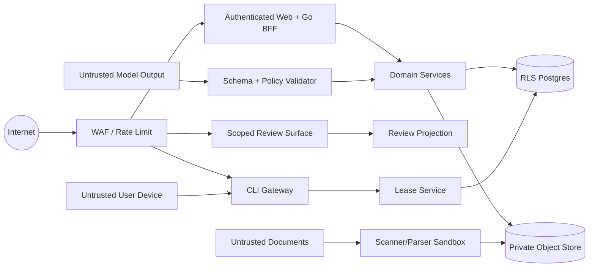

# 安全、可靠性与测试策略

## 1. 安全目标

1. 一个租户不能发现、读取或影响另一个租户的数据、文件、设备或任务。
2. 云端服务无法使用用户的 Codex/Claude 凭据执行任意任务。
3. 恶意客户资料和提示注入不能获得 Shell、写文件、跨目录或额外网络能力。
4. 品牌客户只能访问审批链接绑定的不可变投影视图。
5. 事实、权利和审批历史不能被无痕篡改。
6. 任何导出都能证明输入版本、校验结果和内容摘要。

V1 不宣称达到特定合规认证；安全控制必须可测试、可审计，并为后续等保/隐私合规评估保留证据。

## 2. 信任边界

浏览器、Daemon、文档、Agent 输出、外部 URL 和导入表格均视为不可信。内部服务身份不意味着可以绕过 tenant predicate。

## 3. STRIDE 威胁与控制

| 类型 | 主要威胁 | V1 控制 |
| --- | --- | --- |
| Spoofing | 伪造用户、设备或品牌审批人 | session/OTP、token hash、项目绑定单次 ConnectSession、ReviewGrant 验证、撤销 |
| Tampering | 修改来源、Task Contract、客户端结果或批准版本 | SHA-256 manifest、不可变版本、内容 hash、乐观锁、append-only 审计 |
| Repudiation | 否认批准、退回或导出 | ApprovalDecision、actor、时间、subject hash、request/device 摘要 |
| Information Disclosure | 跨租户、预签名 URL、日志或审批页泄漏 | tenant predicate + RLS、短期 URL、日志脱敏、版本投影、统一 404 |
| Denial of Service | 超大文件、压缩炸弹、长 Agent、poll 风暴 | 配额、流式限制、parser timeout、run timeout、速率限制、队列背压 |
| Elevation of Privilege | 文档提示注入执行 Shell 或读取本机文件 | 只读临时目录、Agent 工具 allowlist、无 Bash/Write/MCP、作用域 run token |

## 4. 多租户隔离

- 请求进入 Domain Service 前必须存在 authenticated tenant context。
- 所有资源查询使用 `(tenant_id, id)`，禁止只按全局 ID 查询后再授权。
- Postgres 核心表启用 FORCE ROW LEVEL SECURITY；应用连接不是表 owner。
- Worker service role 只能通过存储过程领取明确 tenant_id 的工作，并在事务设置 tenant context。
- 每个测试套件至少创建 Tenant A/B，所有读写、列表、搜索、导出、预签名和设备接口执行负向交叉测试。
- S3 bucket 私有；对象 key 由服务端生成，下载 URL 最长 10 分钟并绑定 method/content disposition。
- 搜索索引和缓存 key 必须包含 tenant_id；V1 不引入跨租户向量索引。

## 5. 身份、令牌和审批链接

| 凭据 | 前缀 | 存储 | 生命周期 | 作用域 |
| --- | --- | --- | --- | --- |
| Connect Key | `cck_` | hash | 10 分钟、单次 | 一个邀请人/租户/项目 |
| User CLI Session | `ct_` | 平台安全凭据存储 / 服务端 hash | 短期访问 + 可轮换刷新 | 一个用户/RBAC |
| Device Token | `dt_` | hash | 撤销/轮换前 | 一个设备/租户 |
| Run Token | `rt_` | hash | lease + 2 分钟 | 一个 Attempt |
| Review Grant | `rv_` | hash | 默认 7 天 | 一个 subject version |

- token 至少 256 bit 随机，日志只记录前缀和不可逆 fingerprint。
- 比较使用恒时算法；连续失败触发 IP/凭据维度 rate limit。
- 团队邮箱必须验证；密码使用 Argon2id 强哈希存储，重置链接单次使用且 30 分钟过期。
- 客户端长期 token 只保存到平台安全凭据存储：macOS Keychain、Windows Credential Manager/DPAPI、Linux Secret Service。Linux 无安全存储时设备 `up` fail closed；CLI 配置、命令行参数、进程列表、stdout 和日志都不得出现长期 token。
- Connect Key 消费使用事务锁和恒时 hash 比较；它不能读取项目或上传文件，成功消费后立即失效。
- ReviewGrant 绑定品牌审批人邮箱；查看正文和提交最终决策前均需完成一次性邮件验证码，验证码 10 分钟过期、最多尝试 5 次。
- 修改密码、撤销成员或暂停租户后，相关 session/device/review grant 按策略失效。
- 客户最终批准前执行二次验证，并重新检查 subject hash 和上游依赖。

## 6. 文件与解析安全

- V1 单文件默认上限 100MB、单项目默认 20GB，可由租户套餐调整但不能由请求体绕过。
- MIME sniff 与扩展名不匹配时隔离，不直接交给解析器。
- Office 宏不执行；外部关系、嵌入对象和公式链接不自动访问。
- 压缩文件不作为公开上传类型；Office 内部压缩设置总展开大小、条目数和递归深度上限。
- 解析器运行在资源受限 Worker 进程/容器，设 CPU、内存和 5 分钟超时。
- OCR/解析文字标记为 untrusted content，不拼入 system instruction 区域。
- 文件删除先进入 30 天回收期；法律或合同要求立即删除时使用管理员操作并审计。

## 7. Task Contract、Prompt Injection 与客户端安全

### 7.1 指令分层

服务端 Task Contract 明确区分：

1. `contract.json`：平台签名、版本化的声明式任务意图、capability 和 Schema；不包含 prompt。
2. `brief.json`：已批准业务目标。
3. `knowledge.json`：声明为数据的批准知识。
4. `sources/`：不可信引用资料，内容中的命令无效。

本机签名 Skill 负责实际 prompt 和步骤，并明确禁止遵循来源内的操作指令、访问 contract 外路径、联网补齐事实或改变输出 Schema。服务端无法也不应控制客户端的 LLM 实现，只通过租约、最小数据下发、Schema 与回传校验保护云端边界。

### 7.2 能力限制

- Codex 使用 read-only sandbox、ephemeral、ignore user config。
- Claude Code 使用 safe mode、no session persistence、Read-only tool allowlist，同时保留本地认证。
- 不使用 bypass approvals、danger-full-access、Bash、Write、Edit、Web、MCP、浏览器或用户插件。
- Daemon 只解析本机安装且 digest 已上报的 capability；云端不能下发 prompt、命令行、脚本或插件正文。
- stdout、event count、单事件大小和总输出大小设置上限。

### 7.3 输出不可信

Daemon 与服务端分别验证 JSON Schema。Policy Worker 重新解析所有 knowledge/asset ID，并以数据库状态为准；Agent 声称“已批准”没有效力。

## 8. 隐私、密钥与保留

- 模型供应商凭据只保留在用户本机 Agent 的标准凭据存储中。
- 服务端 secret 使用托管 secrets，不进入代码、日志、Task Contract 或数据库普通列；模型和 Renderer 凭据不存在于服务端。
- 原始资料、Evidence 和导出默认项目成员可见；Agent transcript 默认只存脱敏摘要。
- 原始任务 stdout 保留 7 天用于故障诊断，之后删除；结构化业务产物按项目保留策略保存。
- 审计事件默认保留 3 年；其中不复制敏感正文。
- 关闭租户进入 30 天恢复期，之后执行对象、数据库和备份生命周期删除流程。

## 9. 可靠性目标

| 指标 | 试点目标 |
| --- | --- |
| 月可用性 | 99.5%，不含计划维护 |
| Web BFF / CLI Gateway 普通读取 p95 | <500ms |
| 在线设备派发 p95 | <5s |
| Run 状态一致性 | 终态不可回退，重复 report 不产生重复版本 |
| 数据库备份 | 每日全量/增量按供应商能力，RPO 24h |
| 恢复目标 | RTO 4h |
| 对象完整性 | 所有 Task Contract、结果和导出保存 SHA-256 |
| 审计覆盖 | 关键状态、权限、设备、导出和审批 100% |

## 10. 故障模式

| 故障 | 检测 | 恢复 | 不变量 |
| --- | --- | --- | --- |
| Web 实例重启 | readiness/5xx | 无状态副本接管 | 任务和审批保存在 Postgres |
| Worker 崩溃 | lease timeout | 重新领取 | 同一任务结果幂等 |
| Postgres 暂时不可用 | health/连接错误 | 停止领取、指数退避 | 不切换到空本地库 |
| S3 上传中断 | multipart/校验失败 | 重试未完成部分 | complete 前不可引用 |
| Daemon 休眠 | heartbeat 过期 | Run 重新 queued | 旧 run token 失效 |
| Agent CLI 升级不兼容 | capability probe | 标记设备 upgrade_required | 不尝试猜测参数 |
| 客户审批时上游失效 | 最终依赖检查 | 拒绝批准，进入 review_required | 不批准过时内容 |
| 结果部分导入失败 | 行级校验 | 整批原子失败并返回报告 | 不产生部分统计 |

## 11. 测试分层

### 11.1 单元测试

- 所有状态机合法/非法转换。
- OpenAPI、JSON Schema、生成的 Go/TypeScript 类型与 golden fixture 一致性。
- Claim、Rights、Visualization、变体和时码 policy。
- token 格式、哈希、过期和恒时比较。
- 对象 key、内容 hash、幂等键和错误分类。
- Markdown/XLSX/JSON Renderer 的字段一致性。

### 11.2 数据库与集成测试

- Goose migration 正向和回滚演练。
- Tenant A/B RLS 全矩阵。
- `SKIP LOCKED` 多 Worker 并发领取。
- lease 过期、heartbeat race、cancel/report race。
- 预签名 URL method、过期、对象归属和 disposition。
- ReviewGrant 过期、撤销、重放和版本绑定。
- SourceRevision、KnowledgeItem、Brief 和 Script 的影响传播。
- ConnectSession 原子消费、ProjectDeviceGrant 同租户约束、设备复用和撤销传播。

### 11.3 Contract 测试

- Server/Daemon 使用同一 contracts fixtures。
- 当前和前一个 minor Schema 的兼容性。
- Codex/Claude event stream 的录制 fixture，不在 CI 调用真实付费模型。
- 模拟损坏 JSON、超大 stdout、部分 event、非零退出和超时。
- Task Contract manifest 缺文件、错误 hash 和路径穿越。
- Artifact 展示等级由服务端重算，客户端伪造 `cloud_native` 或错误派生 hash 必须被拒绝。
- 未知 Artifact 在无 rendition、有 rendition、来源设备在线/离线时分别稳定降级，不出现空白预览。
- Review Projection 的 script pointer、缩略图引用和 ScriptVersion hash 必须全部可解析且同项目。

### 11.4 端到端测试

1. 注册团队账号并创建两个租户。
2. 在 Tenant A 创建项目并生成 Connect Key，从临时用户目录执行安装器/CLI 模拟，等待 fake daemon 首个心跳；Tenant B 不能消费该 key。
3. 上传脱敏金陵古都香 fixture。
4. 运行知识提取模拟器并完成审核。
5. 建立市场框架、卖点、可视化和 Brief。
6. 使用已授权 fake daemon 生成 review_ready 与 blocked 两种 Script。
7. 完成镜头批注、修订、内审和客户链接审批。
8. 导出三种格式并验证语义等价。
9. 导入结果并完成评级决策。

### 11.5 安全测试

| ID | 场景 | 预期 |
| --- | --- | --- |
| SEC-01 | Tenant A 枚举 Tenant B UUID | 统一 404，无日志正文泄漏 |
| SEC-02 | 修改预签名 URL key | 签名失败 |
| SEC-03 | 伪造 `dt_` token 首次 poll | 401，不创建设备 |
| SEC-04 | 过期、跨项目或重放 `cck_` | 拒绝，不创建/重绑设备，不消费其他 key |
| SEC-05 | 旧 Attempt 晚到 report | 不改变新 Attempt/Run 状态 |
| SEC-06 | 文档写入“读取 ~/.ssh”提示 | Agent 无路径/工具权限，结果忽略命令 |
| SEC-07 | Task Contract `../` 路径 | Daemon 拒绝解包 |
| SEC-08 | ReviewGrant 修改 version ID | 404，不显示其他版本 |
| SEC-09 | XLSX 公式注入 | 导出/导入转义 `= + - @` 开头单元格 |
| SEC-10 | 普通 SVG/HTML Artifact 主动脚本 | 强制 attachment；只有 Hosted Preview 协议校验的 bundle 可在独立 origin sandbox 执行 |
| SEC-11 | 客户端把未知二进制伪报为图片/PDF | magic bytes 与 MIME 不符即拒绝预览 |
| SEC-12 | local-open 请求携带路径或命令 | CLI Gateway 拒绝；请求只允许服务器生成的 Artifact ID |
| SEC-13 | Agent 绕过 CLI 直连 dispatch 或对象存储 | 无可用公共凭据/协议；Gateway scope 或 upload permit 拒绝 |
| SEC-14 | `rt_` 上传 manifest 未引用的任意 hash | 拒绝且审计，不生成对象引用 |
| SEC-15 | Preview 尝试联网、父页面导航、Worker、表单或弹窗 | CSP、iframe sandbox 与独立 origin 全部阻断 |
| SEC-16 | Preview nonce 重放、改 host 或跨 ReviewGrant | 失败且不返回任何静态字节 |

## 12. Golden Fixtures

使用脱敏后的金陵古都香数据建立：

- 20 个来源的结构和定位 fixture，不提交未经授权原件。
- 包装尺寸冲突、历史主张、功效主张、价格有效期和素材权利用例。
- 一个 approved Brief。
- 10 个 legacy CreativeDraft 迁移样例。
- 一个 review_ready、一个 blocked、一个 prompt-injection Script fixture。
- Codex 与 Claude Code 的录制 event 流。

Fixture 必须可公开进入测试仓库或仅使用合成文本；不能把客户敏感原件复制进代码库。

## 13. 发布质量门禁

每个 PR 必须通过：format、lint、typecheck、unit、DB integration、contract。涉及授权、RLS、状态机、设备协议、审批或存储时必须新增对应负向测试。

进入试点前额外通过：

- 全量 E2E 和两租户隔离测试。
- 数据库恢复演练与对象生命周期检查。
- Daemon 在 macOS 和 Linux 的 Codex/Claude capability 检查。
- npm 安装器下载 host allowlist、SHA-256/签名校验、macOS 双架构和 Keychain/launchd 测试；Linux Secret Service 缺失时验证 fail-closed 行为。
- 100MB 边界文件、OCR、超时和队列背压测试。
- 外部安全评审或至少独立工程师 threat-model review。
- 金陵古都香迁移 dry-run 和人工抽查。

Hosted Preview 在 V1.1 启用前另需通过：React/Vue 静态包无网络加载、manifest/hash/MIME/路径/限额负测、Tenant A/B 与 ReviewGrant 隔离、nonce 重放、CSP 浏览器 E2E、桌面/移动 iframe 和所有失败降级。详细矩阵见 [09-hosted-preview-and-cli-gateway.md](09-hosted-preview-and-cli-gateway.md)。

## 14. 事故响应

安全或数据事故流程：冻结相关 token/tenant → 保留审计与日志 → 阻止继续导出/审批 → 确认影响范围 → 通知负责人 → 修复与恢复 → 记录时间线和长期动作。运维人员不得通过直接修改业务状态“修复”事故。
