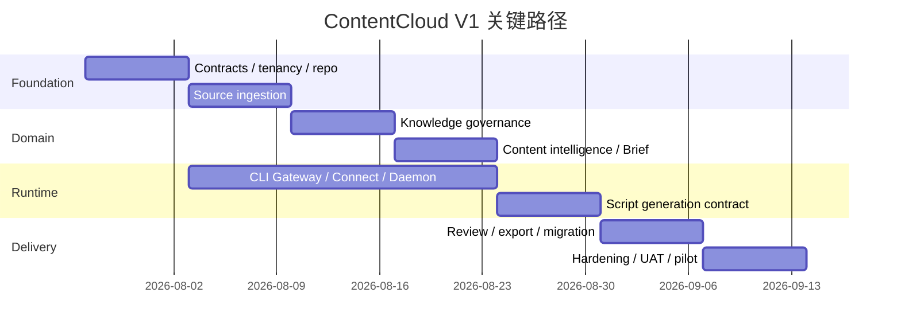

# 8 周交付计划

## 1. 交付目标

8 周结束时，南京 AI 内容营销公司能够在生产试点环境独立完成：

```text
创建金陵古都香项目
-> 从项目页在用户电脑安装/连接 contentcloud Creative Runtime
-> 上传和解析资料
-> 审核品牌知识
-> 登记内容框架和画面模式
-> 锁定卖点、可视化方案和 Brief
-> 连接本地 Codex/Claude Code
-> 生成 AI 视频剧本包
-> 内审和客户审批
-> 导出国内 AI 视频工具工作包
-> 导入一批结果并复盘
```

## 2. 建议团队

| 角色 | 投入 | 主要负责 |
| --- | --- | --- |
| Product/Domain Lead | 1 | PRD、方法论、客户决策和验收 |
| Tech Lead / Backend | 1 | 领域模型、权限、任务与架构一致性 |
| Full-stack Engineer | 2 | React 工作台、Go BFF、审核、导出和集成 |
| Go Runtime Engineer | 1 | CLI Gateway、CLI/Daemon、租约、安装分发、Agent Adapter 和本地安全 |
| QA/Security | 0.5-1 | 测试矩阵、隔离、E2E、恢复和 UAT |
| Design | 0.5 | 工作台信息架构和客户审批体验 |

可由 AI Agent 压缩编码时间，但产品决策、客户知识审核、安全评审和 UAT 不能由 Agent 替代。

## 3. 关键路径



Web、CLI/Daemon 和 Worker 可以并行，但必须先锁定 OpenAPI、JSON Schema 与领域状态机。

## 4. 第 1 周：基础、契约与多租户

### 第 1 周目标

建立可持续实现骨架，并首先证明租户隔离而非最后补安全。

### 第 1 周工作

- 初始化 Go workspace 与 React/TypeScript Web，统一 format/lint/test 配置。
- 建立 `cmd/internal/web/contracts/migrations/fixtures` 边界；锁定 OpenAPI 3.1 与 JSON Schema 生成流程。
- 实现 Tenant、User、Membership、Project 与 AuditEvent。
- 集成已验证邮箱/密码登录、密码重置、session 安全和事务邮件服务。
- 建立 pgx/sqlc/goose、Postgres RLS、测试数据库和 Tenant A/B fixture。
- 创建工作台导航、项目列表、项目创建和角色配置页面。
- 建立 CI：format、lint、typecheck、unit、DB integration。

### 第 1 周验收

- 两个租户可创建同名项目而互不可见。
- 所有跨租户 API、搜索和直接 UUID 访问测试阻断。
- 领域模块不依赖 Web、pgx/S3 适配器或具体 Agent。
- 关键写操作产生 AuditEvent。

## 5. 第 2 周：来源、对象存储与解析

### 第 2 周工作

- Source/SourceRevision/EvidenceSpan schema 与 API。
- S3 预签名上传、哈希校验、私有下载和生命周期。
- Postgres Worker queue 与 `SKIP LOCKED` 领取。
- 构建包含 ClamAV、LibreOffice headless、Poppler 和 Tesseract `chi_sim+eng` 的 Worker 镜像。
- 文件扫描、MIME 检测、资源上限，以及 PDF/DOCX/XLSX/PPTX 解析、PNG/JPEG OCR 和预览。
- 来源列表、上传进度、解析结果、低置信度复核 UI。

### 第 2 周验收

- 支持类型全部通过正常、损坏、伪 MIME、超限和重复文件测试。
- EvidenceSpan 能回到页码、段落、Sheet/单元格、Slide 或图像区域。
- 解析失败不会产生可用于 Agent 的 ready 来源。
- 对象存储路径和预签名 URL 通过租户隔离测试。

## 6. 第 3 周：知识治理与影响分析

### 第 3 周工作

- KnowledgeItem discriminated union、EvidenceLink、Conflict、Asset、RightsRecord。
- 知识状态机和审核 API。
- 候选知识列表、原文对照、批量分组但逐项决策 UI。
- 事实、主张、权利和渠道 policy。
- Task Contract Builder 的知识提取契约；服务端不生成 prompt 或调用 LLM。
- fake daemon/Agent fixture 支持端到端候选提取。
- 首版影响图查询和 review_required 传播。

### 第 3 周验收

- 包装尺寸冲突不能被静默覆盖或批准为两个 canonical 值。
- 功效、历史、价格和无权素材 fixture 被正确阻断。
- Agent 不能直接创建 approved/valid 状态。
- 来源新修订能列出所有受影响知识对象。

## 7. 第 4 周：市场内容资产、卖点和 Brief

### 第 4 周工作

- BenchmarkContent、ContentFramework、ShotPattern、DemandMoment。
- SellingPoint、VisualizationPlan、Brief/BriefVersion。
- 对标案例登记、双框架拆解和镜头模式 UI。
- 卖点排序、画面证据方案和正反案例 UI。
- Brief 编辑、唯一测试变量、内部审批和版本锁定。
- 将培训材料导入为候选 Methodology Template。

### 第 4 周验收

- 无销售依据案例不能标记 internally_verified。
- analysis_only 素材不能进入生成参考资产集合。
- 无 approved VisualizationPlan 的主卖点不能批准 Brief。
- Brief 能稳定构建最小 Task Contract，且不包含无关项目知识、prompt 或客户端执行实现。

## 8. 第 5 周：CLI Gateway、项目连接、Creative Runtime 和本地 Adapter

### 第 5 周工作

- 统一 CLI dispatch、`ct_/dt_/rt_` 凭据分流、稳定 JSON/error envelope、冻结退出码、分页、dry-run、风险门禁和 `schema`。
- BrandProject 后创建 ConnectSession、一次性 `cck_`、ProjectDeviceGrant、设备撤销和 token 轮换。
- Go 单二进制 `contentcloud up/status/doctor/down/update` 与领域读写命令；npm wrapper 下载 host allowlist、SHA-256 校验、国内镜像 fallback 和中断恢复。
- 用户 CLI Device Flow 的 `--no-wait`/`--device-code` 分步登录；内嵌 Skill 的 `skills list/read/status/install` 与 binary 版本锁步。
- 显式项目 context 解析和 `context show/use/clear`；多项目歧义 fail closed。
- 项目创建后的“安装新电脑/使用已有设备”引导，包含 waiting/verifying/connected/expired/error 状态。
- 25 秒 long-poll、5 分钟 lease、30 秒 heartbeat、取消和超时。
- 临时目录、输入 hash、环境 allowlist、stdout 限制和清理。
- Client Capability Manifest，以及本机 Skill/Agent/Renderer 探测与业务 capability 聚合；服务端看不到插件拓扑。
- Codex read-only structured-output Adapter。
- Claude Code safe-mode/read-only structured-output Adapter。
- fake server、fake Agent、录制 event contract tests。

### 第 5 周验收

- 伪造 token 不得自注册设备。
- 用户能先创建项目，再从项目页在干净 macOS 用户环境完成安装、连接并看到首个心跳；连接码过期、跨项目和重放均失败。
- 同一 Daemon 不重复启动，设备撤销立即停止领取新任务。
- `contentcloud --json` stdout、错误 stderr、冻结退出码、doctor 未登录/offline 模式、schema introspection、Skill 版本和 split login 通过 contract test；Agent 示例不包含内部 HTTP。
- read/write/high-risk-write 标签可从 help/schema 读取；dry-run 零写入，未确认 high-risk-write 固定 exit 10，不能由 Agent 自动追加 `--yes`。
- 同一用户有两个项目且未指定 context 时，所有项目级写命令以 `PROJECT_CONTEXT_REQUIRED` 失败，不允许写入最近使用项目。
- Prompt Injection fixture 无法读取 bundle 外文件或执行 Shell。
- sleep/reconnect、lease expiry、late report 和 cancel race 通过测试。

## 9. 第 6 周：剧本包、策略校验和导出

### 第 6 周工作

- Script Package 1.0 Schema、ScriptVersion、Shot、ExperimentPlan。
- script_generate/revise Task 和 Agent Skill。
- 时码、叙事、卖点、引用、权利、可视化、连续性和变体 policy。
- 剧本列表、镜头编辑、引用侧栏、阻断报告和版本差异。
- Markdown、XLSX、canonical JSON Renderer。
- Extension Artifact Envelope、Review Projection 以及 V1 的 cloud-native/safe-rendition/local-open/metadata-only 四级展示；为 V1.1 hosted-preview 保留已定义枚举但不实现托管。
- Codex 与 Claude Code 同 bundle 对照测试。

### 第 6 周验收

- 两个 Agent Adapter 和一个本机 Renderer/Exporter capability 均能产生同 Schema 合法结果。
- 加入未知私有格式不改服务端代码；有预览件时可审阅，无预览件时可稳定降级并显示明确操作。
- review_ready 与 blocked 路径完整，Run 与 Deliverable 状态不混淆。
- 每个 proof 镜头引用 VisualizationPlan 和 approved KnowledgeItem。
- 三种导出语义一致，XLSX 无公式注入且一行一个镜头。

## 10. 第 7 周：审批、结果回流和迁移

### 第 7 周工作

- ReviewCycle、Comment、ApprovalDecision、ReviewGrant。
- 内审批注、退回、修订、版本 diff 和客户投影页面。
- 审批链接过期、撤销、二次验证和最终依赖检查。
- PerformanceObservation 导入模板、校验、隔离和评级决策。
- `jinling-gudu` importer、legacy_id、dry-run 报告和审计。
- 金陵古都香真实试点数据在隔离环境迁移与人工抽查。

### 第 7 周验收

- 客户只能查看绑定版本，不显示内部批注、成本或 transcript。
- 批准与退回均绑定 subject hash，批准版本不可原地编辑。
- 上游知识失效能阻止尚未完成的客户批准。
- 旧状态缺依据时降为 needs_review，迁移不伪造批准。

## 11. 第 8 周：安全加固、UAT 与试点

### 第 8 周工作

- 完成全量单元、集成、contract、E2E 和安全测试。
- 执行 RLS、ReviewGrant、device/run token 和对象存储专项审查。
- 压力测试上传、队列、长轮询和大型项目查询。
- 建立 metrics、dashboard、alert、runbook、备份和恢复演练。
- 南京营销公司按真实角色完成 UAT，不由 Goodvision 代操作。
- 修复阻断问题，冻结 V1 contracts 和 migration。

### 第 8 周验收

- [07-security-reliability-and-testing.md](07-security-reliability-and-testing.md) 发布门禁全部通过。
- UAT 完成一条端到端金陵古都香剧本审批和导出。
- 产品、工程、QA、运维和客户试点负责人共同签署上线清单。
- 所有未完成项明确进入 V1.1，不以隐藏 feature flag 伪装完成。

## 12. 金陵古都香迁移步骤

1. 冻结当前 `marketing/jinling-gudu` 快照并生成文件、哈希和对象清单。
2. 运行 importer dry-run，只生成报告，不写生产库。
3. 人工确认客户、品牌、单品、来源映射和旧 ID。
4. 上传原件到项目对象存储，校验 registry SHA-256。
5. 导入 Evidence、Knowledge、Asset、Rights 和 Conflict。
6. 对无法证明人工决策的 approved/verified/valid 状态降级。
7. 重新编译知识快照并与旧 Wiki 聚合结果对比。
8. 旧 CreativeDraft 作为 legacy artifact 导入；选择 1 条重建正式 Script Package。
9. 执行来源到剧本的全链路抽查和客户负责人复核。
10. 迁移完成后旧目录继续只读作为审计参考，不双向同步。

## 13. UAT 场景

| ID | 场景 | 成功条件 |
| --- | --- | --- |
| UAT-01 | 新项目与客户端接入 | 非工程用户先创建项目，再从项目页在自己的电脑完成安装/连接并看到设备在线 |
| UAT-02 | 知识审核 | 审核人能从候选项定位原文并处理冲突 |
| UAT-03 | 对标拆解 | 策略人员能分开记录画面/文案框架和验证依据 |
| UAT-04 | Brief 锁定 | 项目负责人能明确主卖点、画面证据和测试变量 |
| UAT-05 | Codex 生成 | 在线设备成功生成 review_ready 剧本 |
| UAT-06 | Claude 生成 | 同 bundle 能由 Claude Adapter 执行 |
| UAT-07 | 阻断 | 缺权利或事实时返回可行动 blocked 报告 |
| UAT-08 | 内部修订 | 镜头批注、版本差异和解决状态正确 |
| UAT-09 | 客户审批 | 客户独立完成验证、查看和批准/退回 |
| UAT-10 | 导出与结果 | 国内工具工作表可用，结果可关联回测试变量 |

## 14. 风险登记

| 风险 | 概率/影响 | 缓解 | 触发退出条件 |
| --- | --- | --- | --- |
| 方案洽谈尚未形成付费需求 | 中/高 | 第 1 周确认真实 UAT 负责人和每周评审 | 无客户负责人则不进入定制集成 |
| 原始资料权利不完整 | 高/高 | Gate 1 阻断、analysis_only、客户决策清单 | 不以演示压力绕过权利 |
| Agent CLI 版本快速变化 | 中/中 | capability probe、Adapter contract、版本矩阵 | 不兼容设备标记 upgrade_required |
| 多租户隔离缺陷 | 低/极高 | RLS + service checks + 双租户负测 | 任一泄漏阻止上线 |
| 培训方法论未经效果验证 | 中/中 | candidate template、手工结果回流 | 不承诺 ROI，不自动 approved |
| 8 周范围膨胀到视频生成 | 高/高 | 固定非目标和 canonical export 边界 | 新媒体模型仅记录 V1.1 ADR |
| 客户希望微信内直接审批 | 中/低 | 首版移动 Web + 安全链接 | 微信/飞书集成进入 V1.1 |
| 文档解析质量不稳定 | 中/中 | 结构化定位、置信度、人工复核 | 不允许低置信内容自动支持事实 |

## 15. Definition of Done

一个 V1 功能只有同时满足以下条件才算完成：

- PRD 验收条件、权限和错误状态均已实现。
- Domain 状态机、CLI contract 与 BFF contract 有自动化测试。
- Tenant A/B 负向访问测试通过。
- loading、empty、partial、blocked、error、offline 状态已完成。
- 结构化日志、指标和审计事件已接入。
- 用户文案、错误码和运维 runbook 已更新。
- 不存在仅在开发者电脑可工作的隐式路径或凭据。
- 真实角色 UAT 已通过，不依赖工程师直接修改数据。

## 16. V1.1 候选，不进入 V1

- 可灵、即梦等模型/API Adapter 和关键帧生成。
- 自动视频镜头生成、拼接、字幕和成片质检。
- 抖音/巨量/第三方数据平台自动连接。
- 飞书、企业微信通知与组织身份。
- 自动抓取、下载或批量分析第三方视频。
- 统计显著性、自动归因和自动升级框架评级。
- 原生桌面 App、移动创作 App。
- 自定义角色、工作流设计器和 Agent 市场。
- cron、持续监控、自修改 Agent 和跨设备任务迁移。
- Hosted Preview：客户端发布已构建纯前端页面，云端独立 origin 隔离托管并在审批页内查看。它排在 V1.1 最后一个 P3，只在 V1 稳定两周、CLI Gateway 覆盖全部程序化通讯、内容寻址 Artifact 同步上线且审批无 P0/P1 后启动。

## 17. 上线后两周试点观察

- 每日检查任务失败、Schema 失败、policy 阻断和审批链接错误。
- 每两天与项目负责人观察一次真实使用，不进行引导演示式访谈。
- 第一周只处理阻断、数据、安全和明显体验问题，不扩展功能。
- 第二周复盘建档时间、人工审核时间、剧本首次通过率和客户审批完成率。
- 根据真实行为决定 V1.1 优先级，不根据功能愿望列表排序。
