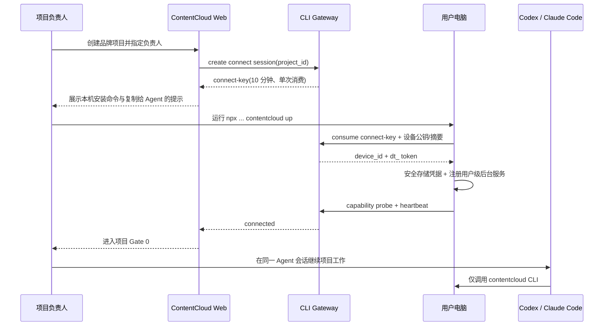
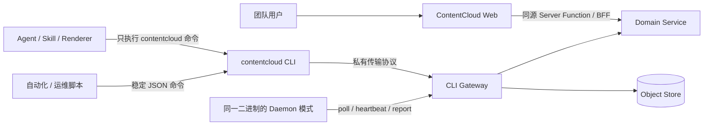
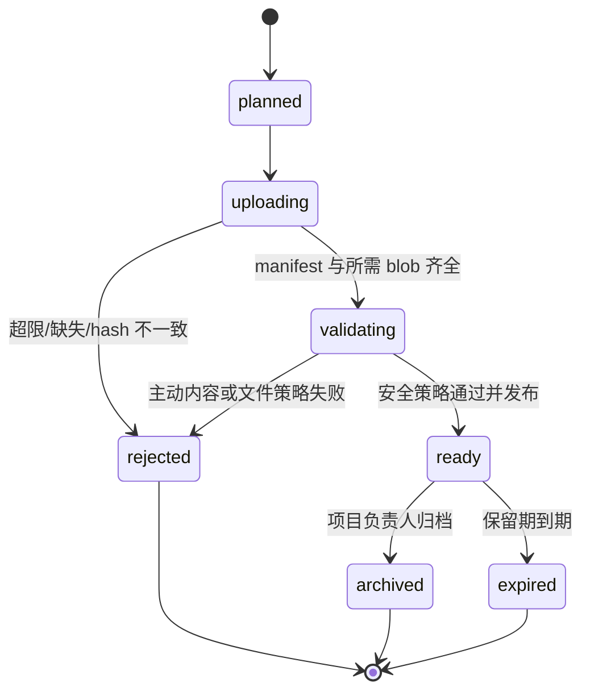
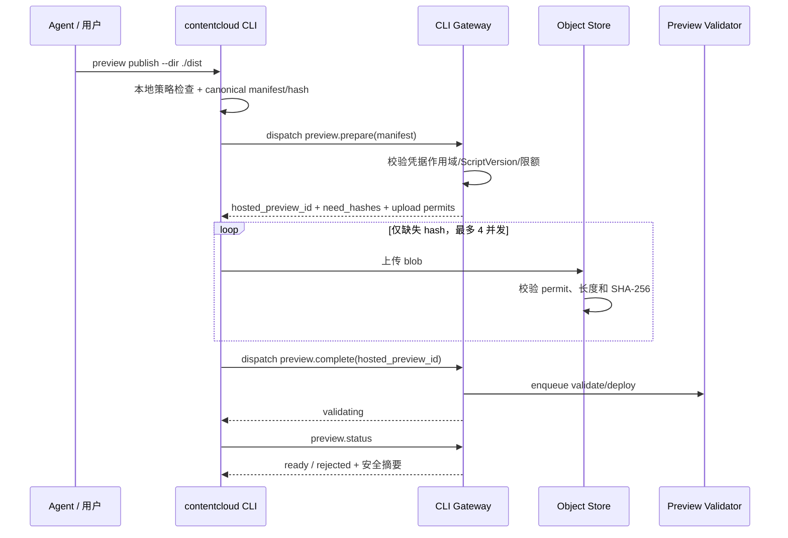

# CLI Gateway 与云端托管演示页面

> 状态：V1.1 候选规格  
> 优先级：P3，核心剧本闭环稳定后实施  
> 依赖：V1 CLI/Daemon、Artifact、ReviewGrant、对象存储与审计  
> 决策：客户端构建静态页面；服务端只校验、存储、托管和隔离展示

## 1. 目标与非目标

Hosted Preview 解决的是非技术客户无法在本机启动 Renderer、Node.js 或开发服务器的问题。客户端 Creative Runtime 可以把 Script Package 生成为交互式纯前端演示；ContentCloud 将已构建文件托管到独立预览域名，并在审批链接中直接打开。

本能力必须同时保持两个不变量：

1. **服务端 zero-exec**：不运行 LLM，不执行用户代码，不安装 npm 依赖，不接收源码后构建。
2. **CLI-first**：所有程序化服务通讯均封装在 `contentcloud` CLI；Agent、Skill、Renderer、Shell 脚本和第三方集成不得直接调用 ContentCloud HTTP 或对象存储 API。

V1.1/P3 不支持 SSR、Server Actions、后端函数、动态代理、外部 API、WebSocket、在线依赖安装、源码构建和自定义域名。Hosted Preview 是 ScriptVersion 的辅助审阅投影，不替代标准 Script Package，也不拥有独立批准状态。

## 2. 从 Loopany 保留的模式

ContentCloud 复用 Loopany 已验证的架构思想，但不复制业务实现：

| Loopany 模式 | ContentCloud 采用方式 |
| --- | --- |
| 一个二进制承担 Daemon 与运行内回调 | `contentcloud` 同时提供用户命令、Daemon、run-scoped 回报与 Artifact 发布 |
| 统一 CLI dispatch 按凭据类型分流 | CLI Gateway 先识别 user CLI session、device token 或 run token，再开放最小命令集合 |
| 完整 manifest -> `needHashes` -> hash blob 上传 | Hosted Preview 和扩展 Artifact 使用内容寻址同步；服务端只接收 manifest 已引用的 hash |
| 服务端 zero-exec | 服务端只认证、存储、校验、调度、审批和托管静态字节 |
| API 路由复用同一领域方法 | Web BFF、CLI Gateway 和 Worker 共享 Domain Service，权限与校验不复制 |
| 项目页生成连接提示并等待本机上线 | Web 先建立 BrandProject 和授权边界，再发短期 `connect-key`；本机 `up` 后回报设备状态 |
| 飞书 CLI 的 Go 二进制 + npm 安装器 | `contentcloud` 业务逻辑编译为 Go 单二进制，npm 只负责跨平台下载、校验和首启 |

明确不采用 Loopany 的持续目录 watcher、cron/evolve、自修改 Agent、通用工作目录同步和服务端生成 CLI 展示文本。ContentCloud 只在用户显式执行 `publish` 或任务回报时同步声明的产物目录。

## 3. CLI 是唯一程序化入口

### 3.1 项目优先的首次接入

客户端不能先于业务项目“空连”云端。首次流程固定为：



Web 展示的主命令为：

```bash
npx --yes @goodvision/contentcloud@latest up \
  --server-url https://app.contentcloud.cn \
  --connect-key cck_xxx
```

- `connect-key` 已绑定 `tenant_id + project_id + inviter_user_id`，默认 10 分钟有效，只能成功消费一次；Web 只保存 hash。
- `npx` 包是安装器与启动器：下载并校验 Go 单二进制，然后在用户电脑执行 `contentcloud up`。服务端不远程安装、不执行命令。
- 页面状态为 `waiting_for_computer -> verifying -> connected`；过期进入 `expired`，用户可生成新 key；关闭弹窗不撤销已连接设备。
- 同一设备后续进入新项目无需重复安装。项目页选择“使用已有设备”，创建显式 `ProjectDeviceGrant`；设备属于租户，项目授权决定它能领取哪些项目任务。
- 项目在未连接设备时仍可上传资料、治理知识和编写 Brief；“提取候选知识”“生成剧本”等本地 Agent 动作显示明确阻断和“连接电脑”入口。
- 提供“复制给 Codex/Claude Code”提示，但提示正文只要求检查/安装并执行上述 CLI 命令，不要求 Agent 直接 `fetch`、`curl` 或调用内部 API。

### 3.2 边界



- Web 浏览器是产品 UI，通过同源 BFF 使用业务能力；它不是对外 SDK，也不暴露跨域公共 API。
- CLI 是 Agent、桌面运行时、脚本、CI 和第三方集成的唯一公开接口。
- HTTP 路径、预签名 URL 和 bearer token 属于 CLI 私有传输协议，可以版本化，但不得写入 Agent Skill、客户脚本或公共集成文档。
- 所有网络代码集中在 CLI 的 `CliTransport`；其他客户端模块只能调用类型化 CLI application service。
- `curl`、任意 `fetch`、直接 S3 SDK 和浏览器自动调用内部 API 均不属于受支持集成方式。

### 3.3 一个二进制、三种凭据

| 凭据 | 获取方式 | 可用命令 | 禁止能力 |
| --- | --- | --- | --- |
| User CLI Session `ct_` | `contentcloud auth login --no-wait` 发起、`--device-code` 恢复，平台安全存储 | 当前用户按 RBAC 可执行的项目、审核、导出、预览命令 | 设备 poll、其他用户/租户、越权审批 |
| Device Token `dt_` | 项目 ConnectSession 单次消费；后续项目用 grant 复用 | `daemon poll/status/capabilities`、领取已授权项目租约、设备级同步 | 人工审核、未授权项目写入、无租约 Artifact 上传 |
| Run Token `rt_` | lease 下发，短期 | 当前 Attempt 的 heartbeat、report、artifact/preview publish | 指定其他 run/project、业务审批、长期读取 |

CLI Gateway 必须先解析凭据类型，再路由命令。跨作用域资源统一返回 `RESOURCE_NOT_FOUND`；不允许通过参数把 run token 静默切换到另一个项目。终态 run 的 token 只在短暂 grace 内接受幂等重放，之后返回 `RUN_LEASE_RECLAIMED`。

### 3.4 命令面

```text
contentcloud auth login|status|logout
contentcloud up|status|doctor|down|update
contentcloud context show|use|clear
contentcloud device list|show|attach|detach
contentcloud tenant list
contentcloud project list|show|resolve
contentcloud source upload|status
contentcloud knowledge list|show|review
contentcloud brief show|approve
contentcloud run create|list|show|cancel|log
contentcloud artifact register|list|presentation|download|open|open-status
contentcloud preview publish|status|open|archive
contentcloud review create|status
contentcloud result import
contentcloud request get <allowlisted-path>
contentcloud schema [command]
contentcloud skills list|read|status|install
```

- 所有读命令支持 `--json`；分页命令默认 `--limit 20`，最大 100，并返回 `next_cursor`。
- 写命令接受最窄稳定 ID，支持 `--dry-run` 时必须先输出校验和预计变更；审批命令仍要求显式确认和相应 RBAC。
- 项目上下文按 `--project`、环境变量、当前目录绑定、唯一授权项目解析；多项目歧义返回 `PROJECT_CONTEXT_REQUIRED`，禁止静默选择最近项目。
- `read/write/high-risk-write` 风险必须出现在 help 与 schema；未确认的高风险写入固定返回 exit 10，Agent 不得自动追加 `--yes`。
- `--json` 时 stdout 只能输出一个稳定 JSON 对象，进度写 stderr；token、Cookie、预签名 URL 和客户敏感正文不得出现在日志。
- `request get` 仅供诊断缺失的读能力，限制在 allowlist；不提供任意 POST/PUT/PATCH/DELETE 逃生口。
- `schema` 返回命令参数、输出、权限和风险级别，服务于 Agent 自发现；它不返回内部 HTTP path、header 或上传许可。
- Agent 在 Attempt 内使用 run token 的命令不接受 `--project`、`--tenant` 或任意远端 URL。

成功与失败统一为：

```json
{
  "ok": true,
  "command": "preview.publish",
  "request_id": "req_...",
  "data": {"hosted_preview_id": "hpv_...", "state": "validating"}
}
```

```json
{
  "ok": false,
  "command": "preview.publish",
  "request_id": "req_...",
  "error": {"code": "PREVIEW_FILE_REJECTED", "message": "存在不允许发布的文件", "retryable": false}
}
```

## 4. Hosted Preview 领域模型

### 4.1 对象与状态

- `HostedPreviewVersion`：绑定一个不可变 ScriptVersion 和 bundle hash，保存标题、入口、创建 capability 与当前状态。
- `HostedPreviewDeployment`：一次不可变静态部署，保存独立 host、CSP profile、安全报告、部署/过期时间。
- `PreviewAccessSession`：绑定 ReviewGrant 或内部用户、deployment、一次性启动 nonce 和短期会话状态。



`ready` 后字节、manifest、CSP profile 和 host 均不可修改。内容变化必须创建新 HostedPreviewVersion；已发出的 ReviewGrant 不自动切换到新版本。

### 4.2 Bundle Manifest

```ts
interface HostedPreviewBundleV1 {
  schema_version: "1.0";
  script_version_id: string;
  entrypoint: "index.html";
  capability: { id: string; version: string; digest: string };
  files: Array<{
    path: string;
    media_type: string;
    sha256: string;
    size: number;
  }>;
  content_hash: string; // canonical manifest hash
}
```

V1.1 只接受目录 manifest，不向服务端上传 zip/tar。CLI 可在本机读取构建目录，但必须拒绝符号链接、绝对路径、`..`、重复规范化路径、隐藏密钥、Source Map、`.env*`、`node_modules`、源码目录和构建缓存。

默认限制：单文件 25 MB、部署总字节 100 MB、最多 1000 个文件、单一路径 240 UTF-8 bytes。允许 HTML、CSS、生产 JavaScript、JSON、PNG/JPEG/WebP/AVIF、WOFF2、MP4/WebM 和音频 allowlist；SVG、WASM、Source Map、manifest/service worker、任意 archive 和未知 MIME 拒绝发布。

## 5. 发布协议

用户或 Agent 只执行：

```bash
contentcloud preview publish \
  --script-version SCRV_019... \
  --dir ./dist \
  --title "金陵古都香 25 秒分镜演示" \
  --json
```

CLI 内部执行以下步骤，调用者看不到传输 URL：



服务端只接受当前凭据已经通过 `preview.prepare` 引用且授权的 hash，避免 device/run token 成为无限对象存储写入口。重复 manifest 与 blob 上传幂等；同 hash 复用存储字节，但 tenant/project/ScriptVersion 引用单独授权。

## 6. 静态托管与浏览器隔离

### 6.1 独立 origin

每个 deployment 使用独立来源，例如：

```text
https://p-{deployment_id}.preview.contentcloud.example/
```

预览域名与主站不共享 Cookie、LocalStorage、Service Worker、认证 header 或 DOM。对象存储保持私有，Preview Edge 根据有效 PreviewAccessSession 读取字节；bucket URL 不公开。

### 6.2 CSP 与 iframe

默认响应头：

```text
Content-Security-Policy:
  default-src 'none';
  script-src 'self';
  style-src 'self' 'unsafe-inline';
  img-src 'self' data:;
  font-src 'self';
  media-src 'self';
  connect-src 'none';
  worker-src 'none';
  object-src 'none';
  base-uri 'none';
  form-action 'none';
  frame-ancestors https://app.contentcloud.example;
X-Content-Type-Options: nosniff
Referrer-Policy: no-referrer
Permissions-Policy: camera=(), microphone=(), geolocation=(), clipboard-read=(), clipboard-write=(), payment=(), usb=()
Cross-Origin-Resource-Policy: same-origin
```

审批页 iframe 固定使用 `sandbox="allow-scripts allow-same-origin"` 和 `referrerpolicy="no-referrer"`，不开放表单、弹窗、下载、父页面导航、屏幕/摄像头、剪贴板或 storage access。父页面只接受来自精确 deployment origin 的 `ready` 与有限高度消息，忽略任意命令或 URL 消息。

HTML 不允许 inline script、`eval`、动态 import 外部 origin 或运行时网络请求。生产构建必须把依赖、字体、图片和媒体复制进 bundle。Hosted Preview 与普通 HTML/SVG Artifact 严格区分：只有通过该发布协议与 CSP 校验的 bundle 可执行；普通主动内容继续强制 attachment。

### 6.3 审批访问

1. 审批 BFF 验证 ReviewGrant、邮箱 OTP、ScriptVersion hash 和 HostedPreviewVersion 绑定。
2. BFF 创建 60 秒一次性 PreviewAccessSession nonce，并返回 deployment start URL。
3. Preview Edge 消费 nonce，设置仅当前 deployment host 可用的 `Secure; HttpOnly; SameSite=None` 短期 Cookie，再 `303` 到无 nonce 的入口 URL。
4. session 默认 30 分钟；ReviewGrant 撤销、过期或上游失效后，后续资源请求立即失败。
5. 客户批准仍绑定 ScriptVersion hash，同时记录所查看 HostedPreviewVersion hash；Preview 本身不单独批准。

## 7. 页面与降级行为

Artifact 展示优先级调整为：

1. `cloud_native`：标准 Script Package 原生视图。
2. `hosted_preview`：通过校验的交互式静态部署。
3. `safe_rendition`：图片、视频、PDF 或文本审阅件。
4. `local_open`：来源设备在线时本机打开。
5. `metadata_only`：元数据与 attachment 下载。

Hosted Preview 状态为 `planned/uploading/validating` 时显示进度和标准剧本；`rejected` 显示安全报告与重新发布命令；`archived/expired` 自动回退 safe rendition 或 cloud native。任何 Preview 失败都不能阻断 ScriptVersion 内审、客户批准或标准导出。

## 8. 实施顺序与验收

该能力排在 V1.1 最后一个 P3 里程碑，只在以下条件满足后开始：V1 试点稳定两周、CLI Gateway 覆盖全部程序化通讯、Artifact 内容寻址同步上线、审批链接无 P0/P1 缺陷。

验收必须覆盖：

- 非工程用户只通过审批链接打开桌面和移动 Preview，不安装 Node.js 或 CLI。
- React/Vue/Vite 生产静态构建在无网络环境下正常加载、刷新和客户端路由。
- 外部请求、父页面访问、表单、弹窗、下载、Worker、Service Worker 和 `eval` 全部被浏览器策略阻断。
- Tenant A、错误 ReviewGrant、过期 nonce、撤销 session 和修改 deployment host 均无法读取字节。
- manifest 缺文件、hash 不一致、MIME 伪造、路径穿越、符号链接、Source Map、超限和未知类型被拒绝。
- 同 manifest 重试不重复部署；修改任一文件创建新 content hash 和 HostedPreviewVersion。
- `contentcloud --json` 的 prepare/upload/complete/status 错误稳定、可重试性明确且不泄漏 token/URL。
- Preview 不可用时审批页无空白 iframe，稳定降级到 Script Package 或 safe rendition。
