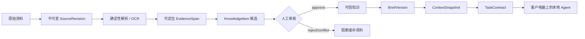

# 企业上下文层与 WrenAI 参考边界

## 1. 结论

WrenAI 对 ContentCloud 的长期价值不在 SQL 问答，而在于它证明了企业 Agent 要稳定工作，必须先建立可治理的上下文层：来源可定位、语义对象可审查、运行输入可冻结、结果可追溯。ContentCloud V1 已实现这条链路在内容营销领域的最小版本，但不会引入 WrenAI 的 BI 查询界面、SQL 生成、数据库语义引擎或向量数据库依赖。

云端仍然 zero-exec。企业数据进入云端后只经过确定性解析、人工治理、版本冻结与策略校验；Codex、Claude Code、Skill 和任何模型凭据只存在于客户电脑。

## 2. 采用与拒绝

| WrenAI 模式 | ContentCloud 决策 |
| --- | --- |
| 编译后的项目上下文与原始来源分离 | 采用。`SourceRevision -> EvidenceSpan -> KnowledgeItem -> ContextSnapshot` |
| 只向一次任务提供最小上下文 | 采用。Daemon 领取不可变 `TaskContract`，不下载整个企业知识库 |
| 可审查的语义对象 | 采用。事实、主张、视觉规则、方法论和风险项都需人工状态 |
| CLI 原语与项目格式 | 采用。所有程序化云端通信只通过 `contentcloud` |
| 数据库连接器、SQL 生成与 BI 问答 | V1 拒绝。它们不属于营销视频剧本闭环 |
| 服务端 LLM、向量召回与 prompt 编排 | 拒绝。违反 zero-exec 和客户自带 Agent 边界 |

## 3. V1 上下文流水线

实现映射：

- `internal/ingest`：TXT、PDF、DOCX、XLSX、PPTX、PNG/JPEG 的确定性定位解析。
- `internal/worker`：原子领取来源、MIME 签名校验、ClamAV 门禁、解析与 Evidence 写入。
- `internal/app/content.go`：来源、对标、框架、卖点、可视化方案和结果观察。
- `internal/app/service.go`：知识状态机、Brief、不可变快照与 Task Contract。
- `internal/store/postgres`：RLS 租户隔离、`SKIP LOCKED` 领取与完整持久化。
- `internal/blob`：本地开发与 S3 兼容对象存储适配器。

## 4. 数据进入原则

1. 原始字节先落不可变对象存储，数据库只保存 hash、MIME、大小和对象 key。
2. 声明 MIME 与字节签名不一致时失败，不能进入知识候选。
3. OCR 低于置信度门槛只进入 `needs_review`，不能由模型猜测补字。
4. KnowledgeItem 必须引用同项目 Evidence；Agent 只能创建候选，不能创建 approved 状态。
5. Brief 只引用批准知识、批准框架和批准可视化方案。
6. 每次 Run 冻结独立 ContextSnapshot。上游变化不静默改变已运行任务。
7. 客户审批和导出绑定 ScriptVersion 内容哈希，不绑定“最新版本”指针。

## 5. 企业内部扩展路线

V1.1 之后按真实项目需求增加连接器，而不是先建设通用数据平台：

1. 先增加只读文件源：飞书文档、企业网盘、对象存储目录。
2. 再增加结构化业务源：商品主数据、合规主张库、素材权利台账、投放结果。
3. 连接器只负责增量读取、版本与删除标记；治理仍收敛到当前领域对象。
4. 本地数据库或客户内网数据可由客户电脑上的 Collector 读取，并通过 `contentcloud source upload` 提交声明的产物；服务端不反向进入客户网络。
5. 只有重复检索规模证明需要时才引入全文或向量索引；索引必须携带 tenant、project、source revision 和权限范围。

## 6. 不变量

- 连接器不能成为模型凭据或 prompt 的传输通道。
- 云端不能执行客户上传的代码、Skill、HTML 或 Renderer。
- Agent 文档不能出现内部 HTTP、对象存储 SDK 或预签名 URL。
- 任何“智能召回”都不能绕过批准状态、证据定位、渠道适用范围和版本快照。
- 数据源数量增加不能改变 Script Package 的批准对象和确定性校验规则。
