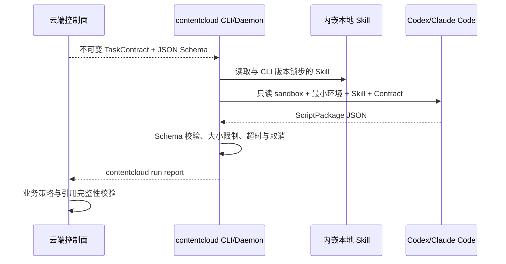

# 本地营销视频剧本 Skill

## 1. 定位

`ai-shortfilm-prompts` 适合作为镜头提示词、首尾帧、运动、连续性和负面约束的方法论来源；`moyin-creator` 适合参考从策划到镜头表的结构拆分。ContentCloud 只吸收它们对“如何写出可供 AI 视频工具执行的剧本”有价值的部分，不整合其图片生成、视频生成、模型 API、任务队列或成片工作流。

V1 的终点是 AI 视频就绪 Script Package。外部团队可以把批准后的 JSON、Markdown 或 XLSX 交给任意视频生成工具，但 ContentCloud 云端和本地 Runtime 都不在 V1 生成图片、视频或成片。

## 2. 运行位置

服务端不下发 prompt，不选择模型，不代理 Agent，也不保存 Codex/Claude 凭据。`internal/agentadapter` 只在客户电脑启动已登录的本机 CLI。

## 3. Skill 组成

当前内嵌 Skill 位于 `skills/contentcloud-marketing-video-script/`：

| 文件 | 职责 |
| --- | --- |
| `SKILL.md` | 入口、工作顺序、CLI 边界和输出约束 |
| `references/marketing-story-structures.md` | Hook、Pain、Solution、Proof、CTA 等叙事结构 |
| `references/continuity-rules.md` | 主体、道具、场景、光线和状态连续性 |
| `references/product-commercial.md` | 产品真实性、Logo/包装和商业表达边界 |
| `references/provider-profiles.md` | 不同外部视频工具的能力差异，仅用于提示词可执行性 |
| `references/script-package.md` | Script Package 字段语义 |
| `references/validation-checklist.md` | 输出前自检，但不替代服务端策略校验 |
| `agents/openai.yaml` | Codex Skill 展示元数据 |

`contentcloud skills list|read|status|install` 从 Go binary 内嵌内容读取，因此 Skill 与 CLI 命令不会独立漂移。

## 4. 画面先于话术

Skill 必须按以下顺序工作：

1. 读取批准 Brief、知识、内容框架和可视化方案。
2. 锁定一个主卖点、唯一测试变量与 invariant list。
3. 建立 Production Bible：主体身份锚、真实产品策略、场景锁与视觉锁。
4. 先写镜头的决策功能、可见动作和证据，再写口播与字幕。
5. 为每个镜头给出首帧、运动、尾帧、负面约束、连续性状态与验收条件。
6. Proof 镜头必须引用批准 VisualizationPlan；确定性表达必须引用批准 KnowledgeItem。
7. 输入不足时输出 `deliverability=blocked` 和可执行 next action，不能编造事实。

## 5. Adapter 安全边界

- Codex 使用 `codex exec --sandbox read-only --ephemeral --output-schema`。
- Claude Code 使用非交互权限模式、空工具集和 JSON Schema 输出。
- 每次运行使用临时目录与环境变量 allowlist。
- stdout/stderr 各有 10MB 上限，运行最长 30 分钟。
- Daemon 每 25 秒续租并检查取消；服务端只保存脱敏进度，不保存 Agent 原始思考或聊天记录。
- Adapter 能力通过实际版本/帮助探测，不能只根据 PATH 猜测。

## 6. 确定性验收

模型输出只有同时通过以下检查才成为 `review_ready`：

- JSON Schema、枚举、时码、镜头顺序、总时长和 9:16 画幅。
- Hook、Product Solution、Proof、CTA 完整。
- 主卖点、渠道、测试变量和 Brief 一致。
- Proof 与 VisualizationPlan、话术/字幕/视觉事实与 KnowledgeItem 引用完整。
- 中文生成提示、负面约束、连续性、产品真实性策略和可观察验收条件完整。
- 同一 Run 重复 report 同 hash 幂等；不同 hash 返回 `REPORT_CONFLICT`。

这些规则由 `internal/domain` 执行。Skill 自检只是改善首次通过率，不能成为信任边界。

## 7. 升级策略

Skill 改动若只改善说明文字，可随 CLI patch 版本发布；若改变 Script Package 字段或规则，必须同时升级 JSON Schema、Task Contract、Go 校验器、fixture、Web 展示和导出，并保留旧版本只读能力。V1 不允许 Skill 自修改、从服务端热更新或在运行时安装未知依赖。
