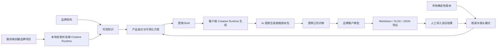

# ContentCloud V1 路线方案

> 状态：实施基线  
> 版本：1.0  
> 日期：2026-07-25  
> 目标：8 周内交付南京 AI 内容营销公司的可试点版本

## 1. 产品结论

ContentCloud 是面向 AI 内容营销服务商的多租户 B2B2B 工作台。营销公司使用它为传统品牌建立可信知识、沉淀市场内容方法、生成 AI 视频剧本并完成客户审批；品牌客户通过受限入口提供资料、核验事实并审批交付版本。

V1 只完成一条纵向闭环：

V1 不生成图片、视频或成片，不自动发布或投放，不开发原生桌面 App，不建设通用 Agent 市场。

## 2. 已锁定决策

| 主题 | V1 决策 |
| --- | --- |
| 商业形态 | 面向 AI 内容营销公司的多租户 SaaS |
| 主要操作者 | 营销公司管理员、项目负责人、内容策略、编导和审核员 |
| 品牌客户 | 通过受限审批链接查看依据、批注、批准或退回指定版本 |
| 身份认证 | 团队使用已验证邮箱 + 密码；客户审批链接绑定邮箱并使用一次性邮件验证码二次验证 |
| 云端职责 | 租户、资料、知识、工作流、审批、审计、确定性任务契约与产物索引的事实源 |
| 本地职责 | Creative Runtime（Daemon/CLI）使用本机 Skill、Agent、Renderer、凭据和模型选择执行创作 |
| 首次接入 | 必须先在 Web 创建项目，再由项目页生成一次性连接码，引导用户在自己的电脑安装并连接 Creative Runtime |
| LLM 边界 | 服务端不调用、代理、编排或保存任何 LLM；所有 LLM/渲染调用均在客户端发起 |
| 能力边界 | 云端只看见业务 capability；Skill、Agent、模型、Renderer 组合及其配置是客户端私有实现 |
| 程序化入口 | Agent、Skill、Renderer、脚本和 CI 与服务端的所有通讯必须经 `contentcloud` CLI；HTTP 与对象存储协议不对集成方公开 |
| 产物展示 | 核心 Script Package 原生展示；V1 扩展产物按安全预览件、本机打开、元数据占位逐级降级；Hosted Preview 在 V1.1/P3 实施 |
| 桌面形态 | Daemon + CLI，不开发 Electron/Tauri |
| 资料存储 | 云端加密对象存储，按任务向本地 Daemon 下发不可变资料包 |
| 客户端安全 | 临时工作区、只读 Agent、结构化 stdout、本地 Renderer 隔离、Daemon 校验后回传 |
| 首版结果 | 面向可灵、即梦等国内工具的 AI 视频生成就绪剧本包 |
| 导出格式 | 人用 Markdown、XLSX，以及机器可读 canonical JSON |
| 反馈闭环 | 手工或表格导入最小投放结果；自动平台连接放到 V1.1 |
| 技术栈 | Go 1.24 控制面与 CLI/Daemon、React + TypeScript Web、Postgres、S3、OpenAPI 3.1 + JSON Schema |

## 3. 双上下文模型

可信剧本需要两类相互独立、同时受治理的上下文。

### 3.1 品牌事实上下文

回答“关于这个客户和产品，哪些内容是真的、允许说、允许展示”：

- 原始来源与精确证据位置。
- 产品事实、品牌事实和视觉规则。
- 对外营销主张及适用渠道。
- 素材真实性等级和使用权利。
- 冲突、有效期、人工决策和变更影响。

### 3.2 市场内容上下文

回答“在什么用户决策场景下，哪些内容结构和画面表达值得测试”：

- 对标内容及其销售验证依据。
- 画面框架与文案框架。
- 钩子、痛点、产品引入、使用、结果证据和 CTA 镜头模式。
- 人群、需求时刻、场景、冲突和表达视角。
- 卖点可视化方案、正反案例和执行标准。
- 测试变量、结果观察、框架和镜头评级。

市场内容上下文不能替代品牌事实。一个已验证的竞品框架只能提供结构，不能成为本品牌事实、功效或权利依据。

## 4. 参考实现的取舍

| 来源 | 保留 | 不保留 |
| --- | --- | --- |
| `marketing/jinling-gudu` | Source/Evidence/Fact/Claim/Rights 分离、人工门禁、影响分析、内容引用 | Wiki 作为在线事务库、全局字符串 ID、服务配置与客户知识混存、单一 completed 状态 |
| WrenAI | 源码与编译产物分离、最小上下文、可审查项目格式、CLI 原语、Skill 随版本交付 | BI/SQL、Rust 语义引擎、数据库连接器和向量库依赖 |
| Loopany | 项目内生成连接码、本机 `up` 启动、等待设备心跳、一次性设备绑定、统一 CLI dispatch、出站 long-poll、任务租约、manifest/hash blob 同步、BYOA Agent | cron loop、evolve、自修改任务、持续目录同步和通用生成式 UI |
| 飞书官方 CLI | Go 单二进制、npm 零门槛安装器、分平台凭据保护、稳定 JSON/错误契约、doctor、dry-run、schema introspection、风险门禁、Agent Skills 与 binary 锁步 | 200+ OpenAPI 镜像命令、允许任意写入的 raw API、bot/user 双身份、与内容生产无关的业务域 |
| 短视频培训材料 | 画面证据、双框架拆解、卖点可视化、需求时刻、单变量测试、反馈复盘 | 搬运/镜像等灰色操作、评论区包装、未经验证的固定数量指标 |

WrenAI 核心与 Loopany 均允许在许可证条件下复用代码，但 V1 默认复用设计思想和经过审查的独立模块，不直接 fork 任一项目。

## 5. 文档导航

| 文档 | 解决的问题 |
| --- | --- |
| [01-prd.md](01-prd.md) | 产品目标、功能、范围、指标和验收是什么 |
| [02-user-stories-and-use-cases.md](02-user-stories-and-use-cases.md) | 谁如何使用系统，页面和异常状态如何表现 |
| [03-domain-and-data-model.md](03-domain-and-data-model.md) | 领域实体、关系、状态和原型迁移如何定义 |
| [04-system-architecture.md](04-system-architecture.md) | 云端、Worker、Daemon、Agent 和存储如何协作 |
| [05-agent-protocol-and-api.md](05-agent-protocol-and-api.md) | CLI 命令、私有传输、设备协议、Task Contract、Capability 和 Script Package 如何协作 |
| [06-product-workflows.md](06-product-workflows.md) | Gate 0-5、审批、影响分析和恢复流程如何运行 |
| [07-security-reliability-and-testing.md](07-security-reliability-and-testing.md) | 安全边界、可靠性目标和测试策略是什么 |
| [08-delivery-plan.md](08-delivery-plan.md) | 8 周如何交付、迁移、验收和上线试点 |
| [09-hosted-preview-and-cli-gateway.md](09-hosted-preview-and-cli-gateway.md) | 项目创建后如何安装客户端、CLI 如何成为唯一程序化入口，以及 V1.1 云端演示如何托管 |
| [10-technology-selection.md](10-technology-selection.md) | 为什么选择 Go 控制面与 CLI、TypeScript Web，以及契约和部署如何组织 |
| [11-feishu-cli-benchmark.md](11-feishu-cli-benchmark.md) | 飞书官方 CLI 的源码事实、可复用模式、拒绝项和 ContentCloud CLI 验收标准 |
| [12-enterprise-context-layer.md](12-enterprise-context-layer.md) | WrenAI 对企业上下文层的参考价值、采用边界与数据扩展路线 |
| [13-marketing-video-script-skill.md](13-marketing-video-script-skill.md) | `ai-shortfilm-prompts` 与 Moyin 方法如何进入本地剧本 Skill |
| [14-implementation-status.md](14-implementation-status.md) | 当前实现事实、V1/V1.1 边界、环境限制与验收入口 |
| [15-completion-matrix.md](15-completion-matrix.md) | 各 FR/UC/NFR 的实现证据、未完成项和验收门禁 |

## 6. 设计原则

1. **事实先于生成**：Agent 只能使用任务快照内明确允许的知识和素材。
2. **画面先于话术**：正式剧本必须先有可实现、可证明、可验收的画面方案。
3. **执行成功不等于可交付**：Run 和 Deliverable 使用独立状态机。
4. **人类拥有最终决策权**：事实、主张、权利、Brief 和剧本批准均不可由 Agent 自动完成。
5. **一次只验证一个主要变量**：变体必须声明保留项和变化项。
6. **来源可追溯**：事实、镜头参考和方法论引用必须能回到不可变来源版本。
7. **服务端不参与 LLM**：云端只生成确定性 Task Contract、验证同步结果；不保存 prompt、模型密钥或 Agent 执行逻辑。
8. **创作能力属于客户端**：Skill、Agent Adapter 和 Renderer Adapter 由客户端安装、探测、选择和执行，服务端只按 capability ID 路由契约。
9. **项目包可移植**：数据库是在线事实源，Markdown/YAML/JSON 是导入导出和客户端消费格式。
10. **支持未知而非理解一切**：新增工具只需返回标准 envelope；云端不为每种私有格式开发 Renderer，也不让不可预览扩展产物阻断核心剧本审批。
11. **项目先于设备**：先在服务端建立租户、项目和授权边界，再生成一次性连接码；设备不能脱离项目上下文自行创建业务空间。
12. **CLI 是程序化边界**：HTTP、上传许可和 token 都是 `contentcloud` 的私有传输细节，Agent 文档只出现稳定 CLI 命令。

## 7. V1 成功定义

- 至少两个测试租户可并行使用，自动化测试证明不存在跨租户访问。
- 金陵古都香现有资料可导入并保留来源哈希、证据位置和旧 ID。
- 营销团队能完成知识审核、卖点可视化、Brief 和剧本双层审批。
- 不同客户端 Skill、Codex、Claude Code 或 Renderer 能消费同一 Task Contract，并返回同一核心 Schema。
- 剧本中所有确定性表述、参考素材和画面证据均可追溯。
- 缺少事实、主张、权利或可视化方案时，系统生成 blocked 结果而非绕过门禁。
- 批准剧本能导出 Markdown、XLSX 和 canonical JSON。
- 外部生成视频后的最小结果数据可回收到具体剧本、框架、镜头模式和测试变量。

## 8. 术语

| 术语 | 定义 |
| --- | --- |
| Brand Project | 营销公司为一个品牌或单品建立的隔离工作空间 |
| Knowledge Item | 带状态、证据和有效范围的事实、主张、规则、受众或场景对象 |
| Benchmark Content | 用于分析结构的外部或自有参考内容，不自动获得复用权 |
| Content Framework | 从案例抽象出的画面顺序与文案结构 |
| Shot Pattern | 承担特定决策功能的可复用镜头模式 |
| Visualization Plan | 将某个卖点转成画面证据的实现方案 |
| Demand Moment | 人群在具体场景和冲突下被触发的需求时刻 |
| Task Contract | 服务端按确定性规则生成的不可变最小上下文快照；不含 prompt 或 Agent 实现 |
| Client Capability | 客户端声明的 Skill、Agent 或 Renderer 能力及版本；服务端仅按其 ID 和契约版本分配任务 |
| Script Package | 包含叙事、镜头、引用、生成约束和验收条件的结构化剧本版本 |
| Review Projection | 客户端从扩展产物生成的只读、可移植、可审阅投影；不替代原始产物 |
| Deliverable | 可供内部或品牌客户审核的业务产物，与 Agent Run 分开管理 |
| Connect Session | 项目创建后由服务端生成、短期有效且只能消费一次的客户端安装与设备绑定会话 |
| CLI Gateway | 接收 `contentcloud` 命令封装的私有传输入口，按用户、设备或运行凭据开放最小命令集合 |
| Hosted Preview | 客户端构建、云端仅校验和隔离托管的静态交互演示；属于 V1.1/P3，不替代 ScriptVersion 审批对象 |
