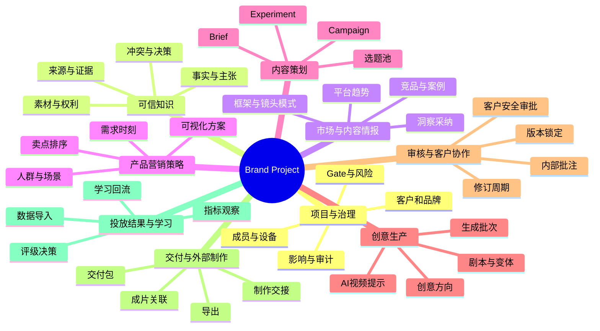

# 九域业务能力地图、用户故事与用例

## 1. 建模方法

V2 同时存在三个不同维度：

```text
九域：用户在哪里工作
Gate：业务何时允许向下游推进
LocalRunContext：用户在本地 Agent 中执行哪些步骤
Automation/Run：哪些步骤由服务端远程、事件或定时驱动
```

云端页面按九域治理检查点组织；项目总览显示 Gate、最近 Submission 和本地工作区状态；运行中心只展示 Automation，不成为项目首页。

## 2. 九域能力地图



## 3. 能力、对象与自动化映射

| 域 | 本地工作区 | 云端治理 | 可选 Automation |
| --- | --- | --- | --- |
| 项目与治理 | init、模板和本地状态 | 分工、Gate、风险、影响、审计 | 权利到期、来源变化、项目周报 |
| 可信知识 | ingest、OCR、extract、lint、query | Submission、证据复核和决策 | 周期刷新、来源变化检查 |
| 市场情报 | 网页/企业资料研究、案例拆解 | Insight 提交、采纳和版本 | 趋势/竞品监控 |
| 营销策略 | 人群、场景、卖点和可视化方案 | Strategy 检查点审批 | 周期风险提示 |
| 内容策划 | 选题、实验和 Brief 编译 | Brief Submission 审批 | 事件提醒、周期复盘 |
| 创意生产 | 方向、批次、生成、变体、修订、lint | Script Submission 审阅 | 远程批处理 |
| 审核协作 | pull 批注并修订 | 批注、退回、批准、锁版 | 到期/等待 Follow-up |
| 交付制作 | 本地导出和制作交接包 | 批准版本下载和收件记录 | 清单检查 |
| 结果学习 | 本地/文件导入、分析候选 | Observation 和 Learning 决策 | 周期表现诊断 |

## 4. 信息架构

```text
工作台
├── 客户组合
├── 待办与审批
├── 自动化与运行
└── 风险与通知

客户
├── 客户概览
├── 服务模板与知识包
└── 品牌/产品项目

项目
├── 总览
├── 可信知识
├── 市场情报
├── 营销策略
├── 内容策划
├── 创意生产
├── 审核协作
├── 交付制作
├── 结果学习
└── 设置与审计
```

项目总览第一屏必须显示品牌/产品身份、当前 Gate、业务阻断、负责人、下一动作和最近交付。运行状态是辅助信息，不得比业务状态更突出。

## 5. 角色责任矩阵

| 事项 | Admin | PM | Strategist | Editor | Reviewer | Client |
| --- | --- | --- | --- | --- | --- | --- |
| 租户与服务模板 | A/R | C | I | I | I | - |
| 客户项目和人员 | C | A/R | C | C | I | I |
| 来源与素材提交 | I | A | R | C | C | C |
| 事实/主张/权利批准 | I | C | C | I | A/R | C |
| 市场研究与洞察采纳 | I | A | R | C | C | I |
| 策略与 Brief | I | A | R | C | C | C |
| 剧本生成和修订 | I | A | C | R | C | I |
| 内部批准 | I | C | C | C | A/R | I |
| 客户最终批准 | I | C | I | I | C | A/R |
| 交付与结果回流 | I | A | C | R | C | C |

## 6. 关键用户故事

### 项目负责人

- 作为项目负责人，我希望从项目总览立即知道当前 Gate、阻断原因、责任人和最小下一动作，而不是浏览所有 Run。
- 我希望为一个客户复用租户模板，同时保留客户特有的方法、知识和审批规则。
- 我希望暂停持续自动化而不改变已经批准的业务对象。

### 策略人员

- 我希望同时查看品牌事实和市场结构，但能清楚区分二者的证据资格。
- 我希望把受众、场景、痛点和卖点组合成可评审的 StrategyVersion。
- 我希望每个 Brief 明确可视化方案、禁止项和单一测试变量。

### 编导

- 我希望通过一个 CreativeBatch 生成多个方向，并比较差异、引用、风险和可实现性。
- 我希望针对具体镜头批注发起修订，而不是重新描述全部上下文。
- 我希望导出的逐镜头提示可直接交给 AI 视频制作人员使用。

### 审核员与客户

- 我希望看到确定性表述来自哪里、素材是否可用、上版到本版改了什么。
- 我希望批准的是固定版本，即使后来产生新版本，历史决定也不改变。
- 我希望来源或权利变化时，系统准确列出受影响对象而不是自动替我决策。

## 7. 核心用例

### UC-01 创建客户项目并连接客户端

1. PM 创建客户、品牌、产品和项目，选择服务模板。
2. 系统检查角色和客户审批人。
3. 项目生成一次性连接码和对应安装命令。
4. 用户在本机执行 CLI 安装/连接，Daemon 声明业务 capability。
5. 服务端确认设备在线并授予项目级权限。

异常：连接码过期、被消费、设备已撤销或 capability 不满足时，项目保留但 Agent 动作 blocked。

### UC-02 完成客户素材诊断和知识包

1. 用户登记来源 revision。
2. 本地 Skill 解析资料、生成候选并完成 lint/query。
3. 本地生成 15 维覆盖、冲突、缺口和七层知识包。
4. 用户确认 publish，选择每个来源的披露等级。
5. Reviewer 在云端对指定 Fact、Claim 和 Rights 作出决策。
6. 客户端 pull DecisionDelta 和 ApprovedSnapshot。

### UC-03 执行市场研究

1. Strategist 指定平台、竞品、关键词、时间窗和研究问题。
2. 客户端研究公网和授权企业资料，返回带来源洞察。
3. 用户拆解或修订框架、镜头和证据模式。
4. 用户采纳、拒绝或标记待验证；只有采纳项进入策略候选。

### UC-04 锁定策略和 Brief

1. 选择 Audience、DemandMoment 和 SellingPoint，组合为 StrategyVersion 候选。
2. 创建至少一个 VisualizationPlan，声明真实性策略和 Plan B。
3. publish strategy 检查点，Reviewer 批准后 pull strategy ApprovedSnapshot。
4. 引用已批准的 `strategy_version_id` 和 `visualization_plan_ids` 生成 Brief 草稿并执行确定性校验。
5. publish brief 检查点，Reviewer 批准对应 SubmissionRevision，生成 brief ApprovedSnapshot。

### UC-05 生成 AI 视频就绪剧本批次

1. Editor 在本地 pull approved Brief，并创建 CreativeBatch。
2. 选择业务模板、候选数量、变化维度和目标 capability。
3. 本地 Agent 直接生成 ScriptPackage V2，不领取云端任务。
4. 本地执行 Schema、引用、权利、品牌、连续性和单变量校验。
5. 用户确认 publish；服务端复核 manifest 后创建待审 Script Submission。

### UC-06 审核、修订和客户批准

1. 内审按对象、镜头或字段创建批注。
2. Editor pull ReviewFeedbackBundle，在本地选择基线和批注发起 revise LocalRunContext。
3. 新版本显示结构化 diff 并继承未解决批注。
4. 内审通过后生成客户安全链接。
5. 修订稿再次 publish；客户 OTP 验证后批准或退回固定版本。

### UC-07 交付和结果回流

1. 从客户批准版本创建 DeliveryPackage。
2. 生成 JSON、Markdown、XLSX 和 ProductionHandoff。
3. 记录外部制作及成片关联。
4. 导入投放结果并生成候选 Learning。
5. Strategist 采纳或拒绝建议，决定是否创建新实验或重编内容。

### UC-08 持续自动化

1. PM 从“竞品周监控”模板创建计划。
2. 配置研究范围、每周时间、负责人、设备和通知。
3. 调度器创建 Run，客户端在线时领取；离线则等待或按策略跳过。
4. RunOutput 自动创建 Research Submission，进入情报待采纳列表，不自动修改策略。
5. 用户用自然语言提出变更，客户端生成 diff，PM 确认后启用新 PlanVersion。

## 8. 页面状态要求

每个九域页面必须覆盖：

- 首次使用引导，但不遮挡实际工作台。
- 空数据和推荐下一动作。
- 加载、部分加载和重试。
- blocked、needs_review、review_required 和失效状态。
- 权限不足、项目归档、设备离线和 capability 缺失。
- 长列表筛选、排序、批量选择和分页。
- 业务对象详情到来源、Run、审批和下游影响的可导航关系。

## 9. Loopany 的采用边界

采用：open/closed 生命周期思想、调度、run once、暂停恢复、租约、心跳、运行历史、通知策略和受限展示。

改造：Loop 改为业务模板驱动的 Automation Plan；edit 改为需确认的 PlanChangeRequest；evolve 改为候选改进建议，不允许自动修改正式计划。

拒绝：Loop 作为首页主对象、Agent 自主完成业务目标、Agent 自改任务后立即生效、文件目录作为云端事实源、完整 transcript 上传和通用生成式 UI。
