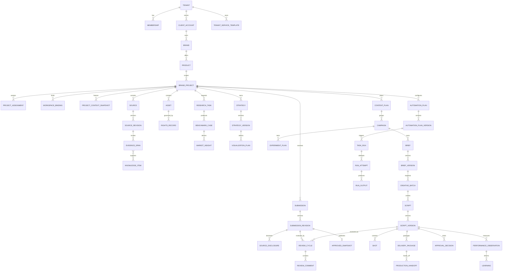
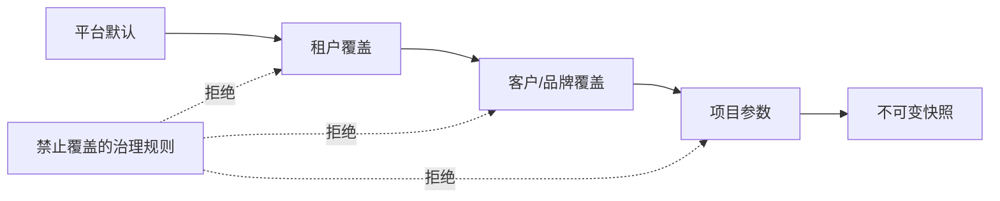
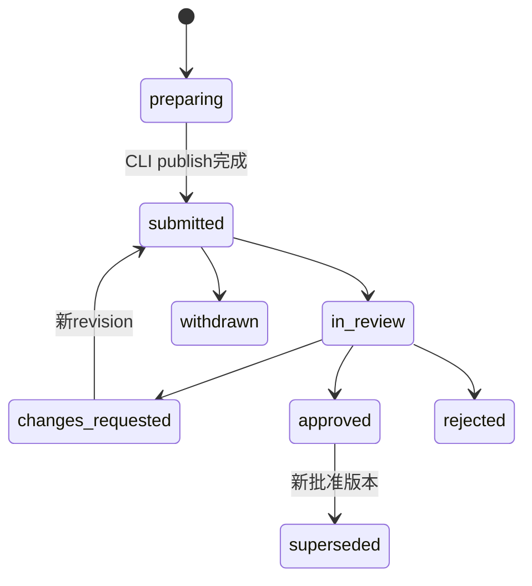
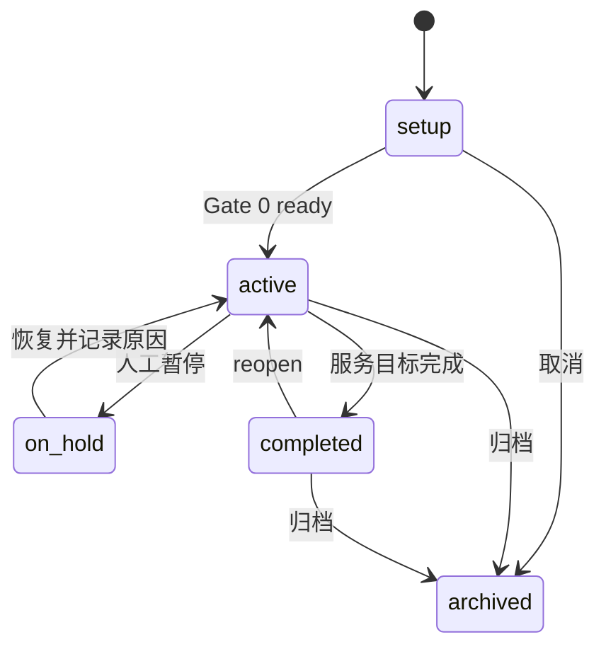
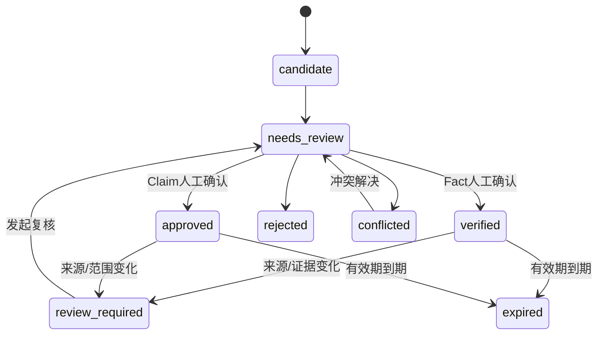

# V2 领域与数据模型

## 1. 建模原则

1. 本地工作区是未发布草稿事实源；云端 Submission、人工决定和 ApprovedSnapshot 是跨团队治理事实源。
2. 需要审批、复现或交付的内容使用不可变版本；可编辑聚合只保存当前指针。
3. 所有对象带 `tenant_id`；项目内对象同时带 `project_id`，数据库查询不能依赖调用方自行补租户条件。
4. 来源、证据、事实、主张、素材和权利分离，市场结构与品牌事实分离。
5. V2 只增加当前九域和剧本闭环需要的抽象，不建设通用低代码实体系统。
6. 客户端只能通过不可变 Submission 提交内容；云端状态变化由领域服务校验并写入 append-only AuditEvent。

## 2. 聚合关系



## 3. 通用字段与版本规则

可变聚合通用字段：

```text
id, tenant_id, project_id?, status, version,
created_at, created_by, updated_at, updated_by
```

云端不可变 Submission/批准版本通用字段：

```text
id, aggregate_id, version_no, schema_version, content_hash,
based_on_version_id?, context_snapshot_id,
created_at, created_by, superseded_at?
```

- `version` 用于乐观锁；更新请求必须携带 expected version。
- `content_hash` 基于 canonical JSON 计算，审批、导出和 lineage 使用该值。
- `based_on_version_id` 表示修订/变体的直接基线，不代替更细的 lineage edge。
- 版本创建后内容不可修改；错误通过新版本修正。

本地草稿不要求每次编辑都进入云端版本表。本地 `LocalRunContext`、文件 hash 和模板锁负责过程可复现；只有 publish 后才产生 SubmissionRevision。

### 3.1 本地工作区对象（不进入云端事务库）

| 对象 | 存储位置 | 作用 |
| --- | --- | --- |
| `WorkspaceTemplateLock` | `.contentcloud/template.lock` | 模板、Skill、MCP 和 Schema 版本 |
| `WorkspaceSyncState` | `.contentcloud/sync-state.json` | 最近 pull/publish 游标和本地 hash |
| `LocalRunContext` | `work/runs/*.json` | ingest/query/compile/lint 阶段与交接历史 |
| 本地草稿 | knowledge/work/outputs | 未发布知识、策略、Brief 和剧本 |

服务端可保存 WorkspaceBinding 的 workspace ID、设备、模板版本、最后同步时间和 capability，但不保存本地绝对路径。

## 4. 客户与四层上下文

### 4.1 `client_accounts`、`brands`、`products`

`ClientAccount` 表示营销公司服务的企业客户，不等于系统租户。一个租户可以服务多个客户；客户可包含多个品牌和产品。

关键字段：name、industry、service_status、primary_contact、data_region、retention_policy_id。

### 4.2 方法论与模板

| 对象 | 作用 |
| --- | --- |
| `MethodologyTemplateVersion` | 平台级 15 维诊断、研发节点、治理和内容研发规则 |
| `TenantServiceTemplateVersion` | 营销公司的服务包、角色、Gate、检查表、意图集合和交付标准 |
| `BrandKnowledgePackVersion` | 客户/品牌七层上下文、覆盖、缺口、资源和限制 |
| `ProjectContextSnapshot` | 一次 Run 实际可使用的不可变最小上下文 |

`ProjectContextSnapshot` 保存被选中的版本 ID、eligible/blocked ID 集、manifest hash 和任务所需的最小内容，不复制不可控的整个客户知识库。

### 4.3 覆盖规则



- 覆盖项必须在模板中声明 `overridable=true`。
- 禁止覆盖人类审批、租户隔离、证据资格、权利门禁和服务端 zero-agent 边界。
- 上层发布新版本不改变已存在快照；项目 rebase 生成影响项并要求人工确认。

## 5. 九域聚合

### 5.0 Submission 与批准快照

`Submission` 是某类业务检查点的稳定身份，类型为 knowledge、research、strategy、brief、script、delivery 或 performance。`SubmissionRevision` 保存 manifest、content hash、base approved snapshot、提交说明、本地 RunContext 摘要和披露策略。



批准时服务端生成 `ApprovedSnapshot`，包含批准的 canonical 内容、subject hash、决定、允许后续本地使用的 eligible IDs 和下载 manifest。`DecisionDelta`/`ReviewFeedbackBundle` 是客户端 pull 的不可变反馈包。

`SourceDisclosure` 对每个来源记录 `metadata_only|evidence_pack|full_source`。默认 evidence_pack；高风险 Claim/Rights 若证据等级不满足租户策略则不能远程批准。

### 5.1 项目与治理

新增 `ClientAccount`、`Brand`、`Product`、`ProjectAssignment`、`GateDecision`、`ProjectRisk`、`ImpactAction`。现有 `BrandProject`、Membership、Device、ConnectSession 和 AuditEvent 原位保留。

项目状态：



### 5.2 可信知识

V1 Source、SourceRevision、EvidenceSpan、KnowledgeItem、Conflict、DecisionRequest、Asset 和 RightsRecord 继续使用。V2 明确 KnowledgeItem kind：

- `fact_assertion`
- `claim`
- `brand_rule`
- `audience_fact`
- `scenario_fact`
- `synthesis`

状态资格仍按类型决定，不能用一个通用 approved 取代：



### 5.3 市场与内容情报

本地研究配置首先存在工作区；publish 后形成 Research Submission。云端 `ResearchTask` 只表示已提交研究或 Automation 配置：research_type、scope、platforms、competitors、queries、time_window、source_policy、status。

`BenchmarkCase`：source snapshot、ownership、channel、performance evidence、visual framework、copy framework、shot patterns、reuse boundary。

`MarketInsight`：statement、evidence refs、confidence、observed_at、applicability、adoption status。状态为 candidate、adopted、rejected、stale；adopted 只代表策略参考资格，不代表品牌事实资格。

### 5.4 产品营销策略

`StrategyVersion` 组合 Audience、Scenario、DemandMoment、PainPoint、SellingPoint 和 adopted Insight。`VisualizationPlan` 继续沿用 V1 并增加：asset strategy、generation mode、truth level、continuity anchor、production risk。

状态：draft -> internal_review -> approved/revision_requested -> review_required -> retired。

### 5.5 内容策划

`ContentPlan` 是周期和渠道计划；`Campaign` 是一个业务主题；`ExperimentPlan` 是单变量测试；`BriefVersion` 是创意生产的不可变输入。

Brief 必须引用 approved StrategyVersion 和至少一个 approved VisualizationPlan。V1 Brief 记录迁移为默认 Campaign 下的 BriefVersion，不改变原 ID。

### 5.6 创意生产

`CreativeDirection` 表示创意方向：angle、hook、narrative、visual motif、tone、target emotion、risks。

`CreativeBatch` 首先是本地批次 manifest：brief snapshot、direction IDs、count、variant dimension、output schema 和本地 status。publish 后云端以 SubmissionRevision 保存候选集合；远程 Automation 才额外关联 TaskRun。

`Script` 是稳定身份；`ScriptVersion` 是不可变内容；`Shot` 可作为 JSON 子对象和读优化表投影，不允许两个事实源分别编辑。

### 5.7 审核与客户协作

沿用 ReviewCycle、ReviewComment、ReviewGrant、ApprovalDecision。新增字段定位 `subject_path`，例如 `/shots/shot-03/voiceover`。

ApprovalDecision 绑定 subject_type、subject_id、subject_hash、actor、decision、reason、previous_state、resulting_state。

### 5.8 交付与外部制作

`DeliveryPackage`：批准的 ScriptVersion 集合、格式、manifest、hash、recipient、delivery status。

`ProductionHandoff`：shot production method、asset checklist、missing inputs、tool suggestion、rights boundary、acceptance checklist、external status 和 final media refs。

V2 只记录外部制作，不存供应商密钥，不自动提交视频生成任务。

### 5.9 投放结果与学习

沿用 ImportBatch、PerformanceObservation、RatingDecision 和 Memory/Lineage 设计。新增 `Learning` 作为候选结论：target_type、target_id、observation_ids、statement、confidence、sample warning、recommended action、adoption decision。

`Learning=adopted` 也不能自动修改 StrategyVersion；采纳动作必须创建新策略/Brief 或显式 ImpactAction。

## 6. Automation、Run 与 Output

`AutomationPlan` 是稳定身份；`AutomationPlanVersion` 是不可变配置；`TaskRun` 是一次远程/事件/定时调度；`RunAttempt` 是一次设备执行；`RunOutput` 必须转换为 SubmissionRevision。

```text
AutomationPlanVersion
  trigger + business_scope + template + parameters
  -> TaskRun
      -> RunAttempt(device/capability/lease)
          -> RunOutput(schema/subject/projection)
              -> SubmissionRevision
                  -> human review / ApprovedSnapshot
```

RunOutput 不得直接批准、发布或覆盖业务对象。普通本地操作不使用上述模型，详细边界见 `06-local-workspace-and-publishing.md` 和 `07-automation-and-run-model.md`。

## 7. Lineage 与影响传播

采用显式 edge：

```text
local_source -> local evidence/knowledge -> knowledge submission -> approved snapshot
approved knowledge -> local strategy/brief -> brief submission -> approved brief
approved brief -> local script -> script submission -> approved script
script_version -> delivery_package -> performance_observation -> learning
```

上游变化只执行两步：

1. 确定性计算受影响对象和影响严重度。
2. 创建 ImpactAction，并按规则将正式下游标记为 `review_required`。

系统不得自动重写下游内容，也不得把所有历史批准记录改成无效；历史决定保持可审计，当前可用性单独表达。

## 8. 数据一致性约束

- tenant/project 外键必须一致，跨项目引用默认拒绝。
- approved BriefVersion 的 StrategyVersion 必须 approved 且未失效。
- review_ready ScriptVersion 必须来自通过本地 preflight 和服务端 manifest 复核的 SubmissionRevision。
- client approved ScriptVersion 必须先 internal approved 且无 unresolved blocking comment。
- DeliveryPackage 只能引用 client approved ScriptVersion。
- PerformanceObservation 必须引用具体内容版本和统计窗口。
- schedule trigger 只能用于模板声明的 automation type。
- 同一业务幂等键在 tenant + operation 范围内唯一。

## 9. V1 兼容映射

| V1 | V2 |
| --- | --- |
| BrandProject 中的品牌/单品字段 | 原值保留，同时创建 ClientAccount/Brand/Product 引用 |
| BriefVersion | 归入默认 ContentPlan/Campaign，ID 和 hash 不变 |
| script generation TaskRun | 保留为 V1 远程执行历史；V2 普通生成迁移为 Submission，不伪造 AutomationPlan |
| ScriptPackage 1.x | 只读兼容；修订时显式升级为 2.0 |
| Artifact | 继续保存二进制/扩展产物；新增 RunOutput 负责业务投影关系 |
| PerformanceObservation | 原位保留，补 Campaign/Experiment/CreativeDirection lineage |

V1 云端 TaskRun 生成的 ScriptVersion 保持可读。迁移后新的普通创作默认由本地 publish 创建；只有明确 Automation 来源的 ScriptVersion 才要求 TaskRun/RunAttempt lineage。

数据库迁移必须可回滚结构变更，不回滚已产生的业务决定；任何数据回填先 dry-run 输出数量、冲突和不可映射项。
