# V2 业务流程、Gate 与恢复机制

## 1. Gate 总览

V2 保留 V1 Gate 0-5 的语义并细化输入，不为九域各造一套门禁。

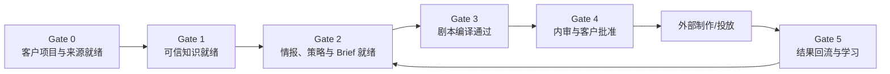

Gate 是条件集合，不是页面步骤，不跟随 Run 成功自动前进。GateDecision 必须记录检查结果、豁免、责任人和时间。

## 1.1 四种执行路径

| 路径 | 发起位置 | 云端对象 | 适用范围 |
| --- | --- | --- | --- |
| 本地交互 | Codex/Claude Code/CLI | 无 TaskRun | ingest、query、策略、Brief、生成、修订 |
| 显式发布 | 本地 CLI | SubmissionRevision | 知识、Brief、剧本等门禁检查点 |
| 云端治理 | Web | Review/Decision/ApprovedSnapshot | 批注、批准、退回、锁版、影响 |
| 云端自动化 | Scheduler/Event/Web remote run | TaskRun/Attempt/RunOutput/Submission | 监控、复盘、Follow-up、远程批处理 |

普通本地交互不得为了记录过程而创建空的云端 TaskRun。

## 2. 客户接入与项目创建

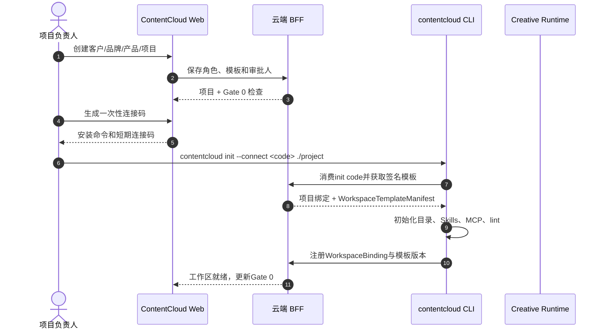

Gate 0 退出条件：角色完整、审批人可达、服务模板已锁定、至少一个本地工作区完成 doctor。只有启用 Automation 时才要求获授权 Daemon 在线；普通本地创作不依赖后台轮询。

## 3. 客户素材诊断与四层上下文

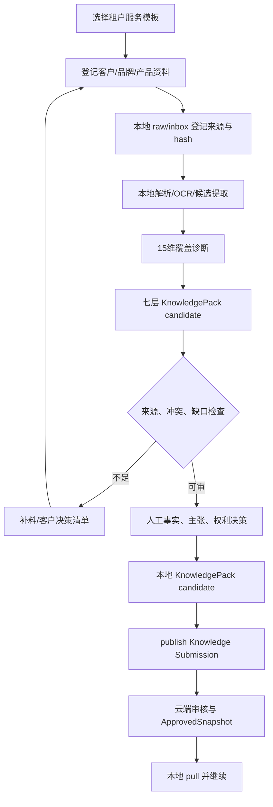

方法论、知识包和本体知识不得混成一个长文档。方法论说明收集什么，知识包组织 Agent 需要理解什么，本体知识决定哪些事实和表达具备资格。

## 4. Gate 1：本地知识工程与云端审核

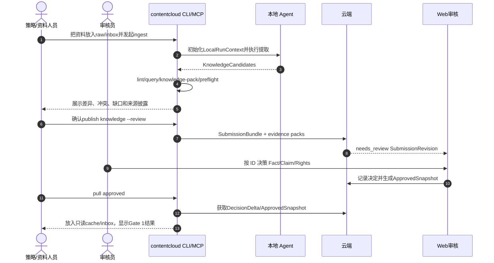

失败规则：无法定位原文、证据越界、冲突未解决、权利未知或关键事实缺失时保持 blocked；不能用模型常识补齐。

## 5. 市场情报到策略

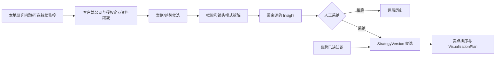

市场情报回答“什么结构值得测试”，品牌知识回答“本品牌什么可以说和展示”。两者在 StrategyVersion 中组合，但资格和引用类型保持分离。

## 6. Gate 2：策略、内容计划与 Brief

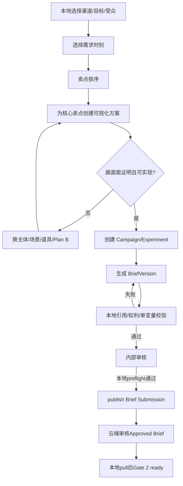

退出条件：approved StrategyVersion、approved VisualizationPlan、approved BriefVersion、目标渠道和测量窗口明确、禁止项无冲突。

## 7. Gate 3：剧本生产

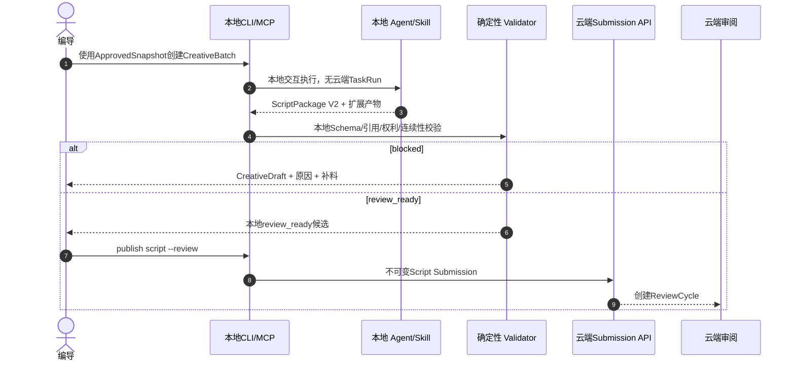

普通本地生成没有云端 Run 状态；只有本地 lint 通过并成功 publish 的 SubmissionRevision 才进入云端 review。Automation Run succeeded 仍只表示执行协议完成。

## 8. Gate 4：审核、修订与批准

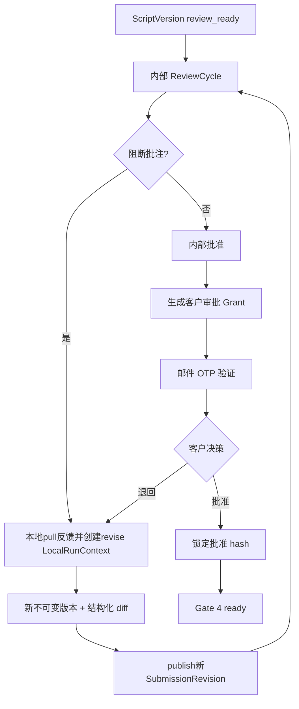

客户只能看到 client-visible 批注、安全引用摘要和允许展示的素材。链接过期、撤销、邮箱不匹配或对象状态变化时拒绝决策。

## 9. 交付与外部制作

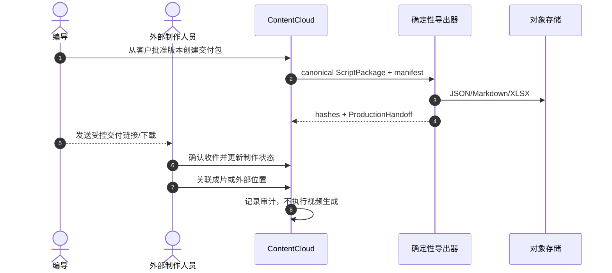

## 10. Gate 5：结果与学习

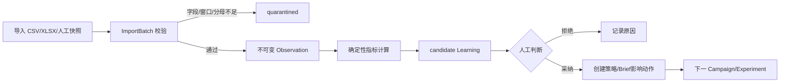

样本不足只能记录现象。自然和付费流量、平台和门店结果、不同统计窗口不能静默混算。

## 11. 来源变化与影响重编

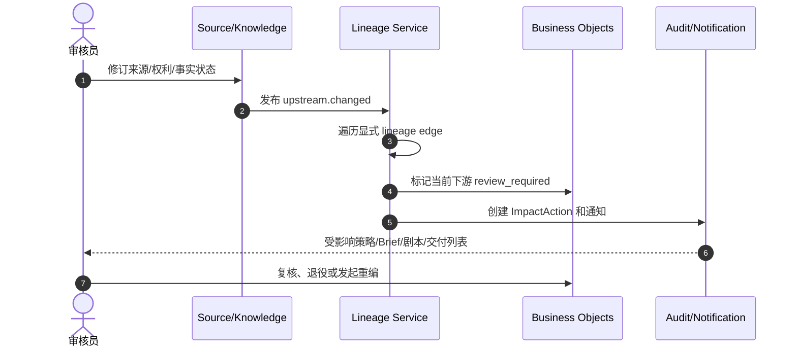

历史 ApprovalDecision 保持不变；当前版本可用性和历史上曾批准是两个不同事实。

## 12. Automation 业务流程

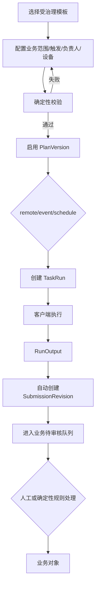

自然语言变更：

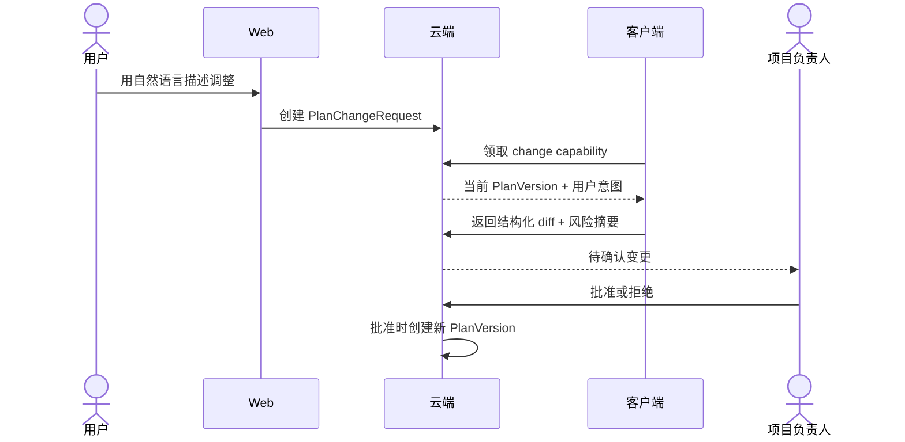

## 13. 恢复和人工干预

| 故障 | 系统行为 | 人工动作 |
| --- | --- | --- |
| 客户端离线 | Run 保持 queued 或按模板策略 skipped | 连接设备或 run once |
| 租约过期 | Attempt 记 expired，Run 可重新租约 | 查看是否存在外部副作用 |
| Capability 不匹配 | 不投递，显示所需版本 | 升级客户端或换设备 |
| 输出 Schema 失败 | Run failed，原始安全摘要保留 | 修复客户端并新建 attempt/run |
| 业务校验 blocked | Run 可 succeeded，产物 blocked | 补料、决策或改 Brief |
| 通知失败 | 不回滚业务事务，进入重试队列 | 检查渠道配置 |
| 上游失效 | 下游 review_required | 复核、退役或重编 |

## 14. 通知

V2 首发站内加邮件。事件包括：任务失败、长时间无心跳、知识待审、决策请求、Brief/剧本待审、客户审批、链接将到期、交付完成和上游影响。

通知只包含租户允许的项目名称、对象类型、状态、责任人和安全链接；不包含原始客户内容、Agent transcript、模型信息或密钥。
