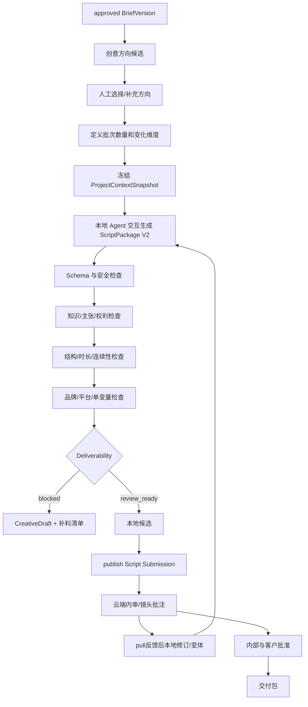
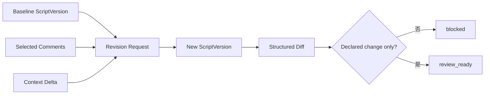

# AI 视频剧本生产系统与 ScriptPackage V2

## 1. 定位

V2 剧本生产在客户本地工作区完成。它不是“云端输入一句话返回文案”，而是由本地成熟 Agent 把已拉取的 ApprovedSnapshot、市场结构、策略、可视化方案和 Brief 编译为可审核、可生成、可追溯的 AI 视频就绪包。

V2 吸收 `marketing/jinling-gudu` 已验证的知识门禁、内容引用、CreativeDraft、批次 manifest 和 RunContext 思想，也吸收短视频方法中的画面先于话术、需求时刻、单变量测试，以及短片 Skill 中的首尾帧、运动、连续性和负面约束。但服务端不保存或执行具体 Skill prompt。

## 2. 生产层级

```text
ContentPlan
  -> Campaign
      -> ExperimentPlan
          -> approved BriefVersion
              -> CreativeDirection[]
                  -> CreativeBatch
                      -> Script
                          -> ScriptVersion
                              -> Shot[]
```

- CreativeDirection 是可比较的创意方向，不是完整剧本。
- CreativeBatch 是本地批次 manifest 和候选集合，不等于 TaskRun；只有 Automation 远程触发时才同时存在云端 TaskRun。
- Script 是稳定内容身份，ScriptVersion 是不可变稿件；二者的 ID 在本地产生，批准资格由云端 ApprovedSnapshot 授予（见 `03-domain-and-data-model.md` §2.1）。
- "approved BriefVersion" 指该 `brief_version_id` 已出现在某个 brief ApprovedSnapshot 的 eligible IDs 中，本地 lint 从 `.contentcloud/cache/approved/` 判定。
- Shot 同时承担叙事功能、视觉实现、生成约束、证据和验收。

## 3. 完整生产流程



## 4. Brief 输入契约

正式生成的 BriefVersion 必须包含：

| 维度 | 必填内容 |
| --- | --- |
| 业务 | channel、objective、campaign、experiment、duration range |
| 用户 | audience、scenario、demand moment、pain point |
| 策略 | strategy_version_id（已批准）、primary selling point、support points、positioning |
| 画面 | approved visualization plans、assets、truth strategy、Plan B |
| 表达 | tone、brand rules、approved claims、forbidden claims |
| 结构 | hook expectation、narrative constraints、single CTA |
| 实验 | primary variable、controlled variables、measurement window |
| 治理 | eligible knowledge、blocked knowledge、rights、risk decisions |

输入不足时本地仍可创建 blocked CreativeBatch，但不得 publish 为可交付版本；可以提交 blocked CreativeDraft 供客户补料和方向讨论。

## 5. CreativeDirection

```json
{
  "id": "cd_...",
  "title": "旅行收尾",
  "angle": "把南京旅行的慢节奏带回日常",
  "hook_type": "场景直入",
  "visual_motif": "半合行李箱与最后一张照片",
  "narrative": ["触发", "情绪放大", "产品进入", "日常延续", "CTA"],
  "target_emotion": "留恋与松弛",
  "risk_refs": ["risk_..."],
  "status": "selected"
}
```

方向来源可以是人工创建或本地 Agent 候选；进入 CreativeBatch 前必须由用户选择。Automation 模板可以按已批准规则选择，但输出仍只进入待审 Submission。

## 6. CreativeBatch

关键字段：

```text
id, project_id, brief_version_id, direction_ids,
requested_count, variant_dimension, controlled_dimensions,
required_capability, output_schema, delivery_profiles,
status, created_by, created_at
```

本地状态：draft -> ready -> producing -> produced/partially_blocked/failed -> published -> archived。`queued` 只用于 Automation 对应的云端 TaskRun。

`produced` 只表示候选集合已形成；单个 ScriptVersion 仍有独立 deliverability 和 review 状态。

## 7. ScriptPackage V2 顶层

```json
{
  "schema_version": "2.0",
  "deliverability": "review_ready",
  "project_id": "prj_...",
  "script_id": "scr_...",
  "creative_batch_id": "cb_...",
  "brief_version_id": "brv_...",
  "context_snapshot_id": "pcs_...",
  "direction": {},
  "channel": "douyin",
  "duration_ms": 25000,
  "aspect_ratio": "9:16",
  "cover": {},
  "narrative_structure": [],
  "shots": [],
  "citations": [],
  "asset_requirements": [],
  "experiment": {},
  "global_constraints": {},
  "blocked_reasons": [],
  "missing_inputs": [],
  "validation_declarations": {}
}
```

允许 `deliverability=blocked|review_ready`。blocked 结果仍须满足 Schema，并明确 candidate refs、blocked reasons 和 missing inputs。

## 8. 顶层对象

### 8.1 Cover

- title、subtitle、visual intent。
- 第一视口必须出现的品牌/产品信号。
- 使用的 asset/rights 引用。
- 平台安全区和禁止遮挡说明。

### 8.2 NarrativeStructure

每一段包含 role、purpose、start/end、decision function 和对应 shot IDs。role 受控词表包括 hook、pain、product_intro、usage、proof、resolution、cta，但模板可使用版本化扩展词表。

### 8.3 Experiment

- `primary_variable`：本版本唯一主要变化。
- `controlled_variables`：保持不变的内容。
- `hypothesis`：可证伪描述。
- `measurement_window` 和目标指标。
- 变体间若检测到多个未声明主要变化，业务校验失败。

## 9. Shot V2

```json
{
  "shot_id": "shot-03",
  "start_ms": 8000,
  "end_ms": 15000,
  "role": "product_intro",
  "narrative_purpose": "把旅行情绪落到可带回家的日常物件",
  "subject": "金陵古都香产品实拍",
  "visual_intent": "产品进入但不遮挡旅行照片",
  "subject_action": "手将产品放在照片旁",
  "composition": "近景，产品与照片形成前后层次",
  "camera_motion": "缓慢推近",
  "first_frame": {"prompt_zh": "...", "asset_refs": ["asset_..."]},
  "motion_spec": "手部动作一次完成，包装文字不可变形",
  "end_frame": {"prompt_zh": "..."},
  "voiceover": "...",
  "on_screen_text": "...",
  "sound_intent": "低音量环境声，不覆盖口播",
  "continuity": {"incoming_state": "...", "outgoing_state": "...", "anchors": []},
  "knowledge_refs": ["ki_..."],
  "claim_refs": ["ki_..."],
  "asset_refs": ["asset_..."],
  "rights_refs": ["rr_..."],
  "visualization_plan_id": "vp_...",
  "product_truth_strategy": "使用客户提供的 T0 实拍作为首帧参考",
  "negative_constraints": ["不得生成不存在的包装文字"],
  "acceptance_criteria": ["产品名称与源素材一致"],
  "plan_b": "改为手部与外盒静物实拍拼接"
}
```

## 10. 画面真实性与生成方式

每个镜头必须声明 production mode：

- `real_asset`：直接使用客户授权实拍。
- `asset_guided_generation`：以 T0/T1 素材约束生成。
- `generated_non_product`：生成非产品环境或转场。
- `composite`：实拍产品与生成环境合成。
- `external_capture`：需要外部补拍。

产品包装、Logo、标准字、规格和文化素材不得使用无约束纯生成替身。生成失败时必须存在明确 Plan B，而不是静默降低真实性。

## 11. 确定性校验

### 11.1 Schema

- 必填字段、类型、时间范围、shot ID 唯一性。
- 镜头不重叠、覆盖完整、总时长与顶层一致。
- 9:16 等渠道规格符合 Brief。

### 11.2 知识与权利

- Fact 必须 verified，Claim 必须 approved，Rights 必须 valid。
- 引用必须属于同一项目快照并覆盖内容实际含义。
- 外部案例只可作为结构引用，不能支撑本品牌事实。

### 11.3 画面与连续性

- proof 镜头必须绑定 approved VisualizationPlan。
- 主体、道具、服装、时间、空间和包装状态在 continuity anchor 上一致。
- 首尾帧、motion 和 end state 不能互相矛盾。

### 11.4 文案与平台

- 禁止功效、历史、价格、背书和权利越界。
- 屏幕文字、口播和画面表达都进入 claim 检查，不能只查口播。
- CTA 唯一且与 Brief 一致。

### 11.5 实验

- 一次只改变一个主要变量。
- 变体记录基线版本、变化路径和保持项。

## 12. 修订和变体

### 修订

修订输入只包含不可变基线、选中批注、当前 eligible context delta 和输出 Schema。新版本保留 `based_on_version_id`、resolved comment IDs 和 change summary。

### 变体

变体必须显式选择 `hook|audience|scenario|visualization|cta|duration` 中一个主要维度。系统计算结构化 diff，检测未声明漂移。



## 13. 批次与候选比较

本地 Skill/MCP 生成候选比较报告；publish 后云端审阅页按方向、钩子、核心画面、时长、主要变量、阻断数、风险、补拍、引用完整率和可生成性比较。Token、模型和 Agent 名称不进入云端业务比较。

用户可以：选为主版本、保留候选、发起修订、标记不采用及原因。批次关闭不会删除 Run 或候选历史。

## 14. 客户审核投影

客户视图默认展示：

- 封面、定位、目标人群和时长。
- 时间轴表格与逐镜头可视化说明。
- 口播、字幕、CTA 和制作边界。
- 来源摘要、素材权利状态和从上版的修改摘要。
- 客户可见批注和明确批准/退回动作。

不展示完整 Task Contract、本地路径、Agent transcript、模型信息、内部批注和内部风险笔记。

## 15. 导出

三种格式从同一个 canonical ScriptPackage 生成：

- JSON：机器消费和重新导入。
- Markdown：审阅、归档和人工制作。
- XLSX：逐镜头制作排期、素材和验收管理。

导出 manifest 保存 script hash、schema version、生成时间、格式文件 hash 和派生关系。任何人工修改导出文件都不反写 ScriptVersion。

## 16. 客户端 Skill 契约

客户端 Skill 可自由组合 Codex、Claude Code 或其他本地 Agent，但必须：

1. 普通交互从本地 workspace、ApprovedSnapshot 和模板获得输入；Automation 才从 CLI 获得 Task Contract。
2. 不越过 eligible/blocked 上下文。
3. 只向临时工作区写入 allowlist 路径。
4. stdout 输出标准 envelope，扩展文件通过 manifest 报告。
5. 先本地验证 ScriptPackage；普通交互经用户确认 publish，Automation 按计划自动提交 Submission。
6. 不自动批准、发布或调用视频生成平台。

普通本地生成不需要向服务端声明 Agent。只有启用 Automation 时，服务端才看到 `contentcloud.script.generate@2.x` 等业务 capability；始终看不到具体 Agent、模型、prompt 或 Skill 文件。
