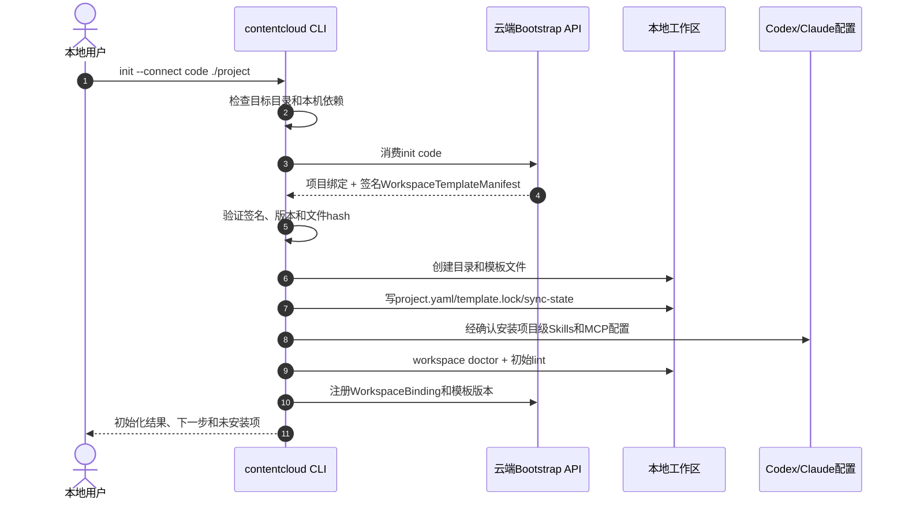
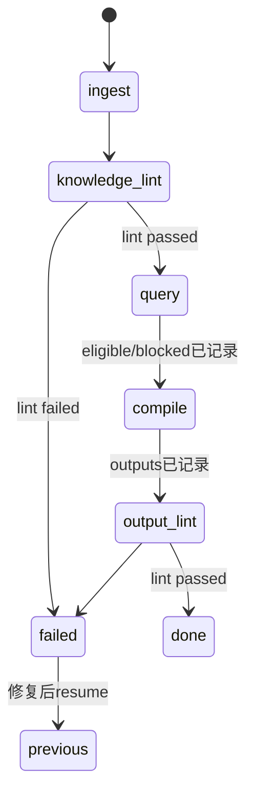

# 本地工作区、初始化、Skills/MCP 与发布同步

## 1. 定位

本地工作区是 ContentCloud V2 的主要创作界面。用户继续在熟悉的 Codex、Claude Code 或其他本地 Agent 中工作，ContentCloud 提供受治理的项目模板、Skills、MCP、确定性校验和云端审批边界。

```text
本地：原始资料、未发布知识、LocalRunContext、策略和创作草稿
云端：项目治理、不可变 Submission、人工决定、ApprovedSnapshot、客户协作
```

本地和云端通过显式 publish/pull 交换不可变检查点，不持续同步目录，也不把每次 Agent 对话变成云端 TaskRun。

## 2. 首次初始化

### 2.1 服务端准备

项目负责人在 Web 完成：

1. 创建 Client、Brand、Product 和 BrandProject。
2. 选择 TenantServiceTemplateVersion 和适用方法论。
3. 指定内部角色和客户审批人。
4. 生成一次性、短期有效、项目绑定的 init code。

Web 显示一条可复制命令：

```bash
npx --yes @goodvision/contentcloud@latest init \
  --connect <one-time-code> \
  ./jinling-gudu
```

### 2.2 CLI 初始化



## 3. 初始化安全规则

- 目标不存在时创建；空目录可以初始化。
- 非空且不是 ContentCloud 工作区时默认拒绝，先输出文件冲突报告。
- 已有工作区时 `init` 幂等返回状态，不重新消费连接码。
- 不覆盖未知文件、用户已修改模板、现有 AGENTS.md 或 Agent 配置。
- 支持 `--dry-run` 输出将创建、修改、跳过和冲突的文件。
- 非交互模式必须显式传 `--target codex|claude|all` 和 `--accept-project-config`。
- 默认不上传任何本地文件，不注册后台 Automation Daemon。
- init code 只用于项目绑定，不能执行用户管理、审批或读取其他项目。

## 4. 工作区结构

```text
project-root/
├── .contentcloud/
│   ├── project.yaml
│   ├── template.lock
│   ├── sync-state.json
│   ├── inbox/
│   │   ├── review-feedback/
│   │   └── decision-deltas/
│   ├── cache/
│   │   └── approved/
│   ├── skills/
│   └── mcp/
├── AGENTS.md
├── methodology/
├── ontology/
│   ├── classes.yaml
│   ├── properties.yaml
│   ├── rules/
│   └── vocabularies/
├── knowledge/
│   ├── index/
│   ├── sources/
│   ├── evidence/
│   ├── facts/
│   ├── claims/
│   ├── assets/
│   ├── rights/
│   └── packs/
├── raw/
│   ├── inbox/
│   └── source-registry.yaml
├── work/
│   ├── current-focus.md
│   ├── conflicts.md
│   ├── knowledge-gaps.md
│   ├── review-queue.md
│   └── runs/
├── workflows/
├── scripts/
└── outputs/
    ├── briefs/
    ├── scripts/
    ├── storyboards/
    └── reports/
```

`raw/` 默认加入项目忽略规则；模板不强制创建 Git 仓库。用户选择版本控制时，原始资料和本地敏感缓存仍保持忽略。

## 5. 模板清单与锁文件

`WorkspaceTemplateManifest` 由服务端按租户模板生成并签名：

```json
{
  "manifest_version": "1.0",
  "template_id": "workspace_marketing_video",
  "template_version": "2.0.0",
  "methodology_version": "2.0.0",
  "schema_versions": {},
  "files": [{"path": "AGENTS.md", "sha256": "...", "mode": "managed_merge"}],
  "skills": [{"name": "knowledge-content-pipeline", "version": "2.0.0", "sha256": "..."}],
  "mcp_servers": [{"name": "contentcloud-local", "version": "2.0.0"}],
  "signature": "..."
}
```

文件模式：

- `managed_replace`：纯生成脚本/Schema，只有内容仍等于旧 hash 时自动替换。
- `managed_merge`：AGENTS.md、工作流等允许用户扩展，升级生成三方 diff。
- `seed_once`：客户内容模板只在首次创建，之后永不自动覆盖。
- `local_state`：运行和同步状态，不参与模板升级。

`template.lock` 保存安装版本、每个受管文件的基线 hash、Skill/MCP 版本和签名摘要。

## 6. Skills 安装

ContentCloud 提供一套面向业务阶段的项目级 Skills：

```text
workspace-onboarding
client-knowledge-pack-builder
source-ingest
knowledge-lint
knowledge-query
knowledge-content-pipeline
market-research
strategy-brief-compile
marketing-content-compile
script-revise
submission-publish
review-feedback-apply
```

Skills 只描述业务步骤、输入输出、门禁和 CLI/MCP 使用，不内嵌客户事实、模型配置和云端私有 HTTP。

CLI 以 `.contentcloud/skills` 为唯一受管副本，再为目标 Agent 生成项目级入口：

```bash
contentcloud skills install --target codex
contentcloud skills install --target claude
contentcloud skills status
contentcloud skills upgrade --dry-run
```

若目标 Agent 不支持共享入口，CLI 复制并在 manifest 中记录生成文件；升级从唯一受管副本重新物化，避免人工维护多份。

## 7. MCP

`contentcloud-local` MCP 运行在本机，工具面只包括：

- `workspace_status`、`workspace_doctor`
- `source_register`、`source_list`
- `local_run_init`、`local_run_show`
- `knowledge_query`
- `lint_run`
- `publish_preflight`
- `submission_status`
- `review_feedback_list`
- `approved_snapshot_list`

MCP 调用本地确定性脚本或 `contentcloud` CLI。它不直接调用私有 HTTP，不返回设备/user token，不自动上传资料，不启动后台 Daemon。

```bash
contentcloud mcp install --target codex
contentcloud mcp install --target claude
contentcloud mcp status
```

修改全局 Agent 配置属于高风险范围，V2 默认只写项目级配置；目标 Agent 只支持全局配置时必须展示精确 diff 并要求明确确认。

## 8. LocalRunContext

LocalRunContext 延续金陵古都香已验证的阶段交接：



LocalRunContext 保存 run ID、intent、stage、source refs、changed IDs、eligible/blocked IDs、output paths、checks、findings 和 history。它不上传完整 Agent transcript，也不对应云端 TaskRun。

Submission 可以附带精简的 LocalRunSummary：阶段、校验结果、版本、输入/输出 hash 和用户确认，不包含工具逐步轨迹。

## 9. 本地知识流程

```text
raw/inbox
-> source registry + hash
-> evidence locator
-> candidate facts/claims/assets/rights
-> conflict/gap/review queue
-> deterministic lint
-> eligible/blocked query
-> seven-layer knowledge pack
-> publish preflight
```

Agent 不得用模型常识补客户事实，不得改变 verified/approved/valid 云端资格。本地可以表达“建议批准”，真正决定只在云端 ReviewCycle 中产生。

## 10. Publish 检查点

支持类型：knowledge、research、strategy、brief、script、delivery、performance。

```bash
contentcloud publish knowledge --review
contentcloud publish brief --review
contentcloud publish script --review
```

publish 固定执行：

1. 解析项目上下文和最近 ApprovedSnapshot。
2. 运行对应 lint 和 Schema 校验。
3. 计算 canonical content hash、文件 manifest 和与基线的 diff。
4. 检查未解决冲突、blocked 引用和来源披露策略。
5. 展示将上传的结构化数据、证据/原件、总大小和可见对象。
6. 用户确认后申请上传许可并上传。
7. 服务端复核 hash、Schema、基线、权限和幂等键。
8. 创建 SubmissionRevision 和 ReviewCycle，返回安全 Web 链接。

相同 submission type + content hash + base snapshot + idempotency key 重试只返回已有 revision。

## 11. 来源分级披露

| 等级 | 上传内容 | 审核能力 |
| --- | --- | --- |
| `metadata_only` | 来源 ID、hash、类型、locator 描述 | 只能知道来源存在，不能独立核验正文 |
| `evidence_pack` | 以上 + 精确摘录/安全预览 | 默认；可审核普通事实，受租户风险策略限制 |
| `full_source` | 以上 + 加密原件 | 允许授权审核人检查完整上下文 |

publish 默认 evidence_pack，并逐来源显示选择。用户降为 metadata-only 或升为 full-source 都需要明确确认。

高风险 Claim、权利和合规事实如果证据等级不足：

- 云端显示 `evidence_limited`。
- 禁止普通远程批准。
- 可上传 full-source，或由具备 reviewer 权限的人完成本地核验并提交签名 attestation、依据和时间。

## 12. Pull 与反馈应用

```bash
contentcloud pull feedback
contentcloud pull decisions
contentcloud pull approved
```

- feedback/decision 先下载到 `.contentcloud/inbox`，不直接修改业务文件。
- ApprovedSnapshot 下载到只读 `.contentcloud/cache/approved/<snapshot-id>`。
- `review-feedback-apply` Skill 读取指定基线和反馈，在新 LocalRunContext 中生成修订。
- 应用前比较本地文件 hash；发现本地未提交修改时生成冲突报告。
- 冲突不得自动选择云端或本地版本；用户处理后重跑 lint。
- sync-state 只有在完整拉取和 hash 验证后推进游标。

## 13. 云端编辑边界

Web 允许：

- 对 SubmissionRevision 批注。
- 对指定对象/字段/镜头提出修改要求。
- 对 Fact、Claim、Rights、Brief 和 Script 作出受权限控制的决定。
- 分配责任人、设置截止时间、撤销审批链接和查看 diff。

Web 不允许直接改 Submission 正文、知识值、Brief 内容、口播或镜头文本。所有内容修改回到本地，形成新的 SubmissionRevision。

## 14. 模板升级

```bash
contentcloud workspace upgrade --dry-run
contentcloud workspace upgrade
```

升级流程：下载新签名 manifest -> 比较 template.lock -> 安全替换未修改 generated 文件 -> 对 managed_merge 生成三方 diff -> 保留 seed_once -> 用户确认 -> 运行 doctor/lint -> 更新 lock。

升级失败不改变旧 lock。平台强制安全升级可以阻止新的 publish/Automation，但不能静默修改客户工作区。

## 15. Automation 工作区隔离

启用 Automation 时：

```bash
contentcloud automation device enable --project <id>
```

Daemon 注册 workspace ID、模板版本、可用来源 hash 和业务 capability，不上传路径。每个 TaskRun 创建隔离临时工作区，从 ApprovedSnapshot 和允许的本地来源读取，输出单独保存并自动 publish Submission。

Automation 不直接写用户当前工作目录。用户可通过 CLI 将通过审核的结果 pull 回主工作区。

## 16. 工作区状态与诊断

```bash
contentcloud workspace status
contentcloud workspace doctor
contentcloud workspace diff
```

状态至少显示：项目绑定、模板/Skill/MCP 版本、Agent 可用性、来源数量、当前 LocalRunContext、未发布变化、待 pull 反馈、最近 ApprovedSnapshot、披露警告和 Automation 授权状态。

doctor 区分本地结构、Agent/MCP、云端连接和 Automation；普通创作所需检查通过时，不因后台 Daemon 未启用而整体失败。
