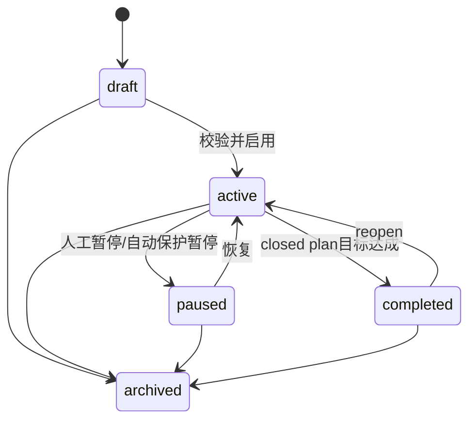
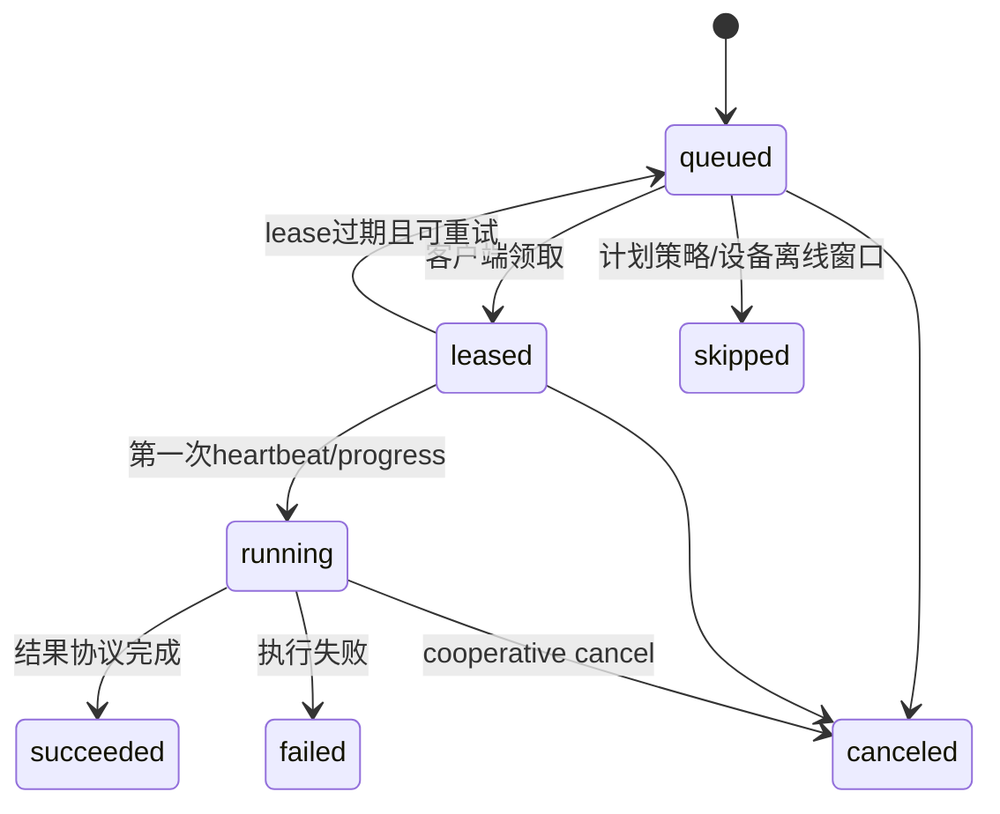
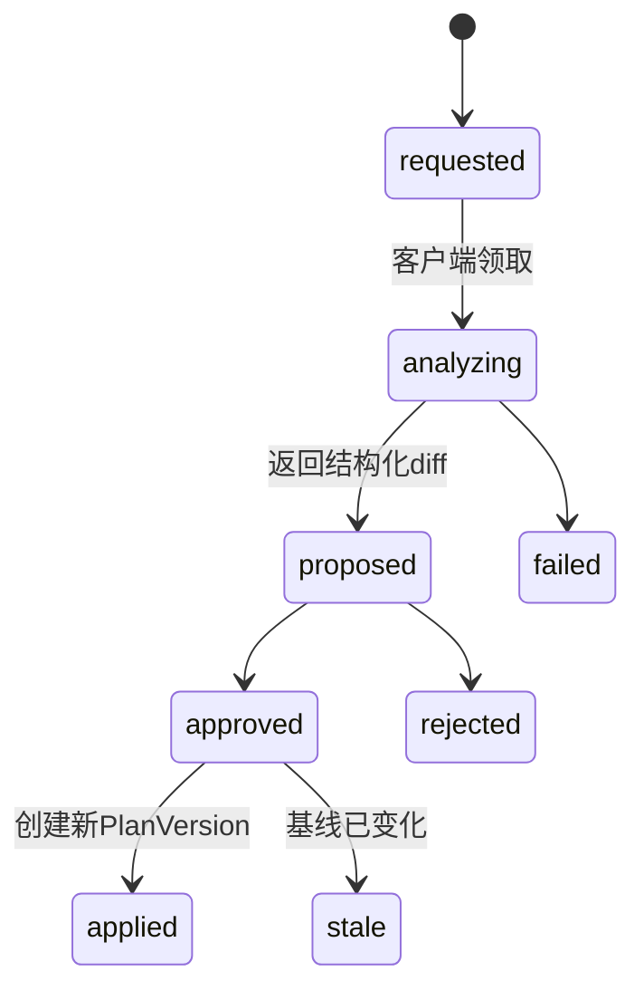

# Automation Plan、Run 与 Output 模型

## 1. 产品定位

Automation 是服务端驱动本地客户端执行的可选能力，不是 ContentCloud 的主产品对象，也不是普通创作的必经路径。用户通常直接在本地 Agent 中完成知识、策略、Brief 和剧本；只有需要远程发起、事件触发或定时执行时才创建 Automation Plan。

```text
Business Object
  -> Automation Plan Version
      -> TaskRun
          -> RunAttempt
              -> RunOutput
              -> SubmissionRevision
                  -> Business Review / ApprovedSnapshot
```

任何 Run 成功都不能自动批准事实、主张、权利、Brief、剧本、交付或学习。RunOutput 自动提交为不可变 SubmissionRevision，随后进入与本地手工 publish 相同的审核门禁。

## 2. 与 Loopany 的对应关系

| Loopany | ContentCloud V2 | 处理 |
| --- | --- | --- |
| Open Loop | 无终点的 monitor/review/maintain Plan | 保留持续执行语义 |
| Closed Loop | 有业务终点的 follow_up Plan | 终点由确定性业务条件验证 |
| exec | TaskRun | 保留正式执行角色 |
| evolve | ImprovementProposal | 只产生改进建议，不自动改计划 |
| edit | PlanChangeRequest | 结构化 diff + 人工确认后生效 |
| cron | schedule trigger | 仅模板 allowlist 类型可用 |
| workflow/agent | 客户端 capability | 服务端不显示具体实现 |
| dashboard DSL | RunProjection | 受治理组件和业务原生页面 |

## 3. Automation 类型

| 类型 | 是否可 schedule | 输出资格 | 示例 |
| --- | --- | --- | --- |
| `monitor` | 是 | 待采纳候选 | 竞品、趋势、来源和权利变化 |
| `extract` | 否，remote/event | 待审核 Submission | 无人值守知识刷新、案例提取 |
| `generate` | 否，remote/event | 待审核 Submission | 明确授权的远程批量剧本/变体 |
| `validate` | 仅事件 | 确定性检查结果 | 引用、权利、结构和交付检查 |
| `follow_up` | 可使用一次性时间 | 提醒或终点证明 | 补料、审批、观察窗口 |
| `review` | 是 | 候选复盘 | 项目周报、表现诊断 |
| `sync` | 是，但连接器显式允许 | 导入批次 | 飞书、网盘、CRM、投放数据 |
| `maintain` | 是，仅治理模板 | 影响项或清理建议 | 过期、重复、上下文健康 |

以下是可选 Automation 模板，不替代同名本地 Skills。V2 首批优先实现 monitor、review 和 maintain；远程 generate 在本地交互闭环稳定后开放：

- 客户资料 15 维诊断
- 可信知识提取
- 竞品与平台趋势监控
- 案例结构拆解
- Brief 候选生成
- AI 视频剧本生成
- 按批注修订剧本
- ScriptPackage 确定性校验
- 交付包清单检查
- 投放结果周期复盘
- 权利到期和来源变化检查

## 4. Automation Plan

`AutomationPlan` 保存稳定身份、项目、绑定 workspace、当前版本指针和生命周期。`AutomationPlanVersion` 保存不可变执行配置：

```json
{
  "schema_version": "1.0",
  "plan_id": "ap_...",
  "version": 3,
  "template_id": "tpl_market_monitor",
  "template_version": "1.2.0",
  "automation_type": "monitor",
  "business_scope": {
    "project_id": "prj_...",
    "subject_type": "competitor_set",
    "subject_ids": ["cmp_..."]
  },
  "workspace_id": "ws_...",
  "parameters": {},
  "trigger": {"type": "schedule", "cron": "0 9 * * 1", "timezone": "Asia/Shanghai"},
  "assignment": {"owner_id": "usr_...", "device_selector": {"capability": "contentcloud.research.monitor"}},
  "notification": {"policy": "actionable", "channels": ["in_app", "email"]},
  "completion_policy": null
}
```

服务端只保存模板公开参数和业务 capability，不保存 prompt、模型、Agent、Skill 路径或本地凭据。

## 5. 生命周期



- `completed` 只适用于有 completion policy 的 follow_up 等 closed plan。
- monitor 等持续计划无 goal，不会自行 completed。
- 连续失败可自动 paused，但必须通知负责人并显示恢复条件。
- archive 不删除 PlanVersion、Run 和审计历史。

## 6. 触发器

### Remote Run Once

由有权限用户在 Web 或 CLI 对已存在 Plan 执行 run once。它不同于本地直接运行 Skill：远程 run once 会创建 TaskRun，并要求工作区已明确授权 Automation。

### Event

由确定性业务事件匹配，例如 `source_revision.ready`、`brief.approved`、`review.comments_selected`。事件触发必须使用 outbox/inbox 去重，并记录 event ID。

### Schedule

使用 cron + IANA timezone。服务端计算下一时间、创建 TaskRun，但不运行客户端逻辑。错过时间按模板选择 `skip|run_latest`，不得无限补跑。

### One-shot

follow_up 可配置 `run_at`，触发后自动 completed 或等待确定性终点条件。

## 7. TaskRun 与 RunAttempt

沿用 V1 状态并明确职责：



`TaskRun` 表示一次云端驱动执行意图。每次领取或重试生成不可变 `RunAttempt`，记录 device、workspace、capability 版本/digest、lease、heartbeat、started/finished、usage、safe summary、error 和 session reference。

同一 Run 同时最多一个有效租约。晚到的 report 可以记录为 late attempt evidence，但不能重复创建业务产物、通知或推进计划游标。

## 8. Run 角色

- `execute`：执行模板的业务任务。
- `change`：为 PlanChangeRequest 生成结构化 diff。
- `improvement`：基于历史摘要生成候选改进建议。

V2 不允许 change/improvement Run 直接改 active PlanVersion。两者也不产生用户业务通知，除非形成需要负责人处理的变更单或风险。

## 9. RunOutput

```json
{
  "id": "ro_...",
  "run_id": "run_...",
  "attempt_id": "att_...",
  "output_type": "script_package",
  "schema_id": "contentcloud.script-package/2.0",
  "business_subject": {"type": "creative_batch", "id": "cb_..."},
  "projection_tier": "cloud_native",
  "validation_status": "valid",
  "artifact_ids": ["art_..."],
  "summary": {},
  "created_at": "..."
}
```

RunOutput 经验证后创建 SubmissionRevision；其中 Artifact 采用以下展示策略：

1. `cloud_native`：服务端理解的知识候选、ScriptPackage、校验结果等。
2. `safe_projection`：客户端生成、JSON Schema 验证的声明式视图数据。
3. `safe_rendition`：PDF、PNG、纯文本等安全预览件。
4. `local_open`：通过 CLI 在授权设备打开。
5. `metadata_only`：仅文件名、类型、大小、hash、来源和下载权限。

## 10. Run 详情

通用 Run 详情只用于 Automation，必须展示：

- 业务任务名称、项目、关联对象和发起原因。
- Run 状态、当前 Attempt、设备在线状态、租约和最近 heartbeat。
- 结构化进度阶段和用户可理解的 progress label。
- 输出摘要、关联 Submission、审核状态和 Artifact 清单。
- duration、标准化 usage、重试次数和错误代码。
- 脱敏执行步骤摘要，不显示完整 transcript、模型、prompt 或本地绝对路径。
- cancel、retry、open business subject 和 copy diagnostic ID。

Run 详情是诊断页；剧本、知识或情报仍从各自业务页面审阅。

## 11. 通知策略

V2 使用业务语义策略，不直接照搬 always/auto/never：

- `actionable`：默认，仅有待用户动作、失败、风险或闭环完成时通知。
- `all_runs`：每次正式 execute Run 结束都通知。
- `failures_only`：失败、连续失败和自动暂停。
- `none`：只保留站内运行记录；安全和租户级事故不能关闭。

首发渠道：站内、邮件。用户可按项目和 Automation Plan 覆盖租户默认，但不能把客户原始内容放入通知正文。

## 12. PlanChangeRequest



diff 只允许模板 Schema 声明的路径，必须显示 before、after、风险、调度变化、数据范围变化和 capability 变化。扩大数据范围、提高频率、改变通知或设备权限必须显著标记。

## 13. 安全与治理

- schedule 创建、扩大业务范围和启用 Automation 工作区仅 PM/Admin 可确认，并要求本地设备所有者授权。
- 客户端只能领取其 tenant/project grant 和 capability 匹配的任务。
- Task Contract 使用短期 run credential，不能调用用户管理或审批命令。
- 取消是协作式；对可能有外部副作用的 sync 任务必须回报 side-effect ledger。
- output、report、heartbeat 和 cancel 都具备幂等或序列号保护。
- 连续失败自动暂停按模板配置，但不删除队列和运行历史。
- Daemon 每个 Run 使用隔离工作区，不直接修改用户当前本地草稿；所需本地来源通过 hash 校验。

## 14. 运行指标

平台运营指标包括 queued latency、lease expiry、success/failure、blocked business output、manual retry、notification failure 和 capability coverage。Token/cost 只作为客户端声明的可选标准化 usage，不作为业务成果指标，也不向客户审批页面展示。
