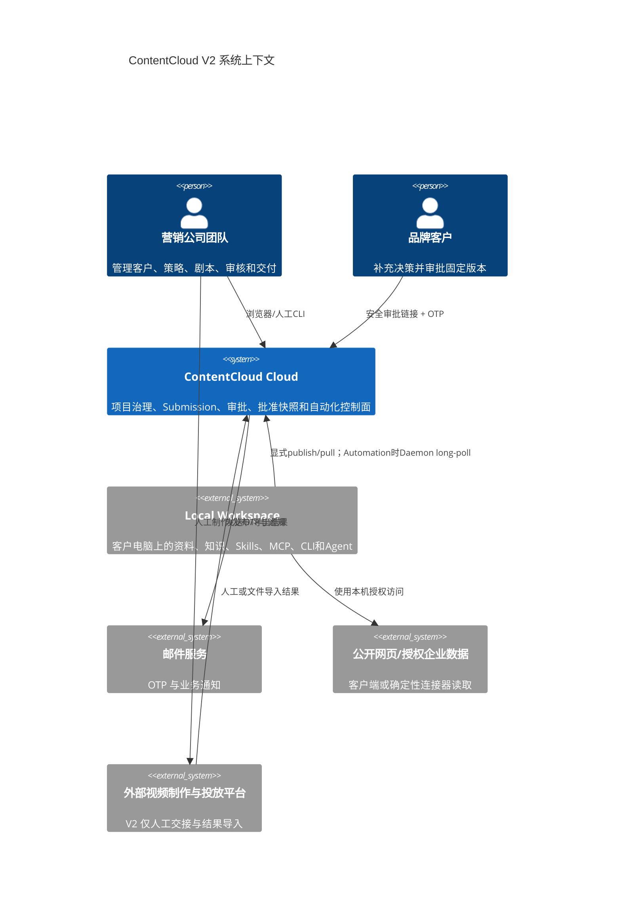
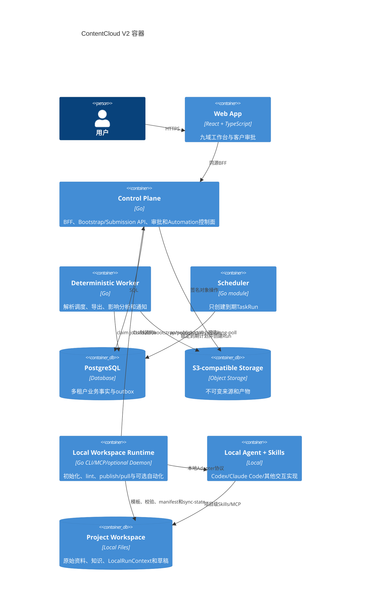
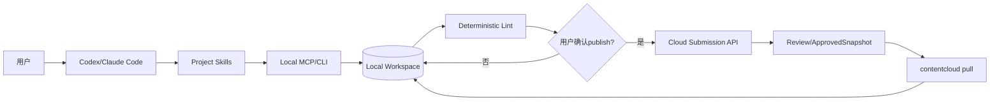
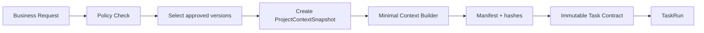
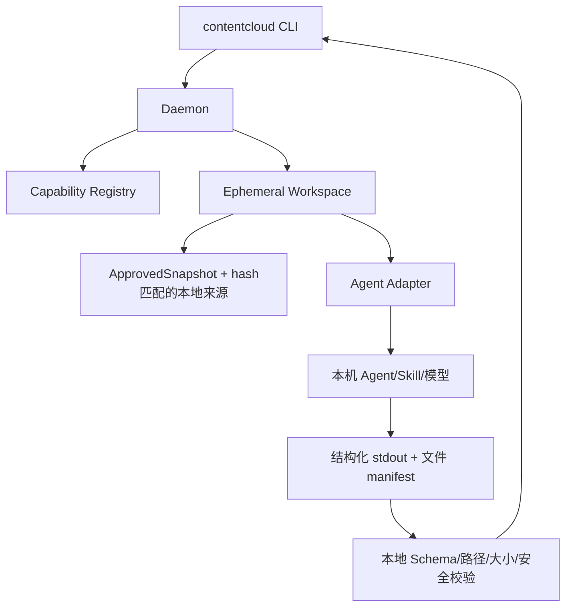
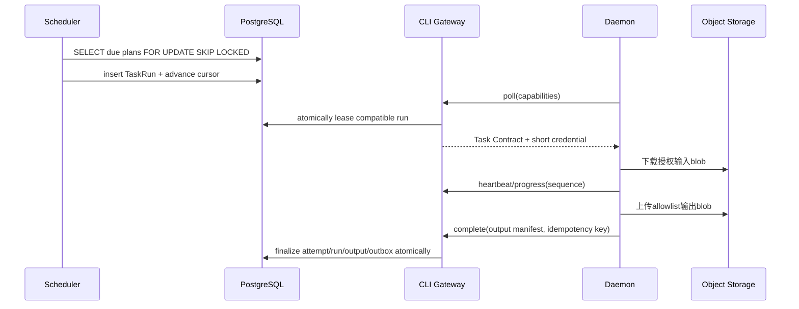
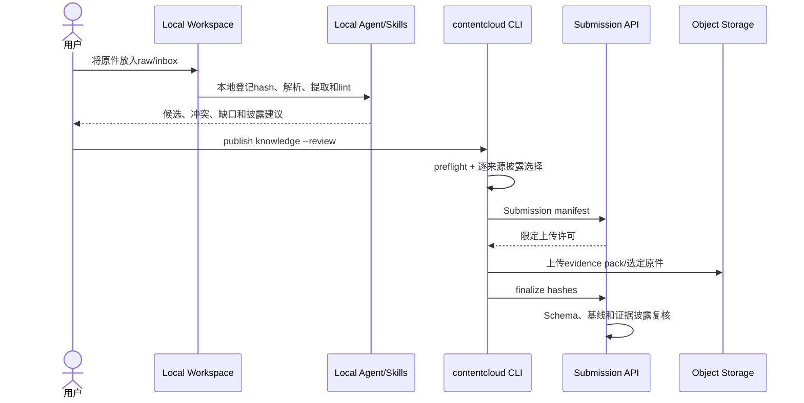
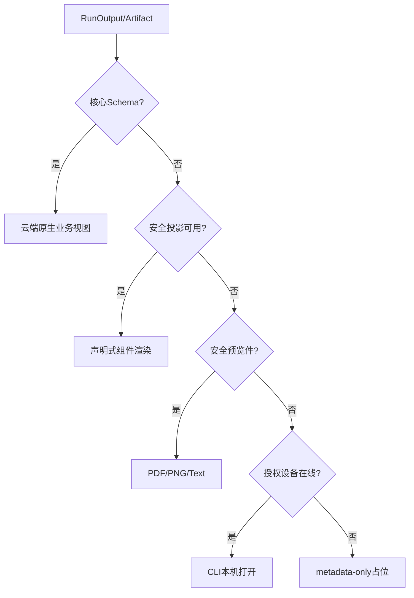
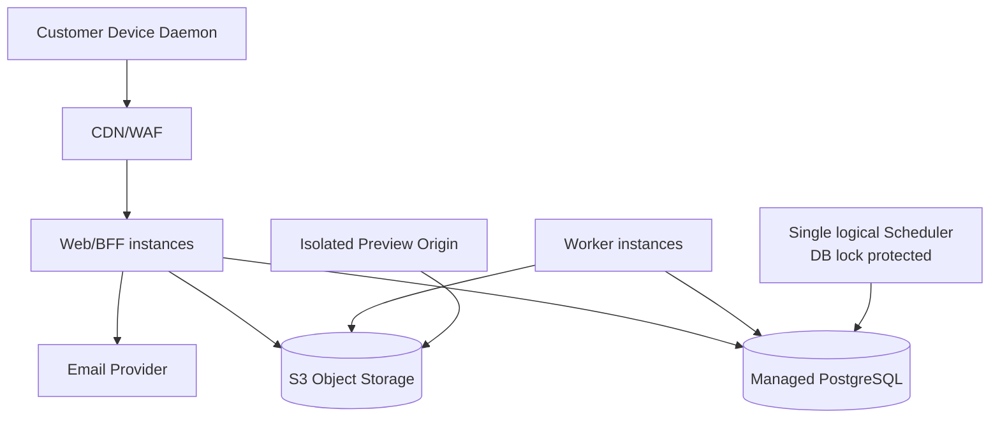

# V2 本地优先系统架构

## 1. 架构目标

- 本地工作区成为资料、未发布知识和创作草稿事实源；云端成为 Submission、决定和批准版本事实源。
- 本地成熟 Agent 通过项目级 Skills/MCP 工作，只有 Automation 才通过 capability 和租约远程执行。
- 一个模块化单体支撑当前南京试点和多客户扩展，避免过早微服务化。
- 核心对象原生渲染，未知产物可安全降级。
- 所有租户、任务、审批和对象存储操作可审计、幂等和恢复。

## 2. 系统上下文



## 3. 容器架构



Scheduler 是控制面内的确定性模块，可独立进程部署但不运行 Agent。Worker 不调用 LLM，只执行可重复解析、Schema 校验、导出、影响计算和通知。

## 4. 服务端模块化单体

```text
cmd/contentcloud-server
internal/
  identity        tenant/session/membership/review grant
  portfolio       client/brand/product/project/gate
  submission      bundle/revision/disclosure/approved snapshot
  knowledge       submitted evidence/fact/claim/rights decisions
  intelligence    research/case/insight
  strategy        audience/scenario/selling point/visualization
  planning        content plan/campaign/experiment/brief
  creative        direction/batch/script/package validation
  review          cycle/comment/approval
  delivery        package/export/handoff
  learning        import/observation/rating/learning
  automation      plan/trigger/run/attempt/output
  lineage         edge/impact/audit
  gateway         web BFF/private CLI transport
```

领域模块通过显式 application service 和 outbox event 交互，不共享可变内部结构。V2 不因为九域而拆成九个部署服务。

## 5. 云端与客户端责任

| 云端 | 本地工作区 |
| --- | --- |
| 租户、项目、Submission、批准快照和不可变决定 | 原始资料、未发布知识、Brief/剧本草稿 |
| Gate、权限、审批、审计和 lineage | 解析/OCR、网页研究、知识候选、内容生成和lint |
| Bootstrap manifest、publish/pull 和自动化调度 | 项目模板、Skills、MCP、LocalRunContext |
| 服务端Schema复核、证据披露和业务状态 | 本地完整Schema/引用/权利/结构校验 |
| 原生视图、安全投影和对象存储 | 本机打开未知私有格式 |

服务端 UI 和数据模型不得出现让用户选择 Codex、Claude、模型名称或本地 Skill 的字段。项目只显示工作区模板版本、最近同步和可选 Automation capability；普通交互不要求设备在线。

## 5.1 普通本地交互架构



这条路径没有 TaskContract、TaskRun、lease、heartbeat 和 Daemon poll。

## 6. Automation Task Contract Builder



Task Contract Builder 只服务 Automation。它按任务类型从 ApprovedSnapshot 和 AutomationPlan 选择必要字段；若需要本地来源，只下发 source hash 和 locator，不上传本机路径。

## 7. Automation 客户端执行架构



- Daemon 只有在工作区所有者显式启用 Automation 后运行，仅出站连接云端。
- 输入挂载只读，输出限定目录，任务结束按保留策略清理。
- Adapter 接口统一 start、cancel、stream-safe-progress、collect-output。
- Automation 输出先创建 Submission；完整 session/transcript 留在本机，云端仅存 session reference 和脱敏摘要。

## 8. 调度、租约和报告



调度至少一次投递，业务导入恰好一次生效。Run/Attempt 状态、output manifest 和 outbox 在一个数据库事务内完成。

## 9. 本地来源摄取与分级发布



服务端只对实际上传的 evidence pack/full source 做 MIME、恶意文件、hash 和安全预览复核，不重新承担本地知识提取，也不做 LLM 语义提取。

## 10. 产物渲染架构



声明式组件初始只支持 metric、table、chart、timeline、calendar、kanban、tabs、text 和 attachment-list。禁止任意 HTML、脚本、外部资源和运行时网络请求。

Hosted Preview 由客户端构建静态 bundle，云端仅验证 manifest、存储 content-addressed blobs，并在独立 origin + 严格 CSP sandbox 中托管。它位于第三波最后，失败时回退且不阻断审批。

## 11. 多租户与对象存储

- PostgreSQL repository 方法强制 tenant ID，敏感表可叠加 RLS 防御。
- 对象 key 使用不可猜测 tenant/project/revision 标识，不包含客户原始文件名。
- 下载由 BFF/CLI Gateway 鉴权后发放短期、限定 method 和 size 的许可。
- 客户审批访问通过 ReviewGrant 派生最小视图，不复用内部用户 session。
- 客户端 run credential 只能访问当前 Run 的输入、heartbeat、report 和输出上传。

## 12. 部署拓扑



控制面、Worker 和 Scheduler 使用同一 Go 代码库构建不同入口。Scheduler 可多实例运行，通过数据库锁保证游标推进一致性。

## 13. 技术选择

- Go 1.24：控制面、Worker、Scheduler、CLI 和 Daemon。
- React + TypeScript：内部工作台和客户审批。
- PostgreSQL：事务事实、状态机、outbox、调度和审计。
- S3-compatible：不可变来源、导出、扩展产物和预览 bundle。
- OpenAPI 3.1 + JSON Schema：Web/CLI 传输和业务产物契约。
- npm 小型安装器 + 平台二进制：降低非技术用户安装门槛。

继续使用模块化单体；只有当独立扩缩、故障隔离或合规边界出现实际证据时才拆服务。

## 14. 可观测性

- 每个 Web/CLI 请求、TaskRun、Attempt、对象存储操作和 outbox event 传播 trace ID。
- 日志使用 tenant/project/run 的不可逆或内部 ID，不记录客户内容和 token。
- 指标覆盖 API latency、DB errors、queue age、lease expiry、run failure、output blocked、notification failure、preview rejection。
- 告警以用户影响为中心：无法登录、审批失败、队列积压、连续任务失败、来源处理失败和跨租户策略异常。
