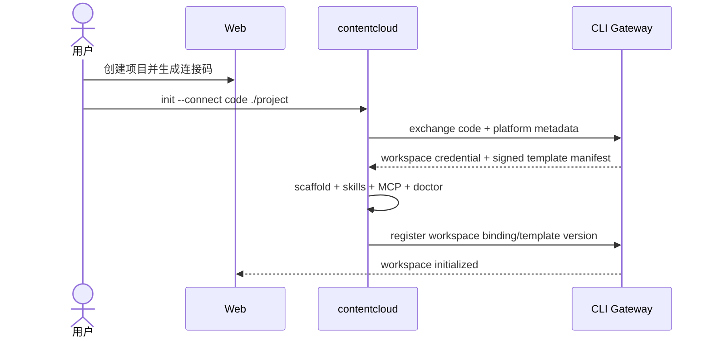

# CLI、MCP、私有 API 与客户端契约

## 1. 原则

`contentcloud` 是所有 Agent、Skill、MCP、脚本、Renderer、Daemon 和 CI 与服务端通信的唯一程序化入口。普通本地工作不需要访问云端；发生 init、publish、pull、审批查询或 Automation 时，由 CLI 封装 HTTP、对象存储许可、token 和分页游标。

浏览器 Web 使用同源 BFF；人工用户可以使用 CLI。业务集成不得直接绑定私有 REST 路径。

## 2. 一个二进制，四种凭据

| 凭据 | 用途 | 权限 |
| --- | --- | --- |
| User Credential | 人工 CLI 操作 | 受用户角色和租户限制 |
| Workspace Credential | init/publish/pull | 绑定项目、工作区和被授权提交人，不具备审批权限 |
| Device Credential | Daemon poll/heartbeat | 受设备和项目 grant 限制 |
| Run Credential | 当前租约任务 | 仅输入下载、进度、报告、输出上传 |

凭据存入系统安全存储。配置文件只保存 endpoint、tenant/project context 和非敏感偏好。

## 3. 安装与首次初始化

```bash
npx --yes @goodvision/contentcloud@latest init --connect <one-time-code> ./project
cd ./project
contentcloud workspace doctor
```

顺序固定为先在 Web 创建项目，再生成一次性 init code，然后初始化本地工作区。init code 绑定项目和被授权提交人；CLI/Daemon 不允许自行创建租户或品牌项目。后台 Daemon 默认不启用。



## 4. 命令设计

### 全局与上下文

```text
contentcloud login|logout|whoami|doctor|version|update
contentcloud init --connect <code> <directory>
contentcloud workspace status|doctor|diff|upgrade
contentcloud tenant list|use
contentcloud client list|show|create
contentcloud project list|show|create|use|status
contentcloud device list|show|revoke
```

上下文优先级：显式 `--project` > 项目配置文件 > 当前用户配置。写操作输出解析后的 tenant/project，并支持 `--dry-run` 时不提交。

### 本地工作流与云端九域资源

```text
contentcloud local-run init|show|resume|validate
contentcloud source register|list|show
contentcloud lint knowledge|content|all
contentcloud knowledge query

contentcloud publish knowledge|research|strategy|brief|script|delivery
contentcloud pull feedback|decisions|approved
contentcloud submission list|show|status|withdraw
contentcloud review show             contentcloud delivery download
contentcloud performance import      contentcloud impact show
```

云端内容正文没有通用 update 命令。CLI 只发布不可变 Submission、拉取反馈/批准快照和执行领域允许的状态动作，不提供 `resource patch status=approved`。

### Automation 与运行

```text
contentcloud automation templates|list|show|create|pause|resume|run|archive
contentcloud automation device enable|disable|status
contentcloud automation change request|show|approve|reject
contentcloud run list|show|cancel|retry
contentcloud daemon poll|serve
contentcloud run heartbeat|progress|complete|fail
```

Daemon 内部命令可以隐藏或标记 machine-only，但仍复用同一 CLI contract。普通本地 Skill 不使用 daemon poll。

### Skills 与 MCP

```text
contentcloud skills list|status|install|upgrade
contentcloud mcp status|install|remove
```

安装默认项目级。修改全局 Agent 配置时必须显示精确路径、diff 和确认提示。

### 产物

```text
contentcloud artifact upload|list|show|download|open
contentcloud output report
contentcloud preview build-manifest|publish|status|revoke
```

`preview publish` 位于第三波最后，上传的是客户端已经构建的静态目录。服务端不接受源码构建请求。

## 5. 输出 Envelope

默认人类可读；Agent 和脚本使用 `--output json`。

成功：

```json
{
  "ok": true,
  "data": {},
  "meta": {
    "request_id": "req_...",
    "tenant_id": "ten_...",
    "project_id": "prj_...",
    "next_cursor": null,
    "warnings": []
  }
}
```

失败：

```json
{
  "ok": false,
  "error": {
    "category": "policy",
    "code": "BRIEF_NOT_APPROVED",
    "message": "当前 Brief 不能进入正式剧本生产",
    "resolution": "完成内部审核或选择已批准版本",
    "retryable": false,
    "details": {}
  },
  "meta": {"request_id": "req_..."}
}
```

stdout 只写 envelope；诊断和进度写 stderr。`--quiet` 不改变退出码或 JSON 完整性。

## 6. 稳定退出码

| Code | 含义 |
| --- | --- |
| 0 | 成功 |
| 2 | 参数或本地配置错误 |
| 3 | 认证失败 |
| 4 | 权限/业务策略拒绝 |
| 5 | 资源不存在 |
| 6 | 版本或幂等冲突 |
| 7 | 服务暂时不可用，可重试 |
| 8 | 契约或输出校验失败 |
| 9 | 用户取消 |

本地 lint 发现业务 blocked 返回契约约定的非零校验码；用户显式发布 blocked CreativeDraft 时，publish 协议可以成功，并在 Submission 中表达 deliverability。不要把业务阻断伪装成网络失败。

## 7. WorkspaceTemplateManifest

init 响应包含项目绑定、签名模板 manifest、方法论/Schema/Skill/MCP 版本和文件 hash。CLI 必须先验证签名再写文件；模板文件模式为 managed-replace、managed-merge、seed-once 或 local-state。

初始化输出固定列出 created、installed、skipped、conflicted、warnings、workspace ID 和下一动作。任何冲突都不得被“初始化成功”摘要隐藏。

## 8. SubmissionBundle

```json
{
  "bundle_version": "1.0",
  "submission_type": "knowledge",
  "project_id": "prj_...",
  "workspace_id": "ws_...",
  "base_approved_snapshot_id": "aps_...",
  "local_run_summary": {
    "run_id": "local-run-...",
    "checks": [{"name": "knowledge-lint", "status": "passed"}]
  },
  "objects": [],
  "source_disclosures": [
    {"source_ref": "src_...", "level": "evidence_pack", "sha256": "..."}
  ],
  "artifacts": [],
  "content_hash": "sha256:..."
}
```

publish preflight 必须显示对象数量、blocked 数、各披露等级、上传字节数、基线 diff 和审核可见范围。服务端完成 hash、Schema、基线、tenant/project 和权限复核后才创建 SubmissionRevision。

## 9. Pull Bundle

ReviewFeedbackBundle 包含 submission/revision、subject hash、字段/镜头定位批注、可见性、作者和状态。DecisionDelta 包含人工决定及依据。ApprovedSnapshot 包含批准 canonical 数据、eligible IDs、manifest 和 lineage。

CLI 先下载到 `.contentcloud/inbox` 或只读 cache；不直接修改用户文件。`--apply` 也只调用确定性安全合并，正文修订必须由对应 Skill 新建 LocalRunContext。

## 10. Automation Capability Manifest

```json
{
  "manifest_version": "1.0",
  "capabilities": [
    {
      "id": "contentcloud.script.generate",
      "version": "2.0.0",
      "kind": "business_capability",
      "input_schema": "contentcloud.task-contract/1.1",
      "output_schema": "contentcloud.script-package/2.0",
      "digest": "sha256:...",
      "delivery_profiles": ["cloud_native", "safe_projection"],
      "local_only": true
    }
  ]
}
```

Capability Manifest 只在用户启用 Automation 时注册。服务端匹配 capability ID、兼容版本、Schema、digest、workspace 和项目授权；manifest 禁止上传模型密钥、prompt、本地绝对路径和 Agent transcript。

## 11. Automation Task Contract 1.1

```json
{
  "contract_version": "1.1",
  "contract_id": "pcs_...",
  "run_id": "run_...",
  "task_type": "script_generate",
  "business_subject": {"type": "creative_batch", "id": "cb_..."},
  "project": {},
  "methodology": {"version_id": "mtv_...", "rules": {}},
  "brief": {},
  "strategy": {},
  "knowledge": {"eligible": [], "blocked": []},
  "assets": [],
  "sources": [],
  "baseline": null,
  "change_request": null,
  "output_schema": "contentcloud.script-package/2.0",
  "capability": {},
  "manifest_hash": "sha256:..."
}
```

Task Contract 只服务 Automation。不同 task type 使用不同最小字段组合，并增加 workspace ID、required local source hashes 和 output submission policy。普通本地 `knowledge_extract`/`script_revise` 使用 LocalRunContext，不生成 Task Contract。

## 12. Poll 与租约

```json
{
  "device_id": "dev_...",
  "capabilities": [{"id": "contentcloud.script.generate", "version": "2.0.0", "digest": "..."}],
  "max_tasks": 1,
  "wait_seconds": 25
}
```

响应为 no-work 或 lease。lease 包含 attempt ID、expires_at、heartbeat interval、Task Contract 和短期 run credential。

- long-poll 上限由服务端返回，客户端加入抖动和退避。
- 领取是数据库原子操作，capability 与 project grant 同时验证。
- 首次 heartbeat 将 leased 转为 running。
- lease 过期后旧 credential 不能提交正常完成，只能提交 late evidence。

## 13. Progress、完成和取消

Progress：

```json
{
  "attempt_id": "att_...",
  "sequence": 8,
  "phase": "compile_shots",
  "label": "正在生成逐镜头方案",
  "percent": 62
}
```

phase 使用 capability Schema 的受控值；label 脱敏且面向用户。服务端按 sequence 去重和拒绝倒退。

完成请求包含 outcome、output manifest、safe summary、usage 和 idempotency key。服务端在一个事务内完成 Attempt、Run、RunOutput、SubmissionRevision 和 outbox；不直接导入批准业务对象。

取消为协作式：服务端设置 cancel requested，heartbeat 返回取消信号，客户端终止 Adapter 并回报 canceled。服务端超时可强制关闭租约，但不能保证撤销客户端已经发生的外部动作。

## 14. Artifact Envelope

```json
{
  "schema_version": "1.0",
  "kind": "extension",
  "capability": {"id": "...", "version": "...", "digest": "..."},
  "schema_id": "...",
  "media_type": "application/json",
  "file_name": "...",
  "sha256": "...",
  "byte_size": 1234,
  "visibility": "internal",
  "purpose": "review_projection",
  "presentation_tier": "safe_projection"
}
```

Daemon 在请求上传许可前计算 hash、大小和 MIME；服务端校验 allowlist、单文件/总量限制、文件名和 manifest 一致性。

## 15. 安全投影 DSL

允许组件：

```text
metric, text, table, chart, timeline,
calendar, kanban, tabs, attachment-list
```

投影是纯 JSON 数据和组件树。禁止 HTML、JavaScript、CSS、iframe、外部 URL 获取、事件处理器和任意表达式。服务端验证组件数量、深度、字段大小和数据绑定路径。

## 16. 幂等与并发

- 所有创建和业务动作支持 `--idempotency-key`，CLI 默认生成并在安全重试中复用。
- update/approve 使用 `--if-version` 或 subject hash。
- complete/fail/cancel 使用 attempt ID + sequence/idempotency key。
- 上传以 sha256 去重；重复 blob 不重复计费和写入业务关系。
- publish 幂等范围包含 project、submission type、base snapshot、content hash 和 idempotency key。
- pull 使用服务端游标；完整下载和 hash 验证前不推进本地 sync-state。
- 分页 cursor 不允许跨 tenant/project/filter 复用。

## 17. 兼容与发现

```text
contentcloud schema list
contentcloud schema show contentcloud.script-package --version 2.0
contentcloud automation templates --output json
contentcloud capability list --local
```

- 服务端至少支持当前与前一个稳定 Task Contract/ScriptPackage 版本。
- 客户端不支持目标版本时不领取任务，而不是尝试猜测字段。
- 新增可选字段保持向后兼容；删除、改语义或收紧规则需要主版本升级。
- CLI 和客户端 Skill 版本通过发布 manifest 锁步，但服务端不强制暴露 Agent 实现。
