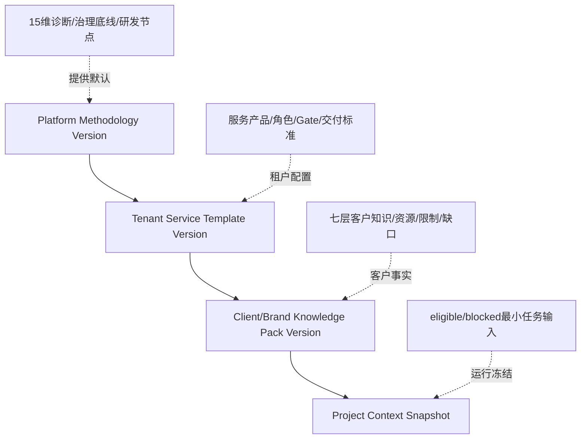
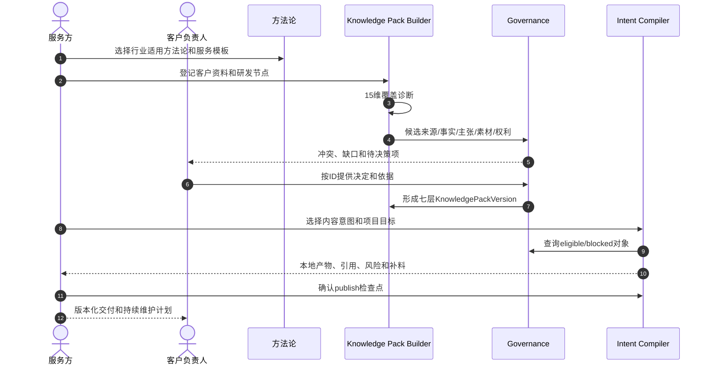
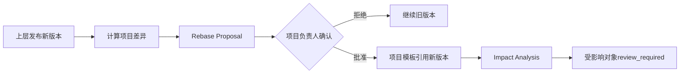

# 多客户上下文、方法论与企业数据层

## 1. 目标

V2 将 `marketing/jinling-gudu` 的文件型客户 Agent 试点产品化，使营销公司能复制到多个客户，同时保留客户差异、来源资格、人工决策和更新影响。

系统不把所有内容塞进一个向量库或长 prompt。上下文按用途、资格、所有权和版本分层。本地交互从 ApprovedSnapshot 和本地草稿构建上下文；只有 Automation Task Contract 选择云端批准数据和经 hash 验证的本地来源。

## 2. 四层继承



### 平台方法论

定义跨客户可复用的工作方法：客户维度、产品维度、供应链维度，素材诊断、四个研发节点、知识治理、内容研发和复盘规则。方法论不是客户事实。

### 租户服务模板

定义营销公司的服务产品：阶段、角色、默认 Automation 模板、检查表、交付物、SLA、通知和客户协作方式。它可以扩展平台方法论，但不能降低证据、权利、审批和租户隔离底线。

### 客户/品牌知识包

把客户已登记知识组织为 Agent 可调用的七层视图。知识包是有来源的综合层，不替代 Fact、Claim、Rights 等治理对象。

### 批准快照与本地项目上下文

云端 ApprovedSnapshot 冻结已批准版本、eligible ID、决定和 hash。本地项目上下文在其上叠加未发布草稿和 blocked 项；LocalRunContext 记录一次交互实际使用的输入。Automation 才将最小 ApprovedSnapshot 编译为 Task Contract。

## 3. 15 维素材诊断

方法论维度使用版本化模板定义，不在代码中写死具体客户内容。V2 支持三组维度：

| 组 | 典型维度 | 诊断输出 |
| --- | --- | --- |
| 客户 | 品牌身份、目标客户、渠道、经营目标、组织与决策 | 来源覆盖、负责人、客户决策项 |
| 产品 | 产品定义、功能/利益、差异、场景、表达和视觉资产 | 事实/主张/素材覆盖、冲突、缺口 |
| 供应链 | 主体、生产、质检、包装、履约和合规 | 证据、权利、风险和可交付边界 |

每个 MethodologyDimension 包含 stable key、label、required evidence kinds、applicable industries、required at stages、expected deliverables 和可覆盖参数。

诊断结果不是一个总分，而是：

- 每维来源数量和证据质量。
- verified/approved/valid 覆盖。
- candidate/conflicted/expired/blocked 数量。
- 负责人、最小补料和预计影响的下游交付物。

## 4. 七层知识包

| 层 | 内容 | 主要来源 |
| --- | --- | --- |
| `identity` | 品牌、组织、定位、历史资格、视觉身份 | Brand、Organization、Fact、BrandRule |
| `product` | SKU、规格、成分、功能、包装、配件和价格范围 | Product、Fact、Claim、Evidence |
| `market` | 受众、场景、痛点、渠道、竞品和需求时刻 | Audience、Scenario、Insight |
| `expression` | 语气、视觉规则、允许/禁止表达、文化边界 | BrandRule、Claim、Asset、Rights |
| `operations` | 生产、质检、门店、服务、履约和维护 | Fact、Process、Location、Evidence |
| `content_engine` | 已采纳框架、镜头模式、可视化方案、历史实验 | Framework、ShotPattern、VisualizationPlan、Learning |
| `compliance` | 权利、有效期、风险、适用渠道和决策 | RightsRecord、Risk、Decision、Policy |

知识包条目至少保存 stable ID、object type、status、source refs、scope、validity、usage 和 last reviewed。Synthesis 必须标为 candidate 或 adopted synthesis，不能伪装成 verified Fact。

## 5. 内容意图模板

V2 支持租户按业务扩展意图，但首批覆盖：

- AI 短视频剧本
- 直播内容结构
- 商品卡文案
- 门店导购话术
- 种草内容候选

当前 V2 的核心交付和验收只要求 AI 短视频剧本全流程；其他意图复用知识查询和门禁，但可以只输出受治理扩展 Artifact，不强制进入 ScriptPackage。

IntentTemplate 定义 channel、objective、required inputs、output schema、forbidden、metrics、capability 和 delivery profiles。模板不包含客户事实，也不允许绕过 eligible/blocked 查询。

## 6. 金陵古都香映射

| 文件型试点 | V2 业务对象 |
| --- | --- |
| `raw/source-registry.yaml` | Source + immutable SourceRevision |
| `wiki/sources`、`wiki/evidence` | SourceRevision + EvidenceSpan |
| `wiki/assertions`、`wiki/claims` | KnowledgeItem(kind=fact/claim) |
| `wiki/assets`、`wiki/rights` | Asset + RightsRecord |
| `wiki/conflicts`、`work/review-queue` | Conflict + DecisionRequest + WorkItem |
| `ontology/instances/*.yaml` | 带 provenance 的批量导入 manifest |
| `knowledge-pack.yaml` | BrandKnowledgePackVersion |
| `intents/*.yaml` | IntentTemplateVersion |
| `work/runs/*.json` | 本地 LocalRunContext，默认不上云 |
| `outputs/scripts/*/manifest.yaml` | 本地 CreativeBatch；publish 后成为 Script Submission |
| 单条 CreativeDraft Markdown | blocked ScriptPackage/扩展 Artifact |

迁移保留旧 stable ID 作为 `external_ref(namespace=jinling-gudu)`。这些文件成为 V2 工作区初始内容，不直接批量导入云端事务库；通过 lint 和显式 publish 分阶段进入 Submission/ApprovedSnapshot。

## 7. 素材诊断与客户交付



## 8. 企业内部数据扩展

WrenAI 的参考价值在于企业上下文接入、数据源治理、最小上下文和可审查项目格式，而不是 BI/SQL 界面本身。

V2 企业数据接入遵循：

```text
Local Connector -> Local Source Registry -> Parsing/Index Projection
                -> Evidence/Knowledge Draft -> Submission -> ApprovedSnapshot
```

- 飞书、网盘、CRM、商品、订单、投放等本地连接器先生成本地 Source 记录或 ImportBatch；用户 publish 后才进入云端 Submission。
- 连接器不得直接写 verified Fact、approved Claim 或正式 Strategy。
- 原始数据权限映射为最小读取范围；同步游标、源版本和删除标记可审计。
- 搜索索引、向量索引和物化 Wiki 都是可重建 projection，不是业务事实源。

## 9. 公网研究与企业资料

本地 Research 配置和 AutomationPlan 的 `source_policy` 都明确允许来源：public_web、tenant_source、client_source。客户端使用本机浏览器/session 或授权 CLI 访问；云端不接收浏览器 cookie。

每条研究输出保存 URL/企业来源 ID、快照 hash、采集时间、标题、locator、可信等级和引用片段。公开网页发生变化时保留当时快照或内容 hash，避免只引用漂移 URL。

## 10. 上下文查询

查询分三步：

1. 根据 tenant/project、对象关系、渠道、时间和状态确定候选集合。
2. 按任务政策划分 eligible、blocked 和 informational。
3. 本地交互记录 LocalRunContext；publish 时冻结 Submission manifest；Automation 才构建最小 Task Contract。

`informational` 可帮助 Agent 理解风险或上下文，但不能支撑确定性表述。blocked 对象必须随任务下发阻断原因，避免客户端再次猜测。

## 11. 模板升级与 Rebase



安全修复可以标为 mandatory，但仍不能静默改历史快照；系统可阻止继续创建新 Run，要求项目确认升级。

## 12. 数据导出与可移植性

本地工作区本身保存可移植 Markdown/YAML/JSON。云端可导出 Submission、决定、ApprovedSnapshot 和 lineage，供新工作区 init/pull 或客户归档。

可移植包不是双向随意目录同步。跨工作区导入必须作为显式本地 ImportBatch，完成 lint 后再 publish，验证 tenant、external ref、版本和冲突。

## 13. 治理不变量

1. 客户知识不能跨租户或未经授权跨客户复用。
2. 平台方法论不能包含具体客户秘密和受保护第三方原文。
3. 客户知识包不能提升底层对象资格。
4. 项目快照一经 Run 使用不可修改。
5. 企业连接器和搜索索引不能直接成为正式事实。
6. 方法论升级、知识变化和权利变化都通过 lineage 和 impact 传播。
