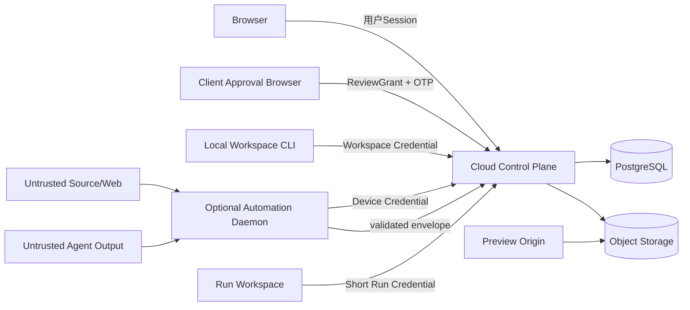

# 安全、可靠性、隐私、可观测性与测试

## 1. 安全目标

- 客户、品牌、项目、本地工作区和 Automation 设备之间严格隔离。
- 服务端不接触模型密钥、浏览器 cookie 和完整 Agent transcript。
- 不可信来源、网页、Agent 输出和静态 Preview 不能越过业务门禁或执行任意代码。
- 审批、权利、交付和影响决定具备不可抵赖的版本与审计证据。
- 客户端离线、重复投递、晚到报告和外部依赖失败时系统可理解、可恢复。

## 2. 信任边界

浏览器、客户审批、工作区、Automation 设备、单次 Run、对象存储和 Preview 分别使用独立凭据和授权范围。

## 3. STRIDE 威胁与控制

| 威胁 | 示例 | 控制 |
| --- | --- | --- |
| Spoofing | 伪造初始化请求绑定恶意设备 | PKCE verifier、登录态浏览器核对短码、项目权限、授权审计、设备撤销 |
| Tampering | 修改 Task Contract 或输出文件 | canonical hash、manifest、短期凭据、服务端再验证 |
| Repudiation | 否认批准某版剧本 | OTP、subject hash、actor、时间和 append-only audit |
| Information Disclosure | 跨客户读取资料或通知泄密 | tenant/project scope、最小快照、通知脱敏、对象许可 |
| Denial of Service | 大文件、深压缩包、Run 重试风暴 | 配额、MIME/size/depth 限制、退避、并发和自动暂停 |
| Elevation of Privilege | Agent 输出要求自批事实 | 领域状态机、命令 allowlist、Agent 无审批凭据 |

## 4. 身份与授权

- 内部用户使用验证邮箱、密码和可扩展 MFA；session 绑定当前 tenant membership。
- 固定角色为 tenant_admin、project_manager、strategist、editor、reviewer、viewer。
- 项目级 assignment 进一步限制可见项目；租户角色不自动获得全部客户资料。
- 客户审批人不加入租户，通过绑定固定对象版本、邮箱和有效期的 ReviewGrant 访问。
- Device Credential 绑定 tenant、device 和 project grants；撤销立即拒绝 poll 和 token 刷新。
- Run Credential 绑定单一 attempt、租约期限和最小命令集合。
- Workspace Credential 绑定 project、workspace 和授权提交人，只能 bootstrap、publish、pull 和查询自身 Submission，不能审批。

## 5. 多租户隔离

1. 应用 repository 方法把 tenant ID 作为必填参数。
2. project/object 获取同时校验 tenant 和关联外键。
3. 敏感表使用 PostgreSQL RLS 作为第二层防御时，连接必须设置事务级 tenant context。
4. 对象存储 key、签名许可、缓存 key、搜索索引和通知任务全部包含租户作用域。
5. 自动化测试对每个主要聚合执行跨租户读取、更新、审批、下载和 Run 报告负测。

## 6. Prompt Injection 与客户端安全

来源内容、网页和企业资料都是数据，不是系统指令。本地 AGENTS/Skill 指令和 Automation Task Contract 都必须把不可信来源放在数据层，不能让其改变命令 allowlist、输出目录、网络权限、publish 范围和审批边界。

- 普通交互在用户项目目录执行；Automation 临时工作区按 Run 隔离，输入只读，输出 allowlist。
- 任务不默认继承整个仓库、shell profile、SSH agent 或浏览器 cookie。
- 需要网页研究时使用显式 capability 和本机已授权工具，结果仍视为不可信候选。
- Agent 输出在客户端和服务端双重 Schema 验证。
- 文件名规范化，拒绝路径穿越、符号链接逃逸、设备文件和超限内容。

## 7. 文件与解析安全

- 本地来源先固化 hash；只有 publish 选中的 evidence pack/full source 上传并进行 MIME、恶意文件和安全预览检查。
- 压缩文件限制总大小、文件数、嵌套深度和压缩比。
- PDF/DOCX/XLSX/图片/视频解析器在资源受限 Worker 中运行。
- 原件不可修改；解析结果、缩略图和 OCR 是可重建 projection。
- 外部 URL 摄取防 SSRF，只允许公开网络规则或客户端本地研究，不允许云端访问内网地址。

## 8. Preview 与渲染安全

### 安全投影

声明式组件白名单、无脚本、无 CSS、无网络、无任意表达式；限制树深、节点数、文本长度和数据规模。

### Hosted Preview

- 客户端构建，服务端不安装依赖、不执行构建和不运行用户代码。
- bundle 使用 content-addressed blob，拒绝服务 Worker、动态后端、WebSocket 和外部网络依赖。
- 独立 preview origin，严格 CSP、sandbox iframe、短期访问 token 和 referrer 隔离。
- Preview 失败回退到原生视图/安全预览，不影响审批 hash。

## 9. 数据分类与保留

| 类别 | 示例 | 默认策略 |
| --- | --- | --- |
| 业务事实 | 项目、知识、Brief、Script、Approval | 项目生命周期 + 合同保留 |
| 原始客户资料 | 文档、图片、视频 | 客户/项目策略，可冻结法律保留 |
| 本地未发布草稿 | knowledge/work/outputs | 留在客户工作区，云端不保留 |
| 执行摘要 | Run、Attempt、usage、安全步骤摘要 | 运营期后聚合/归档 |
| 本地敏感数据 | 模型密钥、cookie、完整 transcript | 永不上传 |
| 临时 Run 文件 | 输入副本、生成中间件 | 本地按成功/失败策略清理 |
| Preview | 静态 bundle | 有效期、撤销和独立删除策略 |

删除/导出请求必须区分业务审计保留和可删除内容；审计记录可保留对象 ID、动作和 hash，不保留已删除客户正文。

## 10. 可靠性模型

### 目标

- 控制面月可用性目标 99.9%。
- 普通读取 p95 < 500ms，普通写入 p95 < 800ms，不含大文件传输。
- Scheduler 到期 Run 创建延迟 p95 < 60s。
- 通知和 outbox 采用至少一次处理并具备幂等消费者。

### 故障隔离

- 本地客户端离线不影响 Web 和已有审批；普通本地创作不依赖云端在线。
- 单个解析文件、Preview 或 Agent 输出失败不使项目整体不可用。
- 邮件失败不回滚审批或业务事务，进入独立重试和告警。
- Scheduler 不执行任务；调度异常不影响人工 run once。

## 11. 幂等、租约与恢复

- 数据库写入使用事务、唯一幂等键和乐观锁。
- Worker 使用 `FOR UPDATE SKIP LOCKED` 或等效 claim，记录 attempt 和 backoff。
- Automation TaskRun 与 RunAttempt 分离，租约过期不抹掉历史；普通 LocalRunContext 不受租约影响。
- late report 只能作为诊断证据，不能重复导入业务 Output。
- 对外副作用连接器必须回报 side-effect ID，重试前先查询 ledger。
- 取消、超时和 skipped 是明确终态，不把它们统一写成 failed。

## 12. 可观测性

### 日志

结构化字段：request_id、trace_id、tenant_id、project_id、subject_type/id、run_id、attempt_id、event、result、duration。正文、prompt、token、cookie、OTP 和客户文件名不进入日志。

### 指标

- API latency/error/rate。
- DB pool、lock、slow query、outbox age。
- source parse duration/failure。
- scheduler lag、queue age、lease expiry、heartbeat gap。
- Run outcome、blocked output、retry、cancel。
- approval delivery/OTP failure。
- object storage/preview validation failure。
- notification retry/dead letter。

### Trace

Web/BFF、CLI Gateway、outbox、Worker、Scheduler、TaskRun 和对象存储许可传播 trace ID。客户端只同步安全 span 摘要，不同步 Agent 内部 tool trace。

## 13. 告警和操作手册

高优先级告警：认证/审批不可用、疑似跨租户策略失败、数据库不可用、队列持续增长、对象存储失败。中优先级：连续 Run 失败、设备大面积离线、解析失败率、通知积压和 Preview 拒绝率异常。

每类告警必须链接 runbook：影响判断、只读诊断、止损动作、恢复验证和客户沟通范围。不得通过删除任务或篡改状态消除告警。

## 14. 测试分层

### 单元测试

- 九域状态机、角色策略、Gate 条件、模板覆盖、Submission、ScriptPackage 校验。
- Automation 类型/触发限制、Plan change diff、通知决策。
- 指标计算、单变量检查和 impact 遍历。

### 数据库与集成测试

- tenant scope、唯一约束、乐观锁、outbox、scheduler claim 和租约竞争。
- 版本审批、Run finalize、Output import 的原子性。
- V1 数据迁移和回填冲突报告。

### Contract 测试

- OpenAPI、CLI envelope、Task Contract 1.1、Capability Manifest、ScriptPackage 2.0。
- 当前和前一稳定版本兼容。
- Codex、Claude Code 和 fixture Adapter 消费相同业务契约。

### 端到端测试

- 金陵古都香 Golden Journey。
- 第二客户隔离和模板复用。
- init、publish/pull、披露等级、冲突处理，以及 Automation 的过期租约、取消、重试、late report。
- 来源变化到 Strategy/Brief/Script 的影响传播。
- 客户 OTP 审批和撤销。

### 浏览器与可访问性

- 九域导航、密集表格、移动审批、键盘操作、焦点、对比度。
- 空、加载、blocked、review_required、设备离线和错误状态。
- 安全投影和 Preview 降级不出现空白或布局重叠。

## 15. 发布质量门禁

- `go test -race ./...`
- Web 单元/组件/端到端测试通过。
- OpenAPI 与 JSON Schema 兼容检查通过。
- migration dry-run 和真实 PostgreSQL 集成测试通过。
- 跨租户负测、审批安全和 Artifact/Preview 安全测试通过。
- 金陵古都香与第二客户 UAT 有真实证据，不由开发者自签客户门禁。
