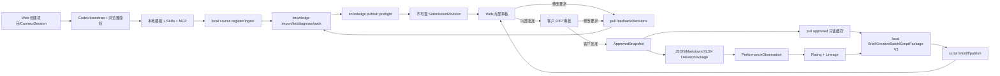

# V2 实现状态与验收入口

> 更新日期：2026-07-26。本文只描述仓库当前事实；路线图中的目标模型不能据此自动标记完成。

## 1. 当前可运行闭环



该路径以客户端为主。服务端只接收显式提交、保存治理事实并提供人工审核；普通本地操作不会创建 `TaskRun`。

## 2. 已实现

| 范围 | 当前实现 |
| --- | --- |
| 初始化 | `bootstrap preflight/plan/apply/resume/diagnostics`；浏览器 PKCE 授权、固定 Plugin、确定性 `plan_id`、未知非空目录拒绝、结构化进度和脱敏支持码 |
| 本地模板 | `.contentcloud/project.yaml`、`template.lock`、`sync-state.json`、知识/ontology/raw/work/outputs 目录和受管文件 hash |
| Agent 接入 | 项目级 Codex/Claude 配置；内置 `contentcloud-knowledge-extraction` 与 `contentcloud-marketing-video-script` Skills |
| 本地来源与运行 | source register/list/show/ingest/verify；copy/reference；SHA-256/MIME/100MB；EvidenceBundle；可恢复 LocalRun 阶段门禁 |
| 本地知识 | strict `knowledge-candidates/1.0` 导入、精确证据校验、eligible/blocked/informational、15 维诊断、七层 KnowledgePack 和披露清单 |
| 本地剧本 | Brief V2 lint、CreativeDirection、CreativeBatch、冻结 context、ScriptPackage V2、逐镜头 lint、blocked/review_ready、修订 diff、JSON/MD/XLSX |
| MCP | 工作区、source、LocalRun、knowledge、Brief、CreativeBatch、script、publish/submission/pull 共 24 个客户端工具，复用 CLI/领域逻辑 |
| 凭据 | `wt_` Workspace Credential 用于 publish/pull；macOS Keychain；`dt_` 继续供兼容 Runtime/可选 Automation 使用 |
| 发布 | knowledge/research/strategy/brief/script/delivery/performance；本地 JSON/lint/hash/大小/路径/preflight；`--review`/`--yes` 确认 |
| 拉取 | feedback/decisions 写 inbox，ApprovedSnapshot 写只读 cache，不覆盖业务正文 |
| 云端治理 | Submission、不可变 Revision、SourceDisclosure、ReviewFeedbackBundle、DecisionDelta、ApprovedSnapshot |
| 内部审核 | Web 列表/详情/revision 切换/来源披露/批注/修改要求/内部批准；不提供正文编辑控件，内部批准不提前生成快照 |
| 客户审批 | ReviewGrant 绑定 SubmissionRevision；OTP 验证、客户批准/修改要求、新 revision 撤销旧未决 Grant；公开页兼容 V1 历史链接 |
| 交付 | 客户批准原子生成 ApprovedSnapshot；从快照生成 JSON/Markdown/XLSX Artifact 与不可变 DeliveryPackage |
| 结果学习 | PerformanceObservation 绑定 ApprovedSnapshot；RatingDecision 支持 `approved_snapshot`；Lineage 串联提交、快照、交付和结果 |
| Brief 策略血缘 | `strategy_version_id` 必填，且必须引用已 pull 的 strategy ApprovedSnapshot 对象 |
| 数据库 | `00013`-`00015`；Workspace token lookup、RLS、revision/snapshot/package immutable trigger、两阶段审批事务、V1 影子快照幂等回填报告 |

核心代码入口：

- `internal/localworkspace/workspace.go`
- `internal/cli/workspace_commands.go`
- `internal/cli/v2_commands.go`
- `internal/app/submissions.go`
- `internal/app/review_export.go`
- `internal/app/artifacts.go`
- `internal/app/performance_results.go`
- `internal/store/postgres/submissions.go`
- `internal/store/postgres/delivery.go`
- `internal/httpapi/submission_handlers.go`
- `web/src/views/SubmissionsView.tsx`
- `web/src/views/PublicViews.tsx`
- `web/src/views/AssetViews.tsx`

## 3. 已验证规则

- publish 时服务端复算 canonical hash；篡改 payload 会被拒绝。
- 同一幂等键和相同内容返回原 Revision；相同幂等键不同内容冲突。
- 高风险对象使用 metadata-only 或无披露时标记 `evidence_limited`，不能远程批准。
- 内部批准只把 Submission 推进到 `internally_approved`；不会提前创建 ApprovedSnapshot。
- ReviewGrant 绑定具体 SubmissionRevision；新 revision 会撤销同一 Submission 上旧 revision 的未决 Grant。
- 客户 OTP 批准要求同一 revision 已完成内部批准，并在同一事务内写客户决定、Grant、Submission 和不可变 ApprovedSnapshot。
- ApprovedSnapshot 固定 Revision hash；JSON/Markdown/XLSX Artifact、DeliveryPackage 和 PerformanceObservation 均引用该快照。
- 修改要求在同一事务中写 Decision、Comment 和 `changes_requested` 状态。
- Workspace Credential 只能访问绑定工作区；Web 用户角色负责 approve/request-changes。
- 普通 publish 不创建 TaskRun；服务端没有 LLM、Agent、Skill、MCP 或 Renderer 执行入口。
- Web 审核动作不改写 Revision 正文。
- Brief publish 会强制执行 Brief V2 lint；Script publish 会识别批次目录中的 `script_package` 并强制执行完整 ScriptPackage V2 lint，batch/context 不会被误发布；多个候选必须通过重复 `--file` 明确范围。
- 阻断剧本允许没有镜头，但必须使用 blocked 状态并给出结构化 blocked reasons；review_ready 必须有连续镜头、必要角色、引用、权利和实验声明。
- Brief 必须声明 `strategy_version_id`，且该对象必须存在于已 pull 的 strategy ApprovedSnapshot 中。
- V1 已批准 ScriptVersion 可幂等回填为 `origin=v1_import` 的只读影子快照；有效历史 hash 原值保留，无效 hash 只计入报告、不伪造或重算。
- HTTP Golden Path 已自动验证 revision 内审、Grant、公开 OTP、客户批准、快照查询、三格式交付包和快照结果绑定。
- 真实 PostgreSQL 已验证 migration、Workspace token lookup、Revision/ApprovedSnapshot 不可变、审批事务、V1 回填幂等和跨租户 RLS。
- 金陵古都香一个真实 DOCX 已自动走通来源登记、DOCX ingest、知识候选导入、lint、15 维诊断、七层 pack 和 publish preflight，且不上传 raw。

以上证明代码状态为 `implemented`，不等于真实业务场景已经 `accepted`。剩余验收项见 §4。

## 4. 尚未完成

| 优先级 | 缺口 | 完成条件 |
| --- | --- | --- |
| P0 | 金陵全量客户端迁移 | 迁移 source registry、232 个对象、冲突/权利候选和十条旧稿；输出 dry-run、错误清单和人工核对报告，保留 stable ref/status/locator |
| P0 | 金陵 Golden Journey UAT | 由真实业务角色完成 knowledge -> strategy -> brief -> 三候选 script -> 内审 -> 客户 OTP -> 三格式交付 -> 结果导入 -> rating/lineage，并保存验收证据 |
| P0 | 浏览器与生产前验收 | 桌面/移动端执行内部审核、公开 OTP、下载和结果录入；验证错误恢复、链接撤销/过期和生产数据库迁移演练，由责任人签署 |
| P1 | Client/Brand/Product 与四层上下文 | 正式聚合、版本继承、override/rebase 和第二客户隔离验收 |
| P1 | StrategyVersion 扩展能力 | 候选比较、采纳与跨域 lineage；最小可用审批已随波次一的 Brief 策略血缘一起交付 |
| P1 | 九域工作台 | 研究、策略、内容计划、创意、交付、学习等真实对象和页面，不建设在线正文编辑器 |
| P1 | 模板分发升级 | 服务端签名 manifest、workspace diff/upgrade、冲突和回滚 |
| P2 | Automation Plan | remote/event/schedule、隔离工作区、RunOutput；仅在用户显式启用后使用 Device Credential |
| P3 | Hosted Preview | 客户端构建静态页面后上传；服务端只托管，不构建、不执行源码 |

## 5. 当前准确命令

```bash
contentcloud bootstrap preflight ./project --server-url <url> --json
contentcloud bootstrap plan ./project --server-url <url> --session <session-id> --json
contentcloud bootstrap apply ./project --server-url <url> --session <session-id> --plan-id <plan-id> --accept --json
contentcloud workspace status
contentcloud workspace doctor
contentcloud mcp status
contentcloud mcp serve

contentcloud local source register <file> --id <source-id>
contentcloud local source ingest <source-id>
contentcloud local source verify
contentcloud local run init --id <run-id> --intent content
contentcloud local knowledge import work/candidates.json --run <run-id>
contentcloud local knowledge lint
contentcloud local knowledge diagnose --channel douyin
contentcloud local knowledge pack --name <name>

contentcloud local brief lint outputs/briefs/<brief>.json
contentcloud local script batch init --brief <brief-id> --directions work/directions.json --count 3 --variant hook
contentcloud local script lint outputs/scripts/<batch>/<script>.json
contentcloud local script batch finalize --batch outputs/scripts/<batch>/batch.json --file <script-1> --file <script-2>
contentcloud local script diff --baseline <baseline> --candidate <candidate> --allow /shots/0
contentcloud local script export <approved-script-id>

contentcloud publish knowledge --dry-run --file knowledge/packs/<pack>.json --disclosures knowledge/index/<pack>-disclosures.json
contentcloud publish script --dry-run --file outputs/scripts/<batch>/<script>.json
contentcloud submission list
contentcloud submission status <submission-id>
contentcloud pull feedback
contentcloud pull decisions
contentcloud pull approved --type script
```

内部与客户审批是人工治理动作，使用 User Credential 创建客户授权；客户本人通过一次性 OTP 公开页决定：

```bash
contentcloud submission approve <revision-id> --reason <结论> --yes
contentcloud submission request-changes <revision-id> --reason <要求> --json-pointer /0/shots/0 --yes
contentcloud review create <submission-revision-id> --email <customer@example.com>
contentcloud review status <submission-revision-id>
contentcloud review list <submission-revision-id>
```

客户批准后，以 ApprovedSnapshot 为唯一交付和结果入口：

```bash
contentcloud artifact export <approved-snapshot-id> --format json
contentcloud artifact export <approved-snapshot-id> --format markdown
contentcloud artifact export <approved-snapshot-id> --format xlsx
contentcloud artifact package <approved-snapshot-id>
contentcloud artifact packages --project <project-id>
contentcloud artifact package-show <delivery-package-id>
contentcloud artifact download <artifact-id> --out <path>

contentcloud result import <json-csv-or-xlsx-file> --project <project-id>
contentcloud result list --project <project-id>
contentcloud result rate approved_snapshot <approved-snapshot-id> --project <project-id> --observation <observation-id> --rating <rating> --reason <reason> --next-action <action>
contentcloud lineage show --project <project-id> --type approved_snapshot --id <approved-snapshot-id> --direction both
```

## 6. 自动化验证

```bash
go vet ./...
CONTENTCLOUD_TEST_DATABASE_URL=<postgres-url> go test -race ./...
pnpm --dir web typecheck
pnpm --dir web test
pnpm --dir web build
node --check packages/contentcloud/bin/contentcloud.js
```

本轮已使用本机隔离测试库设置 `CONTENTCLOUD_TEST_DATABASE_URL`，执行真实 PostgreSQL migration，并验证 Workspace token lookup、Revision/ApprovedSnapshot 不可变、修改/两阶段批准事务、V1 影子回填和跨租户 RLS。该结论只代表自动化测试通过，不代表生产数据迁移演练完成。

代码主链只能标记 `implemented`。发布前仍需金陵业务角色 Golden Journey、第二客户场景、浏览器桌面/移动交互和生产数据迁移演练，完成责任人签署后才能标记 `accepted`。

## 7. 永久边界

1. 服务端不运行、代理、选择或编排 LLM、Agent、Skill、MCP 或 Renderer。
2. 所有程序化云端通信经过 `contentcloud` CLI；本地 MCP 复用 CLI 客户端，不直连私有 API。
3. 原始资料和草稿默认留在客户电脑；只有显式 publish 的结构化对象和披露内容进入云端。
4. 云端不编辑知识、Brief、剧本正文；修改回到本地并形成新 Revision。
5. Hosted Preview、视频生成、自动发布和投放不属于当前 V2 核心闭环。
