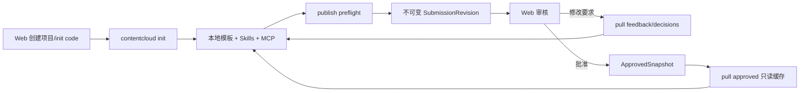

# V2 实现状态与验收入口

> 更新日期：2026-07-26。本文只描述仓库当前事实；路线图中的目标模型不能据此自动标记完成。

## 1. 当前可运行闭环



该路径以客户端为主。服务端只接收显式提交、保存治理事实并提供人工审核；普通本地操作不会创建 `TaskRun`。

## 2. 已实现

| 范围 | 当前实现 |
| --- | --- |
| 初始化 | `contentcloud init --connect <code> <directory>`；空目录初始化、未知非空目录拒绝、已有工作区幂等、完全离线 dry-run |
| 本地模板 | `.contentcloud/project.yaml`、`template.lock`、`sync-state.json`、知识/ontology/raw/work/outputs 目录和受管文件 hash |
| Agent 接入 | 项目级 Codex/Claude 配置；内置 `contentcloud-knowledge-extraction` 与 `contentcloud-marketing-video-script` Skills |
| MCP | `workspace_status`、`workspace_doctor`、`publish_preflight`、`submission_status`、`review_feedback_list`、`approved_snapshot_list` |
| 凭据 | `wt_` Workspace Credential 用于 publish/pull；macOS Keychain；`dt_` 继续供兼容 Runtime/可选 Automation 使用 |
| 发布 | knowledge/research/strategy/brief/script/delivery/performance；本地 JSON/lint/hash/大小/路径/preflight；`--review`/`--yes` 确认 |
| 拉取 | feedback/decisions 写 inbox，ApprovedSnapshot 写只读 cache，不覆盖业务正文 |
| 云端治理 | Submission、不可变 Revision、SourceDisclosure、ReviewFeedbackBundle、DecisionDelta、ApprovedSnapshot |
| 审核 | Web 列表/详情/revision 切换/来源披露/批注/修改要求/批准；不提供正文编辑控件 |
| 数据库 | `00013_v2_workspace_submissions.sql`、Workspace token lookup、RLS、revision/snapshot immutable trigger、审批事务 |

核心代码入口：

- `internal/localworkspace/workspace.go`
- `internal/cli/workspace_commands.go`
- `internal/cli/v2_commands.go`
- `internal/app/submissions.go`
- `internal/store/postgres/submissions.go`
- `internal/httpapi/submission_handlers.go`
- `web/src/views/SubmissionsView.tsx`

## 3. 已验证规则

- publish 时服务端复算 canonical hash；篡改 payload 会被拒绝。
- 同一幂等键和相同内容返回原 Revision；相同幂等键不同内容冲突。
- 高风险对象使用 metadata-only 或无披露时标记 `evidence_limited`，不能远程批准。
- 批准固定 Revision hash 并创建不可变 ApprovedSnapshot。
- 修改要求在同一事务中写 Decision、Comment 和 `changes_requested` 状态。
- Workspace Credential 只能访问绑定工作区；Web 用户角色负责 approve/request-changes。
- 普通 publish 不创建 TaskRun；服务端没有 LLM、Agent、Skill、MCP 或 Renderer 执行入口。
- Web 审核动作不改写 Revision 正文。

## 4. 尚未完成

| 优先级 | 缺口 | 完成条件 |
| --- | --- | --- |
| P0 | 完整知识生产命令 | 从 raw registry 到 evidence/fact/claim/asset/rights、冲突、缺口、15 维诊断和七层知识包可重复执行 |
| P0 | AI 视频剧本全流程 | Strategy/Brief/CreativeDirection/CreativeBatch/ScriptPackage V2、逐镜头 lint、修订和三格式交付走通 |
| P0 | 金陵古都香迁移/UAT | 现有资料保留 stable ref/status/locator，完成 knowledge -> brief -> script -> approval Golden Journey |
| P1 | Client/Brand/Product 与四层上下文 | 正式聚合、版本继承、override/rebase 和第二客户隔离验收 |
| P1 | 九域工作台 | 研究、策略、内容计划、创意、交付、学习等真实对象和页面，不建设在线正文编辑器 |
| P1 | 模板分发升级 | 服务端签名 manifest、workspace diff/upgrade、冲突和回滚 |
| P2 | Automation Plan | remote/event/schedule、隔离工作区、RunOutput；仅在用户显式启用后使用 Device Credential |
| P3 | Hosted Preview | 客户端构建静态页面后上传；服务端只托管，不构建、不执行源码 |

## 5. 当前准确命令

```bash
contentcloud init --server-url <url> --connect <code> --target all --accept-project-config ./project
contentcloud workspace status
contentcloud workspace doctor
contentcloud mcp status
contentcloud mcp serve

contentcloud publish knowledge --dry-run
contentcloud publish script --review
contentcloud submission list
contentcloud submission status <submission-id>
contentcloud pull feedback
contentcloud pull decisions
contentcloud pull approved --type script
```

审批是人工治理动作，使用 User Credential：

```bash
contentcloud submission approve <revision-id> --reason <结论> --yes
contentcloud submission request-changes <revision-id> --reason <要求> --json-pointer /0/shots/0 --yes
```

## 6. 自动化验证

```bash
go vet ./...
CONTENTCLOUD_TEST_DATABASE_URL=<postgres-url> go test -race ./...
pnpm --dir web typecheck
pnpm --dir web test
pnpm --dir web build
node --check packages/contentcloud/bin/contentcloud.js
```

设置 `CONTENTCLOUD_TEST_DATABASE_URL` 后，Go 测试会执行真实 PostgreSQL migration，并验证 Workspace token lookup、Revision 不可变、修改/批准事务和跨租户 RLS。本次递交前已在隔离 PostgreSQL 18 实例执行完整 `go test -race ./...`，上述数据库场景均通过。

前端当前没有自动化测试文件，`pnpm --dir web test` 以 `--passWithNoTests` 通过。发布前仍需补浏览器桌面/移动交互检查，以及南京业务角色 Golden Journey UAT。

## 7. 永久边界

1. 服务端不运行、代理、选择或编排 LLM、Agent、Skill、MCP 或 Renderer。
2. 所有程序化云端通信经过 `contentcloud` CLI；本地 MCP 复用 CLI 客户端，不直连私有 API。
3. 原始资料和草稿默认留在客户电脑；只有显式 publish 的结构化对象和披露内容进入云端。
4. 云端不编辑知识、Brief、剧本正文；修改回到本地并形成新 Revision。
5. Hosted Preview、视频生成、自动发布和投放不属于当前 V2 核心闭环。
