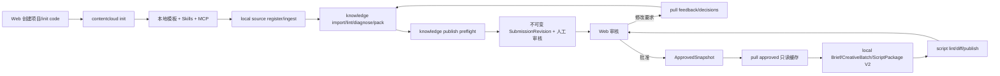

# V2 实现状态与验收入口

> 更新日期：2026-07-26。本文只描述仓库当前事实；路线图中的目标模型不能据此自动标记完成。

## 1. 当前可运行闭环



该路径以客户端为主。服务端只接收显式提交、保存治理事实并提供人工审核；普通本地操作不会创建 `TaskRun`。

## 2. 已实现

| 范围 | 当前实现 |
| --- | --- |
| 初始化 | `contentcloud init --connect <code> <directory>`；空目录初始化、未知非空目录拒绝、已有工作区幂等、完全离线 dry-run |
| 本地模板 | `.contentcloud/project.yaml`、`template.lock`、`sync-state.json`、知识/ontology/raw/work/outputs 目录和受管文件 hash |
| Agent 接入 | 项目级 Codex/Claude 配置；内置 `contentcloud-knowledge-extraction` 与 `contentcloud-marketing-video-script` Skills |
| 本地来源与运行 | source register/list/show/ingest/verify；copy/reference；SHA-256/MIME/100MB；EvidenceBundle；可恢复 LocalRun 阶段门禁 |
| 本地知识 | strict `knowledge-candidates/1.0` 导入、精确证据校验、eligible/blocked/informational、15 维诊断、七层 KnowledgePack 和披露清单 |
| 本地剧本 | Brief V2 lint、CreativeDirection、CreativeBatch、冻结 context、ScriptPackage V2、逐镜头 lint、blocked/review_ready、修订 diff、JSON/MD/XLSX |
| MCP | 工作区、source、LocalRun、knowledge、Brief、CreativeBatch、script、publish/submission/pull 共 24 个客户端工具，复用 CLI/领域逻辑 |
| 凭据 | `wt_` Workspace Credential 用于 publish/pull；macOS Keychain；`dt_` 继续供兼容 Runtime/可选 Automation 使用 |
| 发布 | knowledge/research/strategy/brief/script/delivery/performance；本地 JSON/lint/hash/大小/路径/preflight；`--review`/`--yes` 确认 |
| 拉取 | feedback/decisions 写 inbox，ApprovedSnapshot 写只读 cache，不覆盖业务正文 |
| 云端治理 | Submission、不可变 Revision、SourceDisclosure、ReviewFeedbackBundle、DecisionDelta、ApprovedSnapshot |
| 审核 | Web 列表/详情/revision 切换/来源披露/批注/修改要求/批准；不提供正文编辑控件 |
| 数据库 | `00013_v2_workspace_submissions.sql`、Workspace token lookup、RLS、revision/snapshot immutable trigger、审批事务 |

核心代码入口：

- `internal/localworkspace/workspace.go`
- `internal/cli/workspace_commands.go`
- `internal/cli/v2_commands.go`
- `internal/app/submissions.go`
- `internal/store/postgres/submissions.go`
- `internal/httpapi/submission_handlers.go`
- `web/src/views/SubmissionsView.tsx`

## 3. 已验证规则

- publish 时服务端复算 canonical hash；篡改 payload 会被拒绝。
- 同一幂等键和相同内容返回原 Revision；相同幂等键不同内容冲突。
- 高风险对象使用 metadata-only 或无披露时标记 `evidence_limited`，不能远程批准。
- 批准固定 Revision hash 并创建不可变 ApprovedSnapshot。
- 修改要求在同一事务中写 Decision、Comment 和 `changes_requested` 状态。
- Workspace Credential 只能访问绑定工作区；Web 用户角色负责 approve/request-changes。
- 普通 publish 不创建 TaskRun；服务端没有 LLM、Agent、Skill、MCP 或 Renderer 执行入口。
- Web 审核动作不改写 Revision 正文。
- Brief publish 会强制执行 Brief V2 lint；Script publish 会识别批次目录中的 `script_package` 并强制执行完整 ScriptPackage V2 lint，batch/context 不会被误发布；多个候选必须通过重复 `--file` 明确范围。
- 阻断剧本允许没有镜头，但必须使用 blocked 状态并给出结构化 blocked reasons；review_ready 必须有连续镜头、必要角色、引用、权利和实验声明。
- 金陵古都香一个真实 DOCX 已自动走通来源登记、DOCX ingest、知识候选导入、lint、15 维诊断、七层 pack 和 publish preflight，且不上传 raw。

以下规则**尚未成立**，属于 §4 的 P0 缺口，不要据 §2 的"已实现"推断：

- 云端审核目前只覆盖内部决定。客户 OTP 审批、导出、DeliveryPackage 和 PerformanceObservation 仍绑定 V1 `script_version`（`internal/app/review_cycles.go:36,135`、`internal/app/review_export.go:105,232`），与 Submission 轨没有连接。
- 因此从 publish 到"客户批准并三格式交付"这一段目前跑不通，Golden Journey 第 9-11 步无法执行。

## 4. 尚未完成

| 优先级 | 缺口 | 完成条件 |
| --- | --- | --- |
| P0 | **审批单轨收敛（代码缺口，非 UAT 缺口）** | ReviewCycle/ApprovalDecision/ReviewGrant 的 subject 从 `script_version` 改为 `submission_revision`；DeliveryPackage 与 PerformanceObservation 改引用 ApprovedSnapshot；V1 记录回填 `origin=v1_import` 影子快照。见 `03-domain-and-data-model.md` §2.1/§2.2 |
| P0 | 客户 OTP 审批链接接入 Submission | ReviewGrant 绑定具体 SubmissionRevision，新 revision 使旧链接失效；内部/客户两阶段决定写入同一 revision |
| P0 | 三格式导出改由 ApprovedSnapshot 驱动 | 导出与 DeliveryPackage 从批准快照的 canonical 内容生成，hash 与 revision 一致 |
| P0 | Brief 策略血缘 | `LocalBrief` 增加 `StrategyVersionID` 字段并加入 `internal/localworkspace/script.go` 的必填校验；校验其落在已 pull 的 strategy ApprovedSnapshot 的 eligible IDs 内（契约已改，实现待补） |
| P0 | 金陵古都香迁移/UAT | 现有资料保留 stable ref/status/locator，完成 knowledge -> strategy -> brief -> script -> approval Golden Journey |
| P0 | 金陵全量客户端迁移 | 迁移 source registry、232 个对象、冲突/权利候选和十条旧稿；输出 dry-run 与核对报告 |
| P0 | 真实审批剧本闭环 | 上述单轨改造完成后，真实 publish/人工审批/pull，从 Approved Brief 生成至少三候选、修订、批准并三格式交付 |
| P1 | Client/Brand/Product 与四层上下文 | 正式聚合、版本继承、override/rebase 和第二客户隔离验收 |
| P1 | StrategyVersion 扩展能力 | 候选比较、采纳与跨域 lineage；最小可用审批已随波次一的 Brief 策略血缘一起交付 |
| P1 | 九域工作台 | 研究、策略、内容计划、创意、交付、学习等真实对象和页面，不建设在线正文编辑器 |
| P1 | 模板分发升级 | 服务端签名 manifest、workspace diff/upgrade、冲突和回滚 |
| P2 | Automation Plan | remote/event/schedule、隔离工作区、RunOutput；仅在用户显式启用后使用 Device Credential |
| P3 | Hosted Preview | 客户端构建静态页面后上传；服务端只托管，不构建、不执行源码 |

## 5. 当前准确命令

```bash
contentcloud init --server-url <url> --connect <code> --target all --accept-project-config ./project
contentcloud workspace status
contentcloud workspace doctor
contentcloud mcp status
contentcloud mcp serve

contentcloud local source register <file> --id <source-id>
contentcloud local source ingest <source-id>
contentcloud local source verify
contentcloud local run init --id <run-id> --intent content
contentcloud local knowledge import work/candidates.json --run <run-id>
contentcloud local knowledge lint
contentcloud local knowledge diagnose --channel douyin
contentcloud local knowledge pack --name <name>

contentcloud local brief lint outputs/briefs/<brief>.json
contentcloud local script batch init --brief <brief-id> --directions work/directions.json --count 3 --variant hook
contentcloud local script lint outputs/scripts/<batch>/<script>.json
contentcloud local script batch finalize --batch outputs/scripts/<batch>/batch.json --file <script-1> --file <script-2>
contentcloud local script diff --baseline <baseline> --candidate <candidate> --allow /shots/0
contentcloud local script export <approved-script-id>

contentcloud publish knowledge --dry-run --file knowledge/packs/<pack>.json --disclosures knowledge/index/<pack>-disclosures.json
contentcloud publish script --dry-run --file outputs/scripts/<batch>/<script>.json
contentcloud submission list
contentcloud submission status <submission-id>
contentcloud pull feedback
contentcloud pull decisions
contentcloud pull approved --type script
```

审批是人工治理动作，使用 User Credential：

```bash
contentcloud submission approve <revision-id> --reason <结论> --yes
contentcloud submission request-changes <revision-id> --reason <要求> --json-pointer /0/shots/0 --yes
```

## 6. 自动化验证

```bash
go vet ./...
CONTENTCLOUD_TEST_DATABASE_URL=<postgres-url> go test -race ./...
pnpm --dir web typecheck
pnpm --dir web test
pnpm --dir web build
node --check packages/contentcloud/bin/contentcloud.js
```

设置 `CONTENTCLOUD_TEST_DATABASE_URL` 后，Go 测试会执行真实 PostgreSQL migration，并验证 Workspace token lookup、Revision 不可变、修改/批准事务和跨租户 RLS。当前环境未设置该变量，因此本轮不能提供新的真实 PostgreSQL 执行记录。

代码实现只能标记 `implemented`。发布前仍需南京业务角色 Golden Journey、第二客户场景、浏览器桌面/移动交互和真实 PostgreSQL 验证，完成责任人签署后才能标记 `accepted`。

## 7. 永久边界

1. 服务端不运行、代理、选择或编排 LLM、Agent、Skill、MCP 或 Renderer。
2. 所有程序化云端通信经过 `contentcloud` CLI；本地 MCP 复用 CLI 客户端，不直连私有 API。
3. 原始资料和草稿默认留在客户电脑；只有显式 publish 的结构化对象和披露内容进入云端。
4. 云端不编辑知识、Brief、剧本正文；修改回到本地并形成新 Revision。
5. Hosted Preview、视频生成、自动发布和投放不属于当前 V2 核心闭环。
