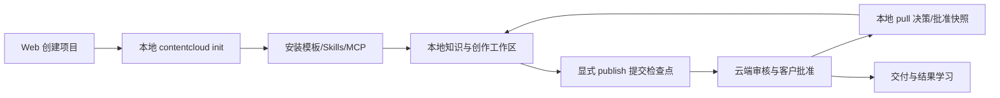
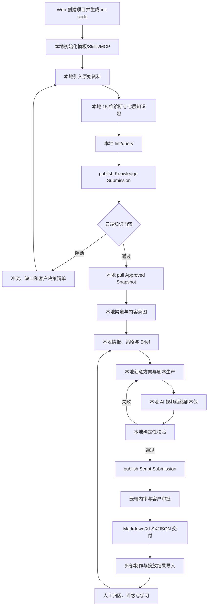

# ContentCloud V2 路线方案

> 状态：实施中
>
> 版本：2.0  
> 日期：2026-07-26  
> 基线：在 V1 已实现能力上增量演进

## 1. 产品结论

ContentCloud V2 是面向 AI 内容营销服务商的本地优先、多租户协作系统。团队在客户电脑上的 Codex、Claude Code 等成熟 Agent 中完成知识工程、市场研究、营销策略和 AI 视频剧本生产；云端负责项目治理、不可变提交、人工审批、客户协作、审计和可选自动化调度。

ContentCloud 的主对象是客户、品牌项目及其已提交业务版本，不是 Loop、Agent 或 Run。Automation 只是服务端驱动客户端执行的可选横向能力，普通本地交互不创建云端 TaskRun。



## 2. V2 九域业务系统

| 业务域 | 解决的问题 | 核心事实对象 |
| --- | --- | --- |
| 项目与治理 | 客户、品牌、产品、人员、设备、风险如何受控 | Client、BrandProject、Membership、Gate、Risk、Impact |
| 可信知识 | 什么是真的、允许说、允许展示 | Source、Evidence、Fact、Claim、Asset、Rights、Conflict |
| 市场与内容情报 | 哪些市场结构和表达值得借鉴 | ResearchTask、BenchmarkCase、Trend、Insight |
| 产品营销策略 | 对谁、在何时、用什么卖点和画面 | Audience、Scenario、DemandMoment、SellingPoint、VisualizationPlan |
| 内容策划 | 做什么内容、在哪个渠道、验证什么 | Topic、ContentPlan、Campaign、Experiment、Brief |
| 创意生产 | 如何稳定产出可生成、可验证的剧本 | CreativeDirection、CreativeBatch、Script、Scene、Variant |
| 审核与客户协作 | 谁批准了哪个不可变版本 | ReviewCycle、Comment、Approval、ReviewGrant |
| 交付与外部制作 | 如何形成标准交付并与外部制作衔接 | DeliveryPackage、Export、ProductionHandoff |
| 投放结果与学习 | 内容结果如何形成可审阅的下一步 | PerformanceObservation、RatingDecision、Learning |

九域是业务能力和云端治理视图。Gate 是跨域业务门禁。未发布草稿只存在本地；云端九域页面展示 Submission、批准版本、审批、风险和影响。Automation Plan、TaskRun 和 RunAttempt 只用于服务端驱动的自动化。

## 3. 核心纵向闭环

V2 使用金陵古都香作为第一条 Golden Journey，但模型必须支持其他客户、品牌、产品和行业。



## 4. 四层客户上下文与双事实源边界

```text
Platform Methodology
  -> Tenant Service Template
      -> Client / Brand Knowledge Pack
          -> Immutable Project Context Snapshot
```

- 平台方法论描述可复用的诊断维度、治理规则和内容研发步骤。
- 租户模板表达营销公司的服务产品、角色、检查表和交付标准。
- 客户/品牌知识包承载七层品牌上下文：identity、product、market、expression、operations、content_engine、compliance。
- 项目快照冻结一次任务实际可使用的来源、知识、素材、Brief 和策略版本。
- 下层可以受控覆盖上层参数，但必须记录来源、版本、覆盖理由和生效范围。

本地工作区是未发布草稿、原始资料和交互过程的事实源；云端是不可变 Submission、人工决定和批准版本的事实源。两者通过显式 `publish`/`pull` 交换检查点，不做持续目录同步。

## 5. AI 视频就绪剧本

V2 交付的是可供可灵、即梦及其他视频工具继续制作的结构化剧本包，不在服务端或客户端自动调用视频生成平台。

剧本包至少包含：

- 渠道、目标、受众、场景、需求时刻和单一测试变量。
- 封面、钩子、叙事结构、时间轴、口播、字幕和唯一 CTA。
- 每镜头的主体、动作、构图、运镜、首帧、运动、尾帧、声音和连续性。
- 可用素材、素材真值等级、权利、知识与主张引用。
- 产品真实性策略、负面约束、合规边界、Plan B 和验收条件。
- blocked 结果所需的候选引用、阻断原因和补料清单。

## 6. Automation 定位

| 类型 | 业务目的 | 典型模板 |
| --- | --- | --- |
| `monitor` | 持续发现变化 | 来源变化、权利到期、竞品与平台趋势 |
| `extract` | 从资料提取结构化候选 | 知识提取、案例拆解、卖点候选 |
| `generate` | 生成正式业务候选 | Brief、剧本、变体、按批注修订 |
| `validate` | 执行确定性或客户端补充检查 | 引用、权利、品牌、结构、可生成性 |
| `follow_up` | 跟进有终点事项 | 等待补料、等待审批、投放观察窗口 |
| `review` | 周期复盘 | 项目周报、内容诊断、评级建议 |
| `sync` | 同步授权企业数据 | 飞书、网盘、CRM、投放平台 |
| `maintain` | 维护上下文健康 | 重复项、过期项、影响分析 |

触发器包括 `remote`、`event` 和 `schedule`。只有服务端驱动的 Automation 才创建 TaskRun。普通用户在本地 Agent 中执行 generate、extract 或 revise 时使用 LocalRunContext，并在门禁点显式 publish。

## 7. 不可破坏的系统边界

1. 服务端不运行、代理、选择或编排任何 LLM、Agent、Skill、模型或 Renderer。
2. 服务端只在 Automation 中按客户端声明的业务 capability 分配确定性 Task Contract。
3. Agent 不能成为责任矩阵中的 A/R，事实、主张、权利、Brief、剧本、审批和归因均由人负责。
4. Agent、Skill、MCP、脚本、Renderer 和外部集成与服务端的程序化通信必须走 `contentcloud` 的 CLI 命令面或其同一 dispatch 客户端与凭据层；禁止新增自建 HTTP 客户端或直接绑定私有 REST 路径。
5. 核心业务对象由服务端原生渲染；扩展产物使用安全投影和明确降级。
6. 完整 Agent transcript 不上传；云端只保存脱敏步骤摘要、业务输出、usage 和 allowlist 文件清单。
7. 本地资料默认不上传；publish 时逐来源选择 metadata-only、evidence-pack 或 full-source。
8. 云端不直接编辑知识、Brief 和剧本正文，只做批注、决策、审批和版本比较。
9. V2 不自动生成视频、不自动发布、不自动投放。

## 8. V1 到 V2

| 分类 | 处理方式 |
| --- | --- |
| V1 已实现 | 多租户、项目、来源、证据、知识、Brief、ScriptVersion、TaskRun、RunAttempt、审批、导出、结果与 lineage 原位继承 |
| V2 改造 | Gate 0-5 扩展为本地工作流与云端治理检查点；Script Package 升级；客户上下文改为四层继承；审批主体从 ScriptVersion 单轨收敛到 SubmissionRevision |
| V2 新增 | WorkspaceTemplate、LocalRunContext、Submission、ApprovedSnapshot、显式 publish/pull、Skills/MCP 安装、Automation Plan 和 RunOutput |
| 延后能力 | 飞书/CRM 深度连接、视频生成平台、自动发布投放、Hosted Preview 的高级能力 |

## 9. 实施波次

1. **本地工作区与剧本工程**：init、Skills/MCP、四层上下文、知识发布、CreativeBatch、ScriptPackage V2 和端到端审批。
2. **九域业务工作台**：市场情报、内容计划、项目治理、交付、跨域 lineage 和第二客户验证。
3. **持续自动化与运营学习**：Automation 调度、Run 详情、通知、变更单、周期复盘；最后实施 Hosted Preview。

## 10. 文档导航

| 文档 | 内容 |
| --- | --- |
| [01-prd.md](01-prd.md) | 产品目标、九域功能需求和验收标准 |
| [02-business-capability-map.md](02-business-capability-map.md) | 能力地图、角色、用户故事、用例和信息架构 |
| [03-domain-and-data-model.md](03-domain-and-data-model.md) | 聚合、实体、关系、状态机和迁移 |
| [04-business-workflows.md](04-business-workflows.md) | 九域业务流程、Gate、异常与恢复 |
| [05-script-production-system.md](05-script-production-system.md) | AI 视频剧本全流程和 ScriptPackage V2 |
| [06-local-workspace-and-publishing.md](06-local-workspace-and-publishing.md) | init、目录、Skills/MCP、publish/pull 和冲突模型 |
| [07-automation-and-run-model.md](07-automation-and-run-model.md) | Automation、Run、Output、通知和变更模型 |
| [08-system-architecture.md](08-system-architecture.md) | 本地优先系统、容器、部署和零 Agent 服务端边界 |
| [09-cli-mcp-and-contracts.md](09-cli-mcp-and-contracts.md) | CLI、MCP、Submission、Capability 和兼容契约 |
| [10-client-context-and-methodology.md](10-client-context-and-methodology.md) | 四层继承、七层知识包和企业上下文 |
| [11-security-reliability-and-observability.md](11-security-reliability-and-observability.md) | 安全、可靠性、隐私、监控和测试 |
| [12-migration-and-delivery-plan.md](12-migration-and-delivery-plan.md) | V1 增量迁移、三个波次和上线策略 |
| [13-acceptance-and-traceability.md](13-acceptance-and-traceability.md) | FR/UC/NFR 追踪、UAT 和完成定义 |
| [14-implementation-status.md](14-implementation-status.md) | 仓库当前实现事实、缺口和验证入口 |

### 文档编辑约定

这套文档最容易出的问题是"某一份说已实现、另一份说待实现"。为避免再次漂移：

1. **只有 `14-implementation-status.md` 描述实现现状**，并注明更新日期。01-13 一律只写目标契约和验收标准。
2. 01-13 确实需要提醒现状时，使用 `> 实现现状：…… 以 14 号文档为准` 的引用块，不在正文混写。
3. 领域概念的唯一定义处是 `03-domain-and-data-model.md`；其他文档引用概念时链接过去，不重复下定义。
4. 改动波次归属时，`12`（交付计划）和 `13`（追踪矩阵）必须同时改。
5. 文档中出现的命令、MCP 工具名、Schema 版本和文件路径，提交前用仓库实际内容核对一次。

## 11. 成功定义

- 金陵古都香能从客户建档完整走到 AI 视频就绪剧本、审批、三格式交付和结果回流。
- 第二个不同传统行业客户能复用平台方法论和租户模板，同时保持知识、权利和业务隔离。
- 九域均有本地工作流、云端检查点、责任人、CLI 能力、审计和至少一条可验收主流程。
- 自动化失败只影响 Run，不得绕过业务门禁或自动改变正式对象状态。
- 100% 可交付剧本的确定性表述、素材和镜头证据可追溯到不可变项目快照。
