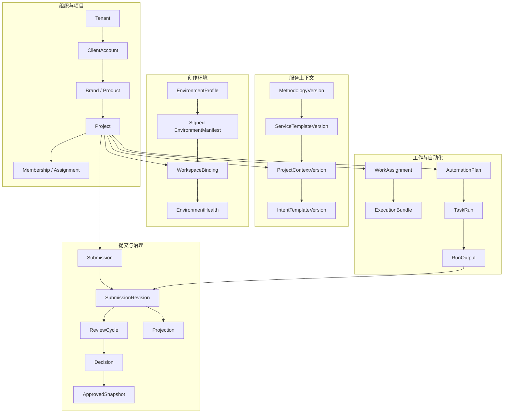

# V3 服务端领域与同步边界

## 1. 服务端定位

ContentCloud Server 不是远程文件管理器，也不是另一个内容编辑器。它负责：

1. 客户、项目、角色和服务阶段。
2. 方法论、意图和创作环境的版本化交付。
3. 本地检查点的不可变提交、人工审核和批准快照。
4. 工作分派、客户协作、交付、结果和审计。
5. 明确启用后的 Automation 调度。

本地 Workspace 负责候选内容的持续编辑；Web 负责查看投影、做决定和安排下一步，不能与 Codex 同时编辑同一份本地草稿。

## 2. 领域分区



## 3. 命令事实与查询投影分离

### 3.1 服务端正式事实

V3 服务端的正式业务事实只有：

- 组织、项目、角色和分派。
- 已发布的模板、意图和环境版本。
- 不可变 `SubmissionRevision`。
- 绑定 revision digest 的人工 `Decision`。
- 不可变 `ApprovedSnapshot`。
- WorkAssignment、Automation Plan/Run 和审计事件。

### 3.2 Web 查询投影

以下对象可以在数据库中建表以便列表、过滤、聚合和 lineage 查询，但它们是从 Revision/Snapshot 投影出来的 read model：

- Source、Evidence、Fact、Claim、Asset、Rights、Conflict。
- 15 维覆盖、七层 KnowledgePack、Intent。
- Campaign、Brief、ContentBatch、Script、MediaAsset。
- DeliveryPackage、Observation、Learning。
- LocalRunSummary 和 HandoffSummary。

投影表不能提供独立编辑 API。修改动作只能产生反馈、决定、Assignment 或新的 SubmissionRevision，不能原地改 projection。

这条边界消除当前“本地 Wiki 是一份、云端 KnowledgeItem 又是一份”的双事实源。

## 4. 核心聚合

### 4.1 Project

`Project` 绑定客户、品牌、产品、服务模板、方法论版本、当前研发节点和一个或多个 WorkspaceBinding。

项目状态：

```text
setup -> active -> on_hold -> completed -> archived
```

研发节点状态独立表达，例如：立项、实物样品、收口文档、生产/质检。项目 active 不代表当前节点已通过。

### 4.2 ProjectContextVersion

它是下发到 `10-context/` 的不可变解析结果，包含：

- 客户、品牌和产品 ID。
- MethodologyVersion 与 ServiceTemplateVersion。
- 当前研发节点和 Gate。
- 适用 IntentTemplateVersion。
- 角色、交付物、约束和允许覆盖项。

本地对它提出修改时创建 `context` Submission；服务端批准后生成新版本，再由用户显式 pull。

### 4.3 Submission

V3 使用一条统一的云端审核轨道：

```text
Submission
  -> immutable SubmissionRevision
      -> ReviewCycle / Comment
      -> Decision
      -> ApprovedSnapshot
```

`submission_type` 首版固定为：

| 类型 | 典型对象 | 审核结果 |
| --- | --- | --- |
| `context` | 客户资料、方法论覆盖、研发节点、Intent | 新 ProjectContextVersion 或决定增量 |
| `knowledge` | Source metadata、Evidence、Fact、Claim、Asset、Rights、Conflict、KnowledgePack | 类型化 eligible/blocked Snapshot |
| `brief` | Campaign、生产计划、Brief | 可用于内容生产的 Brief Snapshot |
| `content_batch` | Script/图文/直播话术批次 | 可交付内容 Snapshot 或退回意见 |
| `asset_batch` | 图片、音频、视频候选及权利引用 | 可进入下游生产的 Asset Snapshot |
| `delivery` | 交付包、清单、验收条件 | Delivery Snapshot |
| `result` | Observation、Learning 候选 | 可采纳 Learning Snapshot |

不再保留 `research`、`strategy`、`script` 等相互重叠的旧类型；研究和策略分别作为 context/knowledge/brief 中的明确对象类型出现。

### 4.4 类型化资格

批准 Revision 不等于其中所有对象都获得同一个 `approved` 状态。Snapshot 对每个对象保存决定：

```json
{
  "subject_id": "claim:ancient-formula",
  "subject_type": "Claim",
  "source_version": 3,
  "source_digest": "sha256:...",
  "decision": "request_changes",
  "resulting_status": "needs_review",
  "eligible": false,
  "basis": "缺古方原文和传承链"
}
```

资格规则：

| 类型 | 可用于正式内容的状态 |
| --- | --- |
| FactAssertion | `verified` |
| Claim | `approved` |
| RightsRecord | `valid` |
| Asset | 自身可用且关联 `valid` RightsRecord |
| Brief | `approved` Snapshot 中 eligible |
| Content | `approved` 且所有引用仍有效 |
| Learning | `adopted`，但不能自动修改策略或 Brief |

## 5. WorkspaceBinding 与本地状态

服务端只保存：

- workspace ID、project ID、device ID。
- layout/template/environment 版本和 digest。
- 最后一次 publish/pull、健康摘要和 capability。
- 公开的 Run/Handoff 数量摘要，仅在用户显式上报时更新。

服务端不保存：

- 本机绝对路径。
- Codex transcript 或隐藏推理。
- Workspace Credential 明文。
- 未 publish 的正文、原始资料或临时草稿。
- Run claim 文件和本地锁细节。

## 6. 双向交换模型

### 6.1 服务端到客户端

| 交换物 | 触发 | 本地落点 | 是否可变 |
| --- | --- | --- | --- |
| ProjectContextVersion | 初始化或显式 rebase | `10-context/` | 只读版本；本地修改另建候选 |
| EnvironmentManifest | bootstrap、check update | `.contentcloud/environment.lock` | 签名、版本化 |
| WorkAssignment | 用户选择拉取工作 | `.contentcloud/inbox/assignments/` | 不可变 |
| ReviewFeedbackBundle | 用户拉取审核意见 | `.contentcloud/inbox/review-feedback/` | 不可变 |
| DecisionDelta | 用户拉取决定 | `.contentcloud/inbox/decisions/` | 不可变 |
| ApprovedSnapshot | 用户拉取批准结果 | `.contentcloud/cache/approved/` | 不可变、只读 |
| ExecutionBundle | Assignment/Automation 需要能力 | `.contentcloud/cache/` | 签名、绑定 subject digest |

### 6.2 客户端到服务端

| 交换物 | 触发 | 服务端结果 |
| --- | --- | --- |
| Workspace registration | bootstrap 用户确认 | WorkspaceBinding |
| Health summary | doctor 后用户允许或策略要求 | EnvironmentHealth |
| SubmissionBundle | preflight 后用户明确确认 | SubmissionRevision |
| Assignment receipt | 用户领取任务 | Assignment 状态与审计 |
| RunOutput | Automation 完成 | 先形成 SubmissionRevision，不直接批准 |
| Diagnostics bundle | 用户预览并确认 | Support case 摘要 |

## 7. 原始资料策略

V3 支持三种 SourceDisclosure：

| 级别 | 上传内容 | 使用场景 |
| --- | --- | --- |
| `metadata_only` | ID、文件名、MIME、hash、大小、摘要 | 普通来源登记或敏感原件 |
| `evidence_pack` | metadata + 必需片段/缩略图/locator | 远程审核事实和主张的默认方式 |
| `full_source` | 完整原件 | 用户明确授权且业务确需远程查看 |

Source 页面可以显示本地登记的真实文件名和状态，但没有披露权限时只能显示 metadata。Web 不伪造文件正文，也不能通过 Source metadata 推断事实已经成立。

## 8. WorkAssignment

Web 给客户端“下任务”不是修改本地目录，而是创建不可变 Assignment：

```json
{
  "assignment_id": "asg_...",
  "project_id": "prj_...",
  "intent_id": "intent:douyin-short-video",
  "input_snapshot_refs": ["aps_..."],
  "requested_outputs": [{"type": "ContentBatch", "count": 10}],
  "constraints": ["不得使用 blocked Claim"],
  "due_at": "...",
  "execution_bundle_id": "ceb_..."
}
```

用户显式 pull 后，Codex 可以为 Assignment 创建本地 Run。Assignment 不指定 Prompt、模型或具体 Skill 路径；ExecutionBundle 只绑定 capability 和允许的 Pack。

## 9. Environment 与业务数据分离

环境控制面只处理：

```text
Profile -> signed Manifest -> local Resolver -> environment.lock
        -> capability -> Skill/Provider Pack -> ExecutionBundle
```

业务控制面只处理：

```text
Context / Knowledge / Brief / Content / Asset / Delivery / Result
        -> SubmissionRevision -> Decision -> ApprovedSnapshot
```

二者唯一连接是 `environment_digest`、`capability_id` 和 `execution_bundle_id`。Plugin 更新不能修改客户知识；业务正文也不能触发 Plugin 安装。

## 10. 删除的旧服务端路径

V3 实施时直接删除：

- `seedDemo` 三个 TXT 及其直接批准链。
- Web 直接创建/修改正式 Knowledge、SellingPoint、VisualizationPlan、Brief 的命令路径。
- 把 `KnowledgeItem.status=approved` 同时用于 Fact、Claim 和其他类型的通用资格逻辑。
- ScriptVersion 与 SubmissionRevision 两套并行审批。
- Web 依赖本地绝对路径打开业务文件的假设。

如需在 Web 发起新内容，只创建 ProjectContext 修订、WorkAssignment 或 Review 决定；真正的候选正文仍由 Workspace 产生并 publish。
