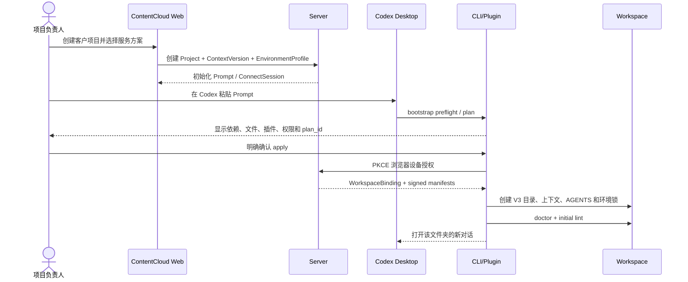
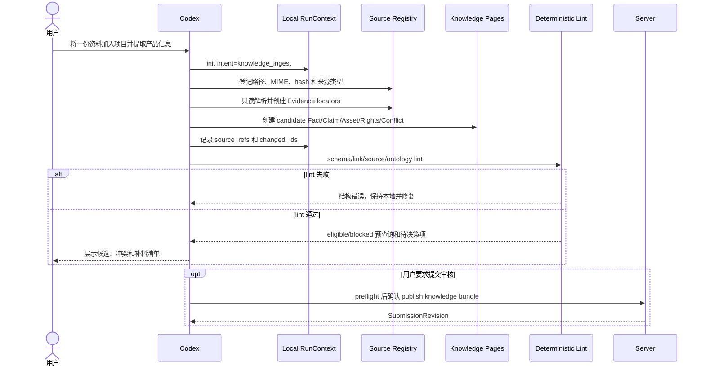
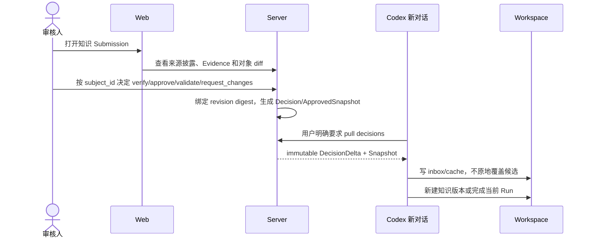
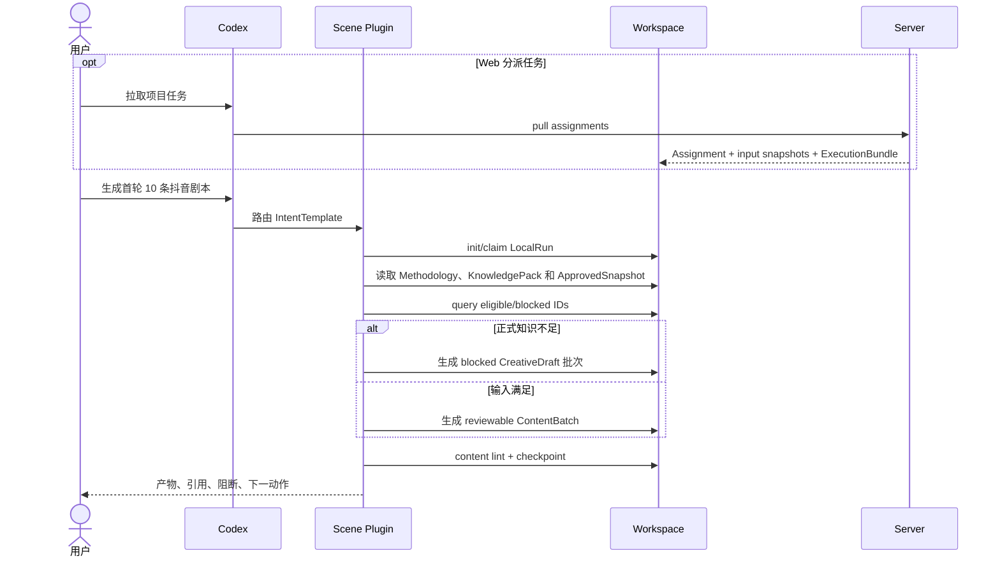
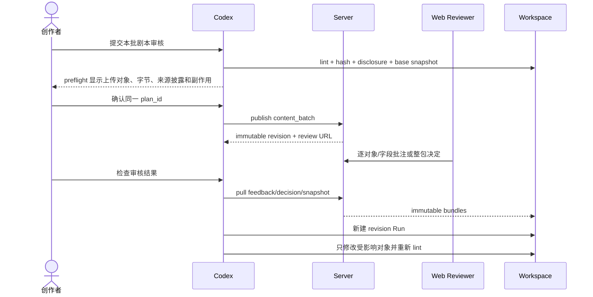
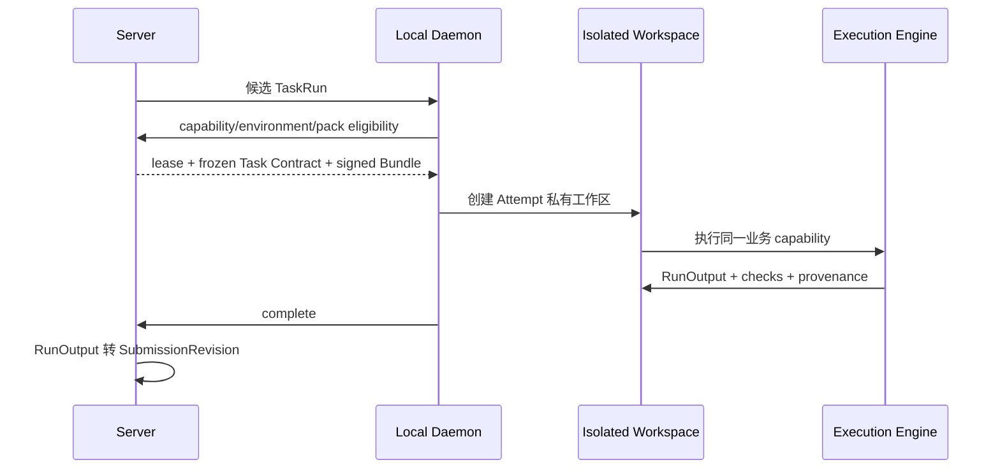

# V3 业务流程与服务端交互

## 1. 总原则

一次 Codex 对话不等于一次云端 Run。普通创作默认在本地完成，只有以下节点访问 ContentCloud Server：

- 初始化和浏览器授权。
- 显式 pull 上下文、任务、反馈或批准快照。
- 检查环境更新或安装缺失 Pack。
- 用户确认后的 publish。
- 用户显式启用的 Automation lease/heartbeat/complete。

## 2. 项目创建与 Workspace 初始化



初始化完成标准不是“目录存在”，而是：Context、Environment、WorkspaceBinding、Schema、doctor 和首个 conversation context 同时有效。

## 3. 资料摄取与知识建设



在这条流程中，Server 不参与 intent 分类、文档解析或每次本地写入。

## 4. 人工知识决策



审核人必须能分别处理 Fact、Claim 和 Rights；整包批准不能把 blocked 对象自动变为 eligible。

## 5. 内容任务与本地创作

内容任务有两个入口：用户在 Codex 直接发起，或 Web 创建 WorkAssignment。



`blocked CreativeDraft` 可以用于探索角度和评审，不得进入 DeliveryPackage。Web 必须显示其阻断原因，不能只显示“剧本生成成功”。

## 6. 多对话分工与交接

推荐的对话分工是业务角色，不是固定数量：

```text
对话 A：项目总控与方法论诊断
对话 B：资料摄取和知识候选
对话 C：脚本批次生产
对话 D：素材/视频生产
对话 E：审核反馈修订
```

交接固定顺序：

```text
保存版本化业务对象
  -> 阶段 lint
  -> 更新 RunContext revision
  -> 创建 HandoffRecord 和 digest refs
  -> 释放 RunClaim
  -> 新对话验证 digest
  -> 原子 claim 同一 Run
  -> 继续下一阶段
```

服务端不参与普通 Handoff。只有 Assignment、publish、pull 和 Automation 才需要云端。

## 7. 内容审核与修订



旧对话可以关闭。新对话通过 Submission ID、反馈包和 Handoff 接续，不读取旧 transcript。

## 8. 交付与结果回流

```text
approved Content Snapshot
  -> 本地组装 DeliveryPackage
  -> delivery lint
  -> publish delivery
  -> 客户验收 / 导出
  -> 导入平台结果
  -> Observation
  -> candidate Learning
  -> 人工 adopt/reject
  -> 新 Context/Brief，不自动改历史内容
```

DeliveryPackage 只能引用仍有效的 ApprovedSnapshot；上游事实、权利或价格变化时创建 ImpactAction，不篡改历史决定。

## 9. Automation

Automation 是独立机器执行，不是后台模拟一个 Codex 对话：



Automation 输出同样需要人工审核，不能直接发布。

## 10. 服务端交互矩阵

| Codex 动作 | 访问服务端 | 用户确认 | 交换内容 |
| --- | --- | --- | --- |
| 打开文件夹、读取当前状态 | 否 | 否 | 本地文件 |
| 创建/恢复 Run、claim、handoff | 否 | 本地破坏性动作除外 | 本地状态 |
| 解析资料、生成知识/剧本/素材 | 否 | Provider 费用另行确认 | 本地最小输入 |
| bootstrap | 是 | plan + 浏览器授权 | 设备、项目绑定、签名环境 |
| pull context/assignment/feedback/snapshot | 是 | 用户明确表达拉取意图 | 不可变 Bundle |
| environment check/update | 是 | 安装变更需确认 | digest、版本和权限 |
| publish preflight | 否 | 否 | 本地计算 |
| publish apply | 是 | 必须确认同一 plan_id | SubmissionBundle |
| submission status | 是 | 明确查询意图 | 状态摘要 |
| diagnostics upload | 是 | 预览后确认 | allowlist 脱敏摘要 |
| Automation | 是 | 启用 Plan 时确认 | lease、contract、output |

## 11. 失败与恢复

| 失败 | 恢复方式 |
| --- | --- |
| 本地 lint 失败 | 保持当前 Run，不 publish，按稳定错误码修复 |
| Evidence 不足 | 创建 Gap/DecisionRequest，补料后新版本 |
| RunClaim 冲突 | 只读展示占用者和过期时间，不抢写 |
| Handoff digest 变化 | 拒绝接管，生成冲突报告 |
| publish 网络中断 | 使用幂等键查询结果，不重复创建 revision |
| revision 已有新基线 | 拉取最新 Snapshot，显式 rebase 后重新 preflight |
| Environment 过旧 | 保存当前 Run，升级后打开新会话并从 Handoff 继续 |
| 审核退回 | 拉取不可变反馈包，新建修订 Run |
