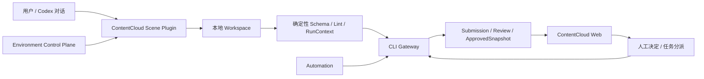

# ContentCloud V3 客户端与服务端一体化方案

状态：`方案已确认，V3 主链实施与零兼容治理收口中`。

更新时间：2026-07-27。

## 1. V3 为什么存在

现有实现完成了 Codex Plugin、Bootstrap、Environment、RunClaim、Handoff、Publish 和审核基础设施，但客户端业务工作区、服务端领域模型和 Web 展现仍没有形成同一条业务链。

最明显的问题不是演示文件使用了 `.txt`，而是当前 Web 把“上传三个文件、在云端创建知识、直接生成 Brief/剧本”当成主流程；真实客户端已经验证的流程是：

```text
方法论与客户上下文
  -> 原始来源登记与证据定位
  -> 本体约束下的候选事实、主张、素材、权利和冲突
  -> 确定性校验与人工决策
  -> eligible / blocked 查询
  -> 意图驱动的内容生产
  -> 版本化产物与引用校验
  -> Submission 审核、交付和结果回流
```

V3 的目标是让以下三者共享同一套对象、状态和流程：

1. 客户在 Codex Desktop 中打开的本地文件夹。
2. ContentCloud 服务端的治理与环境控制面。
3. 项目负责人、创作者和审核人在 Web 中看到的页面。

## 2. 事实基线

V3 以 `/Users/coso/Documents/dev/goodvision/marketing/jinling-gudu/docs/architecture.md` 为已验证架构样本，并同时核对了：

- `AGENTS.md` 的权限和人工决策边界。
- `raw/source-registry.yaml` 的来源、哈希和不可变原件规则。
- `ontology/` 与 `wiki/` 的 Schema、实例、来源、事实、主张、素材和权利分离。
- `work/runs/*.json` 的跨 Skill RunContext。
- `workflows/orchestrate-knowledge-content.md` 与 `workflows/client-agent-delivery.md` 的门禁。
- `../service/` 的 15 维方法论、七层知识包和内容意图。
- `outputs/scripts/*/manifest.yaml` 的 blocked 产物和引用约束。

`jinling-gudu` 是旧目录，不是 V3 目录模板。V3 继承其中已经成立的责任边界，重新设计物理目录、单一事实源和云端投影。

## 3. V3 总体架构



V3 分为三个平面和一个交换边界：

| 部分 | 责任 | 不负责 |
| --- | --- | --- |
| 本地创作平面 | 原件、候选知识、Run、Handoff、草稿、确定性校验 | 云端批准、跨团队权限、静默同步 |
| 云端治理平面 | 项目、Submission、审核、决定、ApprovedSnapshot、交付和审计 | 编辑本地草稿、读取任意本机目录 |
| 环境控制平面 | Plugin/Skill/MCP 版本、签名、安装、升级、Automation capability | 客户事实和内容批准 |
| CLI Gateway | publish/pull/assignment/lease 的显式、结构化交换 | 上传 transcript、自动同步整个目录 |

## 4. 文档导航

| 文档 | 内容 |
| --- | --- |
| [01-architecture-baseline.md](./01-architecture-baseline.md) | 从真实客户端提炼的稳定架构、不变量和 V2 偏差 |
| [02-client-workspace.md](./02-client-workspace.md) | V3 客户端目录、文件契约、Run/Handoff 和 Skill 边界 |
| [03-server-domain-and-sync.md](./03-server-domain-and-sync.md) | 服务端领域、读模型、Submission 和双向同步契约 |
| [04-business-workflows.md](./04-business-workflows.md) | 初始化、知识建设、创作、审核、交付和 Automation 时序 |
| [05-web-console.md](./05-web-console.md) | 后台信息架构、页面内容、角色视图和交互状态 |
| [06-contracts.md](./06-contracts.md) | Workspace、业务对象、Submission、Assignment 和 Projection 契约 |
| [07-delivery-plan.md](./07-delivery-plan.md) | 零兼容实施顺序、删除项、测试和验收门禁 |
| [PLAN.md](./PLAN.md) | V3 唯一进度台账 |
| [prototype.html](./prototype.html) | 基于 V2 原型视觉基线重建的 V3 可交互页面原型 |

## 5. 已锁定的方案原则

1. 一个 ContentCloud `Project` 对应一个本地 Workspace；多个 Codex 对话共享 Workspace，不共享聊天上下文。
2. 目录名服务于人类导航；业务身份使用稳定 ID、类型、版本和 digest，服务端不通过猜文件路径理解业务。
3. 原件、证据、事实、主张、素材和权利必须分离。
4. 方法论、客户知识包、内容意图、本体治理不能合并成一个长 Prompt 或一个知识文档。
5. 本地候选是本地事实源；跨团队批准只由不可变 `SubmissionRevision` 和 `ApprovedSnapshot` 表达。
6. Web 展示服务端投影和治理状态，不远程编辑用户本地文件。
7. Markdown/YAML 是客户端业务格式，不作为“原始资料上传类型”处理；它们通过 Workspace publish 形成结构化 Bundle。
8. Skill 是执行方法，不拥有业务数据；插件市场属于环境控制面，不出现在客户知识目录中。
9. 人类才可以确认 Fact、Claim、Rights 和发布状态；Agent 只能创建候选、运行校验和提交审核。
10. 当前处于开发期，V3 直接替换旧演示和旧业务入口，不建设双写、兼容适配器或旧数据迁移链。

## 6. V3 完成定义

V3 不是“插件可以安装”就算完成。首版必须使用一个由金陵古都香演进而来的 V3 Fixture 证明：

- Web 能显示真实来源数量、15 维覆盖、知识包七层、阻断项和当前研发节点。
- Codex 新对话能从 Workspace 读出当前任务、可继续 Run、Handoff 和待决策项。
- 本地知识和产物通过 manifest publish，服务端不要求上传 Wiki Markdown 作为原始附件。
- Fact、Claim、Rights 使用各自状态与人工决定，不被通用 `approved` 混平。
- blocked 剧本可以用于创意评审，但不能进入发布或交付。
- Web 审核意见能以不可变反馈包回到同一 Workspace，并由新对话继续修订。
- 服务端下发任务时同时绑定业务输入和签名 Execution Bundle；任务正文不能触发插件安装。
- 当前三个 TXT 的 demo seed 和与客户端不一致的主流程在 V3 实施完成时已经删除。
