# 技术图源

状态：`Mermaid 源文件是事实源；SVG/PNG 仅为渲染产物`。

更新时间：2026-08-18。

## 核心架构预览

## 图谱

| 图 | Mermaid 源 | 渲染产物 | 可编辑场景 | 状态 |
| --- | --- | --- | --- | --- |
| Agentic Job Runtime 总架构 | [Mermaid](./contentcloud-agentic-job-runtime-architecture.mmd) | [SVG](./contentcloud-agentic-job-runtime-architecture.svg) / [PNG](./contentcloud-agentic-job-runtime-architecture.png) | [Excalidraw](./contentcloud-agentic-job-runtime-architecture.excalidraw) | 一次性重构目标 |
| Desktop、Codex、Web 与本地/云端边界 | [Mermaid](./contentcloud-desktop-architecture.mmd) | [SVG](./contentcloud-desktop-architecture.svg) / [PNG](./contentcloud-desktop-architecture.png) | [Excalidraw](./contentcloud-desktop-architecture.excalidraw) | Preview 架构；D3-D7 核心链路已实现 |
| Electron 安全边界 | [Mermaid](./contentcloud-desktop-security-boundary.mmd) | [SVG](./contentcloud-desktop-security-boundary.svg) / [PNG](./contentcloud-desktop-security-boundary.png) | [Excalidraw](./contentcloud-desktop-security-boundary.excalidraw) | 当前基线 |
| Desktop 启动与 UI 附着 | [Mermaid](./contentcloud-desktop-startup-sequence.mmd) | [SVG](./contentcloud-desktop-startup-sequence.svg) / [PNG](./contentcloud-desktop-startup-sequence.png) | 不适用 | 目标时序；发现/快照基线已实现 |
| 本地修改同步到 Cloud Revision | [Mermaid](./contentcloud-desktop-local-sync-sequence.mmd) | [SVG](./contentcloud-desktop-local-sync-sequence.svg) / [PNG](./contentcloud-desktop-local-sync-sequence.png) | 不适用 | D4/D5 已实现；冲突合并仍是后续门禁 |
| 云端事件与范围化重同步 | [Mermaid](./contentcloud-desktop-cloud-event-sequence.mmd) | [SVG](./contentcloud-desktop-cloud-event-sequence.svg) / [PNG](./contentcloud-desktop-cloud-event-sequence.png) | 不适用 | 目标协议 |
| 可恢复大文件上传 | [Mermaid](./contentcloud-desktop-upload-flow.mmd) | [SVG](./contentcloud-desktop-upload-flow.svg) / [PNG](./contentcloud-desktop-upload-flow.png) | [Excalidraw](./contentcloud-desktop-upload-flow.excalidraw) | 4 MiB 分片 / 512 MiB 上限已实现 |
| 审批与 Codex Handoff | [Mermaid](./contentcloud-desktop-review-sequence.mmd) | [SVG](./contentcloud-desktop-review-sequence.svg) / [PNG](./contentcloud-desktop-review-sequence.png) | 不适用 | D6 已实现；真实进程 E2E 待补 |
| 冲突决策 | [Mermaid](./contentcloud-desktop-conflict-flow.mmd) | [SVG](./contentcloud-desktop-conflict-flow.svg) / [PNG](./contentcloud-desktop-conflict-flow.png) | [Excalidraw](./contentcloud-desktop-conflict-flow.excalidraw) | 目标流程 |
| 离线与恢复状态机 | [Mermaid](./contentcloud-desktop-offline-state.mmd) | [SVG](./contentcloud-desktop-offline-state.svg) / [PNG](./contentcloud-desktop-offline-state.png) | 不适用 | 目标状态机 |
| Desktop 首个完整交付闭环 | [Mermaid](./contentcloud-desktop-delivery-loop.mmd) | [SVG](./contentcloud-desktop-delivery-loop.svg) / [PNG](./contentcloud-desktop-delivery-loop.png) | [Excalidraw](./contentcloud-desktop-delivery-loop.excalidraw) | D7 投影已实现；正式交付 E2E 待补 |

架构语义以 `.mmd` 与对应 ADR/产品文档为准。修改架构时先改源文件，再用离线 Mermaid 渲染器同时生成 SVG 和 PNG；flowchart 还必须生成 Excalidraw。Sequence/State Diagram 因上游转换器限制不生成 Excalidraw，不得手工伪造可编辑场景。

平台业务层由 `internal/application` 的命名应用服务组成，使用显式 `application.Dependencies` 装配 12 个窄 Repository；Desktop、Web 和 Codex 只通过各自的 API/MCP 表面访问这些服务。图中的业务域节点表示事实所有者，不表示一个全局 Service。

Desktop 的启动时序、同步时序、大文件上传、审批回流、冲突决策和离线状态机维护在：

- [Desktop 架构与技术](../product/content-work-os-desktop/02-architecture-and-technology.md)
- [Desktop 同步、审批与上传](../product/content-work-os-desktop/03-sync-review-upload.md)
- [Desktop 一次性交付计划](../product/content-work-os-desktop/04-delivery-plan.md)
- [Desktop 发布、签名与更新](../product/content-work-os-desktop/05-release-and-updates.md)
